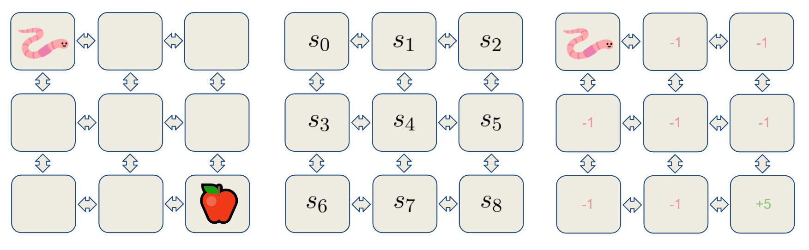
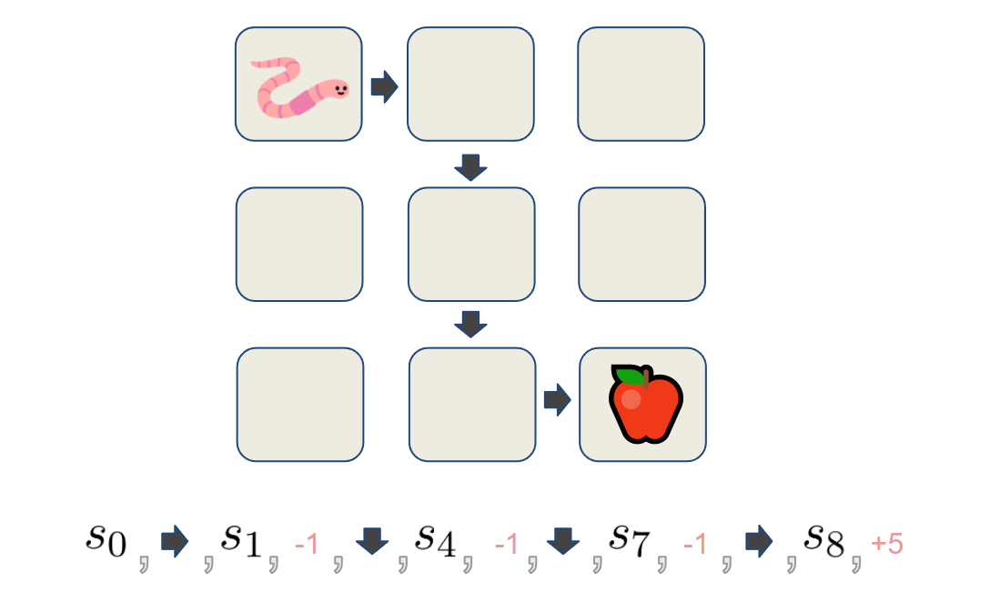
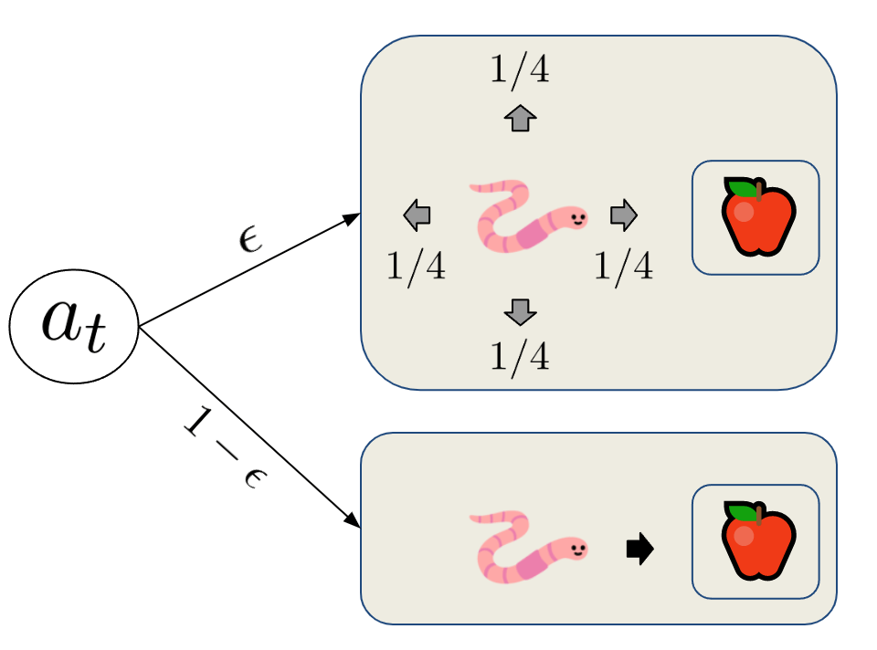

# [非策略与策略强化学习](https://www.baeldung.com/cs/off-policy-vs-on-policy)

[深度学习](https://www.baeldung.com/cs/category/ai/deep-learning) [机器学习](https://www.baeldung.com/cs/category/ai/ml)

[强化学习](https://www.baeldung.com/cs/tag/reinforcement-learning)

1. 简介

    在本教程中，我们将探讨训练强化学习代理的两种不同方法-非策略与策略学习。

    首先，我们将重温这两种方法应该解决的问题，并在此过程中找出它们各自的优缺点。

2. 强化学习基础

    一般来说，强化学习是在环境复杂的情况下使用的。我们的主要目标是找到某种最优行动策略 $\pi^*$，引导代理从 S 中每个给定状态 s 的所有可能行动集合 A 中选择最佳行动 a。

    下面是一个可学习环境的例子，在这个例子中，我们有一只蠕虫，它正试图朝着苹果的方向航行。在这种情况下，蠕虫将是一个代理，而它可以行走的地砖将表示状态。每个状态都会给蠕虫带来奖励，在这个例子中，除了含有苹果的状态外，蠕虫进入其他状态都会得到-1的奖励。如果它到达了那个状态，就会得到正 5 的奖励：

    

    这是一个最小的 RL 问题示例，但在大多数情况下，所涉及的环境相当复杂，几乎不可能获得完整的知识。这就是为什么我们要使用蒙特卡洛方法来对我们试图解决的环境进行采样，并获得一些相关知识。

    我们设定代理遵循给定的策略（policy $\pi$）并与环境交互，直到在时间 T 到达某个终端状态。这样的遍历称为一集(episode)，由代理在其路径上获得的状态、行动和奖励的序列组成。为了说明这一点，让我们设定代理按照某个策略行事，并收集一个事件集：

    

    我们的目标是收集许多类似上述的环境遍历事件。 然后，我们就可以用它们来迭代估计真实的状态值函数 $v_\pi(s)$ 和/或 行动值函数 $q_\pi(s,a)$。

    状态值函数会根据从 s 开始并在其后遵循 $\pi$ 时的预期累积奖励 R 为每个状态赋值。它用于评估给定策略的质量。

    另一方面，状态-行动值函数表达的是给定状态 s 和行动 a 及其后 $\pi$ 的预期累积奖励 R，用于改进政策。如果我们对这两个函数中的任何一个有了正确的估计，我们就可以说任务完成了，因为我们可以很容易地利用它们的输出来构建最优政策。

3. 探索与开发

    收集的事件越多，对函数的估计就越准确。不过，这也有一个问题。如果改进策略的算法总是贪婪地更新策略，即只采取能立即获得奖励的行动，那么不在贪婪路径上的行动和状态就不会被充分采样，潜在的更好奖励就会被隐藏在学习过程中。

    从根本上说，我们不得不做出选择，是根据当前信息做出最佳决策，还是开始探索并寻找更多信息。这也被称为探索与开发的两难选择。

    我们正在寻找两者之间的中间地带。完全探索意味着我们需要大量时间来收集所需的信息，而完全开发则会使代理陷入局部奖励最大化的困境。有两种方法可以确保对所有行动进行充分采样，分别称为 "策略内(On-policy)"和 "策略外(Off-policy)"方法。

4. 策略内方法

    政策上方法通过以软政策的形式加入随机性来解决探索与利用的两难问题，软政策意味着以一定的概率选择非贪婪行动。这些策略被称为 $\epsilon-greedy$ 策略，因为它们以 $\epsilon$ 的概率选择随机行动，并以 $1-\epsilon$ 的概率遵循最优行动：

    

    由于从行动空间随机选择的概率是 $\epsilon$，因此选择任何特定非最优行动的概率是 $\epsilon/|\mathcal{A}(s)|$。然而，遵循最优行动的概率总是略高一些，因为我们直接选择最优行动的概率是 $1 - \epsilon$，而从行动空间采样中选择最优行动的概率是 $\epsilon/|\mathcal{A}(s)|∣$：

    \[P(a_t^{*}) = 1 - \epsilon+\epsilon/|\mathcal{A}(s)|\]

    还值得注意的是，由于最优行动的采样频率高于其他行动，因此策略算法通常会收敛得更快，但也有可能使代理陷入函数的局部最优状态。

    1. SARSA

        使用$\epsilon-greedy$策略的策略算法的一个代表是状态-行动-奖励-状态-行动（state–action–reward–state–action,SARSA）。之所以这么说，是因为我们不是用整个事件来估计行动值函数 Q，而是用随后两个时间步的样本 ${S_t, A_t, R_{t+1}, S_{t+1}, A_{t+1}}$：

        \[Q\left(S_{t}, A_{t}\right) \leftarrow Q\left(S_{t}, A_{t}\right)+\alpha\left(R_{t+1}+\gamma Q\left(S_{t+1}, A_{t+1}\right)-Q\left(S_{t}, A_{t}\right)\right)​\]

        对于每一个状态，SARSA 使用与行动值函数 Q 有关的 $\epsilon-greedy$ 策略选择行动 a，并获得奖励 $R_{t+1}$，然后过渡到下一个状态 $S_{t+1}$，做出另一个 $\epsilon-greedy$ 行动 $A_{t+1}$。

5. 非策略方法

    非策略方法为探索与利用问题提供了不同的解决方案。策略上算法试图改进用于探索的相同的 $\epsilon-greedy$ 策略，而非策略方法则有两个策略：行为策略和目标策略。行为策略 b 用于探索和事件生成，目标或目的策略 $\pi$ 用于函数估计和改进。

    这种方法之所以有效，是因为目标策略 $\pi$ 能获得对环境的 "平衡"视角，并能从行为策略 b 的潜在错误中吸取教训，同时还能跟踪好的行为并试图找到更好的行为。不过，需要记住的一点是，在 "非策略学习"中，我们试图估计的分布与我们正在采样的分布是不匹配的。这就是为什么我们经常使用一种叫做重要性采样的技术来促进这种不匹配。

    1. Q 学习

        SARSA Max 是一种非常流行的非策略学习方法，也称为 Q 学习。在这里，我们不是通过选择 $\epsilon-greedy$ 行动来更新 Q 函数，而是始终选择具有最大值的行动：

        \[Q\left(S_{t}, A_{t}\right) \leftarrow Q\left(S_{t}, A_{t}\right)+\alpha\left(R_{t}-\gamma \max _{a} Q\left(S_{t}, a\right)-Q\left(S_{t}, A_{t}\right)\right)\]

        我们可以看到，在公式中，我们同时使用了 $A_t$ 和 $\max _{a} Q\left(S_{t}, a\right)$ 来更新函数，$A_t$ 是由 $\epsilon$ 贪婪策略 b 选择的，而 $\max _{a} Q\left(S_{t}, a\right)$ 则是由另一个贪婪的 "最大"策略选择的。

6. 结论

    在本文中，我们回顾了强化学习的基本原理，并着手探讨了两个系列的方法 - 策略上学习和非策略上学习。我们以 SARSA 和 SARSA Max 或 Q-learning 这两种流行算法为例。我们看到了它们是如何解决"探索"与"开发"的问题，以及每种方法的优势所在。
