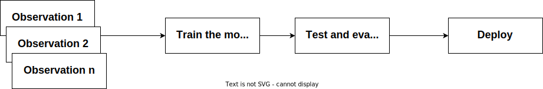

# 在线学习与离线学习

[深度学习](https://www.baeldung.com/cs/category/ai/deep-learning) [机器学习](https://www.baeldung.com/cs/category/ai/ml)

1. 简介

    在本教程中，我们将回顾在线学习和离线学习：它们是什么、如何工作以及有何不同。

2. 定义

    机器学习就是在没有明确指令的情况下教会机器如何自主学习。这涉及将各种学习算法应用于数据，以促进学习过程。当我们谈论机器学习中的学习时，我们指的是机器如何获取执行任务的知识。

    说到机器学习中的学习，一般有两个主题：监督学习和非监督学习。有监督和无监督学习可以通过两种方法进一步促进：在线学习和离线学习。让我们在接下来的章节中详细了解一下。

3. 在线学习

    当我们谈论在线学习时，我们指的是在数据可用时进行学习的情况。或者，我们也指一次只考虑一个观测值的学习。在这种情况下，模型参数会在每次接收到新的观测数据时更新。

    在在线学习中，我们通过观察来训练模型，更新参数，并不断迭代，直到获得一个可用于手头任务的模型。

    这种通过更新参数不断学习的过程使在线机器学习能够适应不同类型的数据。

    例如，假设我们想训练一个模型来识别天气模式。我们可以根据不同时间的温度读数来训练模型，从而确定天气模式。在这种情况下，我们训练出的模型就能即时学习不同天气模式的温度读数：

    

    1. 优缺点

        在线学习的一个主要优点是适应性强。模型能够根据不同模式和分布的数据进行调整和学习。最重要的是，在线学习不需要太多内存来存储数据。一旦模型经过特定观测数据的训练，就无需再存储。

        在线学习的一个缺点是开发或实施复杂。由于学习是即时进行的，我们必须考虑如何更新模型以及如何处理数据等问题。这最终需要更多的资源，因此是资本密集型的。

    2. 应用

        在线学习的适应性使其适用于实时任务。在线学习的一些显著应用包括

        - 流分析--实时分析来自传感器和其他物联网设备的数据
        - 天气预报
        - 股票价格预测

4. 离线学习

    简单地说，离线学习或批量学习指的是一次性学习数据集中的所有观测数据。我们也可以说，离线学习中的模型是在静态数据集上学习的。我们收集数据，然后训练一个机器学习模型来学习这些数据。

    在我们前面学习天气模式的例子中。在离线学习中，我们收集六个月的天气读数，然后根据收集到的数据训练模型。

    此外，在离线学习中，当完成对整个数据集的学习后，机器学习模型的参数也会随之更新：

    

    1. 优缺点

        与在线学习相比，离线学习因其简单性而备受青睐。离线学习模型无需额外的实时处理计算能力，因此实施起来非常简单。

        不过，与在线学习相比，离线学习对数据中不同模式的适应性较差。这意味着对模型的任何改进都需要对整个数据集进行重新训练。此外，保存整个数据集通常需要存储空间。

    2. 应用

        在线学习的一些显著应用包括

        - 图像识别任务
        - 分类任务

5. 异同

    在线学习和离线学习的异同主要体现在学习方式上。让我们来看看这些方面：

    | 在线学习            | 离线学习           |
    |-----------------|----------------|
    | 在数据集上逐步学习       | 只需在数据集上学习一次    |
    | 模型可适应不同数据       | 模型不可调整         |
    | 开发复杂            | 开发复杂度较低        |
    | 需要更多计算          | 所需计算量较少        |
    | 所需的存储空间较少       | 需要存储整个数据集的存储空间 |
    | 由于需要大量资源，因此成本较高 | 成本较低           |

6. 总结

    在本教程中，我们回顾了在线学习和离线学习。在线学习在训练过程中只考虑单个观测数据，而离线学习在训练过程中一次性考虑所有数据。与在线学习相比，离线学习更容易实现。

    总之，选择哪种学习模式取决于所使用的机器学习算法和手头的任务。
