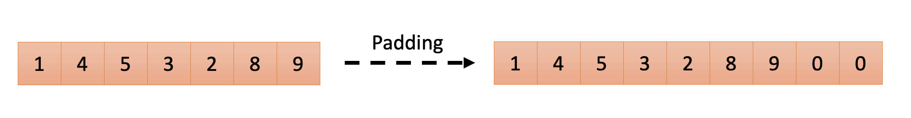

# [Python 中的填充](https://www.baeldung.com/cs/padding-deep-learning-python)

1. 简介

    [填充](https://www.baeldung.com/cs/deep-neural-networks-padding)是深度学习中广泛使用的一种技术。顾名思义，填充就是在原始数据周围添加额外的数据点，如零。它在各个领域都发挥着重要作用，包括使用卷积神经网络（CNN）进行图像处理，以及使用递归神经网络（RNN）或变换器进行文本处理。

    在 Python 中，您可以使用 TensorFlow 或 PyTorch 等库轻松实现填充。

    在本教程中，我们将演示如何在 Python 的图像和文本处理中应用不同类型的填充。

2. 图像处理中的填充

    在图像处理中，我们利用卷积滤波器从图像中提取有用的信息。然而，在计算卷积时，图像的大小会减小，尤其是包含多层的网络。填充有助于保持原始输入大小或将输出保持在所需大小。

    此外，如果没有填充，图像边缘像素的使用率会低于中心像素。这将导致网络无法捕捉边缘的信息。

    因此，填充可以提高网络的性能。图像填充有多种方法。

    1. 零填充

        零填充（Zero Padding），也称为 "same" 填充（Same Padding），如下图所示，在输入图像周围添加一层零：

        

        在 TensorFlow 中，可以使用 tf.keras.layers.Conv2D 函数从卷积层调整零填充，如下所示：

        ```python
        import tensorflow as tf

        model = tf.keras.models.Sequential([
            # Convolutional Layer
            tf.keras.layers.Conv2D(32, (3, 3), padding='same', activation='relu', input_shape=(28, 28, 1)),
            # Pooling Layer
            tf.keras.layers.MaxPooling2D((2, 2)),
            # Flatten the output to feed into a dense layer
            tf.keras.layers.Flatten(),
            # Dense Layer
            tf.keras.layers.Dense(128, activation='relu'),
            # Output Layer
            tf.keras.layers.Dense(10, activation='softmax')  # Assuming 10 classes for classification
        ])

        # Compile the model
        model.compile(optimizer='Adam', loss='sparse_categorical_crossentropy', metrics=['accuracy'])
        ```

        代码演示了用于分类的 CNN。它从使用 "same" 填充的 Conv2D 层开始，这意味着该层的输出将与输入具有相同的空间维度。

        我们也可以使用 PyTorch 构建相同的网络，如下所示：

        ```python
        import torch
        import torch.nn as nn
        import torch.nn.functional as F

        class SimpleCNN(nn.Module):
            def __init__(self):
                super(SimpleCNN, self).__init__()
                # Convolutional Layer
                self.conv = nn.Conv2d(1, 32, kernel_size=3, padding=1)
                
                # Pooling Layer
                self.pool = nn.MaxPool2d(2, 2)
                
                # Dense layer
                self.dense = nn.Linear(64 * 7 * 7, 128)  # Assuming input images have 28x28 pixels
                
                # Output Layer
                self.fc = nn.Linear(128, 10) # Assuming 10 classes for classification
            def forward(self, x):
                # Apply convolutional layer and pooling
                x = self.pool(F.relu(self.conv(x)))
                
                # Flatten the output to feed into a dense layer
                x = torch.flatten(x, 1)
                
                # Dense layer
                x = F.relu(self.dense(x))
                
                # Output layer
                x = self.fc(x)
                
                return x

        # Instantiate and summarize the model
        model = SimpleCNN()
        ```

        在 PyTorch 中，我们可以使用 nn.Conv2D 指定填充大小。在上面的代码中，padding=1 表示在输入数据周围添加一层填充。

    2. 有效填充

        有效填充是指输入数据不添加任何填充。在 TensorFlow 中，我们可以通过改变卷积层来调整填充模式：

        ```python
        # Convolutional Layer 
        tf.keras.layers.Conv2D(32, (3, 3), padding='valid', activation='relu', input_shape=(28, 28, 1))
        ```

        对于 PyTorch，我们可以将填充层设置为 0，这样就不会在数据中添加任何填充：

        ```python
        # Convolutional Layer 
        self.conv = nn.Conv2d(1, 32, kernel_size=3, padding=1)
        ```

3. 文本处理中的填充

    在自然语言处理（NLP）中，尤其是在使用 RNN、长短期记忆网络（LSTM）或变换器等模型时，填充也被广泛使用。当我们处理句子和文档时，它们总是长短不一。因此，通常会在文本的开头或结尾添加填充（特殊标记或零），以确保神经网络的所有输入序列具有相同的长度。

    下图给出了给序列添加填充的示例。图中的数字表示标记/单词的数字表示法：

    

    在 Tensorflow 中，我们可以使用 pad_sequences 函数添加填充：

    ```python
    from tensorflow.keras.preprocessing.sequence import pad_sequences

    # Example list of tokenized sentences (each sentence is a list of integers representing tokens)
    sequences = [
        [1, 2, 3, 4],
        [1, 2],
        [1, 2, 3, 4, 5, 6]
    ]

    # Pad sequences to the length of 10
    padded_sequences = pad_sequences(sequences, padding='post', maxlen=10, value=0)
    ```

    当 padding='post' 时，padding（本例中为 0）会添加到序列的末尾。如果要在序列的开头添加衬垫，可以设置 padding='pre' 代替。maxlen参数表示填充后序列的长度。如果 maxlen=None，则序列的填充长度将与数据集中最长序列的长度相匹配。

    我们也可以在 PyTorch 中使用相同的填充技术：

    ```python
    import torch
    from torch.nn.utils.rnn import pad_sequence

    # Example list of tokenized sentences (each sentence is a tensor of integers representing tokens)
    sequences = [
        torch.tensor([1, 2, 3, 4]),
        torch.tensor([1, 2]),
        torch.tensor([1, 2, 3, 4, 5, 6])
    ]

    # Pad sequences
    padded_sequences = pad_sequence(sequences, padding='post', padding_value=0)
    ```

    默认情况下，pad_sequence 会在序列的左边/开头添加填充。我们也可以使用 padding='pre' 来表示。请注意，使用 pad_sequence，填充序列的长度等于数据集中最长的序列。

4. 结论

    在本教程中，我们介绍了图像和文本处理中 padding 的概念。

    由于填充在深度学习中的广泛应用，PyTorch 和 TensorFlow 等多个现有库都内置了为数据添加填充的函数。我们举例说明了在图像中应用零/有效填充以及在文本中应用前/后填充。
