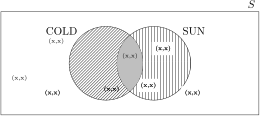

# [概率：联合概率与边际概率与条件概率](https://www.baeldung.com/cs/probability-joint-marginal-conditional)

1. 概述

    概率是一个介于 0 和 1 之间的值。它表示该事件发生的可能性有多大。0 表示该事件不可能发生。另一方面，1 表示该事件肯定会发生。任何介于两者之间的值都表示可能性。数值越大，可能性越大。联合概率、边际概率和条件概率是我们同时考虑事件 A 和 B 后得到的值。

    在本教程中，我们将讨论联合概率、边际概率和条件概率之间的区别。

2. 事件的概率

    假设我们要做一个众所周知的化学实验。如果我们准确无误地得到了所有成分，那么我们就已经知道了结果。这种实验被称为确定性实验。另一方面，有些实验并不那么容易预测。我们称之为[随机](https://www.baeldung.com/cs/randomness)实验。

    1. 随机实验及其结果

        在随机实验中，我们知道所有可能结果的集合。这个集合被称为样本空间。但是，我们并不知道（肯定）在进行实验时会得到哪种结果。举个例子，我们来看看气象站。这是一个随机实验。这是因为我们知道一年中不同时间的温度范围。但是，在实际读取温度之前，我们无法确定温度值。

    2. 作为结果集的事件

        事件是随机实验结果的集合。因此，它是样本空间的一个子集（部分）。以气象站的实验为例，我们来定义三个事件：

        - 事件 COLD：温度 < 15 摄氏度
        - 事件 MILD：15 $\leq$ 温度 $\leq$ 28
        - 事件 HOT：温度 > 28

        当然，每个事件都代表一组温度读数（我们的实验结果）。此外，我们还可以使用维恩图来直观显示事件。在这些图中，结果是一个点，事件是一个圆，样本空间 S 是一个矩形。因此，在我们的实验中，一个点代表一个温度读数。因此，以 COLD 事件为例，圆圈中包含了所有低于 15 摄氏度的读数。最后，样本空间的矩形包含所有记录的读数。

        

        让我们仔细看看上图。我们注意到有六个温度读数。其中两个读数发生了 COLD 事件，即温度低于 15 摄氏度。但是，其他四个读数不属于 COLD 事件。事实上，它们属于事件 NOT COLD。事实上，样本空间 S 中的任何事件 A 都有一个互补事件 $\overline{A} (NOT A)$。 事件 $\overline{A}$ 包含所有不属于 A 的结果。

    3. 事件的概率

        现在，假设我们进行了 N 次随机实验。在 N 次结果中，事件 A 发生了 $N_A$ 次。当然，这意味着事件 $\overline{A}$ 发生了 $N-N_A$ 次。一个事件的概率定义为这个事件发生的次数除以结果的次数：

        \[ P(A) = \frac{N_A}{N} \qquad P(\overline{A}) = \frac{N-N_A}{N} = 1 - P(A) \]

        因此，假设我们对气象站进行了 365 次随机试验。换句话说，我们从第 1 天（1 月 1 日）开始，到第 365 天（12 月 31 日）结束。同时，假设在这 365 天中，有 97 天的结果（温度）低于 15 摄氏度。因此，这 97 天都发生了 COLD 事件：

        \[ P(\text{COLD}) = \frac{97}{365} \qquad P(\overline{\text{COLD}}) = \frac{365-97}{365} = \frac{268}{365} \]

3. 成对事件

    当我们考虑两个事件时，情况会变得更加有趣。在这种情况下，我们可以提出这样的问题：

    - 两个事件发生的概率是多少？
    - 任一事件发生的可能性是多少？
    - 已知两个事件中的一个已经发生，那么另一个发生的概率是多少？

    请看前面介绍的气象站实验，共进行了 365 次。假设我们将所有结果记录在一张表格中。那么，这个表格将包含天数（1 到 365 天）和相应的温度。

    现在，让我们定义另一个实验。它也是在日历年的每一天进行。在新实验中，我们要注意天气是晴天还是多云。然后，我们将这些信息添加到记录温度的同一表格中。这样，该表将包含一年中每天的 365 列。因此，每一列都有两个数据。第一个是当天下午 2 点的温度。第二个是天气状况（晴天或多云）。此外，我们还在新实验中定义了以下事件：

    - 事件 CLOUD：天气多云
    - 事件 SUN：天气晴朗

    1. 多个事件的图形表示

        现在，我们在第一次随机实验中定义了三个事件：COLD、MILD、HOT。此外，我们还在第二次实验中定义了两个事件：CLOUD、SUN。让我们考虑一下这两个事件中的一对：

        

        在这种情况下，我们考虑的是两个随机实验。因此，样本空间中的结果实际上是一对结果。第一个结果表示测得的温度。第二个结果表示是晴天还是阴天。

        此外，结果分为 4 类：

        - 事件 COLD 发生，但 SUN 没有发生（对角线区域）。
        - 发生了 SUN 事件，但没有发生 CLOUD 事件（垂直线区域）。
        - 两个事件都发生了（灰色区域）。
        - 两个事件均未发生（白色区域）。

    2. 联合概率

        两个事件 A 和 B 的联合概率是指两个事件都发生的概率。如上图中的灰色区域所示。它可以写成 $P(A,B)$、$P(A \cap B)$ 或 $P(A~ \text{and} ~B)$。为了演示，让我们展示表格中记录温度和天气状况的部分。

        | Day         | 1     | 2    | 3   | 4     | 5    | 6   | 7     | 8     |
        |-------------|-------|------|-----|-------|------|-----|-------|-------|
        | Temperature | COLD  | COLD | HOT | MILD  | MILD | HOT | COLD  | COLD  |
        | Condition   | CLOUD | SUN  | SUN | CLOUD | SUN  | SUN | CLOUD | CLOUD |

        联合概率 $P(\text{COLD}, \text{SUN})$的计算公式为

        \[ P(\text{COLD}, \text{SUN}) = \frac{N_{\text{COLD}, \text{SUN}}}{N} \]

        $N_{\text{COLD}, \text{SUN}}$是两个事件发生的次数，N 是结果的总数。因此，为了计算 $P(\text{COLD}, \text{SUN})$，我们将计算表格中同时出现 COLD 和 SUN 的列。然后，我们将这个数字除以列的总数。

    3. 边际概率

        边际概率是指单个事件的概率。因此，已知 P(A,B)，P(A) 和 P(B) 就是边际概率。现在，假设我们用 365 列表格来计算联合概率。我们已经知道怎么做了。那么，我们将得到下表。

        |       | COLD | MILD | HOT |      |
        |-------|------|------|-----|------|
        | SUN   | 0.1  | 0.15 | 0.2 | 0.45 |
        | CLOUD | 0.3  | 0.15 | 0.1 | 0.55 |
        |       | 0.4  | 0.3  | 0.3 |      |

        我们注意到所有概率之和为 1：

        \[ P(A) = \sum P(A,X) \]

        这意味着，要计算 P(A)，我们要把 A 出现的所有联合概率相加。因此，我们有以下边际概率：

        - $P(\text{COLD}) = P(\text{COLD}, \text{SUN}) + P(\text{COLD}, \text{CLOUD}) = 0.4$
        - $P(\text{MILD}) = P(\text{MILD}, \text{SUN}) + P(\text{MILD}, \text{CLOUD}) = 0.3$
        - $P(\text{HOT}) = P(\text{HOT}, \text{SUN}) + P(\text{HOT}, \text{CLOUD}) = 0.3$

        此外，我们还可以计算 $P(\text{SUN}) = 0.45$ 和 $P(\text{CLOUD}) = 0.55$。

        它们被称为边际值，因为它们出现在联合概率表的边际。如前表所示。

    4. 条件概率

        假设有两个事件 A 和 B。它是假设 B 发生时 A 发生的概率。换句话说，我们只关注 B 发生的结果。通过这些结果，我们想知道 A 出现的概率。因此，我们不计算所有结果中 A 的出现次数。相反，我们计算 A 在 B 也出现的结果中出现的次数。

        \[ P(A|B) = \frac{N_{A,B}}{N_B} = \frac{\text{Number of occurrences of both} ~A ~\text{and}~ B}{\text{Number of occurrences of} ~B} = \frac{N_{A,B}/N}{N_B/N} = \frac{P(A,B)}{P(B)} \]

        在上式中，N 是结果的数目。通过这个等式，我们可以使用计数或概率来计算条件式。现在，让我们来看看上面的小表。要计算 $P(\text{COLD}|\text{SUN})$，我们要计算 SUN 出现的次数。即 $N_{\text{SUN}} = 4$。然后，在这些出现次数中，我们将计算 COLD 的次数。这就是 $N_{\text{COLD},\text{SUN}} = 1$。现在我们可以计算 $P(\text{COLD}|\text{SUN})$：

        \[ P(\text{COLD}|\text{SUN}) = \frac{N_{\text{COLD},\text{SUN}}}{N_{\text{SUN}}} = \frac{1}{4} \]

        此外，我们希望 $P(\text{COLD}|\text{SUN}) < P(\text{COLD}|\text{CLOUD})$. 事实上，阴天通常比晴天更冷。

4. 更多启示

    到目前为止，我们所看到的想法适用于很多情况。然而，我们需要了解如何解释概率值。

    1. 一个例子

        例如，让我们考虑一些汽车制造商所做的一项研究。他们对某些车型的可靠性很感兴趣。在这种情况下，他们可能会根据里程数对二手车进行分类。例如，他们可以将汽车分为四类

        - 轻度使用：少于 10000 公里
        - 中度使用：10000 至 50000 km
        - 重度使用：在 50000 至 100000 km 之间
        - 过度使用：超过 100000 km

        然后，他们可以联系服务中心。他们的目的是收集有关汽车问题的信息。随后，他们会将这些问题归类为

        - 简单：汽车发出警告，但仍能行驶
        - 一般：汽车故障，但发动机正常
        - 极端：汽车抛锚，发动机需要大修

        这样，他们可能会得到 20000 个汽车故障的数据。

    2. 概率值及其解释

        公司现在可以计算各种概率。例如，假设边际概率 $P(\text{Extreme})$ 很高，例如等于 0.3。那么，他们就知道这种型号的汽车有 30% 的概率需要对发动机进行大修。当然，我们希望 $P(\text{Extreme}| \text{Excessively used})$大于 $P(\text{Extreme}|\text{Lightly used})$。很明显，重度使用的汽车要比轻度使用的汽车磨损更严重。

        在这方面，理解 $P(\text{Extreme}, \text{Excessively used})$ 和 $P(\text{Extreme}|\text{Excessively used})$ 之间的区别非常重要。前者取决于所有流通汽车的数量。因此，它并不能准确说明过度使用汽车的极端问题。例如，如果过度使用汽车的数量在所有流通汽车中所占比例较低，则该值可能较低。另一方面，在后者中，我们只关注过度使用的汽车。因此，它能让我们了解这些汽车的极端问题。

5. 结论

    在本文中，我们解释了边际概率、联合概率和条件概率的概念。我们还展示了它们在实际场景中的应用。然而，有一点需要进一步澄清。我们将概率定义为事件发生的次数除以结果的总数。只要我们知道需要有很多结果，这个定义就没有问题。直观地说，我们无法从少量结果中推断出有意义的统计数据。
