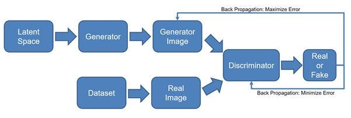
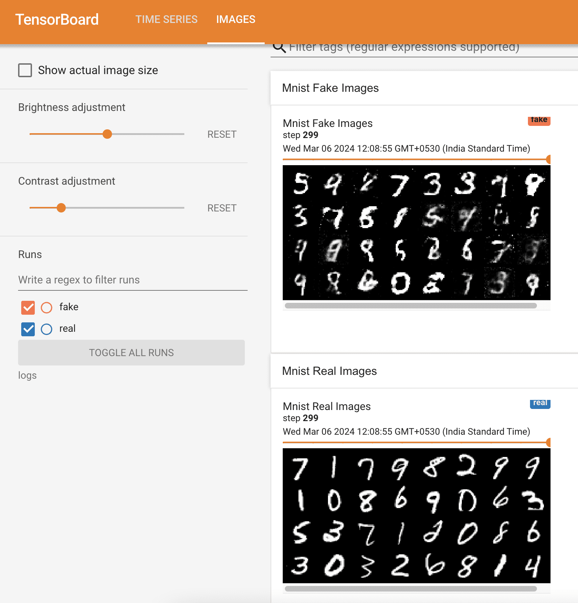

# [PyTorch 中的 GAN 实现](https://www.baeldung.com/cs/pytorch-generative-adversarial-networks)

1. 简介

    在本教程中，我们将展示如何在 PyTorch（一种流行的机器学习框架）中实现生成式对抗网络（GAN）。

2. 生成式对抗网络

    GAN 是一种生成模型，起源于对抗和博弈论。在这里，我们训练两个相互竞争和合作的神经网络，分别称为生成器（G）和判别器或批判器（D）。两者进行零和博弈，G 生成合成数据来欺骗 D，而 D 则致力于区分合成数据和实际数据。

    1. 架构

        下面以图像生成为例，介绍 GAN 的基本架构：

        

        因此，GAN 采用对抗方法来学习输入分布。然后，它会生成与训练数据集相似但不相同的新数据点。生成器 G 和判别器 D 协同工作。首先，G 从多元高斯中提取随机值，生成合成图像。然后，D 学习如何区分真实图像和生成的图像。G 的目标是生成能骗过 D 的真实样本，而 D 的目标恰恰相反：学会区分真实和虚假图像。

        虽然 GAN 并不局限于生成图像，但这可能是其最著名的应用。

3. 代码设置

    让我们看看使用 PyTorch 在 Python 中实现一个简单的 GAN。我们也可以使用 TensorFlow 框架来实现 GAN。

    首先，我们要为代码设置一个[虚拟环境](https://www.baeldung.com/cs/containers-vs-virtual-machines)。我们可以使用 pyenv 或 virtualenv 工具来创建该环境。激活新环境后，我们应该安装所有必要的库：

    - torch
    - torchvision
    - tqdm
    - transformers
    - numpy

    我们将使用以下库进行可视化：

    - tensorboard
    - tensorboard-data-server
    - tensorboardX

4. 库和数据

    让我们加载必要的库：

    ```python
    # For image transforms
    import torchvision.transforms as transforms
    # For Pytorch methods
    import torch
    import torch.nn as nn
    # For Optimizer
    import torch.optim as optim
    import torchvision
    # For DATA SET
    import torchvision.datasets as datasets
    # FOR DATA LOADER
    from torch.utils.data import DataLoader
    # FOR TENSOR BOARD VISUALIZATION
    from torch.utils.tensorboard import SummaryWriter # to print to tensorboard
    ```

    我们使用 Tensorboard 作为可视化工具，使用 MNIST 作为数据集。MNIST 是一个手写数字数据库，每个数字都是 28X28 的单色图像。我们将数据集下载到 dataset 文件夹中。如果当前工作目录中没有该文件夹，代码会创建它：

    ```python
    print(f"\nLoading MNIST DS")
    dataset = datasets.MNIST(root="dataset/",
                            transform=myTransforms,
                            download=True)
    loader = DataLoader(dataset,
                        batch_size=Config.batchSize,
                        shuffle=True)
    ```

5. GAN 超参数

    我们的 GAN 使用了以下超参数：

    ```python
    class Config:
        device = "cuda" if torch.cuda.is_available() else "cpu"
        lr = 3e-4
        zDim = 128 # 64, 128, 256
        imageDim = 28 * 28 * 1  # 784
        batchSize = 32  # Batch size
        numEpochs = 100  # Change as per your need
        logStep = 625  # Change as per your need
    ```

    每个图像样本都被扁平化为 784 维向量 (imageDim)。

    由于 GAN 对[超参数](https://www.baeldung.com/cs/non-trainable-parameter)很敏感，我们需要对其进行微调以提高性能。这不在本文的讨论范围之内，因此我们将按照交叉验证或其他调整技术得到的值来使用上述值。

6. 生成器

    我们使用顺序神经网络来实现生成器模块。它由一个带有 [Leaky ReLu()](https://www.baeldung.com/cs/relu-vs-leakyrelu-vs-prelu) 激活函数的输入层和一个带有 [tanh()](https://www.baeldung.com/cs/sigmoid-vs-tanh-functions) 激活函数的单隐层组成。我们可以根据需要配置 hiddenDim 和 lr 参数：

    ```python
    class Generator(nn.Module):
        def __init__(self, zDim, imgDim, hiddenDim=512, lr=0.01):
            super().__init__()
            self.gen = nn.Sequential(
                nn.Linear(zDim, hiddenDim),
                nn.LeakyReLU(lr),
                nn.Linear(hiddenDim, imgDim),
                nn.Tanh(),  # We normalize inputs to [-1, 1] so make outputs [-1, 1]
            )
        def forward(self, x):
            return self.gen(x)
    ```

7. 判别器

    判别器网络与生成器网络类似。不过，它的输出层只有一个输出（真实数据为 1，合成数据为 0）：

    ```python
    class Discriminator(nn.Module):
        def __init__(self, inFeatures, hiddenDim=512, lr=0.01):
            super().__init__()
            self.disc = nn.Sequential(
                nn.Linear(inFeatures, hiddenDim),
                nn.LeakyReLU(lr),
                nn.Linear(hiddenDim, 1),
                nn.Sigmoid(),
            )

        def forward(self, x):
            return self.disc(x)
    ```

8. 前言

    让我们来看看训练和可视化部分。我们首先创建生成器和判别器对象。然后，我们对标准高斯噪声进行采样，生成随机样本。之后，我们将单色图像映射（784 维向量）归一化，并转换为张量进行处理：

    ```python
    discriminator = Discriminator(Config.imageDim).to(Config.device)
    generator = Generator(Config.zDim,
                        Config.imageDim).to(Config.device)

    # Fixed Noise
    fixedNoise = torch.randn((Config.batchSize,
                                Config.zDim)).to(Config.device)

    # Transforms
    myTransforms = transforms.Compose(
            [
                transforms.ToTensor(),
                transforms.Normalize((0.5,), (0.5,)),
            ]
    )
    ```

    归一化操作将每个通道的像素值减去平均值，再将结果除以标准偏差：

    \[image =\frac{image - \mu}{\sigma}\]

    因此，transforms.Normalize((0.5,), (0.5,))将 MNIST 图像像素值的范围从 [0, 1] 转换为 [-1, 1]。因此，这与 G 的 tanh() 输出相匹配。

9. 优化器

    接下来，我们为生成器和判别器配置 Adam 优化器：

    ```python
    print(f"\nSetting Optimizers")
    optDisc = optim.Adam(discriminator.parameters(),
                        lr=Config.lr)
    optGen = optim.Adam(generator.parameters(),
                        lr=Config.lr)
    ```

10. 损失

    接下来，我们将二元交叉熵（BCE）设为损失函数：

    `criterion = nn.BCELoss()`

11. 图像网格

    现在，我们为可视化配置 Tensorboard 的摘要写入器类：

    ```python
    writerFake = SummaryWriter(f"logs/fake")
    writerReal = SummaryWriter(f"logs/real")
    ```

    类对象 writerFake 将存储合成图像，而 writerReal 将在日志文件夹中存储真实图像。运行代码后，该文件夹将自动创建。

12. 训练

    最后，我们进入训练步骤。我们会在每个epoch从数据集中随机获取一批真实图像。然后，我们通过展示合成图像和真实图像来训练判别器。训练结束后，我们将对生成器进行训练，同时保持鉴别器不变：

    ```python
    step = 0
    print(f"\nStarted Training and visualization...")
    for epoch in range(Config.numEpochs):
        print('-' * 80)
        for batch_idx, (real, _) in enumerate(loader):
            # 28 * 28 *1 flattens to 784
            real = real.view(-1, 784).to(Config.device)
            batchSize = real.shape[0]
            ### Train Discriminator: max log(D(x)) + log(1 - D(G(z)))
            noise = torch.randn(batchSize,
                                Config.zDim).to(Config.device)
            fake = gen(noise)
            discReal = disc(real).view(-1)
            lossDreal = criterion(discReal,
                                torch.ones_like(discReal))
            discFake = disc(fake).view(-1)
            lossDfake = criterion(discFake,
                                torch.zeros_like(discFake))
            lossD = (lossDreal + lossDfake) / 2
            disc.zero_grad()
            lossD.backward(retain_graph=True)
            optDisc.step()

            ###
            # Train Generator: min log(1 - D(G(z))) <-> max log(D(G(z))
            # where the second option of maximizing doesn't suffer from
            # saturating gradients. Minimizing is easier
            ###
            output = disc(fake).view(-1)
            lossG = criterion(output,
                            torch.ones_like(output))
            gen.zero_grad()
            lossG.backward()
            optGen.step()

            # Visualize three steps for each epoch
            if batch_idx % Config.logStep == 0:
                step = prepareVisualization(epoch,
                                            batch_idx,
                                            len(loader),
                                            lossD,
                                            lossG,
                                            writerFake,
                                            writerReal,
                                            step)
    ```

13. 可视化

    我们的可视化函数如下

    ```python
    def prepareVisualization(epoch,
                            batchIdx,
                            loaderLen,
                            lossD,
                            lossG,
                            writerFake,
                            writerReal,
                            step):
        print(
            f"Epoch [{epoch}/{Config.numEpochs}] Batch {batchIdx}/{loaderLen} \
                                Loss DISC: {lossD:.4f}, loss GEN: {lossG:.4f}"
        )

        with torch.no_grad():
            # Generate noise via Generator
            fake = gen(fixedNoise).reshape(-1, 1, 28, 28)

            # Get real data
            data = real.reshape(-1, 1, 28, 28)

            # Plot the grid
            imgGridFake = torchvision.utils.make_grid(fake,
                                                    normalize=True)
            imgGridReal = torchvision.utils.make_grid(data,
                                                    normalize=True)

            writerFake.add_image("Mnist Fake Images",
                                imgGridFake,
                                global_step=step)
            writerReal.add_image("Mnist Real Images",
                                imgGridReal,
                                global_step=step)
            # increment step
            step += 1

        return step
    ```

    在每个周期的固定时间间隔（ConfigParam.logStep）内，我们绘制生成器合成图像和数据集真实图像的网格。我们可以在 Tensorboard 网页上看到该网格的连续数据流：

    

14. 结论

    在本文中，我们展示了如何在 PyTorch 中实现 GAN。GAN 的工作原理是生成器神经网络和判别器神经网络之间的对抗性零和博弈。

    我们将 GANs 用于各种任务，如文本生成、音乐创作和 3D 模型创建。GANs 简单易懂，但训练起来却极具挑战性。我们必须通过选择最佳架构和微调超参数来正确平衡鉴别器和生成器。
