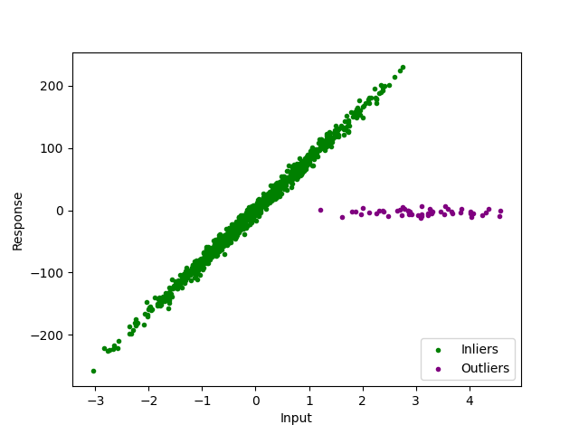
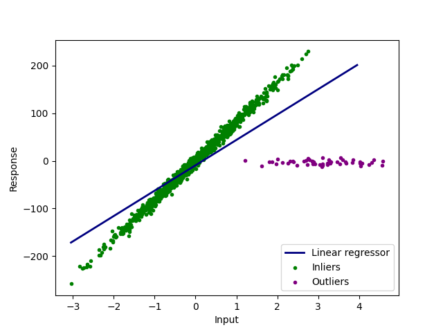
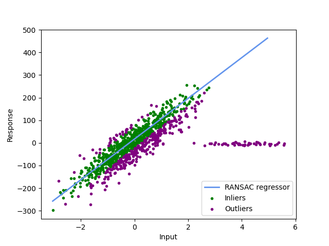
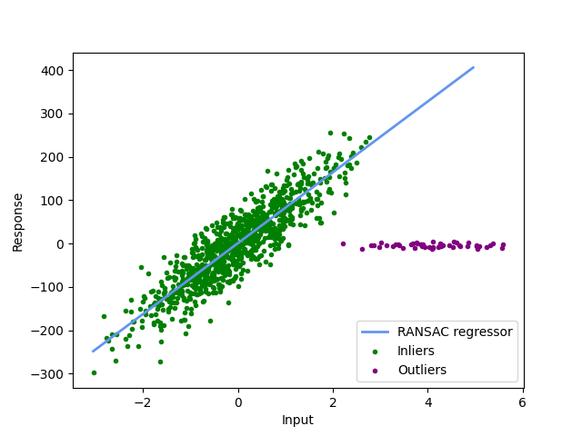

# 随机抽样共识解释

[深度学习](https://www.baeldung.com/cs/category/ai/deep-learning) [机器学习](https://www.baeldung.com/cs/category/ai/ml)

[概率与统计](https://www.baeldung.com/cs/tag/probability-and-statistics)

1. 简介

    在本教程中，我们将探讨随机样本共识 (RANSAC) 算法。它描述了一种使用迭代方法检测数据集中异常值的方法。

2. 动机

    数据集中出现异常值有多种原因，包括测量误差和错误的数据输入。异常值也可能是当前数据固有的。

    1. 示例

        在所示数据中，我们看到了在信号处理中遇到的典型数据集。

        离群值很容易直观地发现，我们用紫色标记出来：

        

        在这个例子中，很容易就能看到异常值。而在其他情况下，我们甚至无法在二维空间中直观地看到异常值。此外，我们当然希望有一种算法能严格自动地检测出异常值。

    2. 进一步处理

        我们还可以看到，异常值阻碍了我们进一步处理数据。例如，我们可以看看线性回归：

        

        我们可以看到，线性回归无法正确描述我们的数据。

        在本例中，我们需要的是排除异常值后进行回归拟合。

3. 使用 RANSAC 算法消除异常值

    为了正确检测异常值并建立一个在计算中忽略异常值的模型，我们使用了 RANSAC 算法。该算法从给定数据中随机抽取一个子集，并从中创建一个模型。然后，我们检查整个数据集与模型的匹配程度。我们会重复这些步骤，直到找到一个与数据拟合良好的模型。在此过程中，我们会将所有不接近模型的点标记为异常值。

    1. 实施

        让我们仔细看看算法：

        

        算法的中心是"for"循环。在这个循环中，我们从数据中随机选择一个子集，其大小为之前选定的 n。这可以是任何一种模型，例如简单的线性回归。

        拟合模型后，我们会在第二个 for 循环中检查原始数据集中的所有其他点与模型的距离。对于这个距离，我们使用参数 t 作为阈值。根据这些点，我们创建一个新的列表，名为 tempInlierAdd。

        如果该列表的大小大于参数 k，我们就可以将其视为合适模型的候选者。然后，我们根据 tempInlier 和 tempInlierAdd 创建一个模型，并将其与之前迭代中的最佳模型进行比较。

    2. 模型参数--阈值

        为了确定离拟合线多远的点仍可被视为离群值，我们使用参数 t 作为阈值：

        

        如果阈值选得太小，如图中所示，我们可能会将太多的点检测为离群值。在大多数 RANSAC 实现中，阈值都是以数据集 y 值的中位数来计算的。如果用户没有给出阈值。在我们的示例中，手动更改阈值可获得更合理的离群点分类：

        

        错误的阈值不仅会检测出错误的异常值，还会导致错误的数据模型。因此，正确选择阈值至关重要。

    3. 模型参数 - 迭代次数

        迭代次数越多，我们检测到不含任何异常值的子集的概率就越高。我们可以使用统计学中的一个结果，即离群值与总点之比 $w = \frac{\text{inliers}}{\text{total points}}$、模型计算所需的数据点数 n 以及遇到不含离群值的子集的概率 p：

        \[k={\frac {\log(1-p)}{\log(1-w^{n})}}\]

        我们可以通过一个简单的 $w = 0.8, p = 0.99$ 和 n = 10 的例子看到，我们大约需要 41 次迭代才能得到一个概率为 99% 的无异常值模型。

4. 优势和替代方案

    正如我们在上面的公式中所看到的，我们的 RANSAC 算法只有在我们想要拟合的模型（即线性回归）需要的点数较少的情况下才是快速和正确的。此外，必须限制异常值的数量，如果异常值超过 50%，我们可能会遇到问题。

    除了 RANSAC 算法，还有多种方法可以[检测异常值](https://www.baeldung.com/cs/ml-outlier-detection-handling)。例如，支持向量机 ([SVM](https://www.baeldung.com/cs/svm-multiclass-classification)) 等分类算法。对于线性 SVM，我们使用一条简单的线将数据集分为离群值和异常值。我们通过最大化直线与数据集中的点之间的累积距离来实现这一目标。由于我们只想将数据集分为两个类别，即异常值和离群值，因此我们使用的是单类 SVM 算法。另一种值得注意的方法是 k 近邻算法（[kNN](https://www.baeldung.com/cs/k-nearest-neighbors)）。

5. 结论

    在本文中，我们讨论了 RANSAC 算法的结构和实现。我们还探讨了它的优缺点和可行的替代方案。
