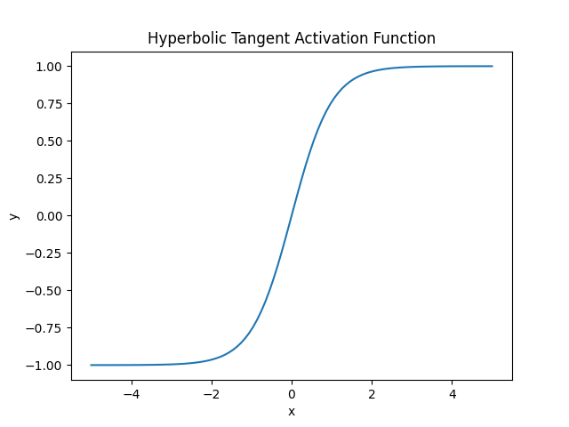
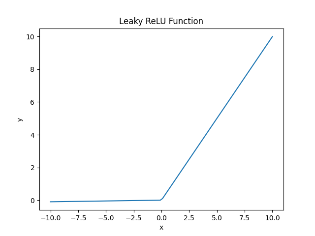
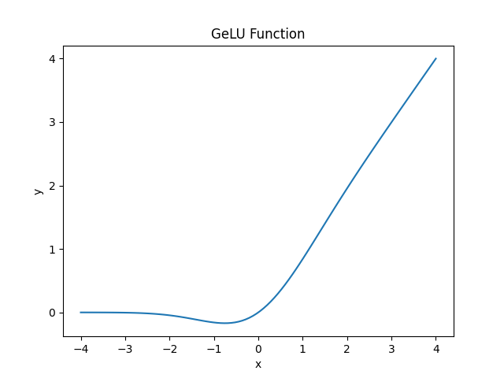

# ReLU vs. LeakyReLU vs. PReLU

[深度学习](https://www.baeldung.com/cs/category/ai/deep-learning) [机器学习](https://www.baeldung.com/cs/category/ai/ml)

[神经网络](https://www.baeldung.com/cs/tag/neural-networks) [训练](https://www.baeldung.com/cs/tag/training)

1. 简介

    在本教程中，我们将研究 ReLU [激活函数](https://www.baeldung.com/cs/activation-functions-neural-nets)系列。

2. 激活函数

    在深入研究 ReLU 之前，我们先来谈谈激活函数及其在通用神经网络中的作用。

    1. 在神经网络中的作用

        我们将人工神经网络定义为由相互连接的节点或人工[神经元](https://www.baeldung.com/cs/neural-networks-neurons)组成的高阶数学模型。它模仿人脑的结构和功能。例如，我们可以利用它进行信息处理，解决[图像分类](https://www.baeldung.com/cs/svm-multiclass-classification)等复杂问题。

        接着，我们的激活函数是神经元执行的数学函数。因此，它根据神经元的输入和单个输入的相关权重来计算神经元的输出。

        它可以是线性的，比如单位函数 $f(x)=\alpha x$，也可以是非线性的，比如 sigmoid 函数 $f_ \theta (x) = \frac{\mathrm{1} }{\mathrm{1} + e^- \theta^Tx }$此外，我们还将这些函数称为传递函数：人工神经元。

        我们通常使用非线性激活函数来解决复杂的实际问题。这是因为大多数问题的特征之间存在复杂的关系。

    2. 常见激活函数

        接下来，我们来看看人工神经网络最常见的激活函数。

        同位函数 f(x)=x 是最常见的线性激活函数。它的范围是$(-\infty, \infty)$。

        在非线性函数中，ReLU 是最常用的激活函数。ReLU 代表整流线性单元。在这里，当 x < 0 时，f(x) = 0；当 $x \ge 0$时，f(x) = x。

        第二个最常用的非线性激活函数是 [sigmoid](https://www.baeldung.com/cs/sigmoid-vs-tanh-functions) 函数。我们也称其为逻辑激活函数。定义上，它接受输入 x 并给出一个介于（0，1）之间的值。因此，我们将其用于需要预测输出概率的模型。

        另一种常用的非线性激活函数是 tanh 或双曲正切激活函数。它的工作原理与 sigmoid 相同。此外，tanh 函数的范围为（-1，1）。在 tanh 图形中，它具有将负输入映射到严格负输出以及将极限零输入映射到接近零值的优势：

        

3. Sigmoid 和 Tanh 激活函数的局限性

    在训练模型时，sigmoid 和 tanh 激活函数会遇到梯度消失和梯度爆炸的问题（尤其是在[隐藏层](https://www.baeldung.com/cs/hidden-layers-neural-network)）。

    1. 梯度问题

        [梯度消失问题](https://www.baeldung.com/cs/lstm-vanishing-gradient-prevention)发生在训练过程中，当我们用于更新网络的梯度从输出层反向传播到前几层时，梯度会变得非常小（消失）。因此，需要对权重进行更多更新，以发现数据中的潜在模式。

        当梯度在训练过程中变得非常大时，就会出现梯度爆炸问题。因此，模型参数权重会得到大幅更新。因此，这使得我们的模型不稳定，这样下去，它就无法从我们的训练数据中学习到所有棘手的模式。

    2. 其他问题

        除了上述问题，我们还遇到了一些其他问题。这两个函数都不是以零点为中心，因此在原点周围不对称。此外，它们的计算成本很高，而且斜率较浅。因此，它们在渐近线附近的可微分性很低，因此我们的训练过程需要更长的时间。

4. ReLU 激活

    在本节中，我们将探讨 ReLU 函数。

    1. 基本 ReLU

        基本版本的 Relu 对于正输入表现为单位函数，对于负输入表现为 0。此外，我们发现 ReLU 比 sigmoid 和 tanh 函数更快。此外，它还不会出现反向传播误差消失或爆炸的问题。

        不过，它也存在垂死反向传播问题。ReLU 会使模型图中的所有负输入值立即归零。这使得 ReLU 神经元失去活性。我们将这种情况称为 ReLU 神经元的死亡状态。当大部分训练输入都是有害的，或者 ReLU 函数的导数为 0 时，这个问题就会加剧。

        我们使用 Leaky ReLU 来克服这一问题。

    2. 泄漏 ReLU

        在这个版本中，当输入为负值时，我们使用一个轻微的非负梯度：泄漏 ReLU

        当单元处于非活动状态时，它允许较小的非零梯度。这样，我们就克服了垂死的现实问题。但是，它无法对负输入给出一致的预测。它在整个训练过程中使用斜率 $\alpha$ 作为恒定参数。随着训练值变得越来越负，其输出也变得越来越线性。这样一来，我们就失去了非线性，而得到了更好的梯度反向传播。

    3. 参数 ReLU

        参数 ReLU 或 PReLU 使用 \alpha 作为模型在训练过程中学习的超参数：

        

        我们使用 PReLU 激活函数来克服 ReLU 和 LeakyReLU 激活函数的缺点。PReLU 提高了模型的准确性。此外，与 LReLU 和 ReLU 相比，它的模型收敛速度更快。不过，它也有一个缺点。我们必须通过反复试验来手动修改参数 $\alpha$。正如你所看到的，这是一项非常耗时的工作，尤其是当我们的数据集多种多样时。

    4. GeLU

        GeLU 或高斯误差线性单元是整流函数的平滑可微近似值。因此，对于每个输入 x，它都会输出 x 与其高斯累积分布函数 $\Phi(x)$ 的乘积。深入研究后我们会发现，GeLU 激活函数按百分位数对输入进行缩放，而 ReLU 激活函数系列则按符号对输入进行缩放：

        

5. ReLU vs. Leaky ReLU vs. Parametric ReLU

    下表总结了普通 Relu 与其两个变体之间的主要区别。

    | Property | ReLU       | LReLU     | PReLU  |
    |----------|------------|-----------|--------|
    | 优势       | 解决梯度问题     | 解决梯度问题    | 解决梯度问题 |
    | 缺点       | 垂死 relu 问题 | 负输入时输出不一致 | 微调 $\alpha$ |
    | 超参数      | 无          | 无         | 1      |
    | 速度       | 最快         | 更快        | 快速     |
    | 准确性      | 高          | 更高        | 最高     |
    | 收敛性      | 慢          | 更快        | 最快     |

6. 结论

    在本文中，我们介绍了人工神经网络中的激活函数。之后，我们深入研究了 ReLU 及其变体。ReLU 是一种简单而强大的激活函数，通过引入非线性，它可以让神经网络学习难以解决的依赖关系。此外，其变体还能解决梯度问题，并为负输入值提供一致的输出。
