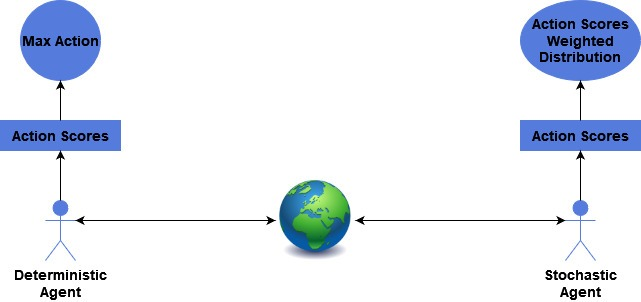

# 强化学习中的确定性策略与随机策略

[深度学习](https://www.baeldung.com/cs/category/ai/deep-learning)

[强化学习](https://www.baeldung.com/cs/tag/reinforcement-learning)

1. 引言

    在人工智能和强化学习（[RL](https://www.baeldung.com/cs/reinforcement-learning-neural-network)）中，策略指的是一个代理与环境交互的策略。策略定义了代理的行为。策略决定了代理针对当前环境状态采取的下一步行动。

    [策略](https://www.baeldung.com/cs/ml-policy-reinforcement-learning)是一个将状态映射到行动的函数。根据所处的环境和问题，策略可以是确定性的，也可以是随机的。在本教程中，我们将解释这两种策略类型的区别。

2. 确定性策略

    确定性(Deterministic)策略是一种将每个状态映射为一个确定行动的策略。换句话说，在给定状态下，代理将始终采取相同的行动。这种策略用一个函数来表示： $\pi: S \rightarrow A$，其中 S 是状态空间，A 是行动空间。确定性策略函数将状态 $s \in S$ 映射到单个行动 $a \in A$。

    确定性策略的优点是易于解释和实施。它也适用于每次都要对相同状态采取相同行动的任务。例如，在国际象棋游戏中，给定棋盘配置的最佳棋步总是相同的。在这种情况下，确定性策略可能是优化游戏的最佳选择。

    另一个能使这一想法具体化的例子是走钢丝。能让代理保持平衡和前进的行动范围很窄。尽管代理有很多行动选择，但代理只有一个选择。

3. 随机政策

    随机(Stochastic)策略是一种将每个状态映射为行动概率分布的策略。换句话说，给定一个状态，代理将根据概率分布随机选择一个行动。我们用一个函数来表示这种策略：$\pi: S \times A \rightarrow [0,1]$，其中 S 是状态空间，A 是行动空间，$\pi(s, a)$ 是在状态 s 中采取行动 a 的概率。

    随机策略的优势在于它可以捕捉环境中的不确定性。例如，在扑克游戏中，代理不一定总是对同一手牌采取相同的行动，因为输赢的概率取决于对手的手牌和下注的进行情况。在这种情况下，随机策略会根据获胜概率学习最佳策略。

    也有一些游戏可以利用确定性策略，尤其是在重复游戏的情况下。以 "石头、剪子、布"游戏为例。在这个双人游戏中，每个玩家都会秘密选择一项物品，即 "石头"、"纸 "或 "剪刀"，并同时向对手透露自己的选择。每个项目都与自己打平，输给一个项目，赢过另一个项目。在这样的游戏中，最佳策略是随机策略，即在三分之一的时间内选择每一项。

4. 比较

    确定性策略和随机策略的主要区别在于它们选择行动的方式。确定性策略为每个状态选择一个行动，而随机策略则从每个状态行动的概率分布中进行选择。这意味着，确定性策略总是为同一状态选择相同的行动，而随机策略则可能为同一状态选择不同的行动。

    另一个区别是，确定性策略更易于解释和实施，而随机策略则更为复杂。随机策略需要学习行动的概率分布，这可能具有挑战性。另一方面，确定性策略只需要为每个状态选择最佳行动，这相对容易。

    确定性策略更适合需要精确控制的任务，因为在这种任务中，任何偏离最佳行动的情况都会对结果产生重大影响。另一方面，随机策略可能更适合涉及不确定性或探索的任务，因为它们允许代理尝试不同的行动并从结果中学习。下图总结了这两种行动选择机制的一般区别：

    

5. 真实案例

    广为人知的 [Q-Learning](https://www.baeldung.com/cs/epsilon-greedy-q-learning) 算法既使用随机策略，也使用确定策略。在该算法中，我们学习的是 "行动-价值" 函数，即 Q 函数。该函数为每个状态下的每个行动生成一个值。这个值就是该行动对我们的好处。我们的最终策略 $Q^*$ 是在每个状态下产生最大值的行动。这是确定性的；如果出现平局，我们会使用确定性的平局打破规则。

    这就是最优政策。不过，在学习过程中，我们使用的是随机策略。我们使用ε贪婪策略。这种策略会在某些ε%的时间内选择随机行动，否则就会遵循贪婪策略。在 Q-learning 的情况下，这样做可以在训练过程中改善对状态空间的探索，但在推理过程中却能充分利用学习到的策略。随机策略在训练过程中是可取的，因为它可以防止代理在探索不同行动时陷入次优策略。

6. 结论

    本文讨论了将每个状态映射为单一行动的确定性策略和将每个状态映射为行动概率分布的随机策略。

    确定性策略更易于解释和实施，而随机策略则能捕捉环境中的不确定性，防止代理陷入次优策略。实践者应根据不确定程度和环境的复杂性，选择最适合其特定任务的策略。
