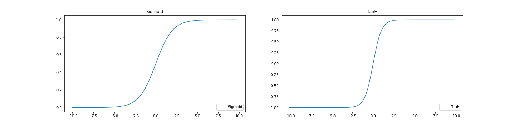
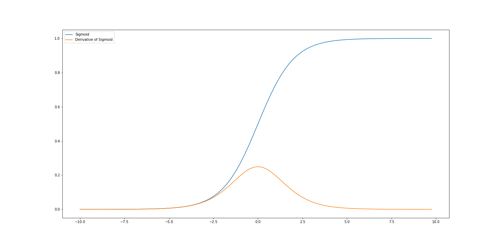

# 饱和非线性

[深度学习](https://www.baeldung.com/cs/category/ai/deep-learning) [机器学习](https://www.baeldung.com/cs/category/ai/ml)

[神经网络](https://www.baeldung.com/cs/tag/neural-networks)

1. 引言

    神经网络架构的一个关键部分是非线性。顾名思义，如果没有非线性，神经网络将只是线性函数的组合。也就是说，它们只是线性函数。没有它们，神经网络就不具备强大的学习和表征能力。

    那么，它们是什么？非线性饱和意味着什么？是否存在非饱和非线性？这些问题揭示了神经网络的内部工作原理，是理解许多现代设计和实现的关键。

    在本教程中，我们将回答这些问题。我们首先介绍非线性及其饱和的含义。其次，我们将探讨饱和引起的问题，并在本教程的最后一部分讨论如何检测、测量和避免饱和。

2. 什么是非线性？

    在实现神经网络时，我们通常会引入一个权重矩阵乘以某个输入向量。为了解决更复杂的问题，我们需要将这种线性运算转化为非线性运算。这将允许我们近似非线性函数。这就是非线性的目的。

    通常，在学习神经网络时，首先引入的非线性函数是[西格莫德函数](https://www.baeldung.com/cs/activation-functions-neural-nets)。这是阶跃函数的可微分版本，输出 0 或 1 表示神经元是否启动。另一个常见的激活函数是双曲正切函数或 TanH 函数。它与 Sigmoid 函数类似，都是将数值压缩到[-1,1]的范围内：

    

3. 什么是饱和非线性

    饱和非线性是一种将输入挤入固定（有界）区间的函数。由此不难看出，sigmoid 函数就是一个饱和非线性函数。

    我们还可以更正式地说明这一性质。

    如果 $(|\lim_{z\rightarrow -\infty}f(z)|=+\infty) lor (|\lim_{z\rightarrow +\infty}f(z)|=+\infty)$, 函数 f 是非饱和的

    如果 f 不是非饱和的，则 f 是饱和的

    利用正式定义，我们可以看到，如果非线性继续向无穷大发展，那么它就是非饱和的。通过这一认识，我们就不难理解为什么我们针对饱和非线性问题提出的解决方案能够奏效。

    我们还注意到，非饱和的定义只提出函数必须在一个方向上增长到无穷大。"Or"条件 v 表明，当 z 减小或 z 增大时，函数值应增长到无穷大。重要的是，它不必在两个方向上都增长到无穷大。

4. 问题出在哪里？

    为什么饱和不可取？对于神经网络而言，非线性饱和将导致神经网络块的二元状态。在这种情况下，网络块主要输出接近非线性渐近线的值。这就降低了区块的表征能力，从而降低了整个网络的表征能力。

    对于饱和单元，输入权重的微小变化几乎不会影响单元的输出。因此，用于权重优化的训练算法很难确定权重变化对神经网络性能的影响是正面还是负面。结果，训练算法将停滞不前，无法进行进一步的学习。

    思考训练神经网络。要训练一个网络，我们要执行[反向传播算法](https://www.baeldung.com/cs/neural-networks-backprop-vs-feedforward)。这意味着我们必须计算网络中每一层的梯度。非线性饱和的问题在于，当非线性饱和时，其梯度的信息量并不大。由于输出变化很小，因此变化的梯度也很小。因此，训练网络就更加困难。

    在使用西格码激活作为神经网络输出时，我们的直觉也值得验证。如果我们考虑的是二进制编码输出，那么二进制饱和输出似乎是合适的。饱和输出的一个缺点是输出并不表示置信度。所有模式都会以相同或相似的强度被分类，即使是那些不那么适合的模式。这就限制了改进解决方案时的模式。

    1. 直观示例

        我们可以以 sigmoid 函数为例。从图中我们可以看到，在 sigmoid 函数饱和的地方，函数的梯度接近于 0。这会产生一个无信息的信号，从而导致学习速度变慢，因为我们只会采取很小的更新步骤：

        

        当我们使用深度神经网络时，学习速度慢的问题就会变得更加复杂。因为我们必须将梯度传播回网络的各个层，如果梯度很小（由饱和非线性引起），那么较早的层将只能接收到非常有限的信号。这个问题被称为梯度消失问题。

5. 何时出现饱和？

    在神经网络中，饱和现象指的是神经元主要输出接近有界激活函数渐近端值的状态。

    饱和会损害神经网络的信息容量和学习能力。饱和度是神经网络的一个重要特征，可用来了解网络本身的行为以及所采用的学习算法。

    1. 饱和度的测量

        饱和度是可以测量的。测量值应与函数的范围无关。它还应允许在函数之间进行直接比较。这种测量方法可用于识别训练过程中的问题根源。

        本文提出了这样一种测量方法，即对有界激活的输出进行[分档](https://ieeexplore.ieee.org/document/7376778)，以估算非线性输出范围内的频率分布。我们取属于给定分区的每个激活的平均值。然后对数值进行归一化处理。最后，使用分选频率作为权重计算加权平均值。

        当饱和度较高时，会产生一个接近 1 的有界值。如果数值为 0.5，则频率分布接近正态分布。饱和度越低，该值越接近 0。

    2. 测量饱和度：数学

        对于激活 g，我们可以计算

        \[\bar{g_b} = \frac{\sum_{n=1}^{count_b}(g_n)}{count_b}\]

        其中，$count_b$ 是给定 bin 中元素的数量。然后，我们进行最小-最大归一化处理，将所有数据缩放到 [-1,1] 范围内。最后，我们计算频率加权平均激活度：

        \[\bar{\psi_b} = \frac{\sum_{b=1}^{B}(|g_b| count_b)}{\sum_{b=1}^{B}count_b}\]

6. 解决方案是什么？

    为了解决非线性饱和的问题，我们可以寻找不饱和的非线性。整流线性单元（Rectified Linear Unit）及其变体就是其中一种常用的非线性单元。ReLU 的计算公式为 $f(x) = max(0,x)$ 。这样，ReLU 有一个最小值，但没有最大值。

    ReLU 函数可能看起来令人困惑，因为当数值为负数时，它就会受到限制。如果我们回顾一下前面关于非饱和的定义，就会发现对于正值，ReLU 是线性增长且无边界的，因此 ReLU 是非饱和的。这并不意味着 ReLU 没有问题。死神经元问题，即 ReLU 不断输出零，同样会导致梯度不足。不过，其原因与权重太小有关。

    1. 替代方案

        非线性饱和问题的另一种解决方案是在训练时应用批量归一化。归一化有助于调整激活度。这反过来又降低了饱和风险。

        使用权重初始化策略（如 He 初始化）也是一种很好的做法。将网络权重初始化为适当的值已被证明可以提高学习效率。这部分是由于减少了在训练初期出现非线性饱和的机会。

        此外，ResNet 架构中使用的残差连接等技术可以绕过非线性，让梯度在网络中轻松流动。当网络变得更深时，这一点尤为重要。

7. 结论

    在本文中，我们讨论了神经网络的关键组成部分--非线性。饱和非线性的问题已经被发现。饱和非线性产生的梯度较小且信息量不大，从而减慢了训练速度。人们提出了非饱和非线性等解决方案。它们能产生更稳定的梯度信息。其他解决方案，如批处理规范，也可以解决这个问题。

- [ ] [Saturating Non-Linearities](https://www.baeldung.com/cs/saturating-non-linearities)
