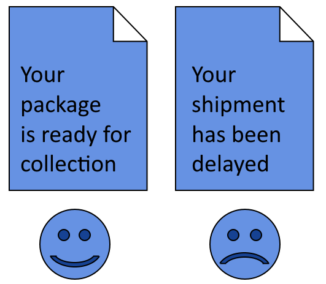

# 情感分析的训练数据

[深度学习](https://www.baeldung.com/cs/category/ai/deep-learning) [机器学习](https://www.baeldung.com/cs/category/ai/ml)

[神经网络](https://www.baeldung.com/cs/tag/neural-networks) [训练](https://www.baeldung.com/cs/tag/training)

1. 概述

    在本教程中，我们将研究自然语言处理中的情感分析问题。

    我们还将确定一些可用于开发模型原型的训练数据集。

    本教程结束时，我们将知道在哪里可以找到情感分析的常用数据集，以及如何使用它们进行简单的自然语言处理。

2. 情感分析

    1. 情感分析简介

        分析人类语言中的情感问题是[自然语言处理](https://www.baeldung.com/apache-open-nlp)、[认知科学](https://en.wikipedia.org/wiki/Cognition)、[情感心理学](http://www.jcreview.com/fulltext/197-1577442103.pdf)、[计算语言学](https://www.researchgate.net/publication/283954600_Sentiment_Analysis_An_Overview_from_Linguistics)和[传播学研究](https://link.springer.com/article/10.1007/s11135-016-0412-4)的主题。他们各自从不同的角度来理解语言与人类情感之间的关系这一现象。

        在我们关于文本中的情感检测的[文章](https://www.baeldung.com/cs/ml-emotion-detection#4-the-mapping-of-emotions-and-language)中，我们讨论了语言和情感之间是否存在独特的映射关系尚不清楚。如果不存在，那么通过语言识别和处理情感的问题就无法通过算法解决。这反过来又意味着，我们无法成功地将机器学习应用于此。

        不过，在许多常用的应用中，机器学习的确可以进行情感分析。例如，识别用户[评论中的负面反馈](https://ieeexplore.ieee.org/abstract/document/6606604/)、检测[候选人政治支持率](https://gate.ac.uk/sale/rnti-09/Pang-Lee-Book.pdf)的变化以及根据社交媒体数据[预测股市价格](https://www.aclweb.org/anthology/P15-1131.pdf)。

        因此，当我们在理论上确信机器学习不能普遍解决情感分析问题时，它怎么可能在实践中得到应用呢？

    2. 狭义任务与一般任务

        人工智能理论将解决[狭义任务和一般任务区](https://link.springer.com/article/10.1007/s00146-016-0685-0)分开来。虽然一般认知问题的解决方案[尚未实现](https://www.sciencedirect.com/science/article/abs/pii/S138904171730222X)，但对于狭义任务，机器学习的表现往往非常出色。

        在[处理情绪问题](https://link.springer.com/chapter/10.1007/978-94-009-2792-6_12)时，我们同样可以区分一般任务和狭义任务。从目前的理论认识来看，一般的情感识别问题是无法解决的。但是，狭义任务的解决仍然可以非常准确。

        我们还讨论了在调节人类心理的[情绪本体论](https://www.baeldung.com/cs/ml-emotion-detection#5-does-this-function-exist)方面如何普遍存在分歧。因此，在识别文本中的情感时所使用的本体论也无法达成一致。不过，如果我们任意假定某个本体适用于某个问题，那么我们就可以通过机器学习来解决这个问题。

        典型的本体包括两个类别：积极情绪和消极情绪。分析单位，无论是文本、单词还是句子，都会被统一归入其中一类：

        

        然而，不同作者对 "积极"和 "消极"的定义可能会有很大不同。由此，我们得出结论，[情感分析有多种方法](https://www.baeldung.com/cs/ml-emotion-detection#5-does-this-function-exist)，每种方法都源于对特定语境中情感的狭义定义。我们给特定问题下的定义越准确，其在机器学习中的应用就越好。

    3. 并非所有数据集生而平等

        这也意味着并非所有的训练数据集都是相同的。在应用某种特定方法时开发的数据集，如果我们将其应用到不同的环境中，效果就不会很好。这意味着，选择一个遵循适用于我们问题的特定理论假设的数据集异常重要。

        为此，我们将在这里讨论最常见的情感分析数据集，以及这些数据集最初是在什么情况下开发的。我们还将研究这些数据集在科学文献中的应用实例，以了解它们各自为我们提供了哪些可能性。

3. 监督学习的数据集

    在情感检测的介绍性文章中，我们列出了一些[情感检测的公共数据集](https://www.baeldung.com/cs/ml-emotion-detection#public-datasets-for-emotion-detection)，我们可以利用这些数据集来开发基础模型。在这里，我们将列出一组不同的数据集，对每个数据集的特征和科学用途进行更全面的描述。

    首先，我们将列出用于情感分析监督学习的最常见数据集。它们都特别适用于开发机器学习模型，根据预定的类型对文本进行分类。

    1. MPQA意见语料库

        [MPQA意见语料库](http://mpqa.cs.pitt.edu/corpora/mpqa_corpus/)由 70 个注释文档组成，这些文档与英语媒体上发布的新闻项目相对应。该语料库采用一种特定的注释方案，包括以下标签或标记：

        - 代理人标签，指作为作者情感接受者的实体
        - 表达-主观性标签，用于标记文本中包含对标记为代理人的实体之一的间接判断的元素
        - 直接-主观性标记，指直接表达与特定实体有关的情感
        - 客观-言语-事件标签，表示情感方面的中性陈述
        - 态度值，包含与所表达的声明有关的情感极化。

        表达性和直接主观性这两个标签还包含对其所指特定句子的极性测量。该数据集特别适合用于训练学习特定实体的[显性和隐性情感表达](https://www.aclweb.org/anthology/D15-1018.pdf)的模型。它还被用于训练情感分析的[深度学习模型](https://onlinelibrary.wiley.com/doi/abs/10.1002/widm.1171)，更广泛地说，它还被用于进行[舆情挖掘](http://citeseerx.ist.psu.edu/viewdoc/summary?doi=10.1.1.364.9222)。

    2. 情感140

        [Sentiment140](http://help.sentiment140.com/for-students/)数据集包含了来自不同英语用户的 160 万条推文，非常适合用于开发情感分类模型。当然，这个名称是根据[原始Twitter消息](https://developer.twitter.com/en/docs/counting-characters)的定义字符限制而命名的。

        该数据集包含自动标记的消息，根据消息是否包含表情符号 $\text{:)}$ 或 $\text{:(}$，分别标记为"正面"或"负面"。这种自动标记方法虽然很常用，但也存在一些已知的局限性，尤其是对[反讽的盲目性](https://www.aclweb.org/anthology/E14-3007.pdf)。

        数据集的特征包括：

        - 极性，从负面到正面
        - 推文的 ID 和日期，这对我们进行时间序列分析非常有用
        - 作者的 twitter 地址
        - 当然还有推文文本本身

        事实证明，情态 140 [特别适用](https://cs.stanford.edu/people/alecmgo/papers/TwitterDistantSupervision09.pdf)于训练[最大熵](https://www.baeldung.com/apache-open-nlp#sentence-detection)模型。此外，科学文献也显示了它在 Naive Bayesian 模型中的[应用](https://www.researchgate.net/profile/Rabi_Behera/publication/296561490_A_Novel_Machine_Learning_Approach_for_Classification_of_Emotion_and_Polarity_in_Sentiment140_Dataset/links/571f098808aefa648899aabe.pdf)。此外，通过[支持向量机](https://www.baeldung.com/cs/ml-support-vector-machines)建模，它还可用于分析人们对流行病的态度。

    3. 论文评论

        [论文评论](https://archive.ics.uci.edu/ml/datasets/Paper+Reviews)数据集包含 405 篇西班牙文和英文评论，涉及提交给计算机科学国际会议的论文。其中涉及的论文数量略多于一半，因为在科学出版领域，每篇论文通常至少有[两名审稿人](https://www.wiley.com/network/researchers/submission-and-navigating-peer-review/why-use-more-than-one-peer-reviewer)。数据集本身是[JSON格式](https://www.baeldung.com/java-json)，包含以下特征：

        - 审稿涉及的论文 ID 和日期
        - 审稿人接受或拒绝论文的决定
        - 审稿人发送给会议论文集编辑和论文作者的审稿文本本身
        - 被称为备注的第二个文本，编辑会收到，但论文作者不会收到
        - 取向，即数据集作者对每篇评论的情感评分
        - 评价，即对某篇论文的评分或判断
        - 最后是置信度，表示审稿人在给文章打分时的确定性。

        论文评论数据集可用于训练包含[蜂群优化](https://www.baeldung.com/java-multi-swarm-algorithm)的[混合模型](https://link.springer.com/article/10.1007/s00500-019-04209-7)。由于评价分数具有数字序数值，因此它也适用于一般的分类和回归任务。在研究同行评审过程中的情感、客观性和分数之间的关系时，它也应该是有用的，但目前还没有得到很好的利用。

        科学界的一个普遍信念是，同行评审过程[通常是公平公正](https://www.ncbi.nlm.nih.gov/pmc/articles/PMC2223019/)的。然而，这种信念是值得怀疑的，尤其是与一些已知的[人类认知偏差](https://doi.org/10.1002/asi.22784)有关，如[性别](https://www.biorxiv.org/content/10.1101/495465v1)、[机构声望](https://doi.org/10.1073/pnas.1707323114)，以及对我们自然语言处理来说最重要的语言。因此，该数据集特别适合用来分析人类偏见及其在科学发现发表过程中的作用。

    4. 大型电影评论数据集

        另一个包含评论的流行数据集是大型电影评论数据集（[Large Movie Review Dataset](http://ai.stanford.edu/~amaas/data/sentiment/)）。该数据集包含 50,000 篇评论，分为训练和测试两部分，所有评论都包含高度两极化的文本。它特别适用于二元分类，只包含两个特征：

        - 评论文本
        - 极化值（"正面 "或 "负面"）。

        该数据集可用于[训练监督-非监督混合学习模型](http://ai.stanford.edu/~amaas/papers/wvSent_acl2011.pdf)。此外，支持向量分类器、[天真贝叶斯分类器](https://link.springer.com/article/10.1007/s00500-015-1779-1)以及神经网络和 k 近邻分类器也[都在](https://arxiv.org/pdf/1802.05322.pdf)使用该数据集。[Kaggle上收集](https://www.kaggle.com/lakshmi25npathi/imdb-dataset-of-50k-movie-reviews/notebooks)了大量包含该数据集分类模型的notebooks。

    5. 深动，斯坦福情感树库

        [斯坦福情感树库](https://nlp.stanford.edu/sentiment/code.html)是论文《[Deeply Moving：情感分析的深度学习](https://nlp.stanford.edu/~socherr/EMNLP2013_RNTN.pdf)》 中使用的文本语料库。该数据集由 10605 篇文本组成，这些文本是从专门提供电影评论的网站 Rotten Tomatoes 上提取的。它包括以下特征：

        - 未经处理的原始文本本身
        - 文本中包含的短语，以及每个短语的唯一 ID
        - 最后是解析数据集中文本的树结构。

        斯坦福情感树库可用于[支持向量分类器](https://www.koreascience.or.kr/article/JAKO201510763641236.page)和[深度学习模型](https://ieeexplore.ieee.org/abstract/document/7942788/)的训练。它还启发了其他语言类似数据集的开发，并创建了[阿拉伯语情感树库](https://dl.acm.org/doi/abs/10.1145/3086576)。

    6. 多域情感数据集

        这个用于多域分析的[数据集](http://www.cs.jhu.edu/~mdredze/datasets/sentiment/)最初是由[宾夕法尼亚大学](http://www.cs.jhu.edu/~mdredze/publications/sentiment_acl07.pdf)基于从亚马逊网站上搜刮的产品而开发的。这些产品属于四个类别：电子产品、书籍、厨房用具和DVD。每条评论都有一个 "正面"或 "负面"的极化分值，分别对应五星以上或五星以下（满分最多五颗星）。

        评论既有未经处理的版本，也有预处理的版本。后者已被[标记](https://www.baeldung.com/java-stringtokenizer)为[单词或双词组](https://www.baeldung.com/cs/ml-understanding-dimensions-cnn#2-encoding-n-grams-with-1d-convolutions)。预处理版本的特点如下：

        - 标记本身
        - 每个标记的出现次数
        - 包含极化值的标签

        正面评论和负面评论两个类别各拥有 1000 个元素。此外，还有 3685 条关于 DVD 的评论和 5945 条关于厨房用具的评论等[未标记数据]。使用未标记数据有助于比较不同模型对以前未见数据的预测。

        该数据集已在情感分析文献中得到广泛应用。其中，[情感-主题联合模型](https://oro.open.ac.uk/28546/1/Automatically_Extracting_Polarity_Bearing_Topics.pdf)被证明有助于学习预测评论情感内涵的因素。[Naive Bayesian模型和顺序最小优化](https://link.springer.com/article/10.1186/s40537-018-0152-5)也成功地对该数据集中的文本进行了分类。

    7. 赞成与反对

        [利弊数据集](http://www.cs.uic.edu/~liub/FBS/pros-cons.rar)涉及[句子层面的意见挖掘任务](https://www.cs.uic.edu/~liub/FBS/Coling-2008-camera-ready.pdf)。它包含约 23,000 个表示正面和负面判断的句子，旨在与比较句子数据集结合使用。该数据集有两种用途：

        - 作为词典或查询字典，确定新文本中相同句子的极性
        - 根据新句子与该数据集所含句子的[相似性](https://www.baeldung.com/cs/ml-similarities-in-text)为新句子指定极性

        利用该数据集的科学文献分为两类：模型开发和将极性自动分类扩展到英语以外的语言。

        关于第一类，该数据集在[自动语音处理](https://en.wikipedia.org/wiki/Speech_recognition)方面非常有效。在这项任务中，数据集提供了极性分类标签，音频处理模型可以利用这些标签来[确定用户语音的情感](https://ieeexplore.ieee.org/abstract/document/6639321)。它的相关数据集 "比较句子"（Comparative Sentences）在对[Youtube视频进行情感归因](https://ieeexplore.ieee.org/abstract/document/6707736)时也有类似的用途。

        关于第二类，该数据集不仅启发了[挪威语极化句子语料库](https://www.duo.uio.no/handle/10852/69040)的创建，而且还启发了用于[深度情感分析的多语言语料库](https://ipsj.ixsq.nii.ac.jp/ej/?action=pages_view_main&active_action=repository_action_common_download&item_id=142646&item_no=1&attribute_id=1&file_no=1&block_id=8&page_id=13)的创建。多语言情感分析是众所周知的难题，因为它与[语言相关](https://arxiv.org/abs/1806.04511)，而使用这个数据集和其他不同语言的数据集有助于解决这个问题。

    8. Opinosis意见数据集

        [Opinosis观点数据集](http://kavita-ganesan.com/opinosis-opinion-dataset/)是由用户对产品和服务的评论组成的资源，按主题分组。该数据集包含与亚马逊、Tripadvisor 和 Edmunds 网站上销售的产品相关的 51 个不同主题。每个主题都有大约 100 个不同的句子，大多与电子产品、酒店或汽车有关。

        所有句子都被划分为词块，然后用语音部分标记对其进行扩充。该数据集对于文本摘要特别有用，因为它缺少极化标签。不过，将[其与情感词典结合使用](https://www.tandfonline.com/doi/abs/10.1080/1206212X.2018.1483813)，还可以进行有监督的情感分析，就像以前所有的数据集一样。

        Opinosis观点数据集的优势在于其语音部分标签。研究表明，[使用形容词和副词的模型](https://icwsm.org/papers/3--Benamara-Cesarano-Picariello-Reforgiato-Subrahmanian.pdf)优于仅使用形容词的模型，而我们需要语篇标签来区分这两组模型。因此，本数据集允许构建使用语篇标签和词法的情感分析模型。

    9. 推特美国航空公司

        另一个源自 Twitter 的数据集是[Twitter美国航空公司数据集](https://www.kaggle.com/crowdflower/twitter-airline-sentiment)，该数据集包含有关美国航空公司服务质量的主题信息。该数据集包含以下特征

        - 每条信息的唯一 ID
        - 由志愿贡献者分配的极性分数
        - 如果极性是负面的，则提供一个自然语言句子，由人工标注员指明原因
        - 人类标记者在分配极性分数时自我评估的可信度
        - 转发次数，用于研究信息的分布或影响力
        - 当然还有信息所涉及的具体航空公司的名称

        在科学文献中，数据集一般用于[分类任务](https://ieeexplore.ieee.org/abstract/document/8377739)。但更具体地说，也用于[支持向量机和AdaBoost](https://www.researchgate.net/profile/Prabhakar_Eswaran/publication/341070490_Sentiment_Analysis_of_US_Airline_Twitter_Data_using_New_Adaboost_Approach/links/5eabc637a6fdcc70509dfb3f/Sentiment-Analysis-of-US-Airline-Twitter-Data-using-New-Adaboost-Approach.pdf)，以及结合多种算法预测结果的[集合方法](https://ieeexplore.ieee.org/abstract/document/7395820)。

        有趣的是，我们可以注意到，该数据集中的一些美国航空公司对 Twitter 上的[负面客户反馈](https://www.forbes.com/sites/grantmartin/2014/10/24/how-to-complain-to-airlines-on-twitter-and-what-youre-doing-wrong/)的反应速度出奇地快。这可能会让我们相信，它们自己可能已经采用了一套系统来检测用户推文中的负面极性。

4. 无监督情感分析数据集

    1. 无监督情感分析

        最后一点是关于[无监督学习](https://www.baeldung.com/cs/machine-learning-intro#unsupervised)在情感分析中的应用。我们知道，如果要给文本分配情感值，实际上是在执行分类或回归任务，这取决于我们是将标签分别视为无序的分类变量还是数字变量。不过，文献中也讨论了[无监督情感分析](https://www.aclweb.org/anthology/P02-1053.pdf)的方法，不过最好说是[半监督](https://www.baeldung.com/cs/machine-learning-intro#semiSupervised)。

        其中一种方法如下。我们首先选择数据集中的两个词，然后给它们分配一个反极性得分。如果我们使用上面链接的论文中选取的单词，那么我们可以将这一过程表示为分配 $P( \text{positive} | \text{excellent} ) = 1$ 和 $P( \text{negative} | \text{poor} ) = 1$。这个过程被命名为 "播种"，因为它类似于[随机发生器的播种过程](https://www.baeldung.com/cs/randomness#3-pseudorandom-generation-middle-squares)。

        然后，我们可以使用一些度量来确定分配给数据集中所有其他词的极性值。常用的测量方法是[互信息](https://en.wikipedia.org/wiki/Pointwise_mutual_information)，但也有一些[变体](https://www.aclweb.org/anthology/P02-1053.pdf)。不过，根据我们使用的种子词，分配给非种子词的极性分值似乎会发生[很大变化](https://www.aclweb.org/anthology/C16-1147.pdf)，因此这种方法的可靠性值得怀疑。

    2. 作为数据集的词典

        从对该方法的描述中，我们可以自然而然地得出这样的结论：包含被人类标记为极化词（如 "优"和 "差"）的文本语料库适用于无监督情感分析。这意味着，一般来说，为有监督情感分析准备的数据集同样适用于无监督分析。

        不过，还有另一种无监督情感分析方法，即[基于词典的方法](https://journals.plos.org/plosone/article?id=10.1371/journal.pone.0197816)。这种方法基于这样一种观点，即有些词本身就有正面或负面的含义，比如 "正面"和 "负面"这两个词。如果这是真的，那么就有可能建立包含单词标记与极性得分之间关联的词典。

        网上有一些此类词典可以公开获取。其中之一是 [VERY NEG VERY POS 词典](https://github.com/citiususc/VERY-NEG-and-VERY-POS-Lexicons)，它还包含每个词的语音部分标记。另一个词库是 [SO-CAL](https://github.com/sfu-discourse-lab/SO-CAL)，其中也包含了[极化词的权重和否定词](http://cognet.mit.edu/journal/10.1162/coli_a_00049)。

        最后，还有一种从数据集开发词典的[自动方法](https://ieeexplore.ieee.org/abstract/document/8554659)。如果我们使用的语言没有现成的数据集，或者我们不确定现有数据集的可靠性，我们可以参考这种方法。

5. 结论

    在本文中，我们学习了情感分析方法的基础知识。

    我们还列出了用于监督式情感分析的公共数据集。

    我们讨论了每个数据集所具有的特征以及科学文献中已知的使用案例。

    最后，我们介绍了无监督情感分析的基础知识，并确定了有助于情感分析的数据集和词典。
