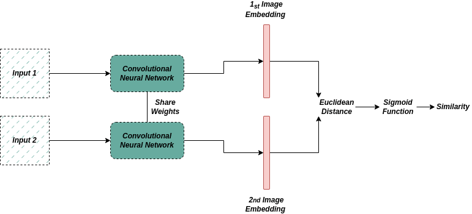

# 连体网络如何在图像识别中发挥作用？

[计算机视觉](https://www.baeldung.com/cs/category/ai/computer-vision) [深度学习](https://www.baeldung.com/cs/category/ai/deep-learning)

[神经网络](https://www.baeldung.com/cs/tag/neural-networks)

1. 简介

    在本教程中，我们将探讨连体网络（又称孪生神经网络），这是一种深度学习架构，在[计算机视觉](https://www.baeldung.com/cs/computer-vision-image-processing-differences)领域得到广泛应用，并日益流行。

    我们将特别介绍其训练阶段，并分析其优缺点。

2. 什么是连体网络？

    [连体网络由 Gregory Koch](https://www.cs.cmu.edu/~rsalakhu/papers/oneshot1.pdf) 于 2015 年提出。

    之所以叫 "连体(Siamese)"，是因为该网络设计了两个完全相同的子网络，每个子网络以相同的权重处理不同的输入样本。这两个子网络的输出会在最后一层进行比较，以生成预测结果。

    因此，这些网络可用于图像识别任务，以判断两幅图像是否不同。事实证明，暹罗网络在数据量较少的情况下特别有用，因为它们可以在少量标注数据上进行训练，然后在更大的数据集上进行微调。

3. 连体网络的架构

    首先，两个神经网络分支都具有相同的神经网络权重，它们都对两个输入学习一个共同的表示，但在不同的输入上分别进行训练。这使得网络可以学习如何比较图像，而不是如何对图像进行分类。

    连体网络的结构如下：

    

    卷积层和[池化层](https://www.baeldung.com/cs/neural-networks-pooling-layers)负责从每个网络的图像样本中提取有意义的特征。每个分支的最后一层是比较层，负责生成嵌入，即数据样本的紧凑表示。比较层通常有几种设计方式，这取决于特定的任务。典型的例子是[欧氏距离](https://www.baeldung.com/cs/euclidean-distance-vs-cosine-similarity)或[相关相似性](https://www.baeldung.com/cs/correlation-coefficient)。然后，通过一个比较函数来驱动嵌入，从而产生一个预测，决定两个数据样本是否相同。

    因此，连体网络的最终输出是一个相似度得分，表示两个输入图像的相似或不同程度。这个分数可用于预测，例如两张人脸图像是否属于同一个人。

4. 连体网络的训练

    连体网络的训练可以是有监督的，也可以是无监督的。在监督学习中，网络是在带有已知地面实况标签的标注数据上进行训练的。在无监督学习中，网络在无标签数据上进行训练，必须学会根据输入图像生成自己的标签。

    连体网络的损失函数通常基于比较函数生成的相似性得分。通常，[三重损失或对比损失](https://www.baeldung.com/cs/contrastive-learning)用于学习。在人脸识别中，损失函数可以是预测的相似性得分与真实标签之间的[交叉熵损失](https://www.baeldung.com/cs/cross-entropy)。

    孪生网络的训练应使用均衡的数据集，以便两个网络得到同等的训练。连体网络需要学习如何区分相似和不相似的图像，而平衡的数据集能提供更具代表性的两类图像样本。

5. 优缺点

    连体网络也有一些优点和局限性。在为特定任务选择合适的网络架构时，必须同时考虑这两方面的因素。

    首先，连体网络最重要的一点是对旋转、平移和缩放等图像变换的鲁棒性。它们可以学习执行对比任务，而无需手动提取特征。此外，它们还能有效处理小型数据集，因为两个分支使用相同的权重。另一个优势是，由于它们共享相同的权重，因此学习的参数数量减少了。

    另一方面，连体网络通常能很好地处理包含具有明显差异的图像的数据集。此外，这些网络已被证明对过拟合很敏感，在性能指标方面也很难完全描述它们。

    下表总结了其主要优点和局限性：

    | 优势    | 缺点   |
    |-------|------|
    | 经得起变换 | 复杂性  |
    | 计算效率高 | 性能限制 |
    | 端对端学习 | 过度拟合 |

6. 连体网络的应用

    由于连体网络具有学习表征和有效比较表征的能力，因此在图像识别的各种应用中得到了广泛应用。在人脸识别中，连体网络用于比较两张人脸图像，并确定它们是否属于同一个人。

    在[物体跟踪任务](https://www.baeldung.com/cs/object-recognition-tasks-differences)中，它们可用于跟踪视频序列中的不同物体。此外，它们还可用于签名验证，以验证签名的真实性。

    最后，连体网络可用于生物识别认证系统、图像验证或[单次学习](https://en.wikipedia.org/wiki/One-shot_learning)，在这种情况下，网络必须在只看到一个新对象的实例后就能识别该对象。

7. 结论

    在本文中，我们介绍了连体网络，这是一类通过设计两个相同的子网络来实现的深度学习架构。

    我们特别介绍了这类网络，谈到了它们的训练阶段，并提到了它们的优点和局限性以及主要用途。
