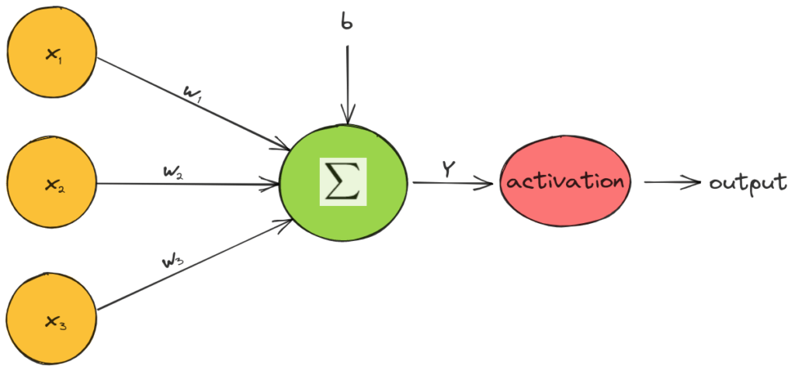
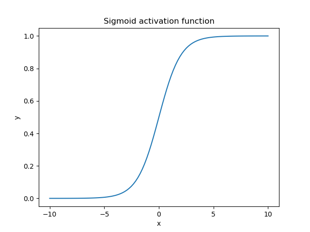
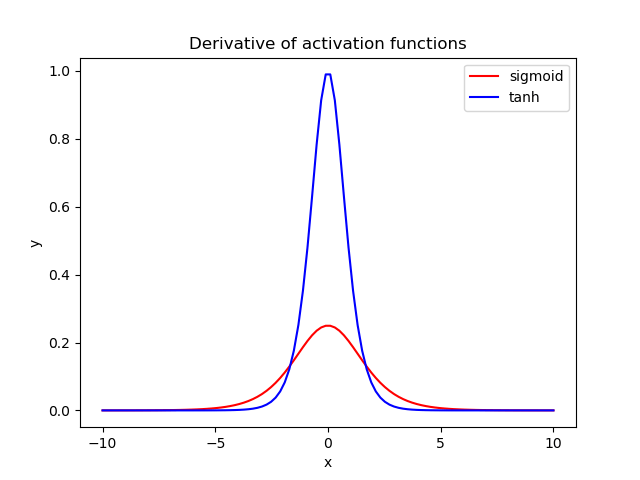
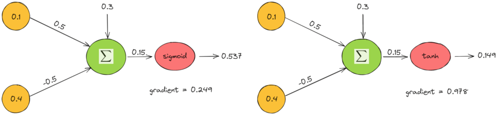

# 活化函数：Sigmoid与Tanh

[深度学习](https://www.baeldung.com/cs/category/ai/deep-learning) [机器学习](https://www.baeldung.com/cs/category/ai/ml)

[神经网络](https://www.baeldung.com/cs/tag/neural-networks)

1. 概述

    在本教程中，我们将讨论 sigmoid 和 tanh 激活函数。首先，我们将简要介绍激活函数，然后介绍这两个重要函数，对它们进行比较，并提供一个详细示例。

2. 激活函数

    激活函数是[神经网络](https://en.wikipedia.org/wiki/Artificial_neural_network)的重要组成部分，它决定神经元是否被激活。具体来说，前馈神经网络中神经元的值计算如下：

    \[Y = \sum_{i=1}^m (x_i * w_i) + b\]

    其中，$x_i$ 是输入特征，$w_i$ 是权重，b 是神经元的偏置。然后，在每个神经元的值上应用激活函数 $\mathbf{f}$，并决定神经元是否处于激活状态：

    \[output = f(Y)\]

    在下图中，我们可以看到激活函数是如何工作的：

    

    激活函数是单变量和非线性的，因为具有线性激活函数的网络只相当于一个线性回归模型。由于激活函数的非线性，神经网络可以捕捉复杂的语义结构并实现高性能。

3. 西格码

    [sigmoid](https://en.wikipedia.org/wiki/Sigmoid_function) 激活函数（也称为 logistic 函数）将任何实值作为输入，并在 $\mathbf{(0, 1)}$ 范围内输出一个值。计算公式如下

    \[\mathbf{s(x) = \frac{1}{1 + e^{-x}}}\]

    其中 x 是神经元的输出值。下面是输入在 [-10, 10] 范围内时的 sigmoid 函数图：

    

    不出所料，sigmoid 函数是非线性的，它将神经元的值限定在 (0, 1) 的小范围内。当输出值接近 1 时，神经元处于活跃状态，可以进行信息流；而当输出值接近 0 时，神经元处于非活跃状态。

    此外，S 形函数的一个重要特点是，由于其 S 形，它倾向于将输入值推向曲线的两端（0 或 1）。在接近零的区域，如果我们稍微改变输入值，输出的相应变化就会非常大，反之亦然。输入值小于-5 时，函数的输出几乎为零，而输入值大于 5 时，输出几乎为 1。

    最后，sigmoid 激活函数的输出可以解释为一种概率，因为它位于 [0, 1] 的范围内。这就是为什么它也被用于预测任务的输出神经元。

4. Tanh

    深度学习中常见的另一个激活函数是[正切双曲](https://en.wikipedia.org/wiki/Hyperbolic_functions)函数，简称 tanh 函数。其计算方法如下

    \[\mathbf{tanh(x) = \frac{e^{x} - e^{-x}}{e^{x} + e^{-x}} = \frac{1 - e^{-2x}}{1 + e^{-2x}} = \frac{2 - (1 + e^{-2x})}{1 + e^{-2x}}= \frac{2}{1 + e^{-2x}} - 1 = 2s(2x) - 1}\]

    我们可以发现，tanh 函数是一个移位和拉伸版的 sigmoid 函数。下面，我们可以看到当输入在 [-10, 10] 范围内时的曲线图：

    

    tanh 函数的输出范围是（-1, 1），其表现与 sigmoid 函数类似。主要区别在于 tanh 函数将输入值推至 1 和 -1 而不是 1 和 0。

5. 比较

    这两种激活函数都被广泛应用于神经网络，因为它们都能学习非常复杂的结构。现在，让我们比较一下它们，看看它们的异同。

    1. 相似之处

        如前所述，tanh 函数是 sigmoid 函数的拉伸和移位版本。因此，两者有很多相似之处。

        这两个函数都属于 S-like 函数，都能将输入值抑制在一定范围内。这有助于网络保持其权重有界，并防止梯度值变得非常大的梯度爆炸问题。

    2. 差异

        这两个函数的一个重要区别在于梯度的行为。让我们来计算每个激活函数的梯度：

        \[s'(x) = s(x) (1 - s(x))\]

        \[tanh'(x) = 1 - tanh^2(x)\]

        下面，我们将绘制 sigmoid（红色）和 tanh（蓝色）激活函数的梯度图：

        

        在神经网络中使用这些激活函数时，我们的数据通常以零点为中心。因此，我们应该关注每个梯度在零点附近区域的表现。

        我们观察到，tanh 的梯度是 sigmoid 函数梯度的四倍。这意味着，使用 tanh 激活函数会在训练过程中产生更高的梯度值，网络权重的更新也会更高。因此，如果我们想要更强的梯度和更大的学习步长，就应该使用 tanh 激活函数。

        另一个区别是，tanh 的输出在零点附近是对称的，因此收敛速度更快。

6. 消失梯度

    尽管这两个函数都有优点，但它们都存在所谓的[梯度消失问题](https://en.wikipedia.org/wiki/Vanishing_gradient_problem)。

    在神经网络中，误差通过网络的隐层反向传播并更新权重。如果我们有一个非常深的神经网络，并且像上面的激活函数一样是有界的，那么误差在经过每个隐藏层的反向传播后会急剧下降。因此，在早期层，误差几乎为零，而这些层的权重没有得到正确更新。[ReLU](https://en.wikipedia.org/wiki/Rectifier_(neural_networks)) 激活函数可以解决梯度消失问题。

7. 示例

    最后，我们以一个简单的神经元为例，说明如何在两个输入特征 $x_1 = 0.1, x_2 = 0.4$ 和权重 $w_1 = 0.5, w_2 = -0.5$ 中应用这些激活函数。下面，我们可以看到使用 sigmoid（左）和 tanh（右）激活函数时的输出值和梯度：

    

    上面的例子验证了我们之前的评论。tanh 的输出值更接近于零，梯度是原来的四倍。

8. 结论

    在本教程中，我们讨论了 tanh 和 sigmoid 这两个激活函数。首先，我们介绍了这两个术语，然后通过一个例子对这两个函数进行了描述和比较。
