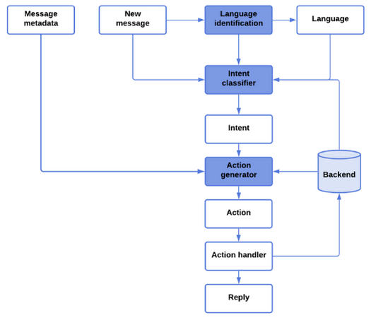
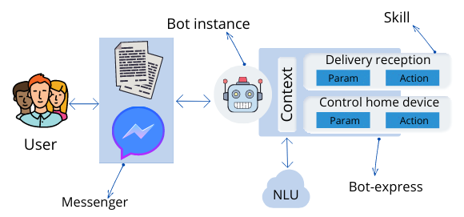
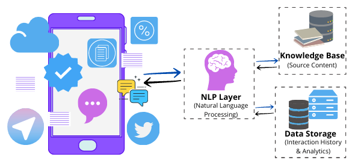

# 如何创建智能聊天机器人？

[深度学习](https://www.baeldung.com/cs/category/ai/deep-learning) [机器学习](https://www.baeldung.com/cs/category/ai/ml)

[自然语言处理](https://www.baeldung.com/cs/tag/nlp)

1. 概述

    在本教程中，我们将了解智能聊天机器人的含义。然后，我们将介绍智能聊天机器人的架构及其工作原理。最后，我们将介绍构建一个能进行有意义对话的聊天机器人的步骤。

2. 什么是聊天机器人？

    聊天机器人是一种基于人工智能的会话软件。这意味着它能用人类的自然语言与人类互动。这些聊天机器人通常通过语音或文本进行交流，它们可以轻松模仿人类语言，以类似人类的方式与人类交流。聊天机器人的首要和最重要的目标之一就是要像一个智能人，让别人难以了解其真实面目。

    聊天机器人使用问答模式来管理对话。而人工智能和机器学习则用于识别问题并提供合适的答案。

3. 不同类型的聊天机器人

    人工智能和机器学习是聊天机器人运行的核心。一般来说，聊天机器人通过将收到的用户问题与预定义指令进行比较来识别请求。它通过高级算法处理请求，然后做出适当回应。根据聊天机器人分析输入和回复的方式，可以将聊天机器人分为两类。让我们来看看这两类聊天机器人：

    - 基于规则的方法(Rule-based approach)： 这种方法会指示聊天机器人根据一组预先确定的规则回答问题，这些规则最初都是经过训练的。这些规则可以非常简单，也可以非常复杂。虽然基于规则的聊天机器人能处理简单的询问，但它们经常无法处理更复杂的询问/请求
    - 自学方法(Self-learning approach)： 顾名思义，它们是可以自学的聊天机器人。它们使用人工智能和机器学习等先进技术，根据实例和行为进行自我训练。自然，这些聊天机器人比基于规则的机器人要智能得多。让我们来看看自学习机器人的两种类型：检索型机器人和生成型机器人
    1. 基于检索的聊天机器人

        使用预定义输入和预定义回复的聊天机器人称为检索型聊天机器人。一旦输入问题/模式，聊天机器人就会采用[启发式](https://www.baeldung.com/cs/heuristics)方法提供适当的回复。这些聊天机器人只回复预定义的问题，不生成新内容。基于检索的模型通常用于创建目标导向型聊天机器人，具有机器人流程和语气等定制功能。

    2. 生成式聊天机器人

        与基于检索的聊天机器人不同，[生成式聊天机器人](https://medium.com/botsupply/generative-model-chatbots-e422ab08461e)通常是开源聊天机器人程序。它不是从预定义的回复中进行选择，而是生成独特的新回复，不需要大量的示例数据库。如果模型经过适当的训练，生成新颖的回复也是轻而易举的事。

        聊天机器人已成为一种必不可少的客户互动工具，可以在品牌和客户之间发送即时信息。想想苹果的 Siri、微软的 Cortana 和亚马逊的 Alexa。这些不是很好吗？难道你不想学习如何制作自己的聊天机器人吗？

4. 聊天机器人架构图

    聊天机器人由许多组件组成，这些组件协同工作以实现共同目标。让我们来看看对话代理各个组件之间的关系：

    
    当聊天机器人收到新消息时，语言识别模块会首先进行处理。这可能包括从简单的标签检索到更复杂的统计技术。然后，意图分类器模块会收到三个输入，即新消息、语言以及从后台获取的之前的讨论消息。意图分类器模块负责推断用户的目的。

    然后，将利用推断出的信息元数据意图和其他后台数据来确定合适的操作或一系列操作。例如，如果用户的意图仍不明确，聊天机器人可以选择回答一个问题；如果用户的意图是请求允许，聊天机器人可以选择重新激活用户账户。

    最后，动作处理模块接受动作输入并适当执行。这一点很有优势，因为根据代理所处的环境，同一个动作可能有多种执行方式。例如，根据机器人是在公司网站还是在 Messenger 平台上工作，执行的操作可能完全不同。

5. 聊天机器人架构和分类方法

    让我们来了解一下这些机器人的工作流程，以便构建一个能提供适当结果的聊天机器人。

    1. 分类方法

        聊天机器人的性能基于三种分类方法。

        - 模式匹配： 这种方法使用模式匹配对文本进行分类，并对用户做出适当回应。这些模式基于人工智能标记语言（AIML）的标准模型。
        我们使用这些模式来匹配用户信息的各个部分。要提供合理的回复，数据库中必须为每种类型的问题提供显著的模式。
        - 自然语言理解（NLU）： 这种方法由三个概念组成：
        - 实体Entity：这个概念代表聊天机器人的主要思想。例如，在线商店的聊天机器人可能将订单跟踪系统或支付系统作为一个实体
        - 语境Context：当 NLU 算法分析一个句子时，它没有用户在对话中的前一次查询的历史记录。因此，它会根据上下文来理解信息，例如 "餐厅"和 "订购披萨"。这一概念有助于机器人提取意图，而无需依赖以前的信息
        - 意图Intent：这个概念是指聊天机器人响应消息时的动作或意图。在这一步中，机器人会针对用户的询问给出相同的答案，如 "我想要一个白色的包"、"给我看一个白色的包"和 "我想购买一个白色的包"，因为它们触发的命令都是 "白色的包"。
        下面是一个使用 NLU 方法的聊天机器人架构示例：

        

        - 自然语言处理（NLP）： 基于人工智能的智能聊天机器人使用这种方法来理解人类命令（语音和文本）并从经验中学习。因此，它能找出如何将用户的文本或语音转化为结构化数据。因此，结构化数据将用于选择合适的答案。以下是[自然语言处理](https://www.baeldung.com/cs/nlp-encoder-decoder-models)的步骤：
        - 标记化(Tokenization)： 这一概念是将一串单词分割成若干片段，这些片段被称为[标记](https://www.baeldung.com/cs/automatic-keyword-keyphrase-extraction)。这些标记具有语言表示法，在应用中具有不同的价值
        - 规范化(Normalization)： 检查文本中是否存在可能改变用户信息真实意图的印刷错误或拼写错误
        - 实体识别(Entity Recognition)： 这是程序解释文本以确定讨论主题的地方。它通过查找类似的词类、用户数据或任何其他必要信息来识别实体
        - 从属解析(Dependency Parsing)： 它扫描文本中的动词、名词、主语、常用短语和宾语，以识别用户传达的任何相关信息
        - 情感分析(Sentiment Analysis)： 调查和评估用户体验（情感）。如有必要，它将把询问交给人工处理
        下面是一个使用 NLP 方法的聊天机器人架构示例：

        

    2. 语言识别

        在某些情况下，确定文本的语言是更广泛的自然语言处理链中必不可少的第一步。有些语言甚至共享同源词（例如，room，尽管在英语和荷兰语中都有不同的含义，但在英语和荷兰语中都会出现）。这可能导致算法对这些词的语义产生混淆，因此有必要在进一步处理给定文本之前为其识别正确的语言。

    3. 意图分类

        对话代理在收到新信息时必须能够识别用户试图实现的目标。这通常被模拟为一个多分类问题，标签与用户可能的意图名称相对应。为解决这一问题，目前有从基本关键字提取到贝叶斯推理等多种技术可供选择。不过，这些技术需要使用大量信息来识别用户的请求。

    4. 知识管理

        没有知识，智能代理就只能完成这么多工作。知识工程对会话机器人大有裨益，例如回答有关广泛事实的简单询问。Siri 和亚马逊 Alexa 利用内部知识推理方法，从网络和其他来源获取信息（例如，向 Siri 询问今天从突尼斯出发的火车，可能会产生 train(Tunis, D, today) 类型的内部推理操作，其中 D 是一个匿名目的地）。如今，知识管理主要通过 API 调用和优化的数据库请求来完成。

    5. 生成回复

        对话者必须能够做出回应，才能进行对话。此外，这些回应必须与对话的语境保持一致。要解决这个问题，可以将两个模块结合起来：一个模块负责创建潜在回复列表，另一个模块负责根据特定标准对这些回复进行选择或排序。解决这一问题最常用的两种方法是基于检索的策略和基于生成的策略。

6. 如何创建聊天机器人

    让我们来了解一下创建目的驱动型聊天机器人的基本要素：

    - 确定聊天机器人的目标： 第一步是确定聊天机器人的目标。为什么要创建聊天机器人？您的目标是什么？这些问题的答案将有助于选择聊天机器人的类型。
    - 选择交流渠道： 在这里，我们需要选择一个自己熟悉的平台。例如，我们可以为网站或移动应用创建聊天机器人。同样，我们也可以将聊天机器人与 Skype、Facebook Messenger 或其他任何信息服务以及短信渠道联系起来。
    - 选择技术栈： 我们很可能会根据开发人员的技能以及开源和第三方 NLP（自然语言处理）库（如 ChatterBot）的可用性来选择框架。
    设计对话流程：  然后，我们需要编写对话。设计对话流程意味着组织对话并确定机器人的回应。因此，"愉快的流程 "是指对话中的每件事都能按部就班地进行。
    - 训练聊天机器人： 这一步的重点是向机器人传授用户可能提出的不同问题。这一步对于理解用户意图至关重要。我们可以通过现有的数据集（如支持单、电子邮件等）来训练机器人。我们还可以获取包含机器人所需信息的第三方数据集，如 NPS 聊天语料库、问答数据集或任何用于机器学习的聊天机器人数据集。
    - 测试聊天机器人： 由于聊天机器人仍处于早期阶段，最好在各种场景下进行测试，并使用优美的一般回复将对话引向实际目标。
    - 实施聊天机器人： 部署聊天机器人并不需要很长时间。简单地说，我们需要确保所有端点都已链接，并将聊天机器人集成到整个基础设施中（使用 ERP、CRM 或类似软件系统）。为了让用户满意，我们需要查看统计数据并改进回复。
7. 总结

    在本文中，我们讨论了智能聊天机器人的基本原理，以及了解其架构如何有助于开发一个能进行有意义对话的智能机器人。我们还讨论了创建一个智能聊天机器人的问题，它可以作为客户支持的主要来源或人类员工的补充。

- [How to Create a Smart Chatbot?](https://www.baeldung.com/cs/smart-chatbots)
