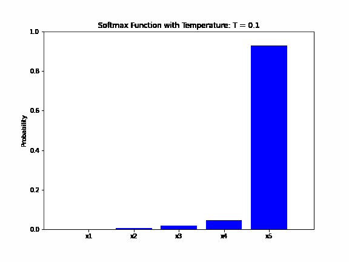

# 什么是温度？为什么要在 Softmax 中使用温度？

[深度学习](https://www.baeldung.com/cs/category/ai/deep-learning) [机器学习](https://www.baeldung.com/cs/category/ai/ml)

[神经网络](https://www.baeldung.com/cs/tag/neural-networks)

1. 简介

    本文将解释 softmax 函数及其与温度的关系。此外，我们还将讨论将温度纳入 softmax 函数的原因。

2. 软最大值

    softmax 函数是一种[激活函数](https://www.baeldung.com/cs/activation-functions-neural-nets)，通常用作[神经网络](https://www.baeldung.com/cs/convolutional-vs-regular-nn#neural-networks)最后一层的输出函数。该函数是 logistic 函数对两个以上变量的泛化。

    Softmax 将实数向量作为输入，并将其归一化为概率分布。Softmax 函数的输出是一个与输入相同维度的向量，每个元素的范围都在 0 到 1 之间。同时，所有元素之和等于 1。

    在数学上，我们将 softmax 函数定义为

    (1) \[\begin{align*} softmax(y_{i}) = \frac{e^{y_{i}}}{\sum_{j=1}^{n}e^{y_{j}}} \end{align*}\]

    其中 $y = (y_{1}, y_{2}, ..., y_{n})$ 是输入向量，$y_{i}, (\ i=\overline{1,n})$ 的值范围为 $-\infty$ 到 $+\infty$ 。

3. 软最大值中的温度

    Softmax "一词源于 "soft"和 "max"。"soft"部分表示该函数产生的概率分布比硬最大值函数更软。而 "max"部分则表示它将选择输入向量中的最大值作为最可能的选择，但选择的方式是软概率分布。

    例如，如果输入向量为（0.4, 0.4, 0.5），硬最大值函数将输出一个向量（0, 0, 1）。相反，软最大值函数的输出将是（0.32, 0.32, 0.36）。

    在软极大值函数中引入温度参数，是为了控制输出概率分布的 "软度"或 "峰度"。温度参数用于控制函数输出的随机性程度。从数学上讲，带有温度参数 T 的 softmax 函数可以定义为

    (2) \[\begin{align*} softmax(y_{i}) = \frac{e^{\frac{y_{i}}{T}}}{sum_{j=1}^{n}e^{\frac{y_{j}}{T}}} \end{align*}\]

    温度参数 T 可以取任意数值。当 T=1 时，输出分布将与标准 softmax 输出相同。T 值越大，输出分布就越 "柔和"。例如，如果我们希望增加输出分布的随机性，就可以增加参数 T 的值。

    下面的动画展示了 softmax 函数的输出概率如何随着温度参数的变化而变化。输入向量为（0.1, 0.4, 0.5, 0.6, 0.9），温度从 0.1 到 2，步长为 0.1：

    

4. 为什么在 Softmax 中使用温度

    当我们希望在输出分布中引入更多随机性或多样性时，温度就会派上用场。这在文本生成的语言模型中尤其有用，因为在这种模型中，输出分布代表了下一个单词标记的概率。如果我们的模型经常过于自信，可能会生成非常重复的文本。

    例如，温度是 GPT-2、GPT-3 和 BERT 等语言模型中的一个超参数，用于控制生成文本的随机性。当前版本的 ChatGPT（gpt-3.5-turbo 模型）也使用了带有 softmax 函数的温度。

    ChatGPT 的词汇量为 175,000 个子词，与 softmax 函数输入和输出向量的维数相同。softmax 函数输出中的每个维度对应于词汇表中某个特定词成为序列中下一个词的概率。因此，ChatGPT API 有一个温度参数，其值在 0 和 2 之间，用于控制生成文本的随机性和创造性。默认值为 1。

5. 结论

    在本文中，我们解释了带温度的 softmax 函数以及使用它的原因。我们还提到了一些使用带温度的 softmax 的应用。
