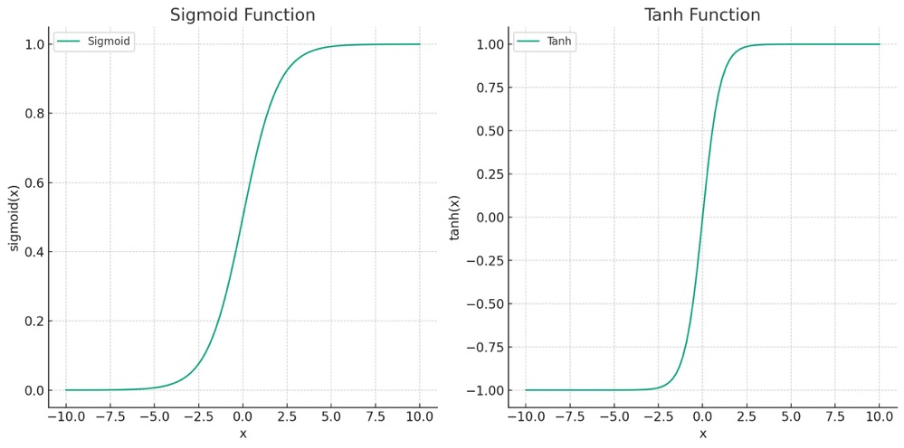

# Softmax 对 Log Softmax

[深度学习](https://www.baeldung.com/cs/category/ai/deep-learning) [机器学习](https://www.baeldung.com/cs/category/ai/ml)

[神经网络](https://www.baeldung.com/cs/tag/neural-networks) [训练](https://www.baeldung.com/cs/tag/training)

1. 引言

    与 Sigmoid、tanh 和 [ReLU](https://www.baeldung.com/cs/relu-vs-leakyrelu-vs-prelu) 类似，Softmax 也是激活函数的一种，在神经网络中起着至关重要的作用。[激活函数](https://www.baeldung.com/cs/activation-functions-neural-nets)为模型引入了非线性特性，使其能够学习复杂的数据模式。我们可以在许多签名深度神经网络中找到 Softmax，例如 [Seq2Seq](https://www.baeldung.com/cs/nlp-encoder-decoder-models) 模型、[Transformers](https://www.baeldung.com/cs/rnns-transformers-nlp#what-are-transformers) 和 GPT-2。

    在本教程中，我们将了解广泛应用于分类问题的 Softmax 函数。此外，我们还将把它与 Log Softmax 进行比较。

2. 什么是 Softmax 函数？

    Softmax 是一种激活函数，通常用作多类分类任务中神经网络的输出。它将实数向量转换为概率向量。在分类任务中，概率向量中的值代表每个类别的概率。我们可以如下计算 Softmax 层。

    \[\sigma(x_i)=\frac{e^{x_i}}{\Sigma_{k}e^{x_k}}\]

    其中，x 是输入向量，k 代表多类分类器中的类数，e 是标准指数函数。

    为了理解 Softmax 函数，让我们假设一个神经网络正试图将图像分类为 "狗"、"猫"、"鸟"或 "鱼"。网络的最后一层将为每个类别生成一组分数。然而，这些分数很难解释。这就是 Softmax 发挥作用的地方。

    Softmax 函数会将这些分数压扁并转化为总和为 1 的概率。Softmax 函数的引入使其在分类任务中发挥了极大的作用，在这种任务中，我们需要从概率的角度清楚地了解每个类别的可能性。

    下图给出了一个以 Softmax 层为输出的网络示例：

    

    如图所示，Softmax 层计算每个类别的概率。概率最大的类别就是网络的实际预测结果。此外，四个类别之间的概率之和等于 1。

    1. 为什么需要 Softmax？

        下图展示了 sigmoid 和 tanh 函数：

        

        x 轴是网络最后一层的值。与 sigmoid 和 tanh 函数相比，Softmax 可用于多类分类，而不仅仅是二元分类。

        Softmax 函数的一个关键要素是指数函数。指数函数的使用简化了梯度的计算，同时使用负对数似然作为损失函数。因此，它有助于训练大型复杂网络。

        Softmax 和负对数似然的组合也被称为[交叉熵损失](https://www.baeldung.com/cs/cross-entropy#1-cross-entropy-as-a-loss-function)。我们可以将多类分类问题的交叉熵损失视为每个单独类别的负对数似然之和。

    2. Softmax 的挑战

        然而，使用指数函数也给神经训练工作带来了挑战。例如，输出值的指数可能是一个非常大的数字。

        当这个数字被用于进一步计算时（如计算损失时），由于计算机浮点表示法的限制，可能会导致数值不稳定。

3. Log Softmax 及其优势

    Log Softmax，顾名思义，就是计算 softmax 函数的对数。

    \[Log\_Softmax (x)= \log{\sigma(x)}\] 对数软极大值函数的对数。

    下图说明了 Softmax 和 Log Softmax 之间的区别，从网络中得到的值是一样的：flog

    

    从图中我们可以看到，取 Softmax 对数的过程将大数转换成了更小的规模。此外，概率有时会非常小，超出浮点表示法的限制。应用对数 Softmax 还能将小概率转化为具有较大标度的负数。这就降低了出现数字问题的风险。

     1. 优势

        与 Softmax 函数相比，Log Softmax 在训练神经网络时具有以下优势：

        - 对数函数的性质使 Log Softmax 更好地处理输入数据中的极端值。与线性或指数函数相比，对数函数的增长速度较慢。因此，Log Softmax 能更好地处理输入数据中的极端值，提供更均衡、更稳定的输出分布。
        - 如前所述，在训练过程中，我们主要使用交叉熵损失和 softmax 函数。交叉熵损失是指取分配给正确类别的概率的负对数。如果我们使用 Log Softmax 代替 Softmax，计算会变得更加简单高效，因为在 Softmax 步骤中已经应用了对数。
        - 在计算梯度时，Log Softmax 函数的导数比 Softmax 函数的导数更简单，数值上也更稳定。这也提高了训练的计算效率，尤其是对复杂模型而言。

4. 基于 Softmax 的函数的局限性

    尽管 Softmax 和 log Softmax 在多类分类中发挥着重要作用，但它们也存在一些局限性：

    - Softmax 可能对异常值或极端值很敏感。由于它采用的是输入对数的指数，因此即使对数稍高，也会主导概率分布
    - Softmax 在计算概率时往往过于自信。它通常会放大最高 logit 与其他 logit 之间的差异，使一个类别的概率大大提高，而其他类别的概率则大大降低。如果模型实际上是不确定的，这可能会导致误导性结果。
    - 这种过度自信也会在反向传播过程中产生问题。具体来说，当 Softmax 与某些损失函数（如交叉熵）一起使用时，可能会导致梯度消失问题。当正确类别的概率非常高时，就会产生非常小的梯度。因此，这会减慢学习过程或导致次优收敛。
    - 与更简单的激活函数相比，Softmax 和 Log Softmax 的计算成本可能更高。例如，在二元分类任务中，用基本的 sigmoid 函数训练神经网络可能更有效。

5. 结论

    本文介绍了 Softmax 和 Log Softmax。Softmax 提供了一种将神经网络输出解释为概率的方法，而 Log Softmax 则通过提供数值稳定性和计算效率改进了标准 Softmax。在深度学习的多类分类任务中，这两种方法都能派上用场。

    另一方面，它们也有一些局限性，比如过度置信和对outliners的敏感性。因此，我们需要根据任务和数据来选择激活函数。
