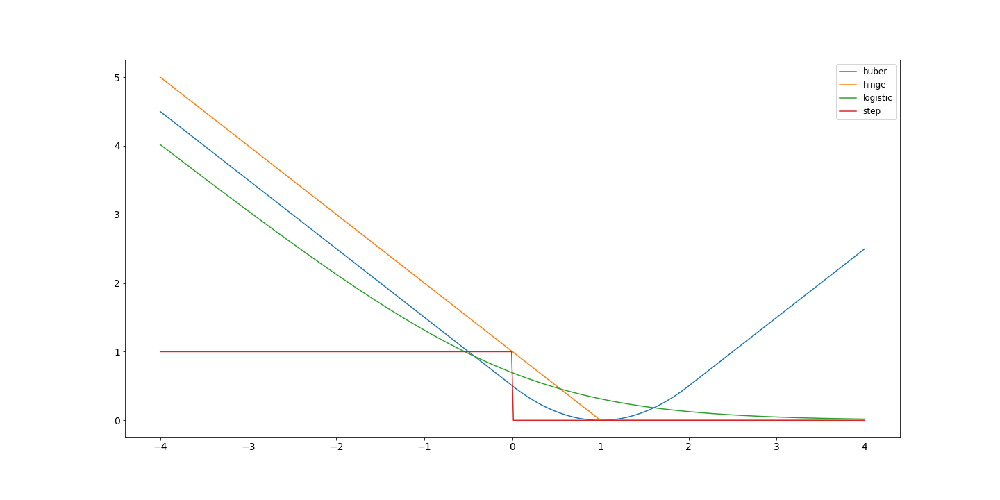

# 为什么使用代替损失

[深度学习](https://www.baeldung.com/cs/category/ai/deep-learning) [机器学习](https://www.baeldung.com/cs/category/ai/ml) [数学与逻辑](https://www.baeldung.com/cs/category/core-concepts/math-logic)

[训练](https://www.baeldung.com/cs/tag/training)

1. 简介

    损失函数是机器学习过程中不可或缺的一部分。它提供了一个信息信号，告诉我们模型的表现如何。在许多情况下，它还可以通过对模型参数的导数来提供直接的学习信号。神经网络就是这种情况。由于损失函数会告诉我们如何更新模型，因此选择正确的损失函数非常重要，而这可能并不总是最明显的损失函数。

    在本教程中，我们将介绍替代损失函数的概念，并展示如何使用它们来提供信息丰富的学习信号。

2. 什么是损失函数？

    损失函数量化一个函数的近似值与实际值的接近程度。在分类中，我们通常希望对函数进行近似，从而最大限度地降低错误分类的经验风险。

    二元分类就是一个例子。我们有一个数据集 {X, Y}，由向量、观测值 X 和标签 Y 组成，其中 Y 是集合 {-1,1} 中的一个元素。

    我们有一个模型 $f_w(X) = sign(Xw)$。这个相对简单的模型预测值 >=0 时为正类，否则为负类。为了优化这个模型，我们需要找到最佳权重 w。

    在这种情况下，如果我们预测正确，那么一个经典而自然的损失就是 0，否则就是 1。我们一眼就能看出，这是一个很明显的损失，没有什么细微差别。没有部分正确；我们要么是对的，要么是错的。

    我们将该标签与真实标签进行比较，发现它是正确的，因此无需进行更新。另一方面，如果我们将预测结果与真实标签进行比较，发现两者不同，我们当前的损失函数并不能告诉我们是否接近。也许我们需要对权重进行重大更新，也许只需要进行轻微更新。我们应该怎么做呢？

3. 新的损失函数

    在上一节中，我们发现我们的损失函数存在不足，因为从我们的预测中可以获得的潜在信息比当前的损失函数所能捕捉到的更多。因此，我们需要一个新的或替代的损失函数来替代我们的劣势函数。我们需要一个替代损失函数。

    支持向量机 [SVM](https://www.baeldung.com/cs/svm-hard-margin-vs-soft-margin) 的损失函数是铰链(Hinge)损失。其值为 $max(1-f_w(x),0)$ 。一旦预测正确，它就会产生与阶跃函数类似的苛刻过渡，并增加一个安全系数。logistic loss（此处取 $log(\frac{1}{1+e^{-f_w(x)}})$ 和 Huber loss 也是常见的损失函数。logistic 损失产生的过渡比 Hinge损失柔和，但形状非常相似。

    我们从图中可以看出为什么建议的替代损失函数是更好的选择。我们可以看到阶跃函数的两个平面和急剧的过渡。除了不连续之外，大面积的平坦区域还提供了非常缺乏信息的信号。相比之下，替代损失函数是连续的，能提供平滑的信息学习信号。我们可以看到，逻辑函数和铰链函数产生了相似的曲线；但是，它们在 0 附近的行为和过渡是不同的：

    

    与阶跃函数相比，代损失函数的斜率更平缓，信息量更大，这是一个直观的对比。

4. 现代应用案例

    代损失函数目前的一个用例是在以决策为重点的学习领域。这里的目标是预测输入决策模型的参数。对这一过程进行端到端优化，往往会导致损失信号不具参考价值。

    在这种情况下，通常会手工制作替代损失函数，以提供信息量更大的信号。然而，这种手工制作也有缺点，因为许多替代损失函数是非凸函数，因此优化可能会陷入局部最小值。因此，该领域的[最新研究](https://arxiv.org/abs/2203.16067)探索了学习这些替代损失函数的可能性。

5. 结论

    理解替代损失函数非常重要，因为它们凸显了理解我们的问题、数据以及我们试图学习的内容的重要性。

    在本文中，我们展示了为什么我们需要替代损失函数，并举例说明了它们的有效性。我们还强调了这一概念在现代环境中的实用性，并重点介绍了当前有关这一主题的工作。
