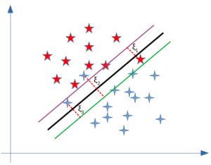

# 在 SVM 中使用硬边际与软边际

[深度学习](https://www.baeldung.com/cs/category/ai/deep-learning) [机器学习](https://www.baeldung.com/cs/category/ai/ml)

[SVM](https://www.baeldung.com/cs/tag/svm)

1. 概述

    [支持向量机](https://www.baeldung.com/cs/ml-support-vector-machines)是一种强大的机器学习方法，可用于[分类](https://www.baeldung.com/cs/svm-multiclass-classification)和[回归](https://en.wikipedia.org/wiki/Support-vector_machine#Regression)。当我们想用它来解决问题时，边距类型的选择至关重要。在本教程中，我们将详细介绍在 SVM 中使用硬边距和软边距的区别。

2. 边际在 SVM 中的作用

    让我们从一组数据点开始，将其分为两组。对于这些数据，我们可以考虑两种情况：要么它们是线性可分离的，要么分离超平面是非线性的。如果数据是线性可分的，而且我们不希望出现任何分类错误，那么我们就使用具有硬边距的 SVM。但是，当线性边界不可行时，或者我们希望允许一些误分类以获得更好的通用性时，我们就可以选择软边值分类器。

    1. 具有硬边距的 SVM

        让我们假设分隔两类的超平面定义为 $\pmb{w^T x} + b = 0$：

        

        然后，我们可以用两个平行的超平面来定义边距：

        \[ \pmb{w^T x} + \alpha = 0\]

        \[ \pmb{w^T x} + \beta = 0 \]

        它们就是上图中的绿色和紫色线条。在硬边际 SVM 中不允许任何错误分类的情况下，我们希望最大化两个超平面之间的距离。要找到这个距离，我们可以使用点到平面的距离公式。因此，蓝点和红点到黑线的距离分别为

        \[ \frac {|\pmb{w^T x} + \alpha|}{||\pmb{w}||} \hspace{2mm} \textnormal{and} \hspace{2mm} \frac {|\pmb{w^T x} + \beta|}{||\pmb{w}||} \]

        因此，总余量将变为：

        \[ \frac{|\alpha ? \beta|}{||\pmb{w}||} \]

        我们希望最大化这个边际。在不失一般性的前提下，我们可以考虑 $\alpha = b + 1$ 和 $\beta = b - 1$。随后，问题就是最大化 $\frac{2}{||\pmb{w}||}$ 或最小化 $\frac{||\pmb{w}||}{2}$。为了使问题在求梯度时更容易，我们用它的平方形式来代替：

        \[ \mathop{\textnormal{min}}_{\pmb{w}, b} \hspace{2mm} \frac{1}{2} ||\pmb{w}||^2 \equiv \mathop{\textnormal{min}}_{\pmb{w}, b} \hspace{2mm} \frac{1}{2} \pmb{w}^T \pmb{w} \]

        这种优化会带来一些限制。假设我们的类别标签是 {-1，+1}。在对数据点进行分类时，我们希望属于正类的点大于 +1 ，这意味着 $\pmb{w}^T \pmb{x} + b \geq 1$，而属于负类的点要小于-1，即 $\pmb{w}^T \pmb{x} + b \leq -1$。

        我们可以把这两个约束合并起来，表示为： $y_i (\pmb{w}^T \pmb{x}_i + b) \geq 1$。因此，我们的优化问题就变成了

        \[\mathop{\textnormal{min}}_{\pmb{w}, b} \hspace{1mm} \frac{1}{2} \pmb{w}^T \pmb{w} \]

        \[ \textnormal{\textbf{s.t.}} \hspace{3mm} y_i (\pmb{w}^T \pmb{x}_i + b) \geq 1 \]

        这种优化被称为原始问题，并保证有全局最小值。我们可以通过引入拉格朗日乘数（$\alpha_i$）并将其转换为对偶问题来解决这个问题：

        \[ L(\pmb{w}, b, \alpha_i) = \frac{1}{2} \pmb{w^T w} ? \sum_{i=1}^{n} \alpha_i (y_i (\pmb{w^T x}_i + b) -1) \]

        这就是 SVM 的拉格朗日函数，它与$\pmb{w}$和 b 有关，是可微分的。

        \[ \nabla_{\pmb{w}} L(\pmb{w}, b, \alpha) = 0  \Rightarrow \pmb{w} = \sum_{i=1}^{n} \alpha_i y_i x_i \]

        \[ \nabla_{b} L(\pmb{w}, b, \alpha) = 0  \Rightarrow \sum_{i=1}^{n} \alpha_i y_i =0 \]

        将它们代入拉格朗日函数的第二项，我们就得到了 SVM 的对偶问题：

        \[ \mathop{\textnormal{max}}_{\pmb{\alpha}} \hspace{1mm} -\frac{1}{2} \sum_{i=1}^{n} \sum_{j=1}^{n} \alpha_i \alpha_j y_i y_j x_i^T x_j + \sum_{i=1}^{n} \alpha_i \]

        \[ \textbf{s.t.} \hspace{3mm} \sum_{i=1}^{n} \alpha_i y_i = 0 \]

        对偶问题更容易求解，因为它只有拉格朗日乘数。此外，对偶问题取决于训练数据的内积，这在扩展线性 SVM 学习非线性边界时非常有用。

    2. 软边际 SVM

        软边际 SVM 的优化过程与线性 SVM 有些类似，但有一些不同之处。首先，在这种情况下，我们允许误分类的发生。因此，我们需要最大限度地减少误分类误差，这意味着我们必须处理多一个约束条件。其次，为了最小化误差，我们应该定义一个损失函数。软边际常用的损失函数是铰链损失。

        \[ \textnormal{max} \{0, 1 ? y_i (\pmb{w}^T \pmb{x}_i + b) \} \]

        误分类点的损失被称为松弛变量，它被添加到硬边际 SVM 的原始问题中。因此，软边际的基本问题变成了

        \[ \textnormal{min} \hspace{1mm} \frac{1}{2} ||\pmb{w}||^2 + C \sum_{i=1}^{n} \zeta_i \]

        \[ \textnormal{\textbf{s.t.}} \hspace{3mm} y_i (\pmb{w}^T \pmb{x}_i + b) \geq 1 - \zeta_i \hspace{4mm} \forall i=1, ..., n,  \hspace{1mm} \zeta_i \geq 0 \]

        一个新的正则化参数 C 控制着边际最大化和损失最小化之间的权衡。正如你所看到的，原始问题与硬边际问题的区别在于增加了松弛变量。新的松弛变量（下图中的$\zeta_i$）为模型的错误分类增加了灵活性：

        

        最后，我们还可以比较二元问题：

        \[ \textnormal{max} \hspace{1mm} -\frac{1}{2} \sum_{i=1}^{n} \sum_{j=1}^{n} \alpha_i \alpha_j y_i y_j x_i^T x_j + \sum_{i=1}^{n} \alpha_i \]

        \[ \textbf{s.t.} \hspace{3mm} \sum_{i=1}^{n} \alpha_i y_i = 0, \hspace{2mm} 0 \leq \alpha_i \leq C \]

        正如你所看到的，在对偶形式中，差别只是应用于拉格朗日乘数的上界。

3. 硬边际与软边际

    SVM 中硬边距与软边距的区别在于数据的可分离性。如果我们的数据是线性可分的，我们就会采用硬边值。但是，如果情况并非如此，那么就不可行了。如果存在无法找到线性分类器的数据点，我们就必须更加宽松，让一些数据点被误分类。在这种情况下，软边际 SVM 是合适的。

    有时，数据是线性可分的，但边际太小，模型容易过度拟合或对异常值过于敏感。在这种情况下，我们也可以通过使用软边际 SVM 来获得更大的边际，以帮助模型更好地泛化。

4. 结论

    在本教程中，我们重点阐明了硬边际 SVM 和软边际 SVM 的区别。
