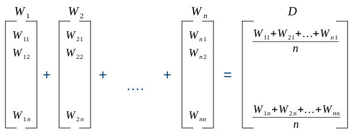
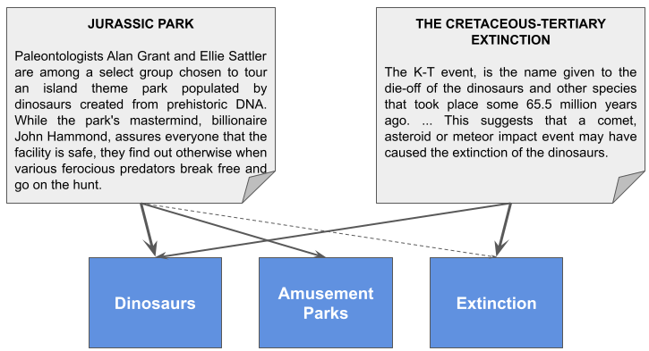
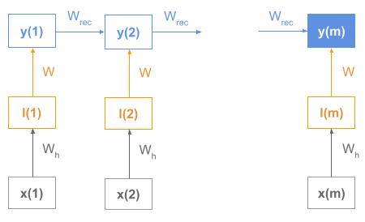
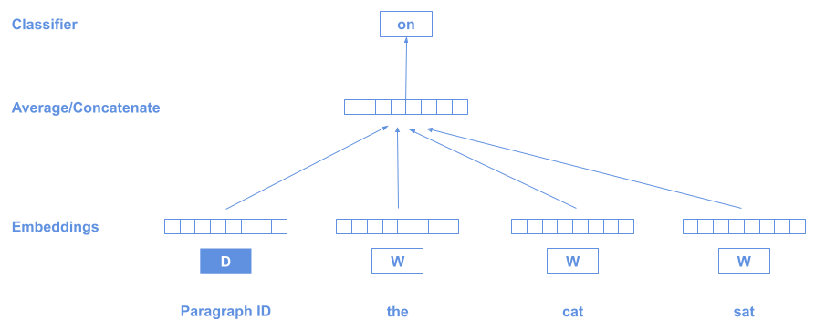
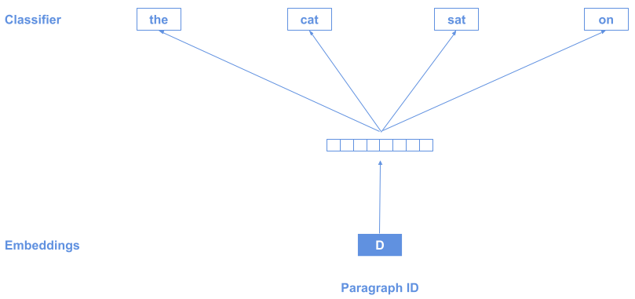
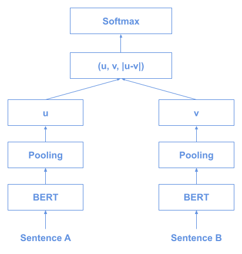
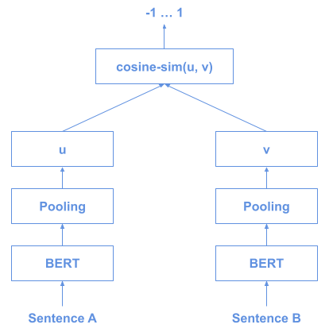
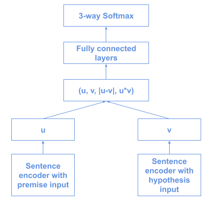
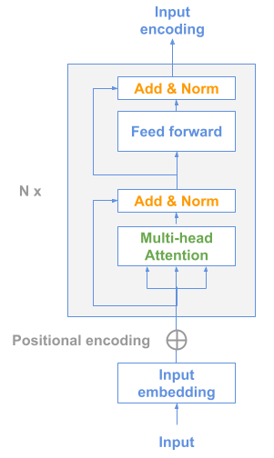
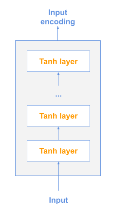

# 如何将文本序列转换为矢量

[深度学习](https://www.baeldung.com/cs/category/ai/deep-learning) [机器学习](https://www.baeldung.com/cs/category/ai/ml)

[自然语言处理](https://www.baeldung.com/cs/tag/nlp)

1. 概述

    大多数 NLP 课程、教程和教科书都解释了如何将单词转换为向量。

    然而，在现实生活中，我们通常要处理更复杂的文本结构，如句子、段落和文档，这些结构也需要用向量表示才能被机器学习模型处理。

    下面我们将学习将文本序列表示为向量的最重要技术。

    要理解本教程，我们需要熟悉常见的深度学习技术，如 RNN、CNN 和 Transformers。

2. 单词向量聚合

    如果我们已经有了文本中单词的向量，那么将单词嵌入聚合成代表整个文本的单一向量就很有意义了。

    这是许多从业者选择的一种很好的基本方法，如果我们已经有了单词向量或可以很容易地获得这些向量，我们可能应该首先采用这种方法。

    最常见的聚合操作有

    - 平均
    - 最大集合

    让我们来看一个平均的例子：

    

3. 主题建模

    主题建模采用了一种更为大胆的方法：获取一个隐藏向量，其中每个维度代表一个主题。

    例如，我们可以有一个向量，它的三个维度分别代表 "恐龙"、"游乐园 "和 "灭绝"。

    《侏罗纪公园》的故事情节可以用[1.0, 0.6, 0.05]这样的向量来建模，因为这是一部与恐龙和主题公园绝对相关的电影，但与物种灭绝的关系不大。与此相反，关于 "白垩纪-第三纪大灭绝" 的文件可以是[0.8, 0.0, 1.0]，因为它与恐龙和大灭绝紧密相关，但与游乐园完全无关：

    

    这个例子只是说明方法的一种方式，但主题实际上是在训练过程中发现的，我们并不真正了解它们的含义，这在我们关于[潜在德里希特分配](https://www.baeldung.com/cs/latent-dirichlet-allocation)的文章中已有解释。

    在实际情况中，我们只有主题 1、2 和 3，通过分析每个主题中最有代表性的文档中出现的词频，我们就能知道它们代表什么。

4. 递归模型

    这是另一种情况，我们需要有文本中每个单词的向量作为先决条件。

    在这种[方法](https://arxiv.org/pdf/1502.06922.pdf)中，我们利用递归神经网络-编码器-解码器结构与生俱来的能力，通过编码器的最终状态来表示输入状态。

    这些模型通常由编码器和解码器组成，其中编码器将积累序列含义，其内部的最终状态将用作嵌入。

    让我们来看看 RNN 编码器的示意图：

    

    我们可以看到，每个词向量都是 RNN 序列的输入，而编码器的最终状态 y(m) 就是序列向量。

5. 词袋

    词袋（BOW）技术将文本建模为一个向量，使用词汇表中每个词的一个维度，其中每个值代表该词在文本中的权重。

    让我们以这些句子为例：

    (1) 约翰喜欢看电影。玛丽也喜欢看电影。
    (2) 玛丽也喜欢看足球比赛。

    这就是我们的词汇表（去掉"to"等限定词）：

    V = {John, likes, watch, movies, Mary, too, also, football, games}

    通过计算每个句子在词汇表中的词数，可以将原始句子转换成这些向量：

    (1) [1, 2, 1, 2, 1, 1, 0, 0, 0]

    (2) [0, 1, 1, 0, 1, 0, 1, 1, 1]

    BOW 模型背后的理念是，尽管失去了语序和句法，但文本中单词的权重对于表示文本意义是有价值的。

    1. N-Grams袋

        在上一点中，我们提到 BOW 模型的一个问题是我们会丢失词序。减少这一问题的解决方案之一是使用 n-grams，因为单词的组合会以特定的顺序出现。

        我们可以单独使用单词（1-grams）或 n-grams，也可以将它们结合起来使用（1-grams + 2-grams 是常见的选择）。

        这种名为 n-grams 包的增强模型就是用 n-grams 代替单词。

        这种技术的主要问题是组合爆炸，会产生很长的向量，而且随着使用的 n-gram 越大，情况会越来越糟。

6. BOW 策略

    确定所有单词后，我们来看看如何从中生成向量的几种策略。

    1. 单词存在策略

        最基本的策略是根据词汇中是否存在该词来设置 1 或 0：

        (1) [1, 1, 1, 1, 1, 1, 0, 0, 0]

        (2) [0, 1, 1, 0, 1, 0, 1, 1, 1]

        在这种方法中，所有词语都同样相关：

        (1) John(1), likes(1), watch(1), movies(1), Mary(1), too(1)

        (2) likes(1)、watch(1)、Mary(1)、also(1)、football(1)、games(1)

    2. 字数统计策略

        这是我们在概述部分使用的策略，我们要做的就是计算文档中每个单词的出现次数：

        (1) [1, 2, 1, 2, 1, 1, 0, 0, 0]

        (2) [0, 1, 1, 0, 1, 0, 1, 1, 1]

        现在，有些词比其他词更相关（数值越大表示越相关）：

        (1) likes(2)、movies(2)、John(1)、watch(1)、Mary(1)、too(1)

        (2) likes(1)、watch(1)、Mary(1)、also(1)、football(1)、games(1)

    3. 词频策略

        另一种策略是保持词在文档中的相对频率：

        让我们先来了解一下什么是词频（TF）：

        \[TF(t) = \frac{\text{Number of times term t appears in a document}}{\text{Total number of terms in the document}}\]

        那么，我们的向量将是这样的：

        (1) [1/8, 2/8, 1/8, 2/8, 1/8, 1/8, 0/8, 0/8, 0/8]

        (2) [0/6, 1/6, 1/6, 0/6, 1/6, 0/6, 1/6, 1/6, 1/6]

        即

        (1) [0.12, 0.25, 0.12, 0.25, 0.12, 0.12, 0.00, 0.00, 0.00]

        (2) [0.00, 0.16, 0.16, 0.00, 0.16, 0.00, 0.16, 0.16, 0.16]

        与上一个策略相比，每个句子的单词权重保持不变，但不同向量的单词权重值不同：

        (1) likes(0.25)，movies(0.25)，John(0.12)，watch(0.12)，Mary(0.12)，too(0.12)

        (2) likes(0.16)、watch(0.16)、Mary(0.16)、also(0.16)、football(0.16)、games(0.16)

    4. TF-IDF 分数策略

        一种广泛使用的技术是计算 TF-IDF 分数：

        \[\text{TF-IDF score} = TF\cdot{IDF}\]

        反文档频率（IDF）降低了在文档中出现频率很高的术语的权重，增加了出现频率很低的术语的权重：

        \[IDF(t) = log_e\frac{\text{Total number of documents}}{\text{Number of documents with term t in it}}\]

        这些就是词汇表中的 IDF 值：

        [ln(2/1), ln(2/2), ln(2/2), ln(2/1), ln(2/2), ln(2/1), ln(2/1), ln(2/1), ln(2/1)]

        或

        [0.69, 0.0, 0.0, 0.69, 0.0, 0.69, 0.69, 0.69, 0.69]

        因此，TF-IDF 向量应为：

        (1) [0.12*0.69, 0.25*0.00, 0.12*0.00, 0.25*0.69, 0.12*0.00, 0.12*0.69, 0.00*0.69, 0.00*0.69, 0.00*0.69]

        (2) [0.00*0.69, 0.16*0.00, 0.16*0.00, 0.00*0.69, 0.16*0.00, 0.00*0.69, 0.16*0.69, 0.16*0.69, 0.16*0.69]

        或者：

        (1) [0.08, 0.00, 0.00, 0.17, 0.00, 0.08, 0.00, 0.00, 0.00]

        (2) [0.00, 0.00, 0.00, 0.00, 0.00, 0.00, 0.11, 0.11, 0.11]

        请注意，非常频繁出现的词都是零，因为它们并不那么相关，所以每个向量的相关词是：

        (1) Movies(0.17), John(0.08), too(0.08)

        (2) also(0.11)， football(0.11)， games(0.11)

7. Doc2Vec

    当我们有一个文档语料库，需要知道其中哪些文档是相似的时候，就可以使用这种方法。

    该技术与 [word2vec](https://www.baeldung.com/cs/convert-word-to-vector) 非常相似，只是在文本开头使用了一个特殊的标记 D 来表示整个序列：

    

    如上图所示，我们利用了分布假说："出现在相同语境中的词语往往具有相似的含义"。

    每个段落会产生一个不同的 D 向量，在训练结束时，我们会得到一个 D 向量数组，每个段落（文档）一个。

    或者，也可以反过来训练： 根据段落向量预测上下文：

    

8. BERT

    目前使用最广泛的模型之一是 BERT，即 "来自变换器的双向编码器表示"（Bidirectional Encoder Representations from Transformer）编码器模型。

    正如[这里](../transformer-text-embeddings_zh.md)所解释的，BERT 本身为整个序列和序列中的每个标记生成一个向量。序列由标记 `[CLS]` 表示，这是输入开头所需的特殊标记。

    在下图中，我们可以看到所有的输入标记向量，其中第一个 `[CLS]` 代表整个序列：

    

    或者，我们也可以通过汇总序列中的其他标记（应用平均或池化）来获得序列向量。

9. 句子 BERT

    句子 BERT（或 SBERT）是 BERT 的一种变体，用于对句子进行有效比较。

    想象一下，我们想在 10000 个例子中找出两个最相似的句子。由于 BERT 需要将两个句子一起作为输入，这将需要大约 5000 万次推理计算（从 10000 个元素集合中选择 2 个元素的组合），执行起来可能需要数天时间（[论文](https://arxiv.org/abs/1908.10084)称他们的系统需要 65 个小时）。

    利用连体网络和三元组网络结构推导出具有语义意义的句子嵌入，然后使用余弦相似度对句子进行比较。

    这就是训练架构：

    

    这就是我们使用它进行推理的方式：

    

    这样，我们就可以获得 BERT 10000 向量，然后在它们之间应用余弦相似性。

10. 推断发送

    InferSent 由 Facebook 创建，（用他们自己的话说）是 "一种提供语义句子表示的句子嵌入方法。它在自然语言推理数据上进行训练，并能很好地推广到许多不同的任务中"。

    这种有监督的技术包括在[斯坦福自然语言推理任务](https://nlp.stanford.edu/projects/snli/)中训练不同架构的 NN 编码器：

    

    [论文](https://arxiv.org/abs/1705.02364)提出了不同的编码器架构，主要集中在 GRU、LSTM 和 BiLSTM 上。

    最初的方法使用 GloVe 向量进行预训练词嵌入，但在最近的版本（InferSent2）中改用了 fastText。

11. 通用句子编码器

    这是由谷歌开发的一种技术，其中包括两种可能的句子表征学习模型，这两种模型都是为多任务学习而设计的。

    第一个只是一个 Transformer 模型编码器：

    

    另一种可能的模型是深度平均网络（DAN）：

    

    在该模型中，首先将单词和双词组的输入嵌入平均到一起，然后通过前馈神经网络生成句子嵌入。

12. 结论

    在前面的章节中，我们学习了从句子或文档生成向量的最相关技术。

    现在，是时候深入研究这些我们需要掌握的方法，以成为优秀的 NLP 实践者了。
