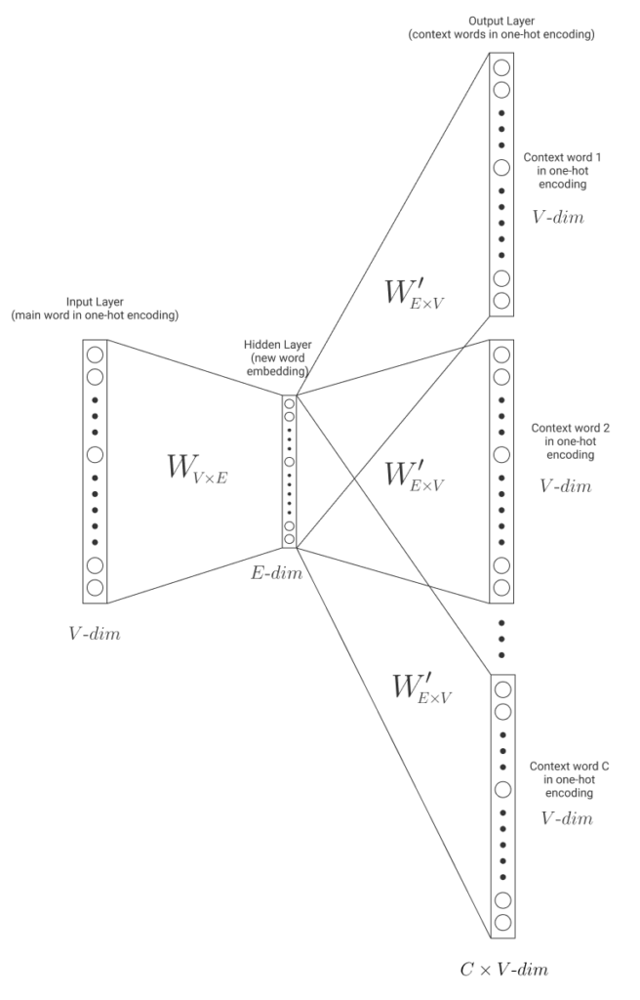
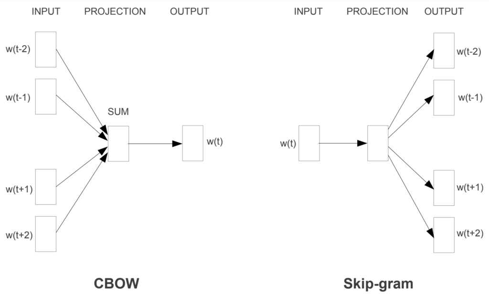

# 词嵌入：CBOW与Skip-Gram

[深度学习](https://www.baeldung.com/cs/category/ai/deep-learning) [机器学习](https://www.baeldung.com/cs/category/ai/ml)

[神经网络](https://www.baeldung.com/cs/tag/neural-networks)

1. 简介

    在自然语言处理中，我们希望计算机能像人类一样理解文本。然而，要做到这一点，我们需要将文字翻译成计算机可以使用和理解的语言。

    在本教程中，我们将讨论如何通过使用词嵌入来实现这一目标。我们将探讨什么是词嵌入以及词嵌入的重要性。

    我们还将介绍获取词嵌入的两种主要方法： CBOW 和 Skip-Gram。

2. 词嵌入

    什么是词嵌入？单词嵌入是单词的数字表示法，就像使用 RGB 系统表示颜色一样。

    常见的表示方法是单次编码。这种方法用不同的向量对每个单词进行编码。向量的大小等于单词的数量。因此，如果有 $1.000$ 个单词，向量的大小就是 $1x1.000$。向量中的所有值都是零，只有一个值是 1，它用于区分每个单词的表示形式。

    让我们使用下面的句子：粉红色的马正在吃东西。在这个例子中有 5 个单词，因此向量的大小为 $1x5$。让我们看看它是如何工作的：

    \[ \text{\huge{ the pink horse is eating }} \]

    \[ \text{\huge{the}} \rightarrow \begin{bmatrix} 1 \\ 0 \\ 0 \\ 0 \\ 0 \end{bmatrix} \hspace{1cm} \text{\huge{pink}} \rightarrow \begin{bmatrix} 0 \\ 1 \\ 0 \\ 0 \\ 0 \end{bmatrix} \hspace{1cm} \text{\huge{horse}} \rightarrow \begin{bmatrix} 0 \\ 0 \\ 1 \\ 0 \\ 0 \end{bmatrix} \hspace{1cm} \text{\huge{is}} \rightarrow \begin{bmatrix} 0 \\ 0 \\ 0 \\ 1 \\ 0 \end{bmatrix} \hspace{1cm} \text{\huge{eating}} \rightarrow \begin{bmatrix} 0 \\ 0 \\ 0 \\ 0 \\ 1 \end{bmatrix} \]

    每个词都会被分配一个不同的向量；然而，这种表示法涉及到不同的问题。首先，如果词汇量太大，向量的大小就会很大。在使用这种编码模式时，这将[导致维度诅咒](https://www.baeldung.com/cs/ai-convolutional-neural-networks#5-the-curse-of-dimensionality)。此外，如果我们在词汇表中添加或删除单词，所有单词的表示都会发生变化。

    然而，使用单击编码最重要的问题是，它并没有封装意义。它只是一个区分单词的数字系统。如果我们希望计算机能像人类一样阅读文本，我们就需要能捕捉语义和句法信息的嵌入。向量中的值必须以某种方式量化它们所代表单词的意义。

    [Word2Vec](https://www.baeldung.com/cs/ml-word2vec-topic-modeling) 是自然语言处理中常用的一种技术。在该技术中，相似的词具有相似的词嵌入；这意味着它们在余弦距离上彼此接近。有两种主要算法可以实现 Word2Vec： 连续词袋算法（Continous Bag of Words）和跳格算法（Skip-Gram）。这些算法使用神经网络模型来获取词向量。

    这些模型利用上下文进行工作。这意味着，嵌入是通过观察附近的词来学习的；如果一组词总是被发现接近相同的词，那么它们最终会有相似的嵌入。因此，国家与国家之间关系密切，动物与动物之间关系密切，等等。

    为了标注单词之间的接近程度，我们首先要设置一个窗口大小。窗口大小决定了我们选取哪些相近的单词。例如，如果窗口大小为 2，那么对于每个单词，我们都会选取它后面的 2 个单词和它后面的 2 个单词：

    

    在上表中，我们可以看到用这种方法构建的词对。高亮显示的单词就是我们要查找的词对。我们并不关心窗口中的单词距离有多远。只要单词在窗口内，我们就不区分单词之间的距离是 1 个单词还是更多。

    现在我们知道了如何查找词对，让我们来看看这些算法是如何工作的。

3. 跳格

    如前所述，这两种算法都使用附近的词来提取嵌入词的语义。在 Skip-Gram 中，我们尝试使用主词来预测上下文词。

    让我们以前面的例子为例。从句子 the pink horse is eating（粉红色的马正在吃东西）中，假设我们想要得到马这个词的嵌入。首先，我们使用单次编码对语料库中的所有单词进行编码训练。我们挑选出要查找嵌入词的词对：（horse, the）、（horse, pink）、（horse, is）、（horse, eating）。现在，我们从每一个词对中使用一个具有一个隐藏层的神经网络模型，如下图所示：

    

    在图中，我们可以看到输入层的大小为 $1xV$，其中 V 是语料库词汇的数量。输入是单次编码中的主词，即我们例子中的马。权重矩阵 $\mathbf{W}_{VxE}$ 将输入转换到隐藏层。

    这个隐藏层的大小为 1xE，其中 E 是单词嵌入所需的大小。这个大小越大，嵌入式捕捉到的信息就越多，但学习难度也就越大。

    最后，权重矩阵 $\mathbf{W'}_{ExV}$ 将隐藏层转换为输出层。由于要预测的输出将是单击编码中的上下文单词，因此最后一层的大小为 1xV。我们将为每个上下文单词运行一次模型。模型将通过尝试预测上下文单词来学习。

    在整个词汇表中完成训练后，我们将得到一个大小为 $VxE$ 的权重矩阵 W，它将输入层与隐藏层连接起来。有了这个矩阵，就可以得到嵌入。如果处理得当，就会像我们之前提到的那样，表示法囊括了语义，在向量世界中，相似的单词彼此接近。

4. 连续词袋

    在 "连续词袋"（Continuous Bag of Words）中，算法其实是类似的，只是操作方式相反。从上下文词中，我们希望我们的模型能够预测主词。

    与 Skip-Gram 一样，我们有输入层（现在由单次编码的上下文单词组成，大小为 $1xV$）。对于每个上下文单词，我们都会得到由权重矩阵 $\mathbf{W}_{VxE}$ 产生的隐藏层。然后，我们将它们平均到一个隐藏层，并将其传递到输出层。模型通过调整权重矩阵来学习预测主词。

    同样，一旦训练完成，我们就会使用权重矩阵 $\mathbf{W}_{VxE}$ 从单次编码中生成单词嵌入。

5. CBOW 与 Skip-Gram

    既然我们对两种模型都有了大致的了解，那么哪一种更好呢？和通常情况一样，这取决于具体情况：

    

    根据 Mikolov 等人的[原始论文](https://arxiv.org/pdf/1301.3781.pdf)，Skip-Gram 可以很好地处理小型数据集，并能更好地表示频率较低的单词。

    然而，CBOW 的训练速度要快于 Skip-Gram，而且能更好地表示频率较高的词。

    当然，我们选择哪种模型在很大程度上取决于我们要解决的问题。对于我们的模型来说，表示罕见词是否很重要？如果是，我们就应该选择 Skip-Gram。我们没有太多时间进行训练，而且稀有词对我们的解决方案并不那么重要？那么我们应该选择 CBOW。

6. 结论

    在本文中，我们了解了什么是词嵌入以及在 NLP 中使用词嵌入的原因。然后，我们介绍了单击编码，这是一种不考虑单词语义的简单嵌入。

    接下来，我们研究了 CBOW 和 Skip-Gram，这两种算法能够通过这种编码产生转换，从而获得包含单词句法和语义信息的嵌入。

    最后，我们讨论了这两种算法的不同之处，以及根据要解决的问题，哪种算法更有用。
