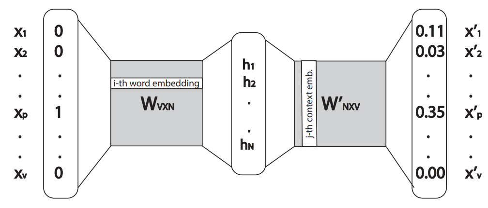
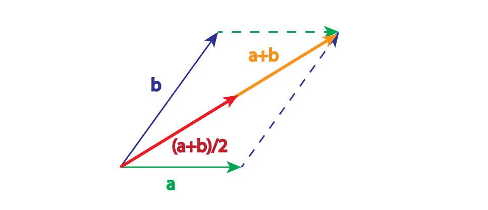
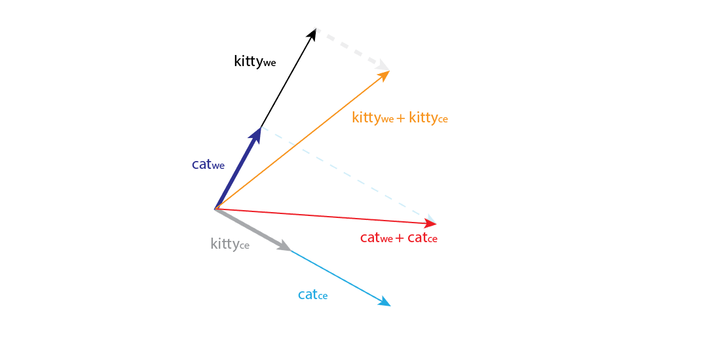

# Word2vec 单词嵌入操作： 单词向量的添加、连接还是平均？

[深度学习](https://www.baeldung.com/cs/category/ai/deep-learning) [机器学习](https://www.baeldung.com/cs/category/ai/ml)

[自然语言处理](https://www.baeldung.com/cs/tag/nlp) [word2vec](https://www.baeldung.com/cs/tag/word2vec)

1. 简介

    虽然变换器在自然语言处理领域占据主导地位，但 word2vec 仍然是构建词向量的常用方法。

    在本教程中，我们将深入探讨 word2vec 算法，并解释词嵌入背后的逻辑。通过解释，我们将能理解使用这些向量的最佳方法，并使用添加、连接或平均操作计算新向量。

2. 词嵌入的类型

    词嵌入是用向量来表示一个词的语义。用同样的方式表示短语或句子也很常见。

    在自然语言处理中，我们经常将其作为向量空间建模的机器学习任务。我们可以用这些向量来衡量不同单词之间的相似性，作为向量空间中的距离，或者直接将它们输入机器学习模型。

    一般来说，词嵌入方法有很多种。我们将只提及一些最流行的方法，例如

    - 一热编码
    - 词频-反文档频率（[TF-IDF](https://www.baeldung.com/cs/text-sequence-to-vector#4-tf-idf-score-strategy)）
    - Word2vec
    - 词表示的全局向量（GloVe）
    - 来自变换器的双向编码器表示法（[BERT](https://www.baeldung.com/cs/transformer-text-embeddings#bert)）

    在本文中，我们将只使用 word2vec 方法。

3. 单词 2vec

    [Word2vec](https://www.baeldung.com/cs/word-embeddings-cbow-vs-skip-gram) 是一种通过创建词向量来模拟词相似性的流行技术。这种方法使用神经网络来模拟词与词之间的关系。基本上，该算法将大量文本作为输入，并生成一个向量（称为上下文向量）作为输出。

    Word2vec 以一个简单的观察结果为出发点：在文档中出现得很近的词很可能具有相似的语义。例如，"king"（国王）和 "queen"（王后）很可能具有相似的含义，在文档中彼此靠近，并且具有 "man"（男人）或 "woman"（女人）等相关词。Word2vec 将这一观察结果应用到机器学习算法中。

    结果，word2vec 创建了两种类型的向量来表示每个输入词。这两种类型是：

    - 单词嵌入或隐藏表示（当单词处于中心位置时）
    - 上下文单词嵌入或输出表示（当单词是上下文时）

    下面我们将详细介绍这两种类型的单词向量。

    1. 词嵌入

        创建 word2vec 模型的一种方法是使用跳格神经网络架构。简而言之，这是一种只有一个隐藏层的简单神经网络。它将输入词作为单击向量，并输出与输入相同维度的 softmax 函数概率向量。

        让我们定义一个输入的单次热向量 $x_{V \times 1}$。那么隐藏层 $h_{1 \times N}$ 就是转置后的单次热向量 $x_{V \times 1}$ 与权重矩阵 $W_{V \times N}$ 的乘积结果：

        (1) \[\begin{equation*} h = x^{T}W. \end{equation*}\]

        由于向量 x 是单热向量，因此如果向量 x 中的第 i 个元素等于 1，则隐藏层或向量 h 将始终等于矩阵 W 的第 i 行，下面是一个例子：

        (2) \[\begin{equation*} [0, 0, 1, 0, 0] \cdot \begin{bmatrix} 4 &8 &16 \\ 17 &0 &11 \\ 2 &13 &4 \\ 9 &5 &4 \\ 28 &31 &19 \\ \end{bmatrix} = [2, 13, 4]. \end{equation*}\]

        在这个例子中，对于一个特定的单词 w，如果我们将其单击向量输入神经网络，就会在隐藏层中得到单词嵌入向量 h。此外，我们还可以得出结论：权重矩阵 W 中的行代表单词嵌入。

    2. 上下文词嵌入

        计算完隐藏层后，我们将其与第二个权重矩阵 $W`_{N \times V}$ 相乘。乘法的输出是输出向量 $x'$，我们在其上使用激活函数 softmax 来得到概率分布：

        (3) \[\begin{equation*} x'=softmax(hW`). \end{equation*}\]

        请注意，输出向量的维度与输入向量相同。同时，该向量的每个元素都代表了特定单词与输入单词处于相同上下文中的概率。

        由此，第 i 个词的上下文词嵌入就是权重矩阵 $W`$ 中的第 i 列。整个神经网络如下图所示：

        

4. 添加、串联或平均单词向量

    为了理解如何处理两个嵌入向量，我们需要更好地理解权重矩阵 W 和 $W`$。

    1. 两个嵌入向量之间的关系

        例如，让我们以单词 "cat"为例，观察其嵌入向量 $cat_{we}$ 和 $cat_{ce}$。如果我们计算两个嵌入式之间的点积，就可以得到 "cat"一词位于其上下文中的概率。

        假设某个单词的上下文是该单词前后的几个单词（通常是这样），那么该单词位于其上下文中的概率应该非常低。基本上，这意味着在同一篇文章中出现两次相同的单词，而且相隔很近的情况非常罕见。

        由此，我们可以假设

        (4) \[\begin{equation*} cat_{we} \cdot cat_{ce} = P("cat"|"cat") \approx 0. \end{equation*}\]

        另外，根据点积的定义，我们可以得到

        (5) \[\begin{equation*} cat_{we} \cdot cat_{ce} = |cat_{we}||cat_{ce}| \cos{ \angle (cat_{we}, cat_{ce})}. \end{equation*}\]

        如果我们假设任何嵌入的大小都接近于零，那么同样的假设将适用于词汇表中的每个单词。这将表明所有不同词的嵌入之间的点积都接近于零，而这是不可能的。因此，我们可以假设嵌入向量之间的夹角余弦接近于 0 或：

        (6) \[\begin{equation*} \cos{ \angle (cat_{we}, cat_{ce})} \approx 0 \end{equation*}\]

        这意味着两个嵌入向量之间的夹角趋于 $90^{\circ}$ 或者它们是正交的。

    2. 添加与平均

        首先，两个向量之和的直观表示就是把一个向量的尾部放到另一个向量的头部所得到的向量。两个向量的平均值是同一个向量，只是乘以 $\frac{1}{2}$。从这个角度来看，两个向量的和与平均之间并没有太大的区别，但平均向量的量级要小两倍。因此，由于向量分量较小，我们可以优先考虑求平均值而不是求和值：

        

    3. 组合嵌入向量

        让我们回到单词 "猫"及其正交向量 $cat_{we}$ 和 $cat_{ce}$ 的例子。假设词汇表中还有一个单词 "kitty"。我们还假设我们有一个完美的 word2vec 模型，它已经知道 "cat"和 "kitty"是同义词，而且它们出现在非常相似的语境中。这就意味着，"$cat_{we}$"和 "$kitty_{we}$"这两个词的词嵌入之间具有很高的余弦相似度。

        现在让我们假设一种完美的情况，即余弦相似度为 1，向量之间的夹角为 $0^{\circ}$。我们知道，有一种做法是只使用 word2vec 词嵌入，而舍弃上下文嵌入。此外，没有证据表明上下文向量会与词嵌入向量具有相同的相似性。如果我们将上下文嵌入添加到单词嵌入中，可能会出现下图所示的情况：

        
        $cat_{we}$ 和 $kitty_{we}$ 之间的夹角为 $0^{\circ}$，这些向量与它们对应的上下文向量是正交的。添加后，我们可以看到和之间的夹角不再是 $0^{\circ}$。

        最后，这意味着即使在完美的条件下，将上下文向量添加到嵌入向量中也会破坏嵌入空间中的已学语义表示。类似的结论也可以用于连接。

    4. 实验

        虽然添加上下文向量显然会破坏嵌入向量的已学语义关系，但我们还是采用这种方法进行了一些实验。结果表明，这种操作可以在嵌入空间中引入额外的知识，并在性能上略有提升。

        例如，将人类对相似性和相关性的[判断](https://aclanthology.org/N18-1062.pdf)与 W 和 W' 嵌入向量组合的余弦相似性进行比较后发现，仅使用单词嵌入向量，W 预测的相似性更好，而使用来自 W 的一个向量和来自 W' 的另一个向量，相关性更好。例如，对于 "房子"一词，使用第一种方法，最相似的词是 "豪宅"、"农舍"和 "别墅"，而使用第二种方法，最相关的词是 "谷仓"、"住宅"、"庄园 "和 "厨房"。

        此外，GloVe 方法的作者在工作中使用了单词嵌入和上下文嵌入的总和，并在性能上取得了小幅提升。

5. 结论

    首先，我们需要明确的是，本文的目的是讨论一个特定单词的向量之间的运算，而不是将一个句子中的单词向量组合起来。[本文](https://www.baeldung.com/cs/sentence-vectors-word2vec)将解释如何获得一个句子的向量表示。

    在本文中，我们详细解释了 word2vec 方法及其向量背后的逻辑，以便讨论词向量的最佳解决方案。具体来说，在最初的 word2vec 论文中，作者只使用了词嵌入作为词向量表示，而舍弃了上下文向量。

    相反，一些实验使用了这些向量的不同组合。结果发现，这些向量之间的总和可以引入额外的知识，但并不总能提供更好的结果。另外，从几何学的解释来看，我们知道夏季向量和平均向量的表现几乎是一样的。

    此外，没有证据表明可以在向量之间使用连接操作。最后，我们建议只使用单词嵌入，而不使用上下文向量，因为这是众所周知的做法，上下文向量不会带来明显更好的结果。不过，出于研究目的，总和或平均值可能值得探讨。

[Word2vec Word Embedding Operations: Add, Concatenate or Average Word Vectors?](https://www.baeldung.com/cs/word2vec-word-embeddings)
