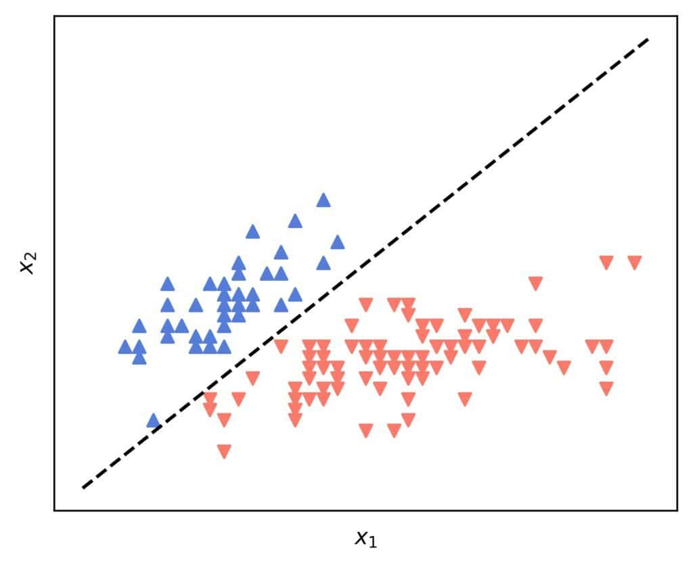
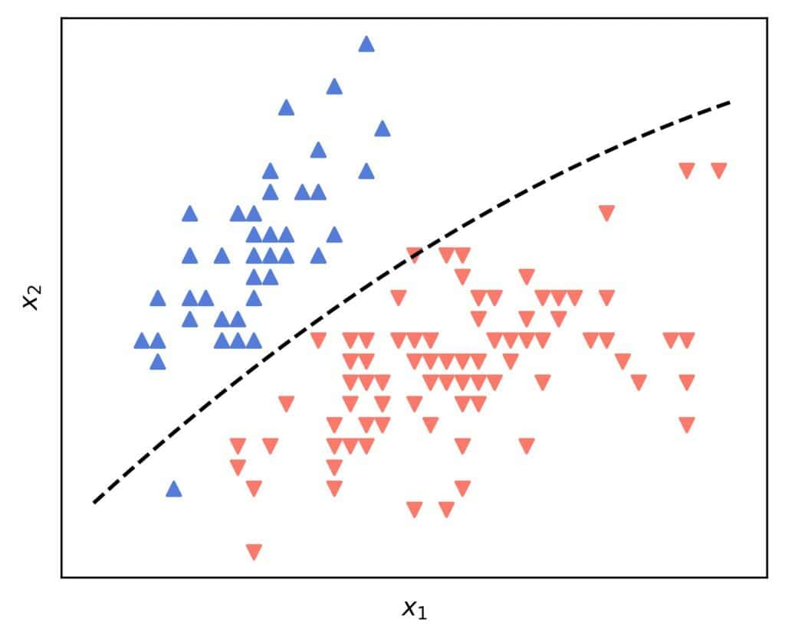

# 如何绘制 Logistic 回归的判定边界？

[机器学习](README-zh.md) [数学与逻辑](https://www.baeldung.com/cs/category/core-concepts/math-logic)

[概率和统计](https://www.baeldung.com/cs/tag/probability-and-statistics)

1. 简介

    在本教程中，我们将演示如何绘制[逻辑回归](https://www.baeldung.com/cs/linear-vs-logistic-regression)分类器的决策边界。我们将重点讨论二元情况，即我们通常所说的正负两类。我们还将假设所有特征都是连续的。

2. 决策边界

    让 $\mathcal{X}$ 成为我们希望使用机器学习进行分类的对象空间。分类器的决策边界是 $\boldsymbol{\mathcal{X}}$ 的子集，其中包含分类器得分等于其决策阈值的对象。

    在逻辑回归（LR）中，对象 x 的得分 f(x) 是 x 为正的概率的估计值，而判定阈值为 0.5：

    \[\{ x \in \mathcal{X} \mid f(x) = 0.5 \}\]

    可视化边界有助于我们理解分类器的工作原理，并将其与其他分类模型进行比较。

3. 绘制边界

    要绘制边界，我们首先要找到它的方程。

    1. 边界方程

        我们可以将 LR 公式插入 f(x) = 0.5 的条件中，从而推导出决策边界方程。

        我们假设 $x= [x_0, x_1, x_2, \ldots, x_n]^T$ 是一个 $(n+1) \times 1$ 的向量，其中 $x_0=1$ 以使 LR 方程更紧凑。在预处理中，我们总是可以在任何 n 维 x 前加上 $x_0=1$。

        因此，我们有

        \[f(x) = \frac{1}{1 + e^{-\theta x}} = \frac{1}{2}\]

        其中 $\theta = [\theta_1, \theta_2, \ldots, \theta_n]^T$ 是我们的 LR 模型 f 的 $(n+1) \times 1$ 参数向量：

        \[\begin{aligned} \frac{1}{1 + e^{-\theta^T x}} &= \frac{1}{2} \\ 1 + e^{-\theta^T x} &= 2 \\ e^{-\theta^T x} &= 1 \\ - \theta^T x &= 0 \\ \theta^T x &= 0 \\ \sum_{i=0}\theta_i x_i &= 0 \end{aligned}\]

    2. 二维和三维边界的形状

        如果 n=2，边界方程变为

        \[\theta_0 + \theta_1 x_1 + \theta_2 x_2 = 0\]

        这就是 $(x_1, x_2)$ 平面上的一条直线。例如，如果我们使用虹膜数据集，$x_1$ 和 $x_2$ 分别为萼片的长度和宽度，并将 versicolor 和 virginica 两类混合为一类，我们就会得到一条直线：

        

        我们不必考虑 $\theta_0=\theta_1=\theta_2=0$ 的退化情况，这意味着没有使用 x 的特征，所以我们无论如何都不会使用这样的模型。假设 $\theta_2 \neq 0$，那么显式边界方程就是：

        \[x_2 = -\frac{\theta_1}{\theta_2}x_1 - \frac{\theta_0}{\theta_2}\]

        如果n=3，我们就有一个平面了

        \[\theta_0 + \theta_1 x_1 + \theta_2 x_2 + \theta_3 x_3 = 0\]

        让 $\theta_3 \neq 0$ 然后，我们就可以用显式写出这个方程了

        \[x_3 = -\frac{\theta_2}{\theta_3} x_2  -\frac{\theta_1}{\theta_3}x_1 - \frac{\theta_0}{\theta_3}\]

    3. 算法

        我们可以使用任何绘图工具将这些方程对应的直线和平面可视化。如果必须从头开始，我们可以以较小的增量遍历独立特征，并使用显式计算从属特征：

        

        极限 l 和 u 决定了我们要关注的边界部分。

    4. 可视化的极限

        在这一点上，我们有两个问题：

        - 我们能否在多个维度上可视化边界？
        - 边界总是直线还是平面？

        让我们一探究竟。

4. 多重维度

    如果我们的对象有三个以上的特征，我们就只能将边界[投影](https://www.baeldung.com/cs/3d-point-2d-plane)到由特征对(pairs)和特征三胞胎(triplets)定义的平面和空间上。

    处理这种情况的一种方法是选择可视化的特征，并将其他特征保持为恒定值，例如我们从理论上知道的均值或相关常数。表示 "该特征不存在或中性" 的值也会有所帮助。在大多数情况下，但并非所有情况下，这意味着将其他特征设为零。

    1. 示例

        有了 10 个特征 $x_1、x_2、\ldots、x_{10}$，我们就有 $\binom{10}{2}=45$ 个特征对。假设我们选择 $x_1$ 和 $x_2$ 来显示边界。在这种情况下，我们将 $x_3、x_4、\ldots、x_10$ 设为一些常量。让它们分别为 $x_3 = \chi_3，x_4 = \chi_4，\ldots，x_{10}=\chi_{10}$。

        那么， $\sum_{i = 3}^{10} \theta_i \chi_i$ 是另一个常数。我们把它加到 $\theta_0$ 中，就好像 $x_1$ 和 $x_2$ 是我们唯一感兴趣的两个特征：

        \[x_2 = -\frac{\theta_1}{\theta_2} - \frac{1}{\theta_2}\left(\theta_0  + \sum_{i = 3}^{10} \theta_i \chi_i \right)\]

        这种方法适用于任何一对或三对 $x_1, x_2, \ldots, x_n$。

        然而，这种方法的缺点是边界取决于所选的常数 $\chi_i$。

5. 曲率

    我们可以通过特征工程引入曲率。

    假设我们的原始特征是 $[x_1，x_2]$。在假设 $x_0 = 1$ 之前，我们可以添加 $x_3=x_1^2$。这样，决策边界就变成了：

    \[\theta_0 + \theta_1 x_1 + \theta_2 x_2 + \theta_3 x_1^2 = 0 \implies x_2 = -\frac{\theta_0}{\theta_2} - \frac{\theta_1}{\theta_2}x_1 - \frac{\theta_3}{\theta_2}x_1^2\]

    这是原始$(x_1, x_2)$空间中的一条曲线。例如

    

    然而，同样的边界在增强$(x_1, x_2, x_3)$空间中是一个平面。

6. 结论

    在本文中，我们展示了如何将逻辑回归的决策边界可视化。绘制它有助于我们理解逻辑模型的工作原理。
