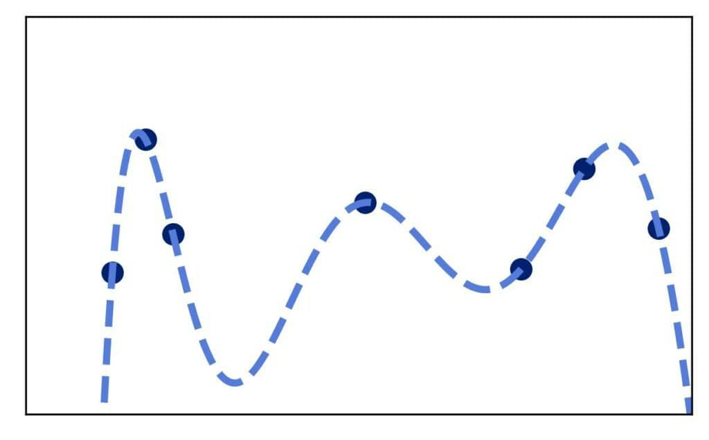
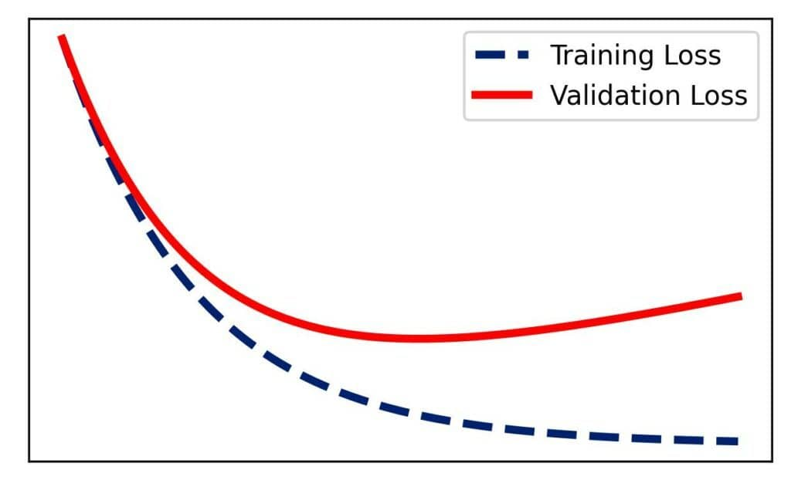
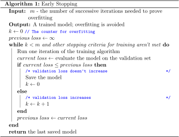

# 如何做到提前止损？

[机器学习](README-zh.md)

[神经网络](https://www.baeldung.com/cs/tag/neural-networks) [训练](https://www.baeldung.com/cs/tag/training)

1. 简介

    在本教程中，我们将介绍如何提前停止，以避免机器学习（ML）模型与数据过度拟合。

2. 过拟合与正则化

    在机器学习中，过拟合意味着我们的模型在训练数据集上非常[准确](https://www.baeldung.com/cs/ml-accuracy-vs-auc)，但无法泛化到其他数据。因此，它的训练误差很小，但测试和验证误差却很大。

    当我们的模型捕捉到训练集中的噪声时，就会出现过拟合，例如

    

    我们使用[正则化](https://www.baeldung.com/cs/regularization-parameter-linear-regression)技术来避免过拟合。最常用、最有效的正则化方法之一是提前停止，尤其是在神经网络方面。

3. 早期停止

    在所选[训练](https://www.baeldung.com/cs/training-validation-loss-deep-learning)算法的每次迭代之后，我们都会在训练集和验证集上对模型进行评估。

    前者的结果显示了模型对训练数据的拟合程度，而后者则显示了模型对训练期间未见数据的泛化程度。将得分与迭代次数进行对比，我们就得到了训练和验证学习曲线。通常情况下，训练曲线显示的误差是递减的，而验证曲线显示的误差值较大，并逐渐减小到某一点后开始增大：

    

    验证曲线的拐点是我们的模型开始将噪声纳入训练集的迭代点，这就是为什么模型在验证集上的性能会下降。

    在早期停止中，我们希望在到达拐点之前停止训练。

    1. 伪代码

        当我们观察图像时，相对容易发现过度拟合，但在训练过程中绘制和检查它们是不切实际的。因此，我们需要将检测规则正规化，以便在程序中使用这种技术。

        为此，我们定义了验证损失增加的连续迭代次数（m），以确定我们是否过度拟合：

        

        在验证损失不增加的每一次迭代中，我们都会重置计数器。同时，我们会保存当前模型，因为它是到目前为止我们发现的最佳模型。

        这种算法不仅能避免验证曲线上的拐点。按照我们的算法，如果连续 m 次迭代都没有提高验证分数，它就会停止训练。

    2. 设置 $\boldsymbol{m}$

        如果我们将 $\boldsymbol{m}$ 设为一个较大的值，那么提前停止训练将需要更有力的过度拟合证明。因此，我们训练模型的时间会比必要的时间更长。

        相反，如果 m 值较小，则需要较弱的证明。虽然使用这样的 m 我们花费的训练时间较少，但这可能会导致模型不尽人意。例如，训练算法可能会发现它需要重设一些权重，这可以在几次迭代中提高性能。但是，如果我们过早停止，算法就无法做到这一点。

    3. 步长

        此外，我们还可以指定我们的模型在两次迭代之间误差的最小下降幅度，这样我们才能说它有所改进。

        例如，我们可以将改进定义为误判率至少下降 0.2%。因此，如果第 i 次迭代和第 i+m 次迭代的验证率相差小于 0.2%，我们就停止训练。这样做的理由是，继续训练只会浪费计算资源，因为它不可能显著提高性能。

4. 结论

    在本文中，我们讨论了提前停止训练。这是一种正则化技术，可以在模型在验证集上的性能没有改善时停止训练过程，从而防止过拟合。
