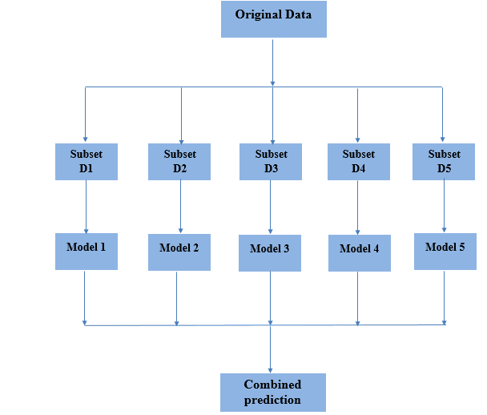
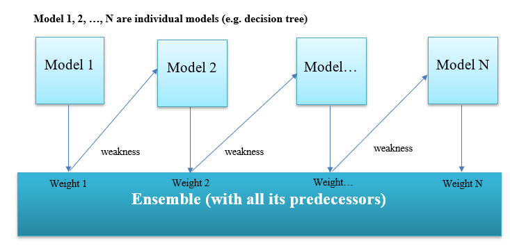
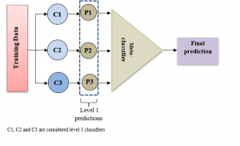
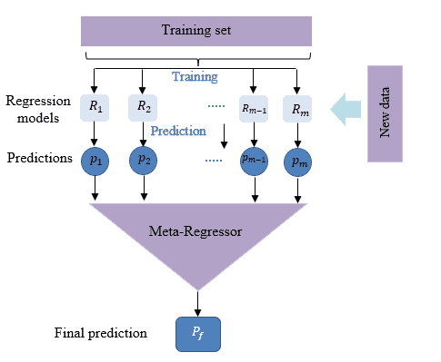

# [集合学习](https://www.baeldung.com/cs/ensemble-learning)

1. 概述

    在本教程中，我们将介绍机器学习中的集合学习方法。

    然后，我们将介绍常见的集合学习类型。最后，我们将介绍不同的集合学习应用。

2. 集合学习的定义

    我们创建机器学习模型是为了针对特定情况生成最佳预测。但是，单个模型可能无法做出最佳预测，而且可能会出现方差和偏差等误差。

    因此，我们可以将多个模型组合成一个模型。因此，这就是所谓的集合学习，以减少这些误差并提高预测结果。

    接下来，我们将探讨可用于改进机器学习过程的集合学习技术。

3. 常见的集合学习类型

    在这一部分，我们将介绍先进的集合学习技术。

    1. 装袋

        Bagging 是 bootstrapping 和 aggregation 两个词的组合。它将两者合并为一个模型。同时，Bagging 也是一种将多个模型结合起来以获得更广泛结果的技术。

        不过，在训练模型时会遇到一个问题。当所有模型都在相同的数据上进行训练，然后进行组合时，结果很可能相当相似。

        Bootstrapping 是一种可以解决这一问题的抽样策略。它可以用来创建原始数据集观测值的子集。抽样采用替换法。

        当我们从群体中随机抽取一个样本，然后将其返回到群体中时，这就是所谓的替换抽样。子集的大小与原始数据集相同。此外，我们还使用 "袋(Bags)" 来描述这些子集。

        以下是装袋过程的步骤：

        - 我们使用引导法创建袋集。如前所述，我们进行了替换抽样。
        - 现在我们在创建袋后进行引导聚合（套袋）。这种方法利用数据包来确定数据集中数据的分布情况。
        - 接下来是在每个引导子集上创建基础模型。值得注意的是，这些模型是独立并行运行的。
        - 最后一步是合并所有模型的结果，以确定最终预测结果

        下图有助于理解袋集过程：

        

    2. 提升

        提升是指使用一系列算法将弱学习器转换为强学习器。差学习器对实例的标注仅比随机猜测稍好。基本的决策树就是一个例子。此外，在这些弱学习器上使用加权数据。对于误分类数据，加权是唯一的。

        每个后续模型都会连续进行提升，以最小化前一个模型的误差。

        让我们来了解一下提升过程：

        

        提升算法旨在通过训练一系列弱模型来提高预测准确性，每个模型都会纠正前一个模型的不足（即调整权重）。

        一般来说，它将弱学习器的输出结合起来生成一个强学习器，从而提高模型的预测能力。

        提升法更重视因之前的弱规则而被误分类或错误较多的案例。

    3. 堆叠

        堆叠是一种训练元分类器的策略，它将许多分类器的预测结果作为新特征加以利用。许多分类器被归类为一级分类器。我们也可以将元分类器定义为包含其他分类器预测结果的分类器。

        为了让这一过程更加直观，让我们使用一张图片：

        

        我们可以在上图中看到三个一级分类器（C1、C2 和 C3）。我们对这些分类器进行了单独训练。这些分类器在训练完成后就会进行预测。因此，元分类器就是利用这些预测结果进行训练的。在堆叠分类器时，最好能从训练集中未用于训练一级分类器的部分获得一级预测。

        这样做的目的是不让我们试图预测的信息（目标）进入训练集。为此，我们将训练集分为两半。一级分类器应使用训练集的前半部分进行训练。分类器训练完成后，我们再利用剩下的一半训练数据进行预测。

        最后，预测结果训练出元分类器。值得一提的是，回归模型也能从堆叠中获益。与分类模型一样，堆叠也是使用元回归器将许多回归模型的预测结果结合起来。

        下图更好地描述了这一技术：

        

4. 集合学习应用

    近年来，随着计算机能力的提升，大集合学习的应用数量也在不断增加，这使得大集合学习可以在合理的时间内完成训练。

    事实上，集合分类器有多种用途，包括

    - 医学：这一领域在神经科学、蛋白质组学和医学诊断中有效地运用了集合分类器，如利用核磁共振成像数据集识别神经认知障碍和宫颈细胞学分类等。
    - 情感识别：虽然该领域的大多数行业重量级公司，如谷歌、微软和 IBM，都表示其语音识别的底层技术是基于深度学习的，但基于语音的情感识别也可能在使用集合学习时表现出色
    - 人脸识别：人脸识别涉及基于数字图像对人的识别或验证，最近已成为模式识别领域最热门的研究课题之一。这门学科总是使用集合学习技术来实现值得关注的性能
    - 入侵检测：入侵检测系统监控计算机网络或计算机系统，以识别入侵代码，就像异常检测过程一样。集合学习在减少监控系统的整体误差方面非常有效。
    - 计算机安全、遥感、欺诈检测

5. 结论

    任何机器学习任务都试图找出一个最能预测我们所需的结果的单一模型。与创建一个单一模型并希望它是最好/最准确的预测结果不同，集合学习方法使用多种模型并对其进行平均，从而得到一个最终模型。

    在本文中，我们讨论了集合学习的基本原理。此外，我们还讨论了可以改善最终分类结果的不同集合学习技术。

    然后，我们介绍了集合学习在各个领域的重要性。
