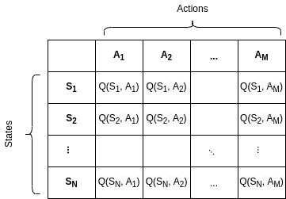
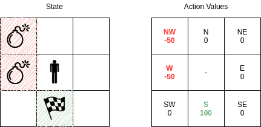
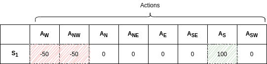
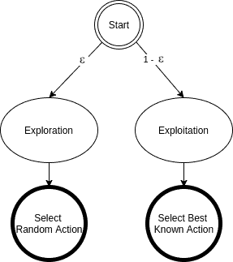

# [ε-贪心 Q 学习](https://www.baeldung.com/cs/epsilon-greedy-q-learning)

1. 简介

    在本教程中，我们将学习一种著名的强化学习算法 - epsilon-greedy Q-learning。在学习过程中，我们还会提到一些基本的强化学习概念，如时间差和非策略学习。然后，我们将考察探索与利用的权衡以及ε-greedy 行动选择。最后，我们将讨论学习参数以及如何调整这些参数。

2. Q 学习算法

    强化学习（RL）是机器学习的一个分支，系统从行动结果中学习。在本教程中，我们将重点介绍 Q-learning，它是一种非策略时差（TD）控制算法。它由沃特金斯于 1989 年提出。

    我们创建并填充一个存储状态-动作对的表。该表称为 $\boldsymbol{Q}$ 或 Q-表，可互换使用。

    Q表中的Q(S, A)对应于状态S和行动A的状态-行动对。$Alpha(\alpha)$和 $gamma(\gamma)$是学习参数，我们将在下文中解释。

    在这种情况下，状态-行动对的可能值是通过公式迭代计算得出的：

    \[Q(S_t, A_t) \gets Q(S_t, A_t) + \alpha \left[ R_{t+1} + \gamma \max_{a} Q(S_{t+1}, a) - Q(S_t, A_t) \right]\]

    这就是行动价值函数或 Q 函数。该函数近似于在特定状态下选择特定行动的价值。在这种情况下，Q 就是算法学习到的动作值函数。$\boldsymbol{Q}$ 近似于最优行动值函数 $\boldsymbol{Q*}$。

    算法的输出是计算出的 Q（S，A）值。N 个状态和 M 个行动的 Q 表如下所示：

    

    Q-learning 的一个简单应用是迷宫寻路，在迷宫中，可能的状态和行动都是微不足道的。通过 Q-learning，我们可以教会代理如何朝目标前进，并忽略途中的一些障碍。

    让我们假设一个更简单的情况，让代理处于一个 3×3 网格的中间。在这个小例子中，可能的状态是指代理可以驻留的网格单元。可能的行动是指代理可以前往的（最多）8 个相邻单元格。状态和行动值为

    

    在这种情况下，我们可以很容易地根据代理的状态来表示 Q 值。在上面的例子中，我们的状态是代理处于中间并刚刚开始。当然，代理最初对周围环境一无所知。当它采取行动时，它就会知道行动值，并且每一步都会更新 Q 表。经过多次试验后，我们预计相应的 Q 表部分会收敛到以下值：

    

    因此，代理将忽略炸弹，并根据行动值朝着目标前进。

3. Q 学习特性

    Q-learning 是一种非策略时差（TD）控制算法，我们已经提到过。现在我们来看看这些属性的含义。

    1. 无模型强化学习

        Q-learning 是一种无模型算法。我们可以把无模型算法看作是试错法。代理探索环境并直接从行动结果中学习，而不需要构建内部模型或马尔科夫决策过程。

        一开始，代理知道环境中可能存在的状态和行动。然后，代理通过探索发现状态转换和奖励。

    2. 时差算法

        这是一种 TD 算法，在迈出一步后会对预测进行重新评估。即使是不完整的情节也会为 TD 算法提供输入。总的来说，我们衡量的是最后一次行动与最初估计的行动之间的差异，而不需要等待最终结果。

        在 Q 学习中，存储在 Q 表中的 Q 值会使用估计值进行部分更新。因此，在 Q-learning（Q-学习）中，无需等待最终奖励和更新先前的状态-行动对值。

    3. 非策略学习

        Q-learning 是一种非策略算法。它根据最优（贪婪）策略估算状态-行动对的奖励，与代理的行动无关。非政策算法近似于最优行动价值函数，与政策无关。此外，非政策算法还能利用编造的行动更新估计值。在这种情况下，Q-learning 算法可以探索学习阶段未发生的行动，并从中获益。

        因此，Q-learning 是一种简单有效的强化学习算法。然而，由于贪婪的行动选择，算法（通常）会选择下一个奖励最好的行动。在这种情况下，行动选择并不是在可能更长、更好的路径上进行的，因此它是一种短视的学习算法。

4. Epsilon-Greedy Q 学习算法

    我们已经介绍了如何填写 Q 表。让我们来看看伪代码，以便更好地理解 Q 学习算法是如何工作的：

    算法 EpsilonGreedyQLearning()：

    ```txt
    algorithm EpsilonGreedyQLearning():
        // INPUT
        //    alpha = learning rate
        //    gamma = discount factor
        //   epsilon = exploration rate
        // OUTPUT
        //    A Q-table containing Q(S,A) pairs defining estimated optimal policy π*

        // Initialization
        Initialize Q(s,a) arbitrarily, for all s in S, a in A(s), except for 
        Q(terminal, .) <- 0
        
        for each episode:
            Initialize state S
            for each step of episode:
                // Choose A from S using policy derived from Q (e.g., epsilon-greedy)
                A <- selectAction(Q, S, epsilon)
                // Take the action A, observe R, Z
                Take action A, observe reward R and next state Z
                // Q-learning update
                q <- the maximum Q(Z, a) over a
                Q(S, A) <- Q(S, A) + alpha * (R + gamma * q - Q(S, A))
                S <- S
    ```

    在伪代码中，我们首先创建一个 Q 表，其中包含任意值，但终端状态值除外。终端状态的动作值设为零。

    在伪代码中，我们首先创建一个 Q 表，其中包含任意值，但终端状态除外。终端状态的动作值设为零。

    初始化完成后，我们按照所有的情节步骤进行。在每一步中，我们都会从 Q 表 Q 中选择一个行动 A。

    当我们采取 A 行动时，我们的状态会从 S 变为 S'。在此期间，我们会得到 R 的奖励。然后，我们使用这些值更新 Q 表项 Q(S,A)。我们不断重复，直到达到终点状态。

5. 行动选择

    强化学习算法的目标是教会代理在不同情况下如何行动。在训练过程中，代理会发现应该采取哪些行动。

    1. 探索与开发的权衡

        为了更好地理解行动选择是如何进行的，我们首先需要理解探索和利用的概念。

        在强化学习中，代理会试图发现自己所处的环境。如上所述，无模型算法依赖于试错。在这些试验中，代理有一系列行动可供选择。其中有些行动是以前选择过的，代理可能会猜到结果。另一方面，有些行动以前从未采取过。

        在[多臂强盗问题](https://www.baeldung.com/cs/k-armed-bandit-problem)中，代理最初对环境一无所知或所知有限。代理可以选择未知结果的行动进行探索，以获取更多环境信息。或者，它可以选择 “利用”（exploitation），根据先前对环境的了解选择行动，以获得丰厚的回报。

        利用代理已知知识与探索随机行动的概念被称为探索-利用权衡。当代理进行探索时，它可以改善其现有知识，并从长远来看获得更好的回报。然而，当它进行探索时，即使是次优行为，也能立即获得更多奖励。由于代理不能同时做这两件事，因此需要权衡利弊。

        正如我们已经说过的，代理最初并不知道可能行动的结果。因此，需要进行充分的初始探索。如果某些行动比其他行动带来更好的回报，我们希望代理选择这些选项。然而，只利用代理已经知道的东西是一种危险的方法。

        例如，贪婪的代理可能会陷入次优状态。或者，随着时间的推移，环境可能会发生变化。因此，我们希望在探索和利用之间保持平衡，而不是放弃其中一个。

    2. ε-贪婪行动选择

        在 Q-learning（Q-学习）中，我们根据奖励来选择行动。代理始终选择最优行动。因此，它能为给定状态带来最大的回报。

        在epsilon-greedy行动选择中，代理既要利用先前的知识，又要探索新的选择：

        

        ε-贪婪法在大多数情况下都会选择估计奖励最高的行动。其目的是在探索和利用之间取得平衡。探索让我们有一些尝试新事物的空间，有时会与我们已经学到的知识相矛盾。

        在概率很小的情况下，我们会选择探索，即不利用我们目前所学到的知识。在这种情况下，行动是随机选择的，与行动值估计无关。

        如果我们进行无限次试验，那么每个动作都会进行无限次。因此，epsilon-greedy 行动选择策略肯定能发现最优行动。

        现在让我们来看看具体的实现方法：

        ```txt
        algorithm selectAction(Q, S, epsilon):
            // INPUT
            //    Q = Q-table
            //    S = current state
            //    epsilon = exploration rate
            // OUTPUT
            //    Selected action

            n <- uniform random number between 0 and 1
            if n < epsilon 
                A <- random action from the action space
            else:
                A <- maxQ(S, .)
            return A
        ```

        如上所述，通常会选择最优行动，即 Q 值最高的行动。否则，算法会选择一个随机行动。

        ε-贪心算法易于理解和实现。然而，它也很难被打败，其效果不亚于更复杂的算法。

        我们需要记住的是，使用其他行动选择方法也是可行的。根据手头的问题，不同的策略可能会有更好的表现。例如，[softmax 行动选择](http://incompleteideas.net/book/first/ebook/node17.html)策略通过将数值映射到行动概率来控制探索和开发的相对水平。在这里，我们使用了与 [softmax 激活函数](https://www.baeldung.com/cs/ml-nonlinear-activation-functions#3-softmax)相同的公式，我们在分类器神经网络的最后一层也使用了该公式。

6. Epsilon-Greedy Q-learning 参数

    从伪码中我们可以看到，该算法需要三个参数。其中两个（alpha 和 gamma）与 Q-learning 有关。第三个参数（epsilon）则与epsilon-greedy 动作选择有关。

    让我们记住用于更新 Q 值的 Q 函数：

    \[Q(S_t, A_t) \gets Q(S_t, A_t) + \alpha \left[ R_{t+1} + \gamma \max_{a} Q(S_{t+1}, a) - Q(S_t, A_t) \right]\]

    现在，让我们来看看参数。

    1. $Alpha (\boldsymbol{\alpha})$

        与其他机器学习算法类似，$alpha（\boldsymbol{\alpha}）$定义了学习率或步长。从上式中我们可以看到，状态的新 Q 值是由旧 Q 值的增量 alpha 乘以所选动作的 Q 值计算得出的。

        Alpha 是一个介于 0 和 1 之间的实数$（0 < \alpha \leq1）$。如果我们把 alpha 设为零，代理就不会从新行动中学到任何东西。相反，如果我们把 alpha 设为 1，代理就会完全忽略先前的知识，只重视最新的信息。阿尔法值越高，Q 值变化越快。

    2. $Gamma (\boldsymbol{\gamma}) $

        $gamma（\boldsymbol{/gamma}）$是贴现因子。在 Q-learning 中，gamma 乘以最优未来值的估计值。下一个奖励的重要性由 gamma 参数定义。

        Gamma 是一个介于 0 和 1 之间的实数$（0 \leq \gamma \leq1）$。如果我们把 gamma 设为零，代理人就会完全忽略未来的奖励。这种代理只考虑当前的回报。另一方面，如果我们把 gamma 设为 1，算法就会在长期内寻找高回报。高伽马值可能会阻止转换：将非贴现奖励相加会导致高 Q 值。

    3. $Epsilon (\boldsymbol{\epsilon})$

        $Epsilon（\boldsymbol{\epsilon}）$参数与 Q-learning 算法中的 epsilon-greedy 行动选择步骤有关。在行动选择步骤中，我们根据已有的 Q 值选择具体的行动。ε参数为算法引入了随机性，迫使我们尝试不同的行动。这有助于避免陷入局部最优状态。

        如果将 epsilon 设为 0，我们就永远不会探索，而会利用已有的知识。相反，如果将epsilon设为1，就会迫使算法总是采取随机行动，而从不利用过去的知识。通常情况下，ε 被选择为一个接近 0 的小数。

7. 结论

    在本文中，我们讨论了epsilon-greedy Q-learning和epsilon-greedy行动选择程序。我们学习了一些与 Q-learning 相关的强化学习概念，即时间差、非策略学习和无模型学习算法。然后，我们讨论了探索与利用之间的权衡。最后，我们研究了ε-贪婪 Q-learning 算法的超参数以及如何调整这些参数。
