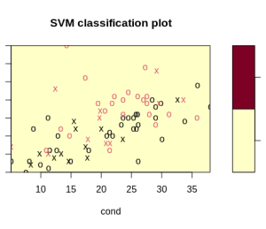
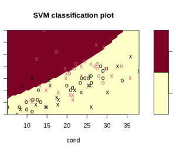

# [功能缩放](https://www.baeldung.com/cs/feature-scaling)

1. 概述

    机器学习算法只将输入视为数字，而不考虑比例或单位。

    除非编程方式不同，否则它们不会理解比例；它们会假定较大的数值应被赋予更大的权重。

    为了避免这种假设带来的问题，我们可以使用特征缩放。

2. 什么是特征缩放？

    特征缩放涉及通过两种主要方法之一修改数值：归一化或标准化。标准化方法修改数值，使它们以 0 为中心，标准偏差为 1。

3. 为什么要使用特征缩放？

    如上所述，机器学习算法可能会认为较大的值更有意义。

    例如，让我们考虑一下汽车数据。发动机排量可能有数百个。每加仑英里数通常小于 100。

    机器学习算法可能会认为，在我们的问题中，发动机排量更重要。因此，在训练我们的模型时，发动机排量可能会起更大的决定性作用。

    缩放数值的另一个原因可能与模型的收敛速度有关。神经网络[梯度下降](https://www.baeldung.com/java-gradient-descent)模型在进行特征缩放时，收敛速度会比不进行特征缩放时快很多。

4. 何时应该使用特征缩放？

    根据经验，在使用计算点间距离的算法时，我们应始终使用特征缩放。

    主成分分析（PCA）就是一个典型的例子，它是一种对数值进行缩放的算法。如果不对数值进行缩放，PCA 算法可能会认为较小数值的变化比较大数值的变化重要得多。

    其他可以从特征缩放中获益的算法包括

    - 支持向量机 (SVM)
    - K 近邻
    - 逻辑回归
    - K-Means 聚类

    例如，我们可以使用 R boot 库中的[尿液数据](https://vincentarelbundock.github.io/Rdatasets/csv/boot/urine.csv)集和 SVM 算法：

    `svmfit.poly.noscale = svm(r ~ ., data = urine, kernel = "polynomial", cost = 7, scale = FALSE)`

    运行后，我们将看到以下输出：

    `WARNING: reaching max number of iterations`

    此外，该算法很难分离样本：

    

    添加特征缩放可以改善我们的输出和算法计算：

    `svmfit.poly.scale = svm(r ~ ., data = urine, kernel = "polynomial", cost = 7, scale = TRUE)`

    这次没有出现警告信息，算法开始出现划线：

    

    并非所有值都需要进行特征缩放。例如，顺序值就不需要进行特征缩放。但连续值却可以。连续值可以在不影响协方差矩阵的情况下进行修改。

    缩放并非在所有情况下都有必要。如果我们要在基于树的算法中使用我们的数据，缩放就没有任何好处。

    如果时间和资源允许，我们可以用原始数据、标准化数据和归一化数据来尝试我们的机器学习模型，看看缩放我们的值是否有任何好处。

    现在，让我们来探讨实现特征缩放的方法。

5. 执行特征缩放

    我们可以使用多种方法来进行特征缩放。大多数方法都基于以下两个原则之一：

    - 修改数值，使它们都位于 0 和 1 之间
    - 修改数值，使它们以 0 为中心

    主要使用的方法有

    - 最小-最大
    - 标准化

    这些方法的变体包括

    - 最大绝对值
    - 稳健型
    - 量化变压器
    - 功率变换器
    - 单位矢量

    1. 最小-最大

        在最小-最大标度器或归一化中，我们对数值进行变换，使其位于给定的范围内。如果标准偏差较小，或者分布不是高斯分布，则可以使用这种标度方法。这种缩放器对异常值比较敏感。

        最小-最大缩放通常使用的公式是

        $$X_norm = \frac{X - X_min}{X_max - X_min}$$

    2. 标准化

        标准化或 Z 值归一化假定数据呈正态分布。标准化的方法是减去平均值：

        $$Y = \frac{(x - \mu)}{\sigma}$$

        其中 $\mu$（平均值）为

        $$\mu = \frac{\sum(x)}{N}$$

        $\sigma$（标准偏差）为

        $$\sigma = \sqrt{\frac{\sum(x_i - \mu)^2}{N}}$$

        标准化假设我们的数据遵循高斯分布。如果我们的数据不是正态分布，这就不是一个好的选择。

    3. 最大绝对值

        最大绝对值缩放器对数值进行缩放和转换，使最大绝对值为 1.0。它不会移动数据或将数据居中，因此不会破坏任何稀疏性。

        如果所有值都是正值，该缩放器对异常值很敏感。

    4. 稳健型

        稳健缩放器移除中位数，然后将数据缩放至四分位数范围内--介于第 1 个四分位数（25%）和第 3 个四分位数（75%）之间。由于该缩放器基于百分位数，因此不会受到几个大的边缘异常值的影响。

    5. 定量变换器

        这种缩放器（也称为等级缩放器）采用反正态变换。它将数值转换为正态分布。这种变换倾向于分散最常出现的值。它还能减少边缘离群值的影响。

    6. 功率变换器

        功率变换器缩放器对数据进行变换，使其更加高斯化。当数据的可变性存在问题或需要正态性时，这种算法就非常有用。

    7. 单位矢量

        单位矢量变换器将整个矢量视为单位长度。与最小-最大缩放一样，该算法生成的值介于 0 和 1 之间，在处理边界（如颜色必须介于 0 和 255 之间的图像值）时非常有用。

6. 结论

数据转换是机器学习预处理的一个重要步骤。我们可以通过修改数据使其在正常范围内，从而改善结果并加快处理速度。
