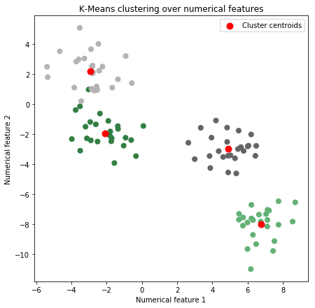
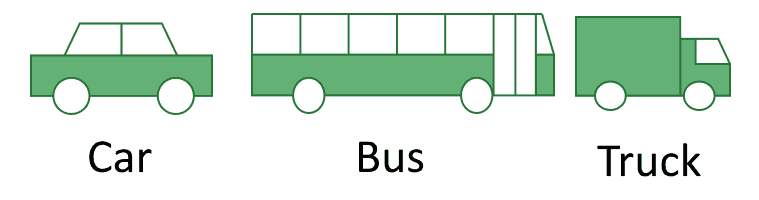
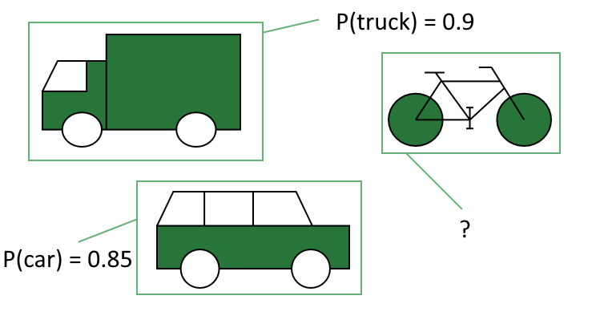

# [特征与标签的区别](https://www.baeldung.com/cs/feature-vs-label)

1. 概述

    在本教程中，我们将讨论[监督学习](https://www.baeldung.com/kotlin-supervised-learning)的两个重要概念定义。具体来说，我们将学习什么是数据集中的特征和标签，以及如何区分它们。

    我们还将研究[监督学习任务](https://www.baeldung.com/kotlin-supervised-learning)的标签概念，并了解它们与我们的研究目标和我们对某一现象的**先验知识**之间的关系。

    在本教程的最后，我们将知道如何避免将标签当作特征使用这一常见错误。我们还将意识到，当我们使用任何给定的标签集时，我们在机器学习模型中包含的偏见。

2. 特征

    机器学习起源于统计分析。因此，通过观察统计学中的对应概念，通常可以很容易地理解机器学习中的概念。

    例如，在统计学中，"群体" 是统计学家研究的集合。而在机器学习中，我们通常把这个完整的集合称为 "数据集"。同样，在统计学中，他们将人群中的每个个体称为 "单位"，而在机器学习中，我们将其称为 "观测值"。

    特征也是如此。在统计学中，人们谈论 "变量"，它表示与特定统计单元相关的特征。在机器学习中，我们称这些特征为 "特征"。

    我们可以看到，这两个学科的术语非常相似，而且经常可以互换使用这两个学科的术语。

    因此，我们可以说，特征是观察结果的特性。让我们通过几个不同的场景来确定观测数据的特征，从而直观地理解这一概念的含义。

    1. 作为测量的特征

        将特征概念化的一个简单方法是想象它们是某些传感器[测量](https://www.baeldung.com/java-measure-elapsed-time)的结果。假设我们有一个温度计，每 15 分钟记录一次空气的温度。

        温度计进行测量，测量结果构成一张观测表。每次测量的相关值对应于机器学习术语中的特征 "温度"，或者统计分析中的特征。

        再举一个例子。警用雷达可以测量街道上汽车的行驶速度。

        结果是计算机中的一个文件，其中每一行都包含一辆车的车牌和雷达测得的车速。

        在这种情况下，车牌构成了数据集的 ID 或[索引](https://www.baeldung.com/spring-data-mongodb-index-annotations-converter#indexes)，而车速则构成了数据集的特征。不过，如果我们想了解有哪些车辆在使用某条街道，我们就可以使用车牌作为特征，而不仅仅是索引。

        我们再举一个例子。我们电子邮件服务中的[垃圾邮件过滤器](https://www.baeldung.com/cs/spam-filter-training-sets)正在监控哪些垃圾邮件是在地址之间发送的。

        电子邮件服务器存储了一个大表，其中包含每封邮件及其相关文本的索引。在这种情况下，我们可以将电子邮件视为样本或独立的统计单元。我们可以将其中包含的文本视为数据集的特征（但请参阅下文了解作为特征的文本）。

        我们看到的例子表明，我们使用"特征"一词来反映观察或测量的结果。至于什么是测量，并没有具体的限制。因此，在处理一项新任务时，我们通常需要花一些时间对其进行定义，以便能够对其进行测量。

    2. 任务类型和特征识别

        我们在讨论上述第二个例子时简要提到，我们可以将某些测量结果视为指数或特征。让我们回到这一点，详细了解一下。

        在讨论警用雷达和车速的例子时，我们说过我们可以将车牌作为观测指标或特征。在特定的具体情况下，我们为什么要使用其中一种而不是另一种呢？

        做出这一决定的理由是，它最终取决于我们的目标。由于没有人会在没有背景知识和对问题特征没有预期的情况下处理问题，因此我们可以说，我们的预期决定了我们的测量结果。反过来，这些预期又会引导我们将收集到的数据中的一部分确定为"特征"，将另一部分确定为指数或噪音。

        在科学界，有人说测量从来都不是天真(naive)的，而总是"[充满理论(theory-laden)](https://link.springer.com/article/10.1007/s11229-018-01992-y)"的。在机器学习领域，有一种观点认为，可以在对测量结果不抱任何期望的情况下进行测量并快速选择特征（大模型？）。然而，这种观点是有[争议](https://core.ac.uk/download/pdf/33752483.pdf)的，而且有可能使我们看不到我们对特征的选择总是意味着一种偏见。

        这一论点支持我们在进行测量时可以自由选择任何特征的观点。哪些数据构成特征，哪些不构成特征，最终由我们来选择。

    3. 特征类别

        不过，在选择特征时，我们可以遵循一些常见的启发式方法来确定方向。其中之一就是确定适合特定任务的特征类别。事实上，并非所有类别的特征都能用于所有任务，我们很快就会看到这一点。

        特征有多种类型或类别，不同的平台或语言会略有不同。一般编程语言中最常见的数据类型都是有效的特征类。它们是

        - 整数、[浮点数](https://www.baeldung.com/java-generate-random-long-float-integer-double)和[其他可计算的实数近似值](https://www.baeldung.com/java-separate-double-into-integer-decimal-parts)
        - 预处理过的[文本字符串](https://www.baeldung.com/java-stream-operations-on-strings)，如 "hello world"
        - [类别](https://www.baeldung.com/apache-commons-frequency#plotting-the-histogram-chart)，我们将其进一步分为名义类别和顺序类别

        让我们来详细了解它们。

    4. 实数近似

        机器学习数据集中最常见的特征是整数、浮点数、双倍数或其他近似实数的原始数据类型。这些数据是我们使用特定仪器进行定量测量的结果。

        数字数据类型是机器学习中最常用的特征。因此，大多数机器学习技术都可以应用于它们。

        例如，[线性回归](https://www.baeldung.com/kotlin-supervised-learning#linear-regression)就是其中一种技术。我们可以通过使用数值特征来预测目标变量的值，从而进行线性回归。

        稍后我们在讨论标签时将会了解目标变量到底是什么。其他适用于数值数据类型的技术包括[无监督学习技术]，例如 [K-Means](https://www.baeldung.com/java-k-means-clustering-algorithm)：

        

        数字特征是最直观的特征。如果测量结果是一个数字，而且我们不需要对测量结果做任何其他说明，那么这个特征就是数字特征。

    5. 文本作为特征？

        机器学习任务的另一个典型特征是文本，或者说是字符串对象。字符串是[自然语言处理](https://www.baeldung.com/apache-open-nlp)子领域用于机器学习的主要特征。

        在机器学习应用中，我们将文本作为特征的方式不像数字特征那样直接。事实上，我们不可能直接将文本作为特征，同时又能从文本语料库中提取有用的信息。这主要有两个原因。

        第一个原因与组合学有关。我们可以尝试将字符串中的每个字符视为一个随机变量，它的值可以是 26 个字母中的一个。如果我们这样做，长度为 n 的每个字符串都可能具有 $26^n$ 种可能的值，这将使搜索空间很快变得难以管理。

        

        而且这个论点还没有考虑空格或其他字符。第二个原因与文本的信息含量有关，文本的信息含量并不像人们想象的那么高。为此，让我们来看看这个文本语料库：

        

        如果我们假定这些文本谈论的是一支笔和一张桌子，那么我们就可以看到其中大部分词语并不包含有用的信息。事实上，我们可以用更精简的格式来描述同样的语料库：

        

        这是一个更普遍规则的具体案例： 文本不会被直接用作特征，只有在经过某种预处理之后才会被用作特征。这些预处理步骤通常包括[词干化和词法化](https://www.baeldung.com/cs/stemming-vs-lemmatization)，以及标记化和矢量化。预处理后的文本将成为数据挖掘的特征，但原始形式的文本并不是特征。

    6. 分类特征

        分类值或特征是一个稍具挑战性的概念。分类背后的理念是，我们可以将世界分门别类，将其划分为相互排斥的类别。我们可以通过观察它如何应用于多种情境来更好地理解这一理念。

        我们可以有把握地假设，绿色的苹果不会同时是红色的，反之亦然，而且所有颜色的组合都是如此。因此，我们可以说 "苹果的颜色"是一个分类特征。由于我们没有对它们进行特定的优先排序，因此我们也可以假定这些类别是无序的。

        在第二个例子中，我们假设要测量一个群体的教育水平。

        我们可以有把握地假设，最高学历为高中文凭的人没有大学文凭。但事实并非如此，因为拥有大学学位的人也拥有文凭。

        从这个意义上说，我们可以确定学历分布的顺序。由于在学生的一生中，大学学位紧随文凭之后，因此我们可以说，教育学位是有序的类别。

        分类特征不能直接输入到机器学习管道中，需要一个转换过程。

3. 标签

    在机器学习入门文章中，通常将数据集的特征视为模型的输入，而将同一数据集的标签视为模型的输出。然而，这种方法存在两个重要问题，限制了它的泛化能力：

    - 标签通常是在我们建立甚至识别任何机器学习模型之前分配的
    - 标签可用作某些[模型的输入](https://arxiv.org/pdf/1710.10501.pdf)，尤其是当我们质疑并希望验证其独立性时。

    相反，我们在关于[标签数据](https://www.baeldung.com/cs/ml-labeled-vs-unlabeled-data#5-the-relationship-between-knowledge-and-labels)的文章中讨论了有关某种现象的[先验知识](https://link.springer.com/article/10.1186/s12859-017-1893-4)与观察结果相关标签之间的关系。本节将在此基础上提出标签与特征之间的区别，这种区别并不局限于任何给定的模型。

    1. 作为目标的标签

        通过与特征的比较，我们可以研究机器学习中的标签。从某种意义上说，标签就是数据集中的一个特征，我们可以任意赋予其较高的重要性。假设我们正在研究股票价格的变化以及股票所属投资组合价格的变化：

        

        看待这项任务的一种方法是想象投资组合的价格取决于其中包含的股票的价格。如果这是我们的理论预期，那么我们就可以研究组合 $portfolio = f(stocks)$ 形式的函数。

        然后，我们就可以尝试通过监督学习来模拟这一函数。在这种情况下，我们将股票价格视为特征，将投资组合的价格视为标签。

        一个同样合理的方法是想象投资组合的价格会影响其中股票的价格。我们可以用一个函数 stocks = g(投资组合)来模拟这一过程，它是前一个函数的倒数。在这种情况下，投资组合的价格将是唯一的特征，而股票的价格将是我们模型中的五个标签。

    2. 作为贝叶斯先验的标签

        这一论点表明，将变量视为标签的决定并不包含在数据集中。相反，它包含在我们对特定现象的[贝叶斯先验知识](https://www.baeldung.com/cs/naive-bayes-classification#2-no-predictions-without-prior-knowledge)中。如果我们认为某个变量会影响另一个变量，那么我们就可以把第二个变量当作第一个变量的标签。

        假设我们正在解决自动驾驶汽车的物体识别问题，并在这些贴有标签的图像上对它们进行训练：

        

        当我们以这种方式构建系统时，我们隐含地假定标签的搜索空间是 $labels = \{car, bus, truck\}$，并且图像识别问题可以在这个空间内解决。因此，我们给新图像的 $P(car \vee bus \vee truck | image)$分配了一个先验概率 1。

        这样做很好：否则，除非搜索空间是有限的，否则物体检测问题将无法解决。但这样做的后果是，系统无法检测到这幅图像中的所有物体：

        

        从这个意义上说，标签是一种将世界的复杂性压缩到有限搜索空间的方法，我们可以通过机器学习来解决这个问题。

4. 结论

    在本教程中，我们已经了解了机器学习数据集中通常会出现哪些类别的特征。我们还看到了它们与标签的相似性。在此过程中，我们表达了我们的判断力是如何将两者区分开来的。

    我们还看到，给数据贴标签意味着对世界运行方式的偏见。反过来，我们可以将这种偏见视为机器学习模型的贝叶斯先验。这样，我们就能从我们对特定现象的先验知识中获益，而不是受到限制。
