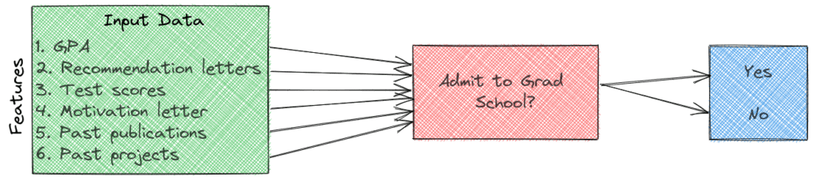
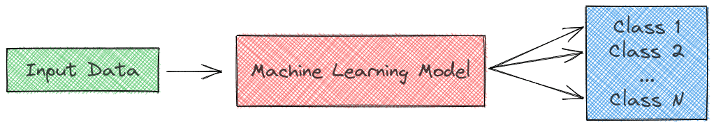

# [机器学习中的特征、参数和类](https://www.baeldung.com/cs/features-parameters-classes-ml)

1. 概述

    在本教程中，我们将讨论机器学习（ML）模型的三个关键组成部分： 特征、参数和类。

2. 前言

    一般来说，ML 的目标是理解数据的结构，并将数据拟合成人们可以理解和利用的模型。这些模型是真实世界过程的数学表示，可分为以下几种：

    - 有监督的，我们使用有标签的数据集来训练算法，以便对数据进行分类或准确预测结果。
    - 无监督：我们对无标签数据集进行分析和聚类，无需人工干预。

3. 特征

    首先，我们来谈谈作为模型输入的特征。特征是衡量任务属性或特征的独立变量。在实施任何模型时，选择信息量大、辨别力强且独立的特征是第一个重要决策。在经典 ML 中，我们有责任手工制作并选择一些有用的数据特征，而在现代深度学习中，特征是根据底层算法自动学习的。

    为了更好地解释特征的概念，让我们设想一下，我们想要实现一个模型，预测一名学生是否会被某大学的研究生课程录取。在选择特征时，我们应该考虑与结果相关的变量，也就是说，这些变量会影响研究生申请的结果。例如，我们可以有以下特征：

    - 本科阶段的 GPA
    - 他们以前的教授或雇主的推荐信
    - 他们在 GRE、GMAT 等标准化考试中的成绩
    - 他们以前是否发表过文章
    - 他们在本科期间参与的项目

    

    由于结果（录取与否）或多或少取决于所有这些变量，因此可以将它们作为 ML 模型的输入特征。如果特征过多，我们可以使用[特征选择](https://www.baeldung.com/cs/feature-selection-reduction-for-text-classification)方法。

4. 参数

    下一步是为我们的任务选择要训练的 ML 模型。模型参数被定义为模型的内部变量。它们是在训练过程中纯粹从数据中学习或估计出来的，因为每个 ML 算法都有优化这些参数的机制。

    训练开始时，通常会将参数初始化为某个值。随着训练的进行，使用优化算法（如梯度下降）更新初始值。学习算法在学习过程中不断更新参数值。在学习过程结束时，模型参数就构成了模型本身。

    为了更好地理解参数的概念，让我们来看看一些常见的 ML 模型中都有哪些参数：

    - 在一个简单的[线性回归](https://www.baeldung.com/cs/linear-vs-logistic-regression)模型中，y = a x + b 变量 \mathbf{a} 和 \mathbf{b} 就是模型的参数。
    - 在[神经网络](https://en.wikipedia.org/wiki/Artificial_neural_network)模型中，权重和偏差是模型的参数。
    - 在[聚类](https://www.baeldung.com/java-k-means-clustering-algorithm)模型中，聚类的中心点就是模型的参数。

    我们经常将参数与超参数混淆。然而，超参数并不是在模型训练过程中学习到的，而是事先设定好的。例如，在聚类中，聚类的数量是一个超参数，而聚类的中心点则是参数。

5. 分类

    我们的最后一个术语只适用于分类任务，在这种任务中，我们要学习从输入特征到一些离散输出变量的映射函数。这些输出变量被称为类（或标签）：

    

    在我们之前的毕业申请任务中，我们只有两个类别，即 "已被录取" 和 "未被录取"。

6. 结论

    在本文中，我们讨论了 ML 模型的三个关键组成部分： 特征、参数和类。首先，我们对它们进行了定义，然后介绍了一些实际例子。
