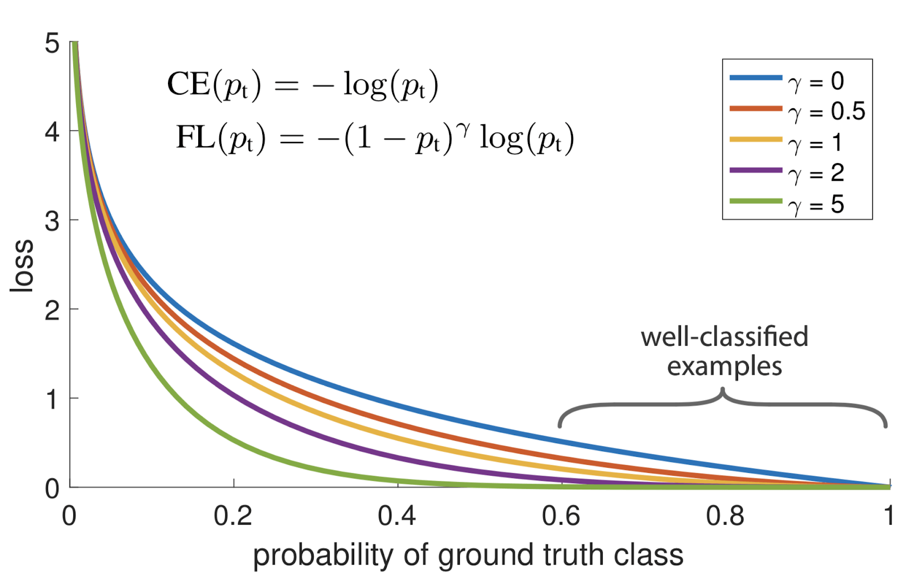

# 病灶损失简介

[机器学习](https://www.baeldung.com/cs/category/ai/ml)

参考 [训练](https://www.baeldung.com/cs/tag/training)

1. 概述

    在本教程中，我们将介绍焦点损耗，并介绍它如何应对不平衡数据集带来的挑战。首先，我们将介绍不平衡数据集领域，然后介绍焦点损耗的定义及其优势和应用。

2. 不平衡数据集介绍

    传统上，在训练机器学习模型进行分类时，我们会使用[交叉熵](https://www.baeldung.com/cs/cross-entropy)损失函数来测量给定随机变量或事件集的两个概率分布之间的差异。

    然而，我们发现，在处理不平衡数据集时，交叉熵损失面临着相当大的困难。更具体地说，当类的大小比例严重失衡时，我们就把数据集称为不平衡数据集。例如，医疗数据集通常是不平衡的，因为它们包含的健康病人样本比病人样本多，因为在普通人群中健康病人更多。

    在这种情况下，使用交叉熵进行训练可能会导致模型不成比例地偏向多数类，从而导致少数类的性能不理想。为了解决这个问题，有人提出了焦点损失法，在训练过程中在损失函数中引入动态平衡机制。

3. 焦点损失

    首先，让我们深入探讨一下焦点损失在处理不平衡数据集方面取得成功的动机。特别是，焦点损失引入了一个调节因子，可以调整每个样本在总损失中的贡献。这使得通过具有挑战性的实例进行学习的权重更大，从而获得更好的性能。它由 [Lin 等人于 2017](https://arxiv.org/abs/1708.02002) 年引入，定义如下：

    (1) \[\begin{equation*}L_{focal}(p) = - \alpha (1 - p)^{\gamma}\log{p}\end{equation*}\]

    其中，p 对应于地面实况的预测概率，a 表示用于处理不平衡的调节因子，而 $\gamma$ 则作为一个附加参数，用于控制处理简单样本的速度。下面，我们可以看到当 $\alpha = 1$ 时，与传统的交叉熵相比，焦点损失的直观图示：

    

4. 优势

    与传统的交叉熵损失相比，焦点损失具有很多优势。

    首先，如前所述，即使少数类的规模非常小，它也能让 ML 模型从不平衡的数据集中学习到有意义的特征。而且，当地面真实值可能包含人为标注造成的错误时，也可以使用它。此外，焦点损失的概念易于理解和实现，不会在训练过程中增加额外的计算负荷。最后，它包含两个超参数（α 和 $\gamma$），为不同领域提供了很大的灵活性。

5. 应用

    最后，让我们来谈谈焦点损耗的用例和应用。

    1. 物体识别

        首先，也是最重要的一点是，在物体识别应用中，焦点损耗被证明对解决不平衡数据集带来的挑战至关重要。具体来说，在训练模型识别物体时，大多数训练图像都不包含所需的物体，从而导致高度不平衡。

    2. 医学图像分析

        由于固有的类不平衡，预测罕见病症极具挑战性。与此同时，医学数据集的注释通常具有一定的不确定性，会给地面实况标签增加噪声。因此，在这些领域使用焦点损失训练 ML 模型非常有益，并能提高最终性能和鲁棒性。

    3. 情感分析

        最后，在情感分析任务中存在着严重的不平衡现象，因为某些情绪（如厌恶或恐惧）的出现不如快乐和悲伤常见。focal loss 能够根据样本的难易程度自适应地调整重点，因此在这些场景中非常有用。

6. 结论

    在本教程中，我们介绍了焦点损耗及其如何处理不平衡数据集。首先，我们介绍了不平衡数据集一词，然后表示了焦点损失函数及其优势和应用。
