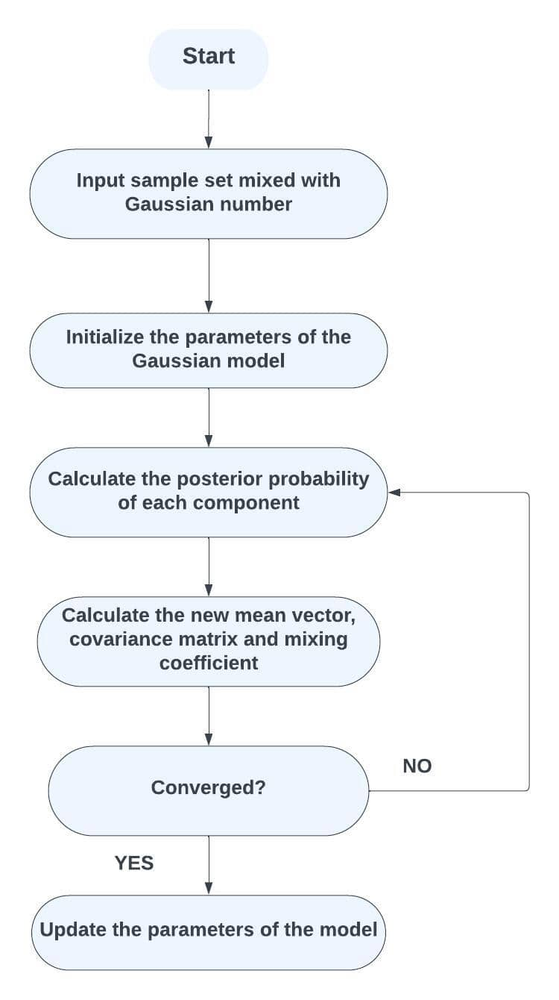
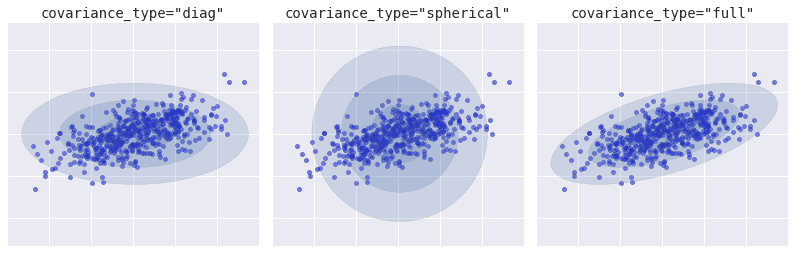
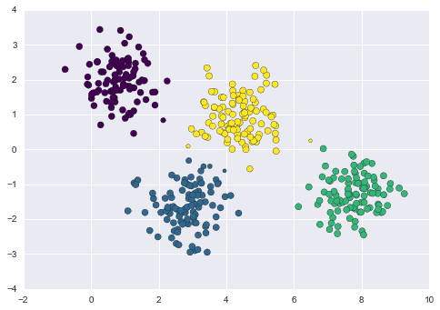
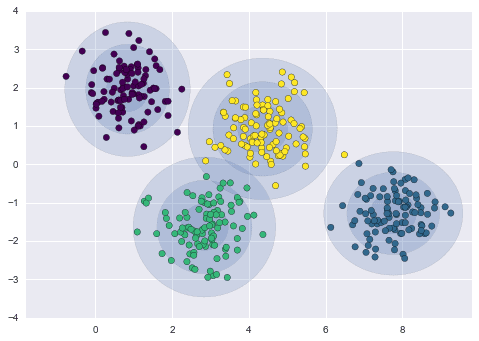
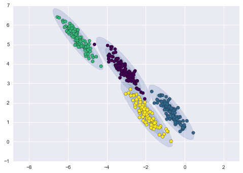

# 用于聚类的GMM

[机器学习](README-zh.md)

[聚类](https://www.baeldung.com/cs/tag/clustering) [概率与统计](https://www.baeldung.com/cs/tag/probability-and-statistics)

1. 简介

    高斯混杂模型（GMM）经常被用于对数据进行聚类，尤其是当基础数据分布难以划分为不同的聚类时。

    在本教程中，我们将学习[高斯混合模型](https://www.baeldung.com/cs/gaussian-mixture-models#:~:text=A%20Gaussian%20Mixture%20Model%20is,corresponds%20to%20a%20data%20cluster)。不过，让我们先从聚类的定义开始。

2. 什么是聚类？

    聚类是一种机器学习技术，它将相关的数据点组合成簇。聚类旨在识别数据中的模式或结构，而无需使用标签或类别。在这方面，该算法无需使用标记样本即可发现数据中的固有模式，因此是一种无监督学习。

    我们对数据集中的数据点进行分组或聚类，使它们之间的相似度高于其他聚类中的数据点，从而达到聚类的目的。通常，我们可以用数据的特定特征或属性来表示数据点之间的相似性。

    许多不同的领域都能找到客户细分、图片细分、文档分类、异常检测和其他聚类的用途。因此，它可以帮助进行数据准备，为数据的自然结构提供洞察力，并在事先不了解基本真实标签的情况下帮助理解数据内部的联系。

3. 实施

    利用高斯混杂模型（GMM），我们根据数据点对各种高斯成分的概率赋值，将其归类为簇。让我们回顾一下高斯混合模型的流程图：

    

    我们将按照以下步骤来实现高斯混合模型。

    1. 步骤 1：数据准备

        在开始之前，我们必须确保数据集的大小和预处理是合适的。可以使用主成分分析等技术。

    2. 第 2 步：决定成分数量

        用户在 GMM 中使用多个聚类（高斯成分）。肘法、剪影评分或贝叶斯信息标准（BIC）等方法可以确定理想的分量数。

    3. 步骤 3：初始化参数

        使用 K-means 聚类等方法提供均值和协方差的初始估计值，并初始化高斯成分的均值、协方差类型和混合系数。有三种协方差类型，我们必须根据数据进行选择：

        

        在 K-means 聚类中，我们只有一个选择，那就是圆形聚类。圆形聚类可能并不适合所有数据聚类。但是，在高斯混合模型中，我们可以灵活地选择不同类型的聚类。

    4. 步骤 4：期望最大化（EM）算法

        作为 E-步骤（期望）的一部分，将计算每个数据点属于每个高斯成分的可能性。通过确定每个数据点在每个高斯分布下的可能性，将这些概率标准化，从而确定责任。我们应确定 E 步中的职责，并更新 M 步参数（均值、协方差矩阵和混合系数）：

        

    5. 步骤 5：迭代优化

        在第 5 步中，我们必须交替使用 E 步和 M 步，直到收敛。当迭代之间的对数似然或参数估计的变化变得不明显时，就说明已经收敛。

    6. 步骤 6：群组分配

        GMM 训练完成后，应将每个数据点发送给责任最大的高斯分量，为每个数据点分配一个簇。

        在这种情况下，让我们考虑以下数据：

        

        让我们从一些猜测开始，然后评估我们的结果。在这种情况下，分量数为 4，随机状态或种子为 42，协方差类型为球形：

        

        从这里我们可以看出，我们的数据可以更好地分组或聚类。因此，我们可以选择其他类型的协方差。

    7. 步骤 7：可视化

        在这一步中，我们将通过绘制数据点和计算出的高斯分量来可视化聚类。我们应该利用等高线图来显示每个高斯分量的密度。

    8. 步骤 8：解释和分析

        在这一步中，我们将研究得出的聚类。为此，我们必须根据每个聚类的匹配高斯成分的均值和协方差来分析其属性。

    9. 步骤 9：评估

        由于 GMM 没有内置的聚类质量度量指标，我们可以使用剪影得分、调整后的兰德指数或眼科检查等外部指标来评估聚类质量。让我们看看下面的聚类示例。我们将决定哪个最适合我们的数据，圆形还是其他。

        这是针对相同参数的相同数据应用的圆形（球形）协方差类型：

        

        这是对相同参数的相同数据应用的椭圆或全协方差类型：

        

        可以看出，椭圆协方差类型更适合我们的数据。

    10. 步骤 10： 预测和分配新数据

        在这一步中，我们将根据需要预测和分配新数据，就像我们在前面的某些步骤中所做的那样。

        由于 GMM 的非凸特性，它可能对初始化很敏感，而且不一定能收敛到全局最优。GMM 通常需要仔细调整参数和初始化技术，才能获得有效的聚类结果。

4. 使用案例

    由于高斯混杂模型（GMM）在捕捉复杂数据分布方面的适应性，研究人员已将其用于不同学科的聚类。下面我们就来探讨一些可以有效应用 GMM 进行聚类的用例。

    GMM 可以根据颜色、纹理或其他视觉特征将图像划分为不同的区域或对象。每个高斯分量可以代表图像的不同部分。

    我们可以使用异常检测，利用 GMMs 找出数据集中的异常值或异常现象。欺诈检测、网络安全和质量控制都可以从异常点中获益，异常点是指在 GMM 下概率较低的数据点。

    我们可以使用 GMM 根据内容对文本文档进行分组，甚至对卫星照片中的土地覆盖进行分类，从而为灾难响应、城市规划和环境监测提供帮助。

    通过分析金融时间序列数据，GMM 可以发现各种市场趋势和制度，还有助于风险控制和投资组合优化。

    我们可以利用 GMM 对 DNA 序列、基因表达谱和其他生物数据进行分组。通过聚类，我们可以发现基因功能、疾病分类和药物开发的趋势。

    使用 GMM 的公司可以根据人口统计学、购买模式或其他特征划分群体。我们可以创造个性化的消费体验，开展有针对性的营销活动。

    请务必记住，GMM 并不是所有聚类任务的理想选择。因为对于大型数据集来说，它们的计算成本可能会很高，而且对初始化和成分数量很敏感。

5. 优缺点

    高斯混杂模型（GMM）的许多优点使一些聚类应用受益匪浅。另一方面，尽管高斯混杂模型（GMMs）有很多优点，但在使用高斯混杂模型（GMMs）进行聚类或其他任务时，也需要考虑其缺点和困难。

    | 优点                                                                                                                          | 缺点                                                                                                      |
    |-----------------------------------------------------------------------------------------------------------------------------|---------------------------------------------------------------------------------------------------------|
    | GMM 可以捕捉不同大小、形式和方向的聚类。K-means 要求球形聚类具有相等的方差，而 GMM 支持更多变化的协方差结构。它们可以容纳拉长、旋转或不同大小的聚类。GMM 在无监督学习任务中表现出色，无需标注数据点来指导聚类 pro-CeSS。 | 由于 GMMs 的迭代处理要求，EM 算法可能无法很好地扩展到大型数据集。在处理高维或复杂数据分布时，EM 方法偶尔会陷入局部最优状态。                                    |
    | GMM 可以生成与发现的分布一致的新数据。这可以生成合成数据，增强现有数据，并进行其他生成活动。用于 GMMs 参数估计的期望最大化（EM）技术可确保收敛性，尽管偶尔会收敛到局部最优。这个问题可以通过使用不同的初始化技术来解决。          | GMM 可能会对异常值很敏感，因为它们假定数据点是从高斯分布中产生的。 因此，异常值可能会严重影响预测参数。鉴于聚类分配，GMM 假设数据点内的每个特征都是内依赖的。因此，可能并非所有形式的数据都符合要求。 |
    | 通过使用 GMMs 将数据可视化为高斯分布，可以揭示数据的聚类分布及其联系。交叉验证或贝叶斯信息标准（BIC）可以帮助选择最佳的成分数量，防止过拟合或欠拟合。                                             | 当使用 GMM 对许多聚类形状建模时，确定高斯分量的形状和方向的精确意义可能会很困难。随着维数的增加，由于需要估计的参数增多，估计协方差矩阵的难度也会增加。因此，这可能会导致过拟合或参数估计问题。      |
    | 软分配是 GMM 的一个特点，它允许每个数据点以不同的概率归属于多个聚类。因此，当数据点不确定或位于聚类之间时，这将有所帮助。                                                             | 尽管存在这些缺点，GMM 仍然是一系列聚类任务的有用工具，尤其是当基础数据分布错综复杂且具有多模态性时。因此，在选择使用 GMM 或研究其他聚类策略之前，请考虑这些限制是否符合我们特定场景的要求。      |

    当基础数据分布复杂、多模态或模棱两可时，高斯混杂模型就会大显身手，成为灵活而强大的聚类方法。各种聚类应用都可以利用它们的概率性质和软分配。

6. 结论

    高斯混杂模型是一种功能强大、应用广泛的聚类统计工具。

    在本文中，我们了解了用于聚类的高斯混杂模型的定义、实施步骤、用例、优点和缺点。
