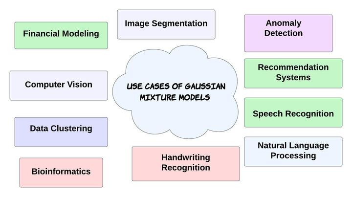
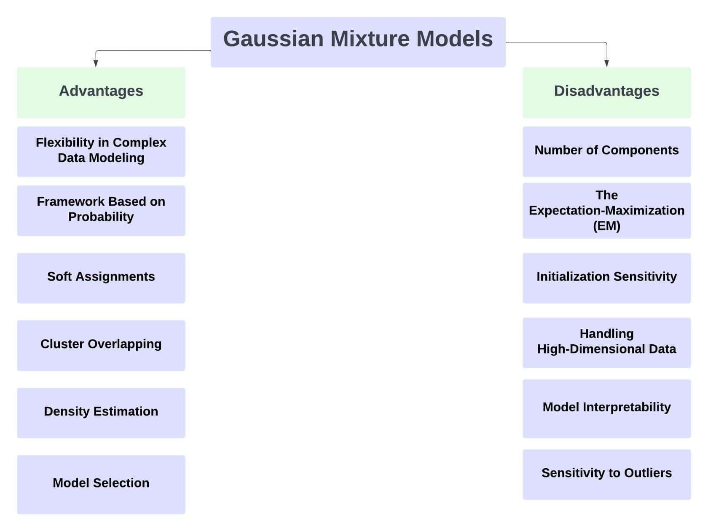

# 高斯混合模型

[机器学习](README-zh.md)

[概率与统计](https://www.baeldung.com/cs/tag/probability-and-statistics)

1. 引言

    机器学习和数据科学无疑使用高斯混杂模型作为强大的统计工具。概率模型使用高斯混杂模型来估计密度和聚类数据。此外，重要的是要认识到，[高斯混合模型](https://www.youtube.com/watch?v=q71Niz856KE)在处理似乎结合了多种高斯分布的数据时非常有用。

    在本教程中，我们将学习高斯混合模型。

2. 高斯混合模型概述

    高斯混合模型混合了多种高斯分布。换句话说，高斯分布参数会计算每个聚类的均值、方差和权重。因此，在学习了每个点的参数后，我们就可以确定每个点属于每个聚类的概率。

3. 步骤

    高斯混合模型是多个高斯分布的加权和。因此，该模型会根据数据点属于每个分量的可能性，尝试将数据点分配到相应的聚类中。也就是说，混合物中的每个高斯分布都对应一个数据集群。以下是高斯混合模型的逐步说明。

    1. 模型表示

        高斯成分通过线性组合形成高斯混合物模型。一般来说，它们使用每个成分的均值、协方差矩阵和权重作为指标。鉴于高斯混合物模型的概率密度函数是其高斯成分的概率密度函数之和，并根据分配给每个成分的概率进行加权。

        符号

        - K：高斯混合模型的高斯成分或聚类的数量
        - N：数据集中的数据点数
        - D：维度（特征的数量）

        高斯混杂模型参数：

        均值（？） 代表每个高斯分量中心的位置。每个分量都有一个长度为 D 的均值向量。

        协方差矩阵（？） 每个分量都有一个 DxD 大小的协方差矩阵。

        权重（？） 权重表示选择每个分量的概率。0 ? ?_i ? 1 和 ?(?_i) = 1 满足要求。 请注意，?_i 代表第 i 个分量的权重。

    2. 模型训练

        要训练高斯混合模型，必须使用现有数据集确定参数（均值、协方差和权重）。

        在训练高斯混合模型时，通常采用期望最大化技术。实质上，在收敛之前，期望（E）和最大化（M）步骤是交替进行的。

    3. 期望最大化

        根据当前的模型参数，程序的期望（E）阶段计算每个数据点属于每个高斯成分的后验概率。 在最大化（M）阶段，算法会利用 E 阶段加权数据点的信息修改模型参数（均值、协方差矩阵和权重）。

    4. 聚类和密度估计

        训练完成后，可以使用高斯混杂模型对数据点进行聚类。对于每个数据点，将分配后验概率最高的聚类。因此，用于密度估计的高斯混杂模型可以用来估计特征空间中每一点的概率密度。

4. 高斯混杂模型的实现

    在了解了高斯混杂模型的概念和步骤后，让我们来看看高斯混杂模型的流程图。例如，这是高斯混杂模型的流程图：

    

    具体来说，高斯混杂模型在 Python 中的实现可以在这里找到。

5. 高斯混杂模型的应用案例

    高斯混合模型的应用包括异常检测、图像分割和语音识别。

    

    高斯混杂模型可灵活管理复杂的数据分布。因此，各行各业都在使用这些模型。

    GMM 可以根据像素的颜色或纹理特征将其划分为不同的区域，从而对图像进行分割。因为每个区域都对应一个高斯分量表示的群集。

    我们可以利用 GMM 发现数据集中的异常情况。例如，该模型可以通过为异常情况分配低概率来检测正常行为的偏差。自动语音识别系统采用 GMM 来模拟音素的声学特征。为此，它们有助于将听觉特性映射到语音单元。最后，就可以根据这些声学模型进行语音识别。

    在手写识别任务中，我们还可以使用 GMM 为每个字符或单词模拟多种手写风格，从而实现更强大的识别能力。GMM 可以帮助进行客户细分和市场研究，将具有相似行为或偏好的客户分组。

    数据聚类是利用 GMM 在数据中寻找自然组或聚类的过程。此外，高斯分量代表每个聚类，概率将数据点分类到聚类中。

    计算机视觉任务，包括物体检测、跟踪和从视频序列中移除背景，都要用到 GMM。

    生物信息学利用 GMM 对基因表达数据建模，并检测基因表达谱的模式或聚类。推荐系统可使用 GMM 对用户偏好和项目属性进行建模，以实现个性化推荐。医学图像分析利用 GMMs 进行图像分割、组织分类和发现图像中的异常区域。

    金融业使用 GMMs 对资产价格的变化进行建模。此外，它还有助于期权定价、风险控制和投资组合优化。因此，高斯混杂模型可用于预测相关价格分布。

6. 高斯混杂模型的优缺点

    机器学习和数据分析应用广泛使用高斯混合模型，因为它们有许多优点：

    

    1. 高斯混杂模型的优点

        GMM 擅长逼近复杂的数据分布。因此，它们适用于具有复杂底层结构的数据集。因为它们可以表示具有不同聚类的数据。

        它们还为数据建模提供了一种概率方法。此外，高斯混杂模型为每个聚类对应的数据点分配概率，以便对每个分配进行不确定性估计和置信度测量。

        与硬聚类方法（如 k-means）相比，高斯混杂模型提供了软聚类分配。例如，当一个数据点隶属于多个聚类时，该数据点会以概率方式被分配到每个聚类中。因此，这种方法具有更大的灵活性。

        由于每个聚类都表示为高斯分布，有自己的协方差矩阵，因此 GMM 可以成功地为具有重叠聚类的数据建模。因此，当聚类在特征空间中没有明显区分时，这种特性尤其有用。GMM 对于密度估计应用非常有用，因为它可以估计数据的基本概率密度函数。因此，在理解数据的分布和形式至关重要的情况下，这很有帮助。

        具体来说，GMM 天生就能处理缺失数据。因此，即使某些特征缺失，模型也能利用现有数据估算出高斯参数。

        在拟合模型下概率较低的数据点可能是异常点或离群点，因此可以利用 GMM 检测离群点。

        GMM 可以很好地扩展到大型数据集，而且实施起来非常简单。因此，使用期望最大化算法进行迭代参数估计是 GMM 训练的有效技术。

        GMM 的模型参数（如聚类均值和协方差矩阵）可提供有关每个聚类特征的可解释信息。

    2. 高斯混合模型的缺点

        特别是，为 GMM 模型选择合适的高斯聚类数目是主要问题之一。例如，不正确地选择分量数会导致数据拟合过度或拟合不足。

        令人惊讶的是，高斯分量的均值、协方差和权重的初始化会影响 GMM 的训练。因为不同的初始化会产生不同的结果，并收敛到不同的局部最优状态。因此，为了解决这个问题，经常需要多次重启 EM 算法，并使用不同的初始化。因此，这就成了一个缺点。

        一般来说，有一种假设认为各种数据都是由高斯分布组合而成的。令人惊讶的是，这并不总是正确的。因此，如果数据具有非高斯形式或不具有高斯分布，GMM 可能不是最佳模型。

        最重要的是，"维度诅咒 "会影响高维领域的 GMM。随着特征数量的增加，精确估计模型参数所需的信息量呈指数增长。此外，如果数据量较小，可能会导致过度拟合或结果不准确。

        值得注意的是，如果其中一个高斯成分具有奇异协方差矩阵（低秩），GMM 可能会出现收敛问题。特别是当一个群组的数据位于低维子空间时，这种情况可能会发生。

        特别是，GMM 可以很好地处理中等规模的数据集。相反，如果数据规模大幅增加，其内存和计算需求可能会变得过高。

        虽然 GMM 可以提供聚类平均值和协方差等可解释的参数，但如果数据集的维度较高且成分较多，解释起来可能会比较困难。

        具体来说，异常值可能会对高斯参数的估计产生影响。因此，GMM 容易受其影响。

    3. 总体

        尽管 GMMs 有很多优点，但也存在一些缺点。例如，它们对参数初始化的敏感性和指定高斯成分数量的要求。重要的是，不恰当的分量选择可能会导致拟合过度或拟合不足。因此，要在各种应用中最大限度地利用高斯混杂模型，就必须进行仔细的研究和模型验证。

        另一方面，尽管存在这些缺点，高斯混合模型在许多情况下仍然是一种有效的工具。毫无疑问，在选择高斯混合模型之前，必须考虑数据的个体特征和建模目标。

7. 结论

    在本文中，我们了解了高斯混杂模型的定义、步骤、实施、用例、优点和缺点。高斯混杂模型是机器学习和数据分析中一种功能强大、应用广泛的统计工具。
