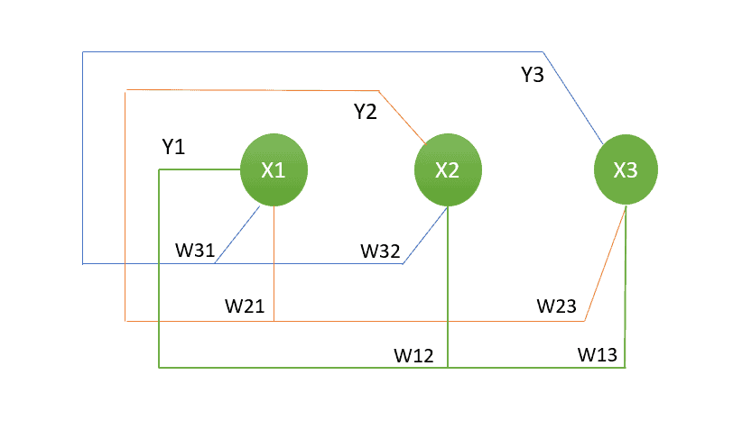

# 什么是 Hopfield 网络？

[机器学习](README-zh.md)

[神经网络](https://www.baeldung.com/cs/tag/neural-networks)

1. 简介

    在本教程中，我们将讨论 Hopfield 网络及其特点。此外，我们还将讨论其架构和训练方法。

2. 什么是 Hopfield 网络？

    约翰-霍普菲尔德（John Hopfield）于 1982 年创建了霍普菲尔德网络（Hopfield Network），这是一种递归人工神经网络（ANN）。它是一种直接的联想记忆，具有保留和回忆模式的能力。Hopfield 网络的典型应用包括[模式识别](https://www.baeldung.com/cs/pattern-recognition-time-series)、内容可寻址记忆和[优化](https://www.baeldung.com/cs/optimization)问题。

    在内容可寻址存储器中，记录的模式可以通过呈现其扭曲或嘈杂的版本来检索，Hopfield 网络是其中的主要应用。它们可用于关联记忆、[图像识别](https://www.baeldung.com/cs/image-recognition-one-shot-learning)、纠错和优化问题。不过，与深度学习模型等当代神经网络相比，它们还略显基础，其应用空间也因架构限制而受到一定限制。

    1. Hopfield 网络的重要特征和要素

        Hopfield 网络由一系列相互连接的神经元或节点组成。这些神经元可以是二进制的，状态分别为 +1 和 -1 （或 1 和 0）。每个神经元代表一种记忆成分或模式。网络中的每个神经元都与系统中的其他神经元相连，包括自身，但对角线连接除外，对角线连接通常设置为零。神经元之间的连接强度通常由这些连接来表示，这些连接通常是二进制权重（可以是+1 或-1）。

        Hopfield 网络的另一个基本特征是能量函数，Hopfield 网络使用能量函数来确定网络的状态。当网络达到一个稳定状态（对应于一个存储模式或模式集合）时，其能量就会降低。网络根据与其相连的神经元的状态，以离散的时间步长更新其状态。神经元通常使用直接的更新规则（如 [McCulloch-Pitts 模型](https://link.springer.com/chapter/10.1007/978-981-13-7430-2_11#:~:text=1%20McCulloch–Pitts%20Neural%20Network%20Model&text=McCulloch–Pitt%20neuron%20(Sivanandam%202006,it%20is%20known%20as%20inhibitory))）来选择其未来状态。每个神经元的状态会异步或顺序更新，直到网络达到稳定状态。

    2. Hopfield 网络的缺点

        Hopfield 网络也有缺点，例如可能会出现假状态，而且其可可靠存储的模式数量有限。此外，网络处理复杂的高维数据可能具有挑战性。

3. Hopfield 网络的结构

    Hopfield 网络的架构由以下部分组成：

    - 在需要更新之前，单个节点保持其状态。
    - 需要更新的节点是随机选择的。
    - 除自身节点外，每个节点都与其他节点相连。
    - 每个节点的状态都是 0/1 或 1/-1。

    以下是 Hopfield 网络的三节点示例结构：

    

    上图中的每个符号表示：

    - x1 、x2 和 x3 代表输入。
    - 每个节点的输出由数字 y1、y2 和 y3 表示。
    - Wij 是 i 和 j 之间链接权重的符号。

4. 训练 Hopfield 网络

    在大多数情况下，Hopfield 网络的学习规则如下，用于更新连接权重以存储模式：

    W_{ij} = \frac{1}{N} \sum_{\mu=1}^{P} x_i^\mu x_j^\mu

    在这个公式中：

    - Wij 代表神经元 i 和神经元 j 之间的权重。
    - N 是网络中神经元的总数。
    - P 是要存储的模式数。
    - $x_i^\mu$ 和 $x_j^\mu$ 是神经元 i 和 j 在第?-个模式中的状态，其中?的范围从 1 到 P。

    该公式根据神经元 i 和 j 的状态在所有训练模式中的共现情况计算权重 Wij。它可以调整权重，使网络以后在遇到噪声或部分输入时可以检索到这些模式。

5. 结论

    在本文中，我们讨论了 Hopfield 网络的简介及其特点。此外，我们还讨论了其基本架构和训练。