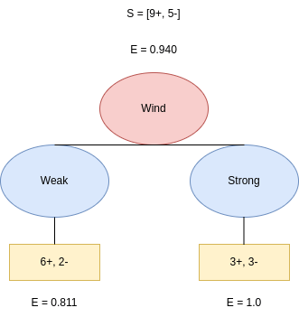

# 决策树中的节点杂质

[机器学习](https://www.baeldung.com/cs/category/ai/ml)

[决策树](https://www.baeldung.com/cs/tag/decision-trees)

1. 简介

    在本教程中，我们将讨论决策树中的节点杂质。[决策树](https://www.baeldung.com/cs/decision-trees-vs-random-forests)是一种贪婪算法，用于[监督机器学习](https://www.baeldung.com/cs/examples-supervised-unsupervised-learning)任务（如[分类](https://www.baeldung.com/cs/classification-model-evaluation)和[回归](/core-concepts/math-logic/linear-vs-logistic-regression-zh.md)）。

2. 决策树中的拆分

    首先，决策树节点会根据所有变量进行拆分。在训练阶段，数据从根节点传递到叶子进行训练。决策树使用不同的算法来决定是否将节点拆分为两个或多个子节点。算法会选择最大化拆分纯度（即最小化不纯度）的分区。非正式地讲，不纯度是对当前节点标签同质性的衡量：

    
    有不同的方法来定义不纯度。在分类任务中，我们经常使用基尼不纯度指数（Gini impurity index）和熵（Entropy）。

3. 基尼不纯度

    基尼指数与随机样本的误分类概率有关。

    假设数据集 T 包含来自 n 个类别的示例。其吉尼指数 $gini(T)$ 定义为：

    (1) \[\begin{equation*} gini(T) = 1 - \sum_{j=1}^{n} p_{j}^2 \end{equation*}\]

    其中，$p_j$ 是 T 中 j 类的相对频率，即随机选择的对象属于 j 类的概率。

    从上式可以看出，基尼系数的取值范围在 [0, 0.5] 之间。最小值为 0 时，节点中包含的元素属于同一类别。在这种情况下，该节点被称为纯节点。最大值为 0.5 时，节点的不纯度最高。

    1. 示例： 计算基尼杂质

        在本例中，我们将计算一个包含 4 个红蓝两种不同颜色的球的集合的 3 种不同情况下的基尼指数：

        4 个红球和 0 个蓝球：
            \[gini = 1 - \left(P(ball = red)^2 + P(ball = blue)^2\right) = 1 - (1 + 0) = 0\]

        2 个红球和 2 个蓝球：
            \[gini = 1 - \left(P(ball = red)^2 + P(ball = blue)^2\right) = 1 - \left(\left(\frac{1}{2}\right)^2 + \left(\frac{1}{2}\right)^2\right) = 0.5\]

        3个红球和1个蓝球
            \[gini = 1 - \left(P(ball = red)^2 + P(ball = blue)^2\right) = 1 - \left(\left(\frac{3}{4}\right)^2 + \left(\frac{1}{4}\right)^2\right) = 0.375\]

4. 熵

    在统计学中，[熵](https://www.baeldung.com/cs/cross-entropy)是一种信息度量。

    假设与节点相关联的数据集 T 包含来自 n 个类别的示例。那么，它的熵为

    (2) \[\begin{equation*} entropy(T) = - \sum_{j=1}^{n} p_j\cdot \log p_j \end{equation*}\]

    其中，$p_j$ 是类别 j 在 T 中的相对频率。熵取值范围为 [0, 1]。与基尼指数的情况一样，当 entropy(T) 取最小值 0 时，节点是纯净的；当 entropy(T) 取最大值 1 时，节点是不纯净的。

    1. 示例： 计算熵

        让我们来计算上述相同例子的熵：

        4 个红球和 0 个蓝球：
            \[entropy = P(ball = red) \cdot log_2 P(ball = red) + P(ball = blue) \cdot log_2 P(ball = blue) = \frac{4}{4} \cdot log_2\frac{4}{4} - \frac{0}{4} \cdot log_2\frac{0}{4}  = 0\]

        2个红球和2个蓝球
            \[entropy = P(ball = red) \cdot log_2 P(ball = red) + P(ball = blue) \cdot log_2 P(ball = blue) = \frac{2}{4} \cdot log_2\frac{2}{4} - \frac{2}{4} \cdot log_2\frac{2}{4}  = 1\]

        3个红球和1个蓝球
            \[entropy = P(ball = red) \cdot log_2 P(ball = red) + P(ball = blue) \cdot log_2 P(ball = blue) = \frac{3}{4} \cdot log_2\frac{3}{4} - \frac{1}{4} \cdot log_2\frac{1}{4}  = 0.811\]

5. 分割数据

    在训练阶段，分割数据的质量非常重要。拆分时，我们选择按导致新节点杂质最小的属性来分割数据。

    我们将展示如何使用熵和基尼指数来分割数据。

    1. 信息增益

        [信息增益](https://www.baeldung.com/cs/ml-information-gain)是父节点的熵与其子节点熵的加权和之间的差值。

        假设有 N 个对象的数据集 T 被划分为两个数据集： 大小分别为 $N_1$ 和 $N_2$ 的 $T_1$ 和 $T_2$。那么，分割后的信息增益$(Gain_{split})$为

        (3) \[\begin{equation*} {Gain_{split}(T) = entropy(T) - \frac{N_1}{N}\cdot entropy(T_1) - \frac{N_2}{N} \cdot Entropy(T_2) } \end{equation*}\]

        一般来说，如果将 T 拆分为 m 个子集 $T_1$、$T_2$、$\ldots$、$T_m$，分别有 $N_1$、$N_2$、$\ldots$、$N_m$ 个对象，则拆分后的信息增益$(Gain_{split})$为：

        (4) \[\begin{equation*} {Gain_{split}(T) = entropy(T) - \frac{N_1}{N}\cdot entropy(T_1) - \frac{N_2}{N} \cdot entropy(T_2)- \ldots - \frac{N_m}{N}\cdot entropy(T_m) } \end{equation*}\]

    2. 示例： 根据信息增益拆分

        让我们来看看数据集 T，它显示了我们是否会根据天气打网球：

        

        它包含 9 个正面结果（是）和 5 个负面结果（否）。因此，起始结构为 $S=[9+,5-]$。我们要确定的属性是

        让我们看看如果按 "结果 "分割会发生什么。Outlook 有三种不同的值： 晴天、阴天和雨天。我们可以看到，可能的拆分是 $[2+，3-]$、$[4+，0-]$ 和 $[3+，2-]$（E 和 S 分别代表熵和拆分）：

        

        首先，我们计算熵。它们是 $E(Sunny) = 0.971$，$E(Overcast) = 0$，$E(Rain) = 0.971$。因此，基于天气预报的信息增益 $Gain(S, Outlook)$为：

        (5) \[\begin{equation*} {Gain(S, Outlook) = 0.940 - \frac{5}{14}\cdot0.971 -\frac{4}{14} \cdot0.0 -\frac{5}{14} \cdot0.971 = 0.247 } \end{equation*}\]

        接下来，我们根据风向特征分割树。它可以有两个值："弱"和"强"，可分为 $[6+，2-]$ 和 $[3+，3-]$：

        

        相应的熵为  $E(Weak) = 0.811$ 和 $E(Strong) = 1.0$。因此，$Gain(S, Wind)$ 为：

        (6) \[\begin{equation*} {Gain(S, Wind) = 0.940 - \frac{8}{14}\cdot0.811 -\frac{6}{14} \cdot1.0 = 0.048 } \end{equation*}\]

        按照这个思路，我们还可以计算湿度和温度的增益。

        (7) \[\begin{equation*} {Gain(S, Humidity) = 0.151 } \end{equation*}\]

        (8) \[\begin{equation*} {Gain(S, Temperature) = 0.029 } \end{equation*}\]

        我们可以看到，信息增益最大的特征是Outlook。因此，我们得出结论，Outlook 是在树根处分割数据的最佳属性。

    3. 示例：根据基尼指数分割

        我们也可以根据基尼指数分割数据。让我们计算所需的概率：

        (9) \[\begin{equation*} {P(Outlook = Sunny) = \frac{5}{14}, P(Outlook = Overast) = \frac{4}{14}, P(Outlook = Rain) = \frac{5}{14} } \end{equation*}\]

        在上例的 14 天中，晴天、阴天和雨天分别出现了 5 次、4 次和 5 次。然后，我们计算晴天和打网球与否的概率。在 Outlook=Sunny 的 5 次中，我们有 2 天打了网球，有 3 天没有打网球：

        \[P(Outlook = Sunny \;\&\; Play \; Tennis = Yes) =  \frac{2}{5}\]

        \[P(Outlook = Sunny \;\&\; Play \;Tennis = No) =  \frac{3}{5}\]

        计算出所需的概率后，我们就可以计算 Sunny 的基尼指数了：

        \[gini(Outlook = Sunny) = 1 - \left(\left( \frac{2}{5}\right)^2 + \left( \frac{3}{5}\right)^2 \right) = 0.48\]

        我们按照同样的步骤计算阴天和雨天：

        \[P(Outlook = Overcast \;\&\; Play \; Tennis = Yes) =  \frac{4}{4}\]
        \[P(Outlook = Overcast \;\&\; Play \;Tennis = No) =  \frac{0}{4}\]
        \[gini(Outlook = Overcast) = 1 - \left(\left( \frac{4}{4}\right)^2 + \left( \frac{0}{4}\right)^2 \right) = 0\]
        \[P(Outlook = Rain \;\&\; Play \; Tennis = Yes) =  \frac{3}{5}\]
        \[P(Outlook = Rain \;\&\; Play \;Tennis = No) =  \frac{2}{5}\]
        \[gini(Outlook = Rain) = 1 - \left(\left( \frac{3}{5}\right)^2 + \left( \frac{2}{4}\right)^2 \right) = 0.48\]

        因此，上述基尼指数的加权和基尼（展望）为

        (10) \[\begin{equation*} gini(Outlook) = \frac{5}{14} \cdot 0.48 + \frac{4}{14} \cdot 0 + \frac{5}{14} \cdot 0.48 = 0.343 \end{equation*}\]

        同样，我们计算温度、湿度和风的基尼系数：

        (11) \[\begin{equation*} gini(Temperature) = 0.423, \; gini(Humidity) = 0.368, \; gini(Wind) = 0.5 \end{equation*}\]

        我们得出结论，Outlook 的基尼系数最低。因此，我们选择它作为根节点。

6. 结论

    在本文中，我们讨论了如何在训练决策树时计算节点的不纯度。特别是，我们谈到了吉尼指数和熵作为衡量不纯度的常用指标。通过拆分数据以最小化所得节点的不纯度得分，我们就能得到一棵精确的树。

[Node Impurity in Decision Trees](https://www.baeldung.com/cs/impurity-entropy-gini-index)
