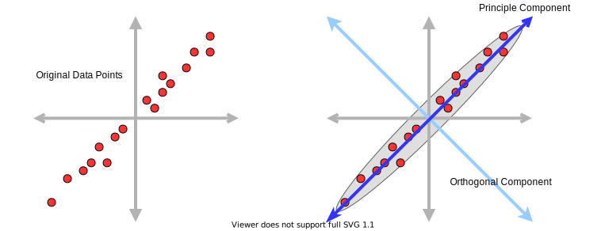
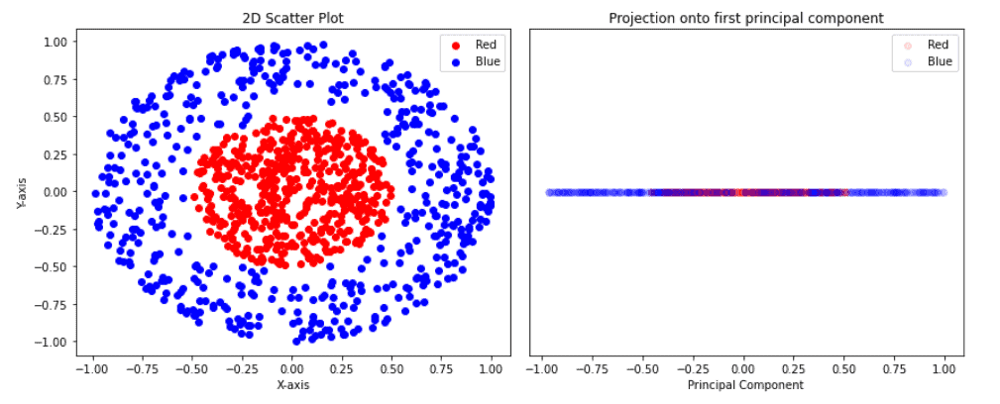
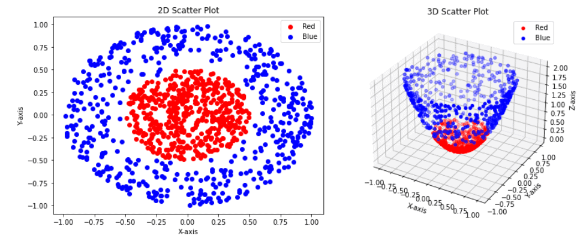
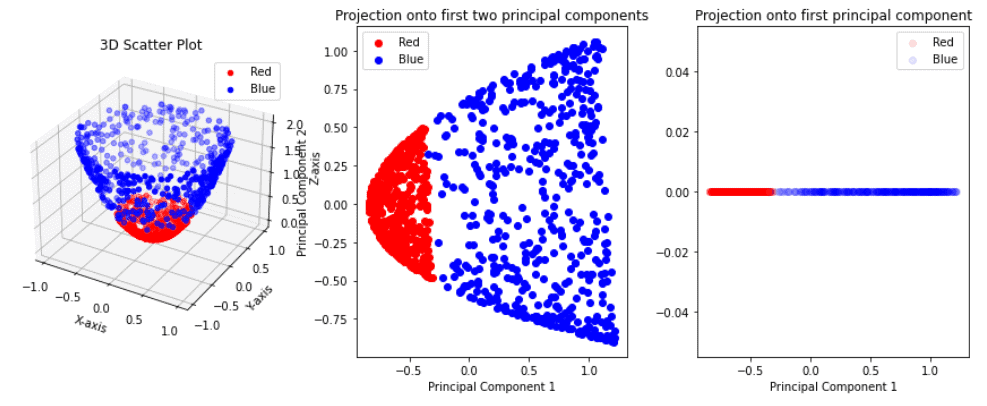

# 与标准 PCA 相比，内核 PCA 有哪些优势？

[机器学习](README-zh.md)

1. 简介

    在本教程中，我们将解释在主成分分析（PCA）中加入核的好处。首先，我们将简要介绍 PCA 技术。然后，我们将深入探讨内核 PCA 的概念，概述其特点并列举其优势。

    最后，我们将介绍内核 PCA 的各种实际应用，以证明其功效。

2. 什么是 PCA？

    主成分分析（[PCA](https://www.baeldung.com/cs/principal-component-analysis)）是数据分析和机器学习中广泛使用的一种统计方法和降维技术。PCA 的主要目标是简化高维数据集，同时保留基本信息。PCA 通过将原始数据转化为一个新的协调系统来实现这一目标，在这个新系统中，数据方差沿着新的轴最大化。这些轴代表主成分。

    例如，我们可以用一个二维数据集（下图中用蓝点表示）。有两种方法可以找到主成分：

    - 最大方差--找到第一个主成分，使数据在该成分定义的低维线性空间中的正交投影方差最大。
    - 最小误差--找到第一个主成分，使数据点与其投影之间距离的均方误差最小。在下图中，这些距离为红线。

    

    之后的每个主成分都需要与之前的主成分正交。而且，我们可以用与前一个主成分相同的方法找到它。请注意，PCA 并不是直接降低数据维度，而是为数据寻找新的轴。从本质上讲，PCA 试图找到数据的另一种视角，从而更好地分离数据：

    

    然后，PCA 会找到从最有用到最无用的主成分。这种有用性是用解释方差比来定义的。如果我们想降低数据的维度，那么我们就需要取前 N 个主成分。一种[有效的方法](https://www.baeldung.com/cs/pca)是确定累计解释方差超过指定阈值（如 0.95 或 95%）的维数。

3. 什么是核 PCA？

    虽然传统 PCA 对线性数据转换非常有效，但它可能无法捕捉复杂、非线性数据集的底层结构。为了解决这个问题，我们引入了核主成分分析（KPCA）。KPCA 依靠的直觉是，许多在当前维度上不可线性分离的数据集，可以通过将其投影到更高维度的空间来实现线性分离。

    一句话，KPCA 将我们的数据集映射到某个更高的维度，然后在这个新维度空间中执行 PCA。

    为了更好地理解这一过程，我们来看看下面的示例：

    

    左边是我们的二维数据集。这个数据集包括两个类别：红色和蓝色。蓝色类是一个甜甜圈状聚类上的点，而红色点则位于甜甜圈中心的圆圈内。很明显，这个数据集不是线性可分的，也就是说，没有一条直线能将这两个类别分开。

    如果我们应用 PCA，将数据维度从二维减少到一维，我们就能得到右图中一个坐标轴上的点。PCA 的目标是简化高维数据集，同时保留基本信息。但是，正如我们在右图中看到的，现在的点是混合的，我们无法将它们分开或聚类。

    现在，让我们用一个简单的函数将数据集从二维转换为三维：

    (1) \[\begin{align*}f(v) = f((x, y)) = (x, y, 2x^{2} + 2y^{2}),\end{align*}\]

    其中，v = (x, y) 是二维空间中的一个点。从外观上看，这种变换是这样的

    

    按照 KPCA 的逻辑，我们将数据集转换到了更高的维度，从二维转换到了三维。现在，我们可以尝试应用 PCA，将维度从三维降低到一维。此外，让我们先将数据转换为二维，然后再转换为一维。结果如下：

    

    与最初的尝试不同，现在对第一个主成分的投影有效地分离了红色和蓝色点。这一结果凸显了核 PCA 相对于标准 PCA 的真正潜力。

    1. 核函数

        核函数是我们用来将原始数据转换到高维空间的函数，在高维空间中，原始数据变得线性可分。一般来说，核函数常用于各种机器学习模型，如支持向量机（[SVM](https://www.baeldung.com/cs/ml-support-vector-machines)）、核脊回归（KRR）、核化 K 均值等。一些最常用的核函数有

        - 线性 $K(u,v) = u\cdot v$
        - 多项式 $K(u,v) = (\gamma u\cdot v+c)^d$
        - GaussRBF: $K(u,v) = \exp{(-\gamma\|u-v\|^2)}$
        - Sigmoid： $K(u,v) = tanh{\gamma u\cdot v+c}$

        通常，确定使用哪个核更好并不容易。一个不错的选择是将核及其参数视为整个模型的超参数，并应用交叉验证来找到它们和其他超参数。

        将数据直接转换为更高维度的操作可能会非常昂贵。为了克服这种转换的显式计算，我们可以使用[核技巧](https://www.baeldung.com/cs/intuition-behind-kernels-in-machine-learning#the-mathematics-of-kernels)。这是一种将数据隐式映射到高维空间的机器学习技术。

4. 核 PCA VS 标准 PCA

    核 PCA 和标准 PCA 都有各自的优势。下面我们将提到其中的一些。

    1. 内核 PCA 的优点

        核 PCA 的一些优点如下

        - 高维变换 - 通过将数据映射到高维空间，核 PCA 可以创建更具表现力的表示方法，从而有可能更好地划分类别或聚类
        - 非线性转换 - 它能够捕捉复杂的非线性关系
        - 灵活性 - 通过捕捉非线性模式，它可以更加灵活地适应各种数据类型。因此，核 PCA 被用于许多领域，包括图像识别和语音处理。

    2. 标准 PCA 的优势

        标准 PCA 的一些优点如下

        - 计算效率 - 标准 PCA 比核 PCA 的计算效率更高，尤其是在高维数据集方面
        - 可解释性 - 更容易理解和解释转换后的数据
        - 线性 - 擅长捕捉线性模式

5. 核 PCA 的应用

    核 PCA 可应用于必须捕捉非线性数据关系的各个领域。核 PCA 的一些显著应用包括

    - 图像识别 - 核PCA 能有效捕捉图像数据中的非线性模式，因此在图像识别任务中非常有价值。例如面部识别系统和物体检测
    - 自然语言处理（NLP）可用于分析和降低文本数据的维度，以完成文本分类、情感分析和文档聚类等任务
    - 基因组学和生物信息学-在基因组学中，核PCA 可帮助分析基因表达数据、DNA 测序数据和蛋白质结构数据，这些数据通常存在非线性关系
    - 金融 - 核PCA 用于金融建模，以捕捉股票价格变动和金融数据中复杂的非线性关系

6. 结论

    在本文中，我们解释了核 PCA。此外，我们还介绍了核 PCA 背后的直觉、核 PCA 和标准 PCA 的优势，并探讨了核 PCA 的一些应用。

    核 PCA 是一种强大的技术，可用于发现复杂数据中隐藏的非线性特征，尤其是与其他机器学习方法相结合时。它在为数据准备创建新特征方面极具价值。
