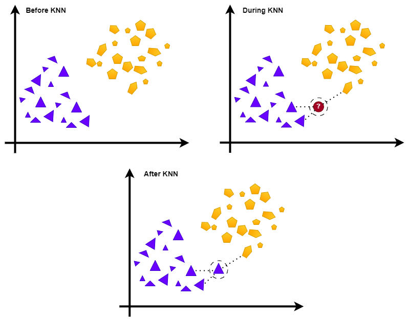

# 懒学与勤学

[机器学习](https://www.baeldung.com/cs/category/ai/ml)

[培训](https://www.baeldung.com/cs/tag/training)

1. 概述

    在本教程中，我们将深入探讨懒惰式机器学习（ML）和急迫式机器学习（ML）之间的区别。

2. 懒惰与急切

    将机器学习算法分为 "懒惰学习"和 "急切学习"两类，是因为它们在处理数据方面存在根本差异。机器学习中懒惰学习与急切学习的关键区别在于它们是否以及何时从训练数据中进行泛化。 后者会在训练过程中进行泛化，而前者则会避免推导出通用规则，或针对每个需要分类的对象建立局部模型。

    这些区别会影响学习效率、对新数据的适应性以及所建立模型的灵活性。

    急迫学习最先出现，但它在大型数据集和实时预测方面面临挑战，因此懒惰学习应运而生，以解决这些问题。

3. 懒惰学习

    懒惰学习也被称为基于实例的学习和基于记忆的学习。它将大部分处理和计算推迟到查询或预测请求时进行。

    在这里，算法以原始形式存储训练数据集，而不从中推导出一般规则。当我们需要处理一个新对象时，算法会在训练数据中搜索最相似的对象，并使用它们来产生输出，就像 k 近邻（kNN）算法一样：

    
    在上面的示例中，kNN 在输入未知点时通过检查其邻域对其进行分类。

    1. 相似度量

        懒惰学习器使用相似度量来检索与输入最相似的训练实例。

        通常，它们使用距离或核函数。例如，通常使用[欧氏距离](https://www.baeldung.com/cs/euclidean-distance-vs-cosine-similarity)：

        \[d(x, y) = \sqrt{\sum_{i=1}^{n} (x_i - y_i)^2}\]

        高斯径向信噪比（Gaussian Radial Bearning）也是如此。

        高斯径向基函数（RBF）内核也是如此：

        \[K(x, y) = \exp\left(-\frac{\|x - y\|^2}{2\sigma^2}\right)\]

    2. 举例说明

        下面是一些著名的懒学习算法：

        - k-近邻算法（[kNN](https://www.baeldung.com/cs/k-nearest-neighbors)）会在训练数据中搜索与查询点最近的 k 个实例。它使用距离度量，返回多数类或邻居的回归平均值。
        - 基于案例的推理（[CBR](https://en.wikipedia.org/wiki/Case-based_reasoning)）可检索和重用已存储的案例来解决新问题。
        - 局部加权学习（LWL）使用基于实例与查询点距离的加权函数，为每个查询点计算局部模型。
        - 学习向量量化（[LVQ](https://en.wikipedia.org/wiki/Learning_vector_quantization)）在训练过程中调整原型向量，以代表数据集类别，并根据最接近的原型进行分类。
        - 径向基函数（[RBF](https://www.baeldung.com/cs/ml-parametric-vs-non-parametric-models)）网络是一种使用径向基函数的神经网络。它们与懒惰学习器的相似之处在于其适应性和对局部逼近的依赖。
4. 急于学习

    急迫学习也称为基于模型的学习，是一种 ML 算法在训练过程中构建广义模型的方法。这些方法试图发现隐藏在训练数据中的关系和模式。因此，生成的模型是所用训练数据集的精简和抽象表示。

    急于学习者会在训练过程中调整模型参数，使成本函数最小化。一旦模型训练完成，它就能对新输入进行预测。

    如果特征与目标变量之间的关系定义明确，模型训练得当，那么急于求成的模型就会非常准确。遗憾的是，这些模型并不总能很好地泛化到新的输入。这种情况通常发生在模型过度拟合训练数据时。

    例如，[决策树](https://www.baeldung.com/cs/decision-trees-vs-random-forests)根据特征值递归拆分数据集，构建类似流程图的结构来进行预测。支持向量机（[SVM](https://www.baeldung.com/cs/ml-support-vector-machines)）通过最大化最接近训练点之间的差值，找到最佳超平面来划分类别。其他急于学习者的例子还有 [Naive Bayes](https://www.baeldung.com/cs/decision-tree-vs-naive-bayes) 和人工神经网络 ([ANN](https://www.baeldung.com/cs/neural-networks-neurons))。

5. 比较

    懒惰学习能快速适应新数据，因为它在查询阶段就能确定使用哪些对象进行预测。因此，要使用新数据，我们只需将其存储起来即可。与此相反，急迫学习在训练阶段进行泛化。之后，要从新数据中获取信息，就需要重新训练。

    懒惰学习通常会产生更简单的模型，因为它只检查查询点的邻域，而急切学习可能会产生更复杂的模型，因为它的目标是找到数据中的全局模式。

    说到训练时间，懒惰学习需要的时间较少，因为算法的重点是存储数据，以便日后方便检索。相比之下，急切学习有一个训练阶段，在这一阶段中，它会使用整个训练数据集来构建一个全面的预测模型。懒惰学习的预测速度较慢，因为它需要搜索数据以找到查询对象的邻域，而急切学习的查询时间较快，因为已完成的模型可以随时使用，通常能很快做出预测。

    懒惰学习的内存使用率较高，因为它会存储所有数据实例，而急切学习的内存使用率较低，因为只存储模型。懒惰学习通常会根据局部模式生成更具可解释性的模型，而急迫学习的可解释性则因所使用的算法而异。有些急切模型（如深度神经网络）更为复杂，难以或无法解释。

    懒惰学习非常适合在线学习，因为它可以轻松更新存储的数据，而急切学习则需要重新训练模型，这可能非常耗时。

    就鲁棒性而言，懒惰学习由于对噪声敏感和依赖局部模式，鲁棒性较差，而急切学习由于能找到全局模式，对噪声不那么敏感，因此鲁棒性一般较高。

    下面是一个简短的总结：

    | Feature          | 特点    | 懒惰学习  | 渴望学习  |
    |------------------|-------|-------|-------|
    | Generalization   | 泛化    | 适应迅速  | 灵活性较低 |
    | Model complexity | 模型复杂度 | 不太复杂  | 更复杂   |
    | Training time    | 训练时间  | 最少    | 更长    |
    | Prediction time  | 预测时间  | 较慢    | 更快    |
    | Memory usage     | 内存使用  | 较高    | 较低    |
    | Interpretability | 可解释性  | 更易解释  | 变化    |
    | Online Learning  | 在线学习  | 适合    | 不太适合  |
    | Robustness       | 鲁棒性   | 稳健性较差 | 更坚固   |

    总的来说，急迫学习可以提供高度准确的预测，但这取决于所选的模型族和训练算法。懒惰学习可以处理多种数据类型。其性能在很大程度上取决于相似度指标以及训练数据的质量和数量。

6. 如何选择？

    快速学习更适合需要实时预测的应用，如金融交易或监控系统。它能提供更快的查询时间。

    相比之下，懒惰学习更适合处理大规模数据流，如传感器网络或社交媒体分析。它非常适合在线学习，可以轻松更新存储的数据，而急于学习则需要重新训练。

    在医疗诊断或欺诈检测等对可解释性要求较高的应用中，懒惰学习通常能根据局部模式生成更易解释的模型。急切学习的可解释性因所使用的算法而异，有些模型可能更复杂、更难解释。

7. 结论

    在本文中，我们解释了懒惰学习和急切学习算法。懒惰学习在对每个新对象进行分类时建立局部模型，或者根本不进行泛化，而急切学习则在训练阶段进行泛化。

[lazy-vs-eager-learning](https://www.baeldung.com/cs/lazy-vs-eager-learning)
