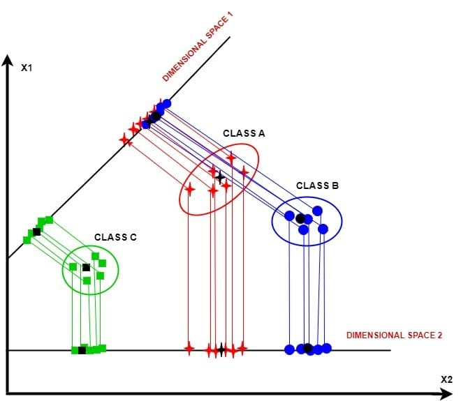
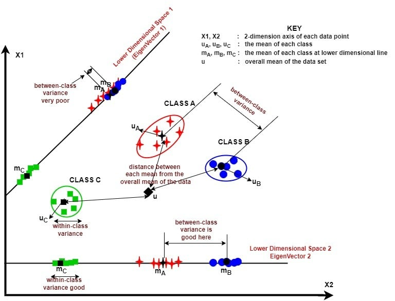
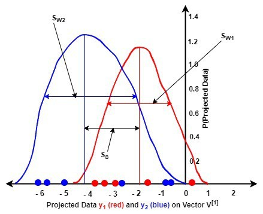
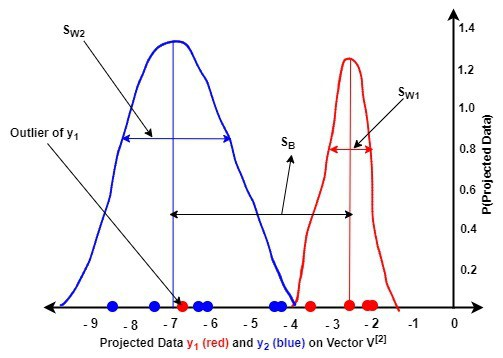
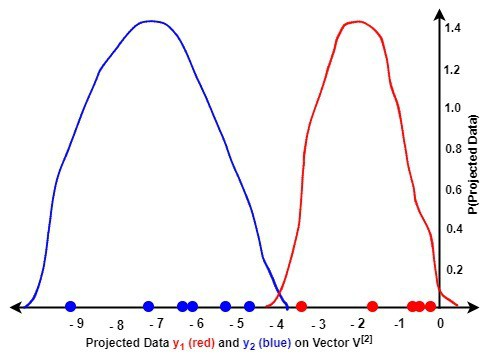

# 如何进行线性判别分析？

[机器学习](https://www.baeldung.com/cs/category/ai/ml)

[PCA](https://www.baeldung.com/cs/tag/pca) [概率与统计](https://www.baeldung.com/cs/tag/probability-and-statistics)

1. 简介

    在本教程中，我们将深入探讨线性判别分析（LDA）的复杂性。

2. 降维技术

    降维技术通过降低维度来简化数据集，并将其分为无监督和有监督两种方法。

    无监督方法，如主成分分析法（[PCA](https://www.baeldung.com/cs/principal-component-analysis)）和独立成分分析法（[ICA](https://www.baeldung.com/cs/independent-component-analysis)），不需要类标签，具有通用性。有监督的方法，如混合判别分析（MDA）、神经网络（[NN](https://www.baeldung.com/cs/neural-networks-neurons)）和线性判别分析（LDA），则整合了类标签。我们的重点是线性判别分析。

3. 什么是线性判别分析（LDA）？

    LDA 是一种强大的降维技术。它旨在将我们的数据转换到一个较低的维度空间，增强类的可分性，同时最大限度地减少类内方差：

    

    我们观察到三个数据集群：A 类、B 类和 C 类。沿维度空间 1 投影可降低类内方差，但会损失 A 类和 B 类的类间方差。因此，我们放弃空间 1，使用空间 2 进行 LDA。

    1. 进行 LDA 的步骤

        在使用 LDA 进行降维时，我们将过程分为三个主要步骤。

        - 首先，我们通过测量两类平均值之间的距离（类间方差）来最大限度地提高类的可分离性。
        - 其次，最小化类内每个数据点与其均值的接近程度（类内方差）
        - 最后，我们利用这些参数构建一个适当的低维空间。

        下图直观地说明了这些步骤：

        

        这个新构建的空间简化了我们的数据，并增强了区分类别的能力。

    2. LDA 方法

        在探索 LDA 的过程中，我们会遇到与类相关的方法和与类无关的方法。在与类相关的 LDA 中，每个类都有自己的低维空间。相反，与类无关的 LDA 将每个类分开处理，但共享一个低维空间。

4. LDA 的数学基础

    本节将讨论进行 LDA 的数学过程。

    1. 计算类间方差

        计算类间方差 $S_B$ 的步骤如下：

        我们首先计算分离距离 $(m_i - m)$ 如下：

        (1) \[\begin{equation*}(m_i-m)^2 = (W^Tu_i - W^Tu)^2 = W^T(u_i - u)(u_i - u)^TW\end{equation*}\]

        其中，$m_i$ 表示第 $i^{th}$ 个类别的均值投影，计算公式如下：

        \[m_i = W^Tu_i\]

        m 是班级总均值的投影，计算公式如下：

        \[m = W^Tu\]

        其中，W 代表 LDA 变换矩阵，$u_i$ 代表第 $i^{th}$ 个类别的均值，计算公式如下、

        \[u_i = \frac{1}{n_i}\sum_{x_i\in w_i}x_i\]

        u 是所有类别的总平均值，计算公式如下：

        \[u = \frac{1}{N}\sum_{i=1}^{N}x_i = \frac{1}{c}\sum_{i=1}^{c}u_i\]

        其中，c 是类的总数。

        等式 1 中的 $(u_i - u)(u_i - u)^T$ 表示第 $i^{th}$ 个类的类间方差 $S_{Bi}$。

        我们将 $S_{Bi}$ 代入公式 1 如下：

        (2) \[\begin{equation*}(m_i-m)^2 = W^TS_{Bi}W\end{equation*}\]

        现在我们得到总的类间方差 $S_B$，如下所示：

        (3) \[\begin{equation*}S_B = \sum_{i=1}^{c}n_{i}S_{Bi}\end{equation*}\]

    2. 计算类内方差

        计算类间方差 $S_W$ 的步骤如下：

        第 $i^{th}$ 个类的类内方差 $(S_{Wi})$ 是均值与该类样本之差。

        然后，我们寻找一个较低维度的空间，以最小化投影平均值 $(m_i)$ 和每个类别的投影样本 $(W^Tx_i)$ 之间的差值，也就是类内方差。

        我们用以下等式捕捉这些步骤：

        (4) \[\begin{equation*}\sum_{x_i\in w_j}(W^Tx_i - m_i)^2 = \sum_{x_i\in w_j}W^T(x_i - u_i )(x_i - u_i )^TW =  \sum_{x_i\in w_j}W^TS_{Wi}W\end{equation*}\]

        根据公式 4，我们可以计算出类内方差如下；

        \[S_{Wi} = d^T_i * d_i = \sum_{k=1}^{n_i}(x_{ki} - u_i)(x_{ki} - u_i)^T\]

        其中，$x_{ki}$ 代表第 $i^{th}$ 个类别中的第 $k^{th}$ 个样本，$d_i$ 是第 $i^{th}$ 个类别的中心化数据，即

        \[d_i = w_i - u_i = \{{x_k\}}_{k = 1}^{n_i} - u_i\]

        为了计算数据的总类内方差，我们将数据中所有类别的类内方差加总如下：

        \[S_W = \sum_{i=1}^cS_{Wi} = \sum_{x_i\in w_1}(x_i - u_1)(x_i - u_1)^T + \sum_{x_i\in w_2}(x_i - u_2)(x_i - u_2)^T + ... + \sum_{x_i\in w_c}(x_i - u_c)(x_i - u_c)^T\]

    3. 构建低维空间：费雪准则

        为了将数据的高维特征转换到低维空间，我们使用费雪准则 J(W)最大化 $S_B$ 与 $S_W$ 之比，以保证最大的类可分性：

        (5) \[\begin{equation*}J(W) = \frac{W^TS_BW}{W^TS_WW}\end{equation*}\]

        为了计算变换矩阵 W，我们将方程 5 变换成方程 6 如下：

        (6) \[\begin{equation*}S_WW = \lambda S_BW\end{equation*}\]

        其中，$\lambda$ 表示变换矩阵 W 的特征值。

        接下来，我们将方程 6 转化为方程 7 如下：

        (7) \[\begin{equation*}W = S_W^{-1}S_B\end{equation*}\]

        然后我们就可以计算出等式 7 中给出的 W 的特征值$（\lambda = {\lambda_1, \lambda_2,....,\lambda_M}）$及其对应的特征向量$（V = v_1,v_2,....,v_M）$。

    4. 特征值和特征向量的作用

        在 LDA 中，特征向量决定空间的方向，而特征值则表示空间的大小。我们选择特征值最高的 k 个特征向量来形成一个低维空间 $V_k$，而忽略其他特征向量。这样，原始数据 X 的维数就从 M 降到了 k：

        (8) \[\begin{equation*}Y = XV_k\end{equation*}\]

5. 独立于类别和独立于类别的 LDA 方法

    下面，我们将介绍与类无关的 LDA 方法和与类相关的 LDA 方法之间的细微差别，并提供这两种方法的算法。

    1. 与类无关的 LDA 方法

        在与类无关的方法中，我们对所有类别只使用一个低维空间。因此，我们计算所有类别的变换矩阵 $W_i$，并将所有类别的样本投影到选定的特征向量上。

        以下是独立于类别的 LDA 方法的算法：

        

    2. 与类别相关的 LDA 方法

        在依赖类的 LDA 中，我们使用 $W_i = S_{W_i}^{-1}S_B$，为每个类计算不同的低维空间。我们分别为每个 $W_i$ 找出特征值和特征向量，然后将样本投影到各自的特征向量上。

        我们提供的与类相关的 LDA 算法如下：

        

6. LDA 的计算复杂性

    在本节中，我们将介绍两类 LDA 的计算复杂度

    1. 与类别无关的 LDA 的计算复杂度

        在分析与类别无关的 LDA 的计算复杂度时，我们考虑了多个步骤。首先，计算每个类别的均值的复杂度为 $O(DN+cD)$。第二，计算总均值的复杂度为 $O(ND + D)$。第三，计算类内散度的复杂度为 $O(ND + ND^2)$。第四，计算类间散度的复杂度为 $O(cD + cD^2)$。第五，查找特征值和特征向量的复杂度为 $O(D^3)$。特征向量排序的复杂度为 $O(D \log D)$。选择 k 个特征向量是 $O(Dk)$。最后，将数据投影到特征向量上的运算量为 $O(DkN)$。总的来说，与类无关的 LDA 在 N > D 时的复杂度为 $O(ND^2)$，否则为 $O(D^3)$。

    2. 与类无关的 LDA 的计算复杂度

        在分析计算复杂度时，与类无关的 LDA 和与类无关的 LDA 都遵循类似的步骤。但是，与类相关的 LDA 会对每个类重复这一过程，从而增加了复杂度。总体而言，当 N > D 时，依赖类的 LDA 复杂度为 $O(ND^3)$，即 $O(cD^3)$，在复杂度上超过了独立于类的 LDA。

7. 数值示例

    在本节中，我们将给出一个数值示例，解释如何逐步计算 LDA 空间，以及如何使用 LDA 来区分与类无关和与类相关的两个不同类别的数据。

    第一个类 $w_1$ 是一个 5 x 2 矩阵，样本数 $n_1 = 5$。第二类 $w_2$ 是一个 6 x 2 矩阵，$n_2 = 6$。两个类中的每个样本都有以下两个特征（即 D = 2）：

    \[w_1 = \begin{bmatrix} 2.3 & 1.2 \\ 0.8 & 2.0 \\ 5.1 & 1.5 \\ 6.2 & 4.4 \\ 3.8 & 0.9 \end{bmatrix}\]

    \[w_2 = \begin{bmatrix} 6.4 & 1.5 \\ 9.3 & 4.7 \\ 3.2 & 5.1 \\ 0.9 & 8.2 \\ 7.2 & 1.4 \\ 2.2 & 5.8 \end{bmatrix}\]

    首先，我们计算每个类别的平均值 $u_j$，然后计算两个类别的总平均值 u。结果如下

    \[u_1 = \begin{bmatrix} 3.64 & 2.00 \end{bmatrix}, u_2 = \begin{bmatrix} 4.87 & 4.45 \end{bmatrix}, and u = \begin{bmatrix} 4.31 & 3.32 \end{bmatrix}\]

    接下来，我们计算每个类的类间方差 $S_{B_i}$，以及给定数据的总类间方差 $S_B$，计算公式如下：

    $S_{B_1} = n_1(u_1 - u)^T(u_1 - u)$，因此，

    \[S_{B_1}= \begin{bmatrix} 2.24 & 4.47 \\ 4.47 & 8.93 \end{bmatrix}\]

    类似地，

    $S_{B_2} = n_2(u_2 - u)^T(u_2 - u)$，所以：

    \[S_{B_2}= \begin{bmatrix} 1.87 & 3.73 \\ 3.73 & 7.44 \end{bmatrix}\]

    S_B 就变成了，

    \[S_B = S_{B_1} + S_{B_2} = \begin{bmatrix} 4.10 & 8.20 \\ 8.20 & 16.37 \end{bmatrix}\]

    接下来，我们计算类内方差 $S_W$。为此，我们要进行均值居中数据处理，即从该类中的每个样本中减去每类的均值。具体方法如下：$d_i = w_i - u_i$。其中，$d_i$ 是类 $w_i$ 的均值居中数据。$d_1$ 和 $d_2$ 的值为：

    \[d_1 = \begin{bmatrix} -1.34 & -0.80 \\ -2.84 & 0.00 \\ 1.46 & -0.50 \\ 2.56 & 2.40 \\ 0.16 & -1.10 \end{bmatrix}\]

    \[d_2 = \begin{bmatrix} 1.53 & -2.95 \\ 4.43 & 0.25 \\ -1.67 & 0.65 \\ -3.97 & 3.75 \\ 2.33 & -3.05 \\ -2.67 & 1.35 \end{bmatrix}\]

    在接下来的两个小节中，我们将介绍两种 LDA 方法是如何解决这个数值例子的。

    1. 独立于类别的 LDA 方法

        在这种方法中，在数据居中处理之后，我们计算类内方差 $S_{W_i}$ 如下： $S_{W_i} = d_i^T * d_i$。$S_{W_i}$ 的值如下：

        \[S_{W_1} = \begin{bmatrix} 18.57 & 6.31 \\ 6.31 & 7.86 \end{bmatrix}\]

        \[S_{W_2} = \begin{bmatrix} 53.07 & -30.09 \\ -30.09 & 34.38 \end{bmatrix}\]

        S_W 变为：

        $S_W = S_{W_1} + S_{W_2}$

        \[S_W = \begin{bmatrix} 71.65 & -23.78 \\ -23.78 & 42.24 \end{bmatrix}\]

        接下来，我们计算变换矩阵 W 如下： $W = S_W^{-1}S_B$。$S_W^{-1}$ 的值分别是 $\begin{bmatrix} 0.02 & 0.01 \\ 0.01 & 0.03 \end{bmatrix}$。变换矩阵的值变为：

        \[W = \begin{bmatrix}  0.15 & 0.30 \\ 0.28 & 0.56 \end{bmatrix}\]

        然后，我们根据 W 计算特征值 $\lambda$ 和特征向量 V：

        \[\lambda = \begin{bmatrix} 0.00 & 0.00 \\ 0.00 & 0.71 \end{bmatrix}\]

        \[V = \begin{bmatrix} -0.89 & -0.47 \\ 0.45 & -0.88 \end{bmatrix}\]

        接下来，我们将 $w_1$ 和 $w_2$ 投影到矩阵 V 的第一列向量 $V^{[1]}$ 和第二列向量 $V^{[2]}$ 上，以研究哪一列在判别数据时更稳健。

        利用 $V^{[1]}$，我们在低维空间上对 $w_1$ 进行如下投影：

        \[y_1 = w_1V^{[1]}\]

        \[y_1 = \begin{bmatrix} 2.3 & 1.2 \\ 0.8 & 2.0 \\ 5.1 & 1.5 \\ 6.2 & 4.4 \\ 3.8 & 0.9 \end{bmatrix} \begin{bmatrix} -0.89 \\ 0.45 \end{bmatrix} = \begin{bmatrix} -1.52 \\ 0.18 \\ -3.89 \\ -3.57 \\ -3.00 \end{bmatrix}\]

        使用相同的特征向量 $V^{[1]}$，我们可以在低维空间上投影 $w_2$ 如下：

        \[y_2 = w_2V^{[1]}\]

        \[y_2 = \begin{bmatrix} 6.4 & 1.5 \\ 9.3 & 4.7 \\ 3.2 & 5.1 \\ 0.9 & 8.2 \\ 7.2 & 1.4 \\ 2.2 & 5.8 \end{bmatrix} \begin{bmatrix} -0.89 \\ 0.45 \end{bmatrix} = \begin{bmatrix} -5.05 \\ -6.21 \\ -0.58 \\ -2.87 \\ -5.81 \\ 0.63 \end{bmatrix}\]

        接下来，我们把 $w_1$ 和 $w_2$ 投影到特征向量 $V^{[2]}$ 如下：

        \[y_1 = w_1V^{[2]}\]

        \[y_1 = \begin{bmatrix} 2.3 & 1.2 \\ 0.8 & 2.0 \\ 5.1 & 1.5 \\ 6.2 & 4.4 \\ 3.8 & 0.9 \end{bmatrix} \begin{bmatrix} -0.47 \\ -0.88 \end{bmatrix} = \begin{bmatrix} -2.15 \\ -2.14 \\ -3.74 \\ -6.81 \\ -2.60 \end{bmatrix}\]

        和

        \[y_2 = w_2V^{[2]}\]

        \[y_2 = \begin{bmatrix} 6.4 & 1.5 \\ 9.3 & 4.7 \\ 3.2 & 5.1 \\ 0.9 & 8.2 \\ 7.2 & 1.4 \\ 2.2 & 5.8 \end{bmatrix}\begin{bmatrix} -0.47 \\ -0.88 \end{bmatrix} = \begin{bmatrix} -4.35 \\ -8.54 \\ -6.01 \\ -7.65 \\ -4.46 \\ -6.15 \end{bmatrix}\]

        从我们的结果来看，$V^{[2]}$ 在区分类别 $w_1$ 和 $w_2$ 时比 $V^{[1]}$ 更稳健。这是因为 $\lambda^{[2]}$ 比 $\lambda^{[1]}$ 大。因此，我们选择 $V^{[2]}$ 来区分 $w_1$ 和 $w_2$，而不是 $V^{[1]}$。

    2. 依赖类别的 LDA 方法

        在这种方法中，我们的目标是为每个类别 $w_i$ 计算一个单独的变换矩阵 $W_i$。每个类的类内方差与我们在类无关方法中计算的相同，然后我们计算每个类的 $W_i$ 如下： $W_i = S_{W_i}^{-1}S_B$。$W_1$ 和 $W_2$ 的值变为

        \[W_1 = S_{W_1}^{-1}S_B\]

        \[W_1 = \begin{bmatrix} 18.57 & 6.31 \\ 6.31 & 7.86 \end{bmatrix}^{-1}\begin{bmatrix} 4.10 & 8.20 \\ 8.20 & 16.37 \end{bmatrix} = \begin{bmatrix} -0.18 & -0.37 \\ 1.19 & 2.38 \end{bmatrix}\]，以及

        \[W_2 = S_{W_2}^{-1}S_B\]

        \[W_2 = \begin{bmatrix} 53.07 & -30.09 \\ -30.09 & 34.38 \end{bmatrix}^{-1}\begin{bmatrix} 4.10 & 8.20 \\ 8.20 & 16.37 \end{bmatrix} = \begin{bmatrix} 0.42 & 0.84 \\ 0.61 & 1.21 \end{bmatrix}\]

        接下来，我们计算每个变换矩阵 $W_i$ 的特征值 $\lambda_i$ 和相应的特征向量 $V_i$。

        对于 $w_1$，$W_1$ 的 $\lambda_{w1}$ 和 $V_{w1}$ 值如下：

        $\lambda_{w1} = \begin{bmatrix} 0.00 & 0.00 \\ 0.00 & 2.19 \end{bmatrix}$，相应的特征向量为：$V_{w1} = \begin{bmatrix} -0.90 & 0.15 \\ 0.45 & -0.99 \end{bmatrix}$

        同样，第二类数据 $w_2$ 的 $W_2$ 的特征值 $\lambda_{w2}$ 和相应的特征向量 $V_{w2}$ 的值如下：

        $\lambda_{w2} = \begin{bmatrix} 0.00 & 0.00 \\ 0.00 & 1.64 \end{bmatrix}$，相应的特征向量为：\[V_{w2} = \begin{bmatrix} -0.90 & -0.57 \\ 0.45 & -0.82 \end{bmatrix}\]。

        从上面的结果中，我们可以观察到针对 $w_1$ 的 $V_{w1}$ 的 $V_{w1}^{[2]} 比 V_{w1}^{[1]}$ 有更大的对应特征值，这意味着 $V_{w1}^{[2]}$ 比 $V_{w1}^{[1]}$ 能更好地判别 $w_1$，因此，我们选择 $V_{w1}^{[2]}$ 作为投影 $w_1$ 的低维空间，如下所示：

        \[y_1 = w_1V_{w1}^{[2]}\]

        \[y_1 = \begin{bmatrix} 2.3 & 1.2 \\ 0.8 & 2.0 \\ 5.1 & 1.5 \\ 6.2 & 4.4 \\ 3.8 & 0.9 \end{bmatrix}\begin{bmatrix} 0.15 \\ -0.99 \end{bmatrix} = \begin{bmatrix} -0.84 \\ -1.85 \\ -0.71 \\ -3.41 \\ -0.31 \end{bmatrix}\]

        对于第二类 $w_2$，我们还可以看到 $V_{w2}$ 的第二列特征向量 $V_{w2}^{[2]}$ 的特征值高于第一列特征向量 $V_{w2}^{[1]}$，这也意味着 $V_{w2}^{[2]}$ 将比 $V_{w2}^{[1]}$ 具有更好的判别能力。我们可以得到 $w_2$ 的投影数据 $y_2$ 如下；

        \[y_2 = w_2V_{w2}^{[2]}\]

        \[y_2 = \begin{bmatrix} 6.4 & 1.5 \\ 9.3 & 4.7 \\ 3.2 & 5.1 \\ 0.9 & 8.2 \\ 7.2 & 1.4 \\ 2.2 & 5.8 \end{bmatrix}\begin{bmatrix} -0.57 \\ -0.82 \end{bmatrix} = \begin{bmatrix} -4.90 \\ -9.16 \\ -6.01 \\ -7.25 \\ -5.26 \\ -6.02 \end{bmatrix}\]

        在下一小节中，我们将直观地展示 LDA 在两类数据 $w_1$ 和 $w_2$ 上的表现，然后得出结论。

        7.3. 独立于类别和独立于类别的 LDA 方法的性能分析

        首先，让我们考虑与类无关的 LDA 方法。

        下图展示了投影数据 $y_1$ 和 $y_2$ 在矩阵 V 的两个特征向量 $V^{[1]} 和 V^{[2]}$ 上的概率密度函数 (pdf) 图：

        

        

        比较这两幅图可以发现以下几点：

        - 与 $V^{[1]}$（第一张图）相比，$V^{[2]}$（第二张图）对每一类数据的区分度更高。这意味着，$V^{[2]}$ 比 $V^{[1]}$ 最大化了类间方差 $S_B$
        - 与 $V^{[1]}$ 相比 $V^{[2]}$ 使两类数据的类内方差 $S_{W_i}$ 最小。
        - 通过使用一些技术，我们可以轻松处理第二幅图中 $y_1$ 的离群值。

        让我们研究一下与类相关的 LDA 方法：

        

        我们注意到，通过将 $w_1$ 投影到第一个特征向量的 $V^{[2]}$，将 $w_2$ 投影到第二个特征向量的 $V^{[2]}$，我们能够有效地对数据进行判别。相应的特征向量通过使数据的 $S_B$ 最大化和 $S_W$ 最小化来实现这一目标。

8. 结论

    在文章中，我们通过与类无关的方法和与类相关的方法探讨了线性判别分析（LDA）。我们的分析表明，与类无关的方法虽然高效，但比与类无关的方法需要更多的计算时间。因此，独立于类的方法通常被认为是线性判别分析的标准方法。
