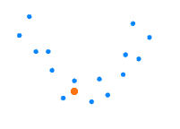
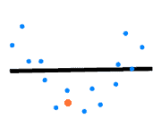
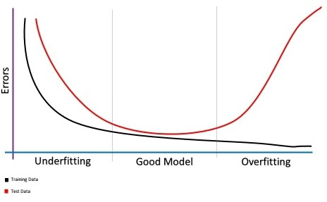

# [什么是机器学习中的学习曲线？](https://www.baeldung.com/cs/learning-curve-ml)

1. 概述

    在本教程中，我们将学习什么是学习曲线，以及为什么在机器学习模型的训练过程中需要学习曲线。

    我们还将发现不同类型的曲线、它们的用途以及如何解释它们才能最大限度地利用学习过程。

    文章结束时，我们将掌握所需的理论和实践知识，避免在实际机器学习训练中遇到常见问题。准备好了吗？让我们开始吧！

2. 学习曲线

    1. 简介

        与人们通常的想法相反，机器学习远非完全自动化。它需要大量的“看护”、监控、数据准备和实验，尤其是在新项目中。在所有这些过程中，学习曲线起着至关重要的作用。

        学习曲线是在机器学习模型的训练过程中，显示与学习相关的特定指标的经验进展的曲线图。它们只是学习过程的数学表示。

        据此，我们将在 x 轴上测量时间或进度，在 y 轴上测量误差或性能。

        我们使用这些图表来监控模型在学习过程中的演变，从而诊断问题并优化预测性能。

    2. 单一曲线

        学习曲线最常见的示例是随时间变化的损失。损失（或成本）衡量的是我们的模型误差，或者说 “我们的模型做得有多糟糕”。因此，就目前而言，损失越小，模型性能就越好。

        在下图中，我们可以看到学习过程的预期行为：

        

        尽管有轻微的起伏，但从长远来看，损失会随着时间的推移而减少，因此模型正在学习。

        准确率、精确度和召回率也是非常流行的学习曲线。所有这些都能反映模型的性能，因此它们越高，我们的模型就越好。

        下面是典型的准确率随时间变化的曲线示例：

        

        随着时间的推移，模型的性能在不断提高，这意味着模型随着经验的积累在不断改进（它在学习）。

        我们也可以看到它在开始时会增长，但随着时间的推移会达到一个高点，这意味着它无法再学习了。

    3. 多重曲线

        最广泛使用的指标组合之一是随时间变化的训练损失 + 验证损失。

        训练损失表示模型对训练数据的拟合程度，而验证损失则表示模型对新数据的拟合程度。

        我们稍后会看到这种组合，但现在，请看下面显示这两个指标的典型图：

        

        另一种常见的做法是在同一图表中显示多个指标，以及不同模型的指标。

    4. 两种主要类型

        我们经常在图表中看到这两种类型的学习曲线：

        - 优化学习曲线： 根据优化模型参数的指标（如损失或均方误差）计算的学习曲线
        - 性能学习曲线： 学习曲线：根据评估和选择模型的指标（如准确率、精确度、召回率或 F1 分数）计算的学习曲线。

        下面是机器翻译中的一个示例，显示了两个不同模型（橙色和绿色）的 BLEU（性能得分）和损失（优化得分）：

        

3. 如何检测模型行为

    我们可以通过观察学习曲线的演变来发现模型行为中的问题。

    接下来，我们将逐一介绍模型行为检测的不同场景：

    1. 高偏差/欠拟合

        让我们快速回顾一下这些概念：

        - 偏差：当学习算法没有考虑到所有相关信息，无法捕捉模型的丰富性和复杂性时，就会出现高偏差。
        - 拟合不足： 欠拟合：当算法无法对训练数据或新数据建模时，会持续获得高误差值，且误差值不会随时间推移而降低

        我们可以看到，这两者是紧密联系在一起的，因为模型的偏差越大，对数据的不完全拟合程度就越高。

        假设我们的数据是下面的蓝点，我们想建立一个线性模型来进行回归：

        

        假设我们是非常懒惰的机器学习从业者，我们提出这条线作为模型：

        

        显然，这样的直线并不能代表我们的点的模式。它缺乏描述给定数据性质的复杂性。我们可以看到，有偏差的模型没有考虑相关信息，从而导致拟合不足。

        对于训练数据，它已经做得很糟糕了，那么对于新的示例，它的表现又会如何呢？

        

        很明显，它对新示例的表现和对训练数据的表现一样差：

        

        现在，我们如何利用学习曲线来检测我们的模型是否存在拟合不足？请看显示验证和训练成本（损失）曲线的示例：

        

        - 无论是验证曲线还是训练曲线，成本（损失）函数都很高，而且没有随着迭代次数的增加而降低
        - 实际上，我们可以只使用训练曲线，检查损失是否偏高且没有减少，以确定是否存在拟合不足的情况

    2. 高方差/过拟合

        让我们简要回顾一下这两个概念：

        - 方差： 当模型过于复杂，不能代表数据中存在的较简单的真实模式时，就会出现高方差。
        - 过度拟合： 算法很好地捕捉了训练数据，但在新数据上表现不佳，因此无法泛化

        这些也是直接相关的概念： 模型的方差越大，它对训练数据的过拟合程度就越高。

        让我们以之前的例子为例，我们希望用一个线性模型来逼近这些蓝点：

        

        现在，从另一个极端来看，假设我们是非常完美主义的机器学习实践者，我们提出了一个线性模型，可以像这样完美地解释我们的数据：

        

        直觉告诉我们，这条线也不是我们想要的。的确，它符合数据，但并不代表数据中的真实模式。
        当一个新的例子出现时，它将很难对其进行建模。请看一个新例子（橙色）：

        

        使用过度拟合模型，它无法很好地预测新示例：

        

        我们如何使用学习曲线来检测模型是否过度拟合？我们需要验证损失曲线和训练损失曲线：

        

        - 随着时间的推移，训练损失会逐渐减少，从而达到较低的误差值；
        - 验证损失会下降，直到发现一个转折点，然后又开始上升，这一点代表了过拟合的开始。

    3. 找到正确的偏差/方差平衡点

        解决偏差/方差问题的方法是找到两者之间的最佳平衡点。

        在上面的示例中

        

        数据的良好线性模型应该是这样一条线：

        

        因此，当一个新的示例出现时

        

        我们将做出更好的预测：

        

        我们可以使用验证损失曲线和训练损失曲线来找到正确的偏差/方差权衡：

        

        - 当验证误差趋势从下降变为上升时，应停止训练过程
        - 如果在此之前停止训练过程，模型将拟合不足
        - 如果我们在该点后停止训练过程，模型将过拟合

4. 如何检测代表性

    1. 代表性的含义

        代表性数据集反映了同一领域中另一个数据集的比例统计特征。

        我们会发现训练数据集与验证数据集相比不具有代表性，反之亦然。

    2. 无代表性的训练数据集

        相对于验证数据集而言，当训练过程中可用的数据不足以捕获模型时，就会出现这种情况。

        我们可以通过显示一条训练损失曲线和另一条验证损失曲线来发现这一问题：

        

        训练曲线和验证曲线都在改善，但它们之间的差距很大，这意味着它们就像来自不同分布的数据集。

    3. 验证数据集缺乏代表性

        当验证数据集不能提供足够的信息来评估模型的泛化能力时，就会出现这种情况。

        第一种情况是

        

        我们可以看到，训练曲线看起来还可以，但验证函数在训练曲线附近的移动却很嘈杂。

        这可能是由于验证数据较少，对训练数据的代表性不强，因此模型很难对这些示例进行建模。

        第二种情况是

        

        在这里，我们发现验证损失比训练损失要好得多，这反映出验证数据集比训练数据集更容易预测。

        一种解释可能是验证数据很少，但在训练数据集中却有广泛的代表性，因此模型在这些少数例子上表现得非常好。

        无论如何，这意味着验证数据集不能代表训练数据集，因此存在代表性问题。

5. 结论

    在本教程中，我们回顾了理解学习曲线背后的概念以及如何使用学习曲线所需的一些基本概念。

    接下来，我们学习了如何解释学习曲线，以及如何使用学习曲线来避免常见的学习问题，例如欠拟合、过拟合或不具代表性。
