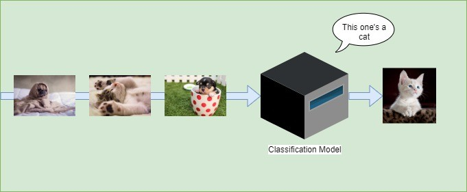
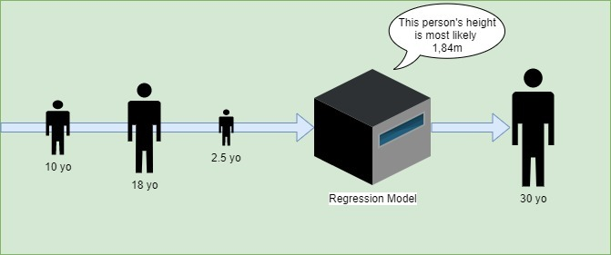
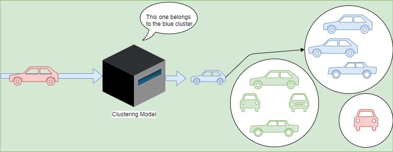
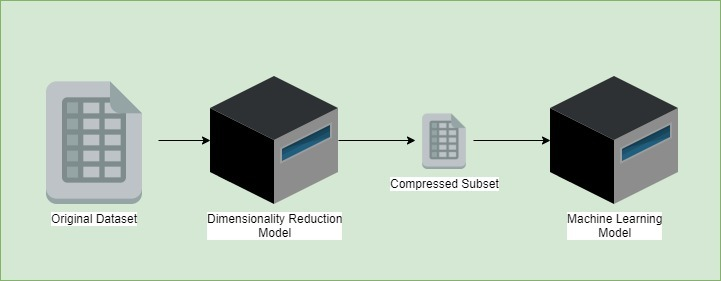
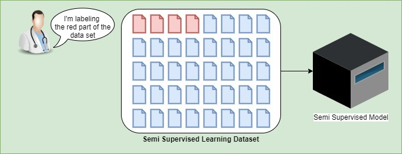
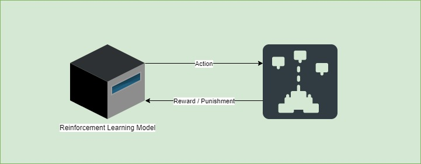

# 监督学习、半监督学习、无监督学习和强化学习简介

[机器学习](https://www.baeldung.com/cs/category/ai/ml)

[强化学习](https://www.baeldung.com/cs/tag/reinforcement-learning)

1. 概述

    机器学习包括应用数学和统计方法让机器从数据中学习。它包括四大技术系列：

    - 监督学习
    - 半监督学习
    - 无监督学习
    - 强化学习
    在本文中，我们将探讨机器学习的目的以及何时应该使用特定技术。随后，我们将根据简单的示例来了解它们是如何工作的。

2. 监督学习

    [监督学习](https://en.wikipedia.org/wiki/Supervised_learning)是一种向机器学习模型提供标记数据的技术。标注数据集通常是从经验中收集的数据，也称为经验数据。此外，数据通常需要准备，以提高质量、填补空白或优化训练。

    让我们以下面的葡萄酒类型数据集为例：

    | Type  | Acidity | Dioxide | pH   |
    |-------|---------|---------|------|
    | white | 0.27    | 45      | 3    |
    | red   | 0.3     | 14      | 3.26 |
    | white | 0.28    | 47      | 2.98 |
    | white | 0.18    |         | 3.22 |
    | red   |         | 16      | 3.17 |

    现在让我们看看制备后的效果：

    | Type | Acidity | Dioxide | pH   |
    |------|---------|---------|------|
    | 1    | 0.75    | 0.94    | 0.07 |
    | 0    | 1       | 0       | 1    |
    | 1    | 0.83    | 1       | 0    |
    | 1    | 0       | 0.52    | 0.86 |
    | 0    | 0.67    | 0.06    | 0.68 |

    我们纠正了与数据集质量有关的问题（单元格缺失），并对其进行了优化，以简化学习过程。例如，我们可以看到红色和白色的数值已被数字值取代。

    根据使用情况，我们将使用分类或回归模型。

    让我们来了解一下这些术语的含义以及如何选择最合适的模型。

    1. 分类

        首先，假设我们有一个汽车图片数据集。我们希望按轿车、卡车、面包车等类型对这些图像进行分类。因此，对于这种用例，我们希望使用分类模型。

        这种类型的模型会将我们的输入按预定义的详尽类别之一进行分类，在本例中就是按汽车类型进行分类。

        但在此之前，我们要给它输入一大组标有正确输出类别的汽车图片。这就是我们所说的训练步骤。

        之后，模型将在另一组从未处理过的标注图像上进行测试。这一步对于了解模型在处理新数据时的表现至关重要。

        最后，如果预测结果的正确率达到一定水平，我们就可以认为模型已经成熟。这个水平通常取决于用例的关键性。例如，与操作自动驾驶汽车的模型相比，过滤垃圾邮件的模型并不那么重要。我们使用损失函数来计算模型的准确性。

        下图是一个分类模型的示例，包括两个类别：猫和不是猫：

        
        让我们列举一些用于分类的算法：

        - 逻辑回归
        - 随机森林
        - 决策树
        - 支持向量回归
        - k 最近邻
    2. 回归

        另一方面，回归不会给出一个类别作为输出，而是给出一个特定值，也称为预测或预报。

        我们使用回归模型来根据历史数据预测这些值。从这个角度来说，它与分类模型并无太大区别。它也需要一个训练步骤和一个测试步骤。

        例如，假设我们有人们的年龄和各自的身高。利用这些数据，我们就能建立一个模型，根据人们的年龄预测他们的身高最有可能是多少：

        
        让我们看看有哪些算法可用于回归：

        - 线性回归
        - 随机森林
        - 决策树
        - 支持向量回归
        - k 最近邻
        我们注意到，其中大部分也已在分类分节中列出。

3. 无监督学习

    与有监督学习相反，[无监督学习](https://en.wikipedia.org/wiki/Unsupervised_learning)包括处理无标签数据。事实上，这些使用案例中的标签往往难以获得。例如，没有足够的数据知识，或者标注成本太高。

    此外，由于缺乏标签，很难为训练好的模型设定目标。因此，衡量结果是否准确就变得复杂起来。尽管如此，多种技术仍可获得结果，从而更好地掌握数据。

    1. 聚类

        聚类包括根据相似项目的某些特征发现它们的聚类。换句话说，这种技术有助于揭示数据中的模式。

        例如，我们有一个由汽车组成的输入。此外，数据集没有标签，我们不知道它们的相似特征或特征集可能导致什么聚类。聚类模型会找到模式。举例来说，在下面的案例中，聚类模型会根据汽车各自的颜色对它们进行分组：

        
        让我们来了解一些聚类算法：

        - K 均值聚类
        - 分层聚类
    2. 降维

        维度是指数据集中的维数。例如，维度可以代表特征或变量。它们描述数据集中的实体。

        这项技术的目标是检测不同维度之间的相关性。换句话说，它将帮助我们找到数据集中的冗余特征并减少其数量。举例来说，我们可以认为两个特征以不同的形式提供了相同的信息。因此，算法只会在压缩子集中保留其中一列。

        之后，我们将只保留所需的最小必要维度，而不会丢失任何关键信息。最终，这种技术有助于获得更好的数据集，优化进一步的训练步骤：

        
        我们可以列出一份并不详尽的降维算法清单：

        - 主成分分析
        - 线性判别分析
        - 广义判别分析
        - 核主成分分析
4. 半监督学习

    与有监督学习和无监督学习类似，[半监督学习](https://en.wikipedia.org/wiki/Semi-supervised_learning)也是利用数据集进行学习。

    不过，半监督学习中的数据集分为两部分：已标记部分和未标记部分。当标注数据或收集标注数据过于困难或过于昂贵时，通常会使用这种技术。已标注的那部分数据也可能质量很差。

    例如，如果我们用医学成像来检测癌症，那么让医生对数据集进行标注就是一项非常昂贵的任务。而且，这些医生还有其他更紧急的工作要做。举例来说，我们可以看到医生标注了部分数据集，而另一部分数据集则没有标注。

    最后，这种机器学习技术已被证明，即使数据集被部分标记，也能达到很好的准确性。

    
5. 强化学习

    在[强化学习](https://en.wikipedia.org/wiki/Reinforcement_learning)中，系统完全通过一系列强化来学习。与系统目标相关的强化物可以是正强化物，也可以是负强化物。正强化被称为 "奖励"，反之，我们将负强化称为 "惩罚"。

    例如，让我们以一个玩电子游戏的模型为例。当系统赢得更多分数时，它就会得到奖励。但如果输了，模型就会受到惩罚。这样，模型就能找出哪些策略是好的。

    然后，这些棋步的价值将相互叠加，从而建立一个短期战略和长期战略。因此，该模型将学会如何玩游戏，并尽可能积累最多的奖励。

    最后，模型会随着每次行动和奖励或每批行动和奖励而发展。

    
    强化学习的一些算法有

    - SARSA 即状态-行动-奖励-状态-行动
    - Q 学习
    - 汤普森采样
    - 置信度上限
    - [蒙特卡洛树搜索](https://www.baeldung.com/java-monte-carlo-tree-search)
6. 如何选择合适的方法？

    理想的通用算法并不存在。每种算法都有其优缺点。根据使用情况和不同因素，我们会选择其中一种算法。

    让我们来看看选择算法时需要考虑的一些不完全要点：

    - 问题类型 - 考虑到要解决的问题，我们将选择一种已被证明能为类似问题提供良好结果的算法
    - 可用样本的数量 - 一般来说，数据集越大越好，但有些算法在数据集较小的情况下也有很好的表现（例如 Naive Bayes、KNeighbors Classifier、Linear SVC、SVR）
    - 与用于训练的数据量相比，模型算法的复杂程度--更准确地说，如果算法过于复杂，但只用了很少的数据进行训练，那么它就会过于灵活，最终可能会导致过度拟合。
    - 预期准确率 - 一个准确率低的机器学习模型的训练速度可能比另一个以最小损失为目标的模型快得多。
7. 结论

    总之，我们已经发现了应用机器学习的多种技术。我们现在知道这些技术有不同的风格，但都有一个共同点：它们总是由数学和统计技术组成。

SEE: [Introduction to Supervised, Semi-supervised, Unsupervised and Reinforcement Learning](https://www.baeldung.com/cs/machine-learning-intro)
