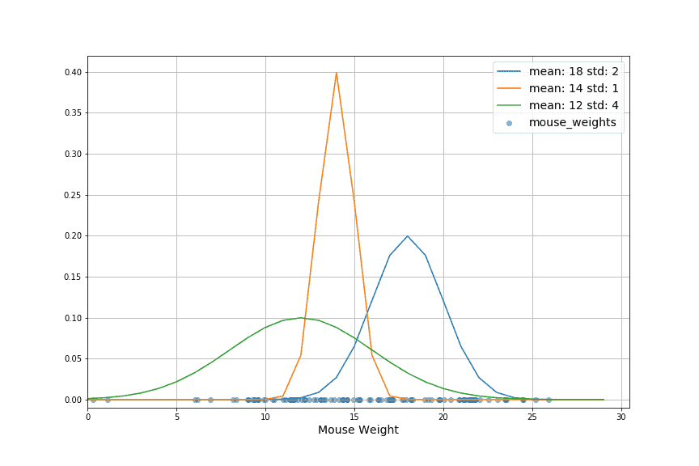

# [最大似然估计](https://www.baeldung.com/cs/maximum-likelihood-estimation)

1. 简介

    在本教程中，我们通过一个例子来探讨最大似然估计。我们注意将似然与概率区分开来。接着，我们将说明估计数据集最大似然的含义。然后，我们将讨论如何将其作为优化多种类型模型的基础。

2. 什么是最大似然？

    最大似然法是统计学和机器学习中用来估计模型参数的一种方法。它包括找到能使模型中给出的数据的可能性最大化的参数值。这意味着，我们使用最大似然法找到的参数值，是在模型中最有可能得到观测数据的参数值。

    换句话说，假设模型正确，参数的最大似然估计值就是最有可能产生观测数据的值。这种方法可以估计各种统计模型的参数，包括回归模型、逻辑模型等。

    1. 与概率的比较

        在此澄清一下可能性与概率之间的区别是有帮助的。概率告诉我们在某个模型下观察到某些数据的概率。相比之下，可能性告诉我们某个模型产生给定数据的概率。在此，我们宽泛地使用 “概率” 一词来表达直觉，并进一步给出相应的公式。

        概率是观测值的函数，由函数参数确定。如果这个模型描述了数据，那么一个具体例子的概率有多大：

        (1)  $P(X | \theta)$

        似然是所选分布参数的函数，由观测数据参数化：

        (2)  $L(\theta | X)$

        最后，这句话有助于巩固重要的启示。概率与可能性之间的区别具有根本性的重要意义：[概率与可能的结果相关，可能性与假设相关](https://www.psychologicalscience.org/observer/bayes-for-beginners-probability-and-likelihood)。由此我们还可以推断，可能性不是概率密度函数。这是因为假设的总和不一定等于 1。

    2. 最大似然估计

        既然我们已经对概率和似然有了直观的认识，那么我们就开始将这两个概念结合起来。由于似然是特定参数化导致观察数据的概率，我们可以将两个公式等同起来：

        (3)  $L(\theta | X) = P(X|\theta)$

        现在，最大化似然等同于最大化数据集中样本的概率。

    3. 如何实现？

        现在我们来看看创建优化问题的步骤。首先，让我们重写上面的等式。

        对于概率密度函数来说，它变成了项的乘积。在离散问题中，我们有一个概率质量函数。在这种情况下，概率质量函数不是一个乘积，而是一个和：

        (4) $MAX_{\theta}\{ \Pi^{N}_{i=1} p(x_i|\theta)\}$

        在现实中，使上式的对数最大化往往更容易。或者，我们也可以最小化负对数似然。这是机器学习中常用的方法。无论哪种情况，我们都取概率密度函数的对数：

        (5)  $MAX_{\theta}\{ \ln(\Pi^{N}_{i=1} p(x_i|\theta))\}$

        然后，我们将对数带入积的内部，从而将其转换为和。

        (6)  $MAX_{\theta}\{ \Sigma^{N}_{i=1} \ln(p(x_i|\theta))\}$

        这样就得出了一个值，我们现在可以对其应用优化算法。这可能是一种基于群体的启发式优化方法，如[蛾焰优化](https://www.baeldung.com/cs/moth-flame-optimization)或[蚁狮优化](https://www.baeldung.com/cs/ant-lion-optimization)。也可以是[爬山法](https://www.baeldung.com/cs/hill-climbing-algorithm)或相关方法，如[模拟退火法](https://www.baeldung.com/java-simulated-annealing-for-traveling-salesman)。

        通过反转符号并使结果为负，我们还可以创建一个最小化问题，即最小化负对数似然。这是标准方法，我们可以使用 [SciPy](https://scipy.org/) 的 minimize 函数甚至[神经网络](https://www.baeldung.com/cs/mlp-vs-dnn)来解决这个问题。

    4. 普通最小二乘法

        值得注意的是，极大似然估计与其他优化技术也有关联。特别是，如果我们假设正态分布，那么它就等同于[普通最小二乘法](https://www.baeldung.com/cs/curve-fitting)。

        普通最小二乘法是一种一致的估计方法。这意味着，随着可用数据的增多，它的收敛速度会越来越接近真实的数据分布。通过普通最小二乘法和极大似然估计法之间的等价关系，我们也可以说极大似然法是一种一致估计法。

3. 例题

    例如，我们想用一个包含一组小鼠测量体重的给定数据集来表示小鼠体重的分布。图中显示了小鼠的体重。最大似然估计是一种优化模型参数的方法。为了使用这种方法，我们需要选择一个模型：

    

    1. 选择模型

        观察鼠标权重图，我们可以说我们的数据看起来是正态分布的。数据似乎向中间集中，然后向边缘密集度降低。许多现实生活中的例子都符合这种分布。

        我们用两个参数来定义高斯（正态）分布。平均值(mean $\mu$)和方差(variance $\sigma$)。我们使用最大似然法拟合分布/模型的这两个参数。

        如果模型拟合得当，我们就会得到一个参数化的分布，如果我们从中采样，那么这个分布就是最有可能产生初始观测样本的分布。

    2. 估计模型

        我们可以在下图中看到三个不同参数化高斯分布的例子。我们使用最大似然估计来选择最佳模型。如果需要更好的结果，则使用优化方法。这样我们就能为分布找到更好的参数：

        

        在这种情况下，数据的平均值和标准偏差产生了最佳拟合高斯分布。这种方法不仅适用于高斯分布，也适用于其他分布和模型。

4. 最大似然法用于何处？

    我们将极大似然估计法广泛应用于以下领域：

    估计统计模型的参数： 我们使用极大似然估计许多不同类型统计模型的参数，包括用于回归和分类任务的模型。负对数似然是最小化的倒置版本，在[优化神经网络](https://www.baeldung.com/cs/cost-function-logistic-regression-logarithmic-expr)时非常有用。

    从样本数据推断群体参数： 我们使用最大似然法从样本数据中估计群体参数（如分布的均值和方差）。这对数据分析非常有用。

    模型选择： 我们还使用最大似然法比较不同模型与数据的拟合程度，并根据参数的最大似然估计值选择最拟合的模型。

    1. 局限性

        与所有估算方法一样，使用最大似然估算时也要考虑几个限制因素。

        用户必须正确指定模型： 在最大似然估计中，我们假定一个模型符合数据。这意味着我们选择用来描述数据的模型。如果模型指定错误，参数的最大似然估计值可能会有偏差或不一致。

        在我们的示例中，需要明确地计算出使我们能够选择优化所选模型的参数的方程。

5. 结论

    在本教程中，我们介绍了极大似然估计。我们强调了似然和概率之间的区别。我们接着介绍了如何将这两个概念联系起来以创建一个优化问题。

    基于这种理解，我们讨论了如何使用极大似然估计来解决优化问题、选择模型和检测群体参数。这一描述突出了最大似然估计在统计和机器学习应用中的普遍性。

    通过统计特性建立数据模型是许多人工智能应用的基本方面。了解最大似然法是深入理解许多应用、其工作原理和局限性的关键。
