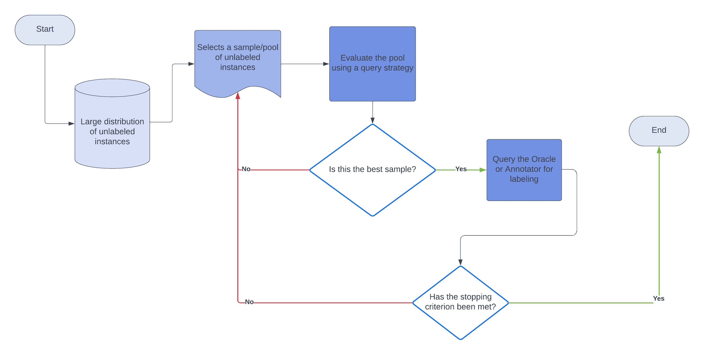
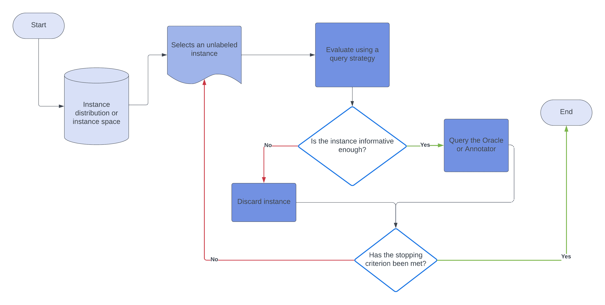

# [机器学习: 主动学习](https://www.baeldung.com/cs/ml-active-learning)

1. 简介

    在本教程中，我们将讨论机器学习中的主动学习。我们将解释它是什么、为什么、如何以及何时使用。

2. 问题陈述

    一般来说，当我们要训练一个[监督学习系统](https://www.baeldung.com/cs/ml-weakly-supervised-learning)时，我们会使用成百上千个标注过的实例。

    训练这些模型的成本通常很低，因为标签并不难获得。例如，根据我们在应用程序中喜欢的歌曲来推荐音乐的模型已经有了一个可以学习的大型数据集。

    但是，如果我们想在没有足够标签实例的情况下为某项任务训练模型呢？例如，一个没有历史数据可供学习的文章推荐器需要训练者或用户注释成千上万的文档和文件，这既困难、耗时又昂贵。

    因此，我们需要一种更好的方法来训练这些系统：一种即使有很多未标注实例也能让系统学习的方法。

    这个框架就是主动学习，它是机器学习的一个子领域，假设了查询学习。

3. 主动学习

    主动学习又称查询学习，其核心思想是学习系统可以选择要学习的数据。与要求我们在学习前对每个实例进行标注不同，系统可以使用一些已标注的实例，并在学习过程中选择未标注的对象进行标注查询。

    因此，这种学习方式旨在解决标签问题。系统根据过去查询的信息或回复，对未标记的实例查询甲骨文或注释器。在典型的主动学习问题中，我们有一个包含大量未标注实例和一小部分标注数据的数据集。

    我们通过一系列步骤来解决这些问题：

    1. 在标注数据上训练模型
    2. 从未标明实例的分布中选择实例样本
    3. 使用模型评估未标注样本池
    4. 根据评估结果，选择最佳样本
    5. 给这个样本贴标签，并将实例添加到已贴标签的数据中

    重复步骤 1-5，直到满足停止标准

    下面是流程图：

    

    巧合的是，这些步骤描述了基于池的抽样，这是主动学习者查询甲骨文的多种方法之一。我们使用查询策略来选择未标记的对象，并对其标签进行查询。查询策略是学习者决定查询哪些实例和忽略哪些实例的规则集。

    让我们来看看主动学习的三种类型。

4. 主动学习类型

    我们将介绍三种类型：成员查询合成、基于流的选择性采样和基于池的采样。

    1. 成员查询合成

        在这里，学习者可以创建一个新的、未标记的实例，并查询甲骨文以获得其标签。这个新实例可能不同于数据集中的未标注对象。在标注者标注对象后，学习者继续学习：

        

        例如，假设我们正在训练系统识别象形文字，并有办法从分布中随机生成象形文字形状。在这种情况下，学习器会查看未标记的字符样本，并生成一个类似的字符。然后，学习者会查询甲骨文，以获得生成字符的标签：它是否是象形文字，或者代表哪个象形文字。

        这样做的一个缺点是，学习者可能会生成模棱两可或不连贯的字符。这种可能性会严重影响学习效率，并导致更多错误。

        生成和查询新实例（尤其是图像和视频等更复杂的数据类型）的计算成本可能是巨大的。因此，主动学习在实践中并不常用。

    2. 基于数据流的选择性采样

        在选择性采样中，我们从实际数据集或分布中选择一个未标注实例的样本，然后决定是查询甲骨文还是忽略该实例：

        
        一般来说，这种方法假设学习者可以自由获取未标记的实例。学习者根据其查询策略决定查询或丢弃，查询策略会评估实例并通知学习者如何处理：查询注释器或丢弃实例并转向下一个实例。

        我们称这种方法为基于流的抽样，因为学习者每次从数据集中抽取一个实例，并在进入下一个实例之前做出决定。

        基于流的采样方法的一个典型例子是在实时数据分析或在线分析中，我们在分析每一个进入的对象之前都会分析下一个对象。

    3. 基于池的采样

        在这种方法中，学习器会选择一个未标记对象池（样本），并使用查询策略对该对象池进行评估，以确定最有希望查询甲骨文的对象。由于我们可以对未标注数据的有限子集进行采样，因此这种方法可以在大量未标注对象的数据集中高效运行。

        一个例子是使用大量非结构化文本的文本分类。在这些应用中，让人工标注员按顺序对每个文本进行分析、分类和标注的成本会相当高。

        为了缓解这一问题，我们可以使用基于池的采样，从语料库中采样并评估一些文本摘录。然后，学习器将最佳摘录转发给 Oracle 进行标注。然后，将这些回复添加到已标记的数据中。之后，我们重新训练模型。

        基于流的采样会按顺序挑选实例并查询oracle，而基于池的方法则会评估一个集合，在查询oracle之前选择最有希望的对象。

5. 查询策略框架

    主动学习器要发挥作用，就必须准确评估未标记实例的信息量。

    学习者可以使用几种框架：不确定性采样(uncertainty sampling)、按委员会查询(query-by-committee)、预期模型变化(expected model change)、预期误差减少(expected error reduction)和方差减少(variance reduction)。我们将讨论不确定性采样，这是最常用的框架。

    在不确定性抽样中，我们使用标签的概率来对实例做出明智的决策。

    一般来说，基于不确定性抽样评估实例有三种方法：最小置信度抽样、边际抽样和熵抽样。

    1. 最小置信度法

        在最小置信度法中，学习者会考虑数据集中每个实例的每个标签的概率。对于每个实例，学习器都会找出最高概率。然后，学习者会查询 "最大" 概率最小的实例的标签。

        让我们举个例子：

        | 无标签物体 | 标签 A  | 标签 B | 标签 C |
        |----------|-------|------|------|
        | Object 1 | 0.5   | 0.25 | 0.25 |
        | Object 2 | 0.1   | 0.8  | 0.1  |

        学习者有 50%的把握认为对象 1 属于类别 A，而对象 2 有 80%的可能拥有实际标签 B。

        这种方法的主要缺点是学习者总是选择最有可能的标签，而忽略了其他标签的概率分布。

    2. 边际采样

        在边际采样中，学习者会考虑两个最可能标签之间的差异。然后，它会选择差值最小的实例。这在边际比较模糊的分布中非常有用。例如：

        | 无标签物体    | 标签 A  | 标签 B | 标签 C |
        |----------|-------|------|------|
        | Object 1 | 0.5   | 0.45 | 0.05 |
        | Object 2 | 0.3   | 0.4  | 0.3  |

        在这种情况下，对象 1 的两个最可能标签之间的差值为 0.05，而对象 2 的差值为 0.1。因此，它向甲骨文查询对象 1 的标签。

    3. 熵采样

        在熵采样中，学习器选择熵最大的实例：

        \[x^*_H = \mathrm{argmax}_x \left\{- \sum_i P(y_i|x)\log P(y_i|x)\right\}\]

        其中 $y_i$ 涵盖 x 的所有可能标签。

        与前面讨论的策略不同，这种方法考虑了实例的所有可能标签。因此，它是最常见的不确定性采样策略。

        如果我们对第一个表格使用这种方法，我们会发现对象 1 的熵为 0.452，而对象 2 的熵为 0.277。因此，学习者会选择 "对象 1"。

6. 应用领域

    随着机器学习领域的不断发展，越来越多的领域开始采用主动学习来训练监督分类器和预测器。

    由于标注语言数据的成本较高（例如在语音识别中），主动学习的最热门应用领域之一是训练 NLP 模型。

    我们还将主动学习用于计算机视觉和信息提取。一些研究人员还在尝试将其与生成对抗网络和深度强化学习相结合。

7. 结论

    在本文中，我们讨论了机器学习中的主动学习，并解释了它如何缓解传统监督学习系统训练中发现的瓶颈。

    主动学习系统通过从一小部分标记数据集开始学习。在训练过程中，它们会查询一个甲骨文（例如人类注释者），以获得一些未标注实例的标签，并将其添加到标注数据中。
