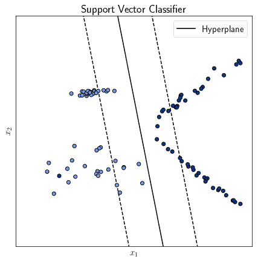
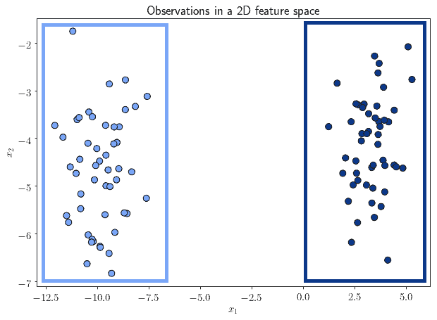
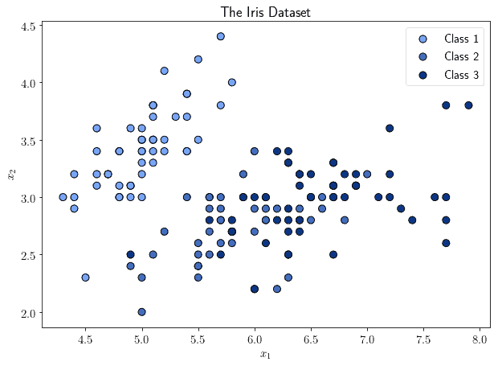

# [分类与聚类的区别](https://www.baeldung.com/cs/ml-classification-vs-clustering)

1. 概述

    在本教程中，我们将研究机器学习中分类和聚类技术的区别。

    首先，我们将介绍这两种方法背后的理念，以及它们各自的优势。然后，我们将列出它们的主要技术和用途。

    我们还将列出一份清单，用于确定在处理新任务时使用哪一类算法。

    在本教程的最后，我们将了解分类和聚类技术的功能，以及它们的典型使用案例。

2. 分类

    1. 分类简介

        分类和聚类都是对数据集进行数据挖掘的常用技术。虽然熟练的数据科学家精通这两种技术，但它们并不同样适合解决所有问题。因此，了解它们的具体优势和局限性非常重要。

        我们先从分类开始。在简要讨论了分类的一般概念后，我们将看看在实际任务中可以使用哪些方法来实现分类。

        分类问题是机器学习中与监督学习相关的一类问题。简而言之，它相当于为一系列观察结果分配标签。正如我们在关于标签数据的文章中所讨论的，只有当我们事先知道标签在语义上代表什么时，才有可能在现实世界中进行分类。

        虽然分类问题本身可以完全用数学符号来描述，但要开发一个机器学习系统并将其部署到现实世界中，我们就必须考虑我们的产品将嵌入的更大系统。这反过来又要求将[标签映射](https://ieeexplore.ieee.org/document/9110198)到现实世界的某种语义类别中。

        分类还传达了这样一种理念：一般来说，我们可能希望将世界划分为离散的区域或区块。这些区域往往是不重叠的，尽管通过[分层](https://en.wikipedia.org/wiki/Hierarchical_classification)或[多标签分类](https://en.wikipedia.org/wiki/Multi-label_classification)可以提出重叠的标签。即使区域重叠，标签本身也不会重叠。

        因此，分类就是给事物或区域分配离散标签的问题。

    2. 分类简述

        分类的基本假设如下：

        - 存在离散而独特的类别
        - 观察结果属于或附属于类别
        - 有一个函数可以模拟观察结果隶属于其类别的过程
        - 该函数可以在训练数据集上学习，并能很好地泛化之前未见过的数据

        这些假设同等重要。如果其中一个假设被违反，那么对于特定问题来说，分类将无法奏效。

    3. 这些假设意味着什么？

        第一个假设很容易理解，它只是意味着类不是连续值。如果是连续值，我们要解决的就是[回归](https://www.baeldung.com/cs/linear-vs-logistic-regression#the-idea-of-regression-in-statistics)问题，而不是分类问题。

        关于第二个假设，我们可以用下面这个直观的例子来说明。假设有人交给我们一个任务，对这些多边形进行分类：

        

        除非给出任务的人指定了一种类型学，让我们根据这种类型学进行分类，否则分类是不可能的。但是，如果他们告诉我们将多边形分为凸形和非凸形，那么分类又是可能的了：

        

        例如，我们就不能把同样的多边形按$\{Pear, Apple\}$分类。

        关于第三个假设，这一点很重要，因为分类不仅与机器学习有关。就像人类识别[卫星图像](https://search.proquest.com/openview/dda91c2ffc33408fab005495725b9f03/1?pq-origsite=gscholar&cbl=51908)中的物体一样，即使仅凭人类的理解能力也可以进行物体识别。在这种情况下，分类过程可以作为一个工作流程来建模，人是其中的一个要素，但不能作为一个数学决策函数来建模：

        

        关于最后一个假设，我们可以用这个例子来代替。假设我们的任务是识别图像中的物体，但我们得到的数据集只包含车辆：

        

        无论我们使用哪种算法，都不可能识别出车辆以外的任何物体。我们可以类比说，通过使用这个数据集，$\forall{x} \to P( \neg {car} | x) = 0$。如果我们想识别自行车，那么这个样本数据集是不合适的，因为违反了第四个假设。

3. 常用分类方法

    1. 逻辑回归

        分类方法都是通过学习一个函数，在给定特征向量 x 的情况下，赋予与训练数据集中的一个标签相对应的标签 y。下面我们将依次介绍几种主要方法及其应用实例。

        [逻辑回归](https://www.baeldung.com/cs/linear-vs-logistic-regression#logistic-regression)是最简单的分类方法之一。它通过将这一过程建模为确定连续分布在区间 (0, 1) 中的概率 P( y | x ) 来模拟为观察结果分配类别的决策。逻辑回归是一种特别常见的分类方法，因为它的[优化函数](https://www.baeldung.com/cs/cost-function-logistic-regression-logarithmic-expr#cost-function-of-the-logistic-regression)可以用[梯度下降](https://www.baeldung.com/cs/gradient-descent-vs-ascent#gradient-descenthttps://www.baeldung.com/cs/gradient-descent-vs-ascent#gradient-descent)法来处理。这反过来又保证了模型可以按程序进行优化：

        

    2. 自然贝叶斯分类法

        [Naive Bayesian](https://www.baeldung.com/cs/naive-bayes-classification) 分类器是为特征向量建立简单分类系统的典型工具，特征向量的各组成部分之间具有很强的线性独立性。具有讽刺意味的是，它经常用于文本等特征，这些特征当然具有很强的线性依赖性。

        然而，当我们无法得知分类函数的一般形状，并且可以假定训练数据集很好地代表了机器学习系统将检索到的[真实世界数据](https://www.baeldung.com/cs/ml-knowledge-graphs#the-problem-of-world-representation)时，它就特别有用了。

        贝叶斯定理计算了在特征向量 x 的特征 $x_i$ 条件下，y 的概率 $P(y | x_i)$：

        $$P(y | x_i) = P(x_i | y) \cdot \frac {P(y)} {P(x_i)}$$

    3. 卷积神经网络

        神经网络，尤其是[卷积神经网络](https://www.baeldung.com/cs/ai-convolutional-neural-networks)，可以帮助解决数据集分类任务，因为在这些数据集中，特征之间具有[很强的线性依赖性](https://www.baeldung.com/cs/ai-convolutional-neural-networks#3-linear-independence-of-features)。它们的工作方式是[降低分类器输入的维度](https://www.baeldung.com/cs/ml-relu-dropout-layers#the-curse-of-dimensionality-in-cnns)，这样就可以在不需要过多计算能力和时间的情况下完成分类任务。

        卷积神经网络有多种激活函数。中间层通常使用 [ReLU 或 Dropout 函数](https://www.baeldung.com/cs/ml-relu-dropout-layers)，而分类层一般使用softmax。

    4. 支持向量机

        另一种常见的分类算法是[支持向量机](https://www.baeldung.com/cs/ml-support-vector-machines)，在这里也称为[支持向量分类器](https://scikit-learn.org/stable/modules/generated/sklearn.svm.SVC.html)。这种算法的工作原理是确定一个分离超平面，该超平面能最好地分离属于不同类别的观测值：

        

        [支持向量机与神经网络相似](https://www.baeldung.com/cs/svm-vs-neural-network#similarities-between-svms-and-nns)，因为它们都是参数化的，但它们之间还有[其他一些区别](https://www.baeldung.com/cs/svm-vs-neural-network#differences-between-the-two-approaches)。与神经网络相比，支持向量机的训练速度明显更快，但计算预测结果的速度却更慢。

4. 分类的用途

    分类的用途取决于我们用它处理的数据类型。最常见的数据类型是图像、视频、文本和音频信号。

    分类在这些数据源中的一些用途如下：

    - 在图像处理中，分类可以让我们[识别图像中的字符等对象](https://www.baeldung.com/java-ocr-tesseract)
    - 在视频处理中，分类可以让我们[识别给定视频所涉及的类别或主题](https://static.googleusercontent.com/media/research.google.com/en//pubs/archive/42455.pdf)
    - 在文本处理中，通过分类，我们可以[检测出电子邮件中的垃圾邮件](https://www.baeldung.com/cs/spam-filter-training-sets)，并将其过滤掉
    - 在音频处理中，我们可以使用分类来[自动检测人类语音中的单词](https://ieeexplore.ieee.org/document/8252104)

    还有一些不太常见的数据类型，仍然使用分类方法来解决某些特定问题：

    - 在天气控制中，可以使用根据气象站数据训练的[分类器进行天气预报](https://www.researchgate.net/publication/272482887_Weather_Prediction_using_Classification)
    - 在系统维护中，可以利用经过适当训练的分类器来[识别故障部件](https://www.researchgate.net/publication/327334242_Machine_Learning_approach_for_Predictive_Maintenance_in_Industry_40)
    - 在天文学领域，根据开普勒望远镜的读数，监督学习可以帮助[探测太阳系外的行星](https://research.google/pubs/pub46789/)
    - 在采矿和资源开采方面，分类可以根据地理信息系统和地质数据[确定找到矿藏的概率](https://www.sciencedirect.com/science/article/pii/S0169136818307406)
    - 在神经学领域，分类器可帮助[微调脑-机和脑-脑接口的脑电图模型](https://www.nature.com/articles/s41598-019-41895-7)

    监督学习和分类的应用还有很多。一般来说，如果一个问题可以以尊重上述四个假设的方式形式化，那么这个问题就可以作为一个分类问题来处理。

5. 聚类

    1. 聚类简介

        机器学习的另一种方法，即有监督学习的替代方法是无监督学习。无监督学习包括一类处理无标记数据的算法，即我们事先不知道其所属类别的数据。

        聚类算法是无监督学习算法中最重要的算法之一，它通过算法识别数据集中根据某种度量标准彼此相似的观测数据组。

        我们在介绍分类法的章节中提到，标签必须是预先确定和离散的。不过，聚类并不一定是预先确定的，事实上，我们有可能[聚类出未知数量的聚类](https://www.baeldung.com/cs/clustering-unknown-number)。

        理解聚类最简单的方法就是用特征空间来表示。特征空间是数据集中所有观测值所在的空间。我们可以把它想象成一个直角坐标平面，将其概念化为二维空间：

        

        从上图中我们可以看到，所有观测值都位于该特征空间内。然而，并非所有观测值都位于该空间的同一区域。事实上，我们可以发现一些观测点彼此非常接近，而另一些观测点则相距甚远：

        

        根据观测值的相似性来确定属于同一组观测值的问题就叫做聚类。

    2. 聚类简述

        与分类法一样，我们现在可以列出将聚类应用于某个问题所需的假设。其中只有两个假设特别重要：

        - 所有观测值都位于相同的特征空间，如果观测值属于同一数据集，这一点总是可以验证的
        - 必须有某种度量标准，我们可以根据它来衡量该空间中观测值之间的相似性

        如果特征空间是一个矢量空间（我们假设它是一个矢量空间），那么度量标准肯定存在。

        与分类所需的假设相比，这些假设的限制性要小得多。从这个意义上说，我们可以说，与分类相比，聚类所需的关于所研究现象性质的先验知识是有限的。不过，请记住，特定的算法可能会对聚类的预期分布提出额外的假设，在选择特定算法时也应将这些假设考虑在内。

        聚类通常有助于[假设的提出](http://methods.sagepub.com/Reference//the-sage-encyclopedia-of-communication-research-methods/i6391.xml)，也可应用于[该任务的自动化](https://www.researchgate.net/publication/221645583_Visual_Topological_Map_Building_in_Self-similar_Environments)。也就是说，聚类主要是假设的制造者，而不是假设的主体。

6. 常见的聚类方法

    1. K-均值法

        现在我们可以研究对数据集进行聚类的具体技术。为了展示不同的技术可能导致不同的结果，我们将始终使用同一个数据集，即著名的iris数据集：

        

        请注意，Iris 数据集具有通常用于监督学习的类。不过，我们可以忽略类标签，直接进行聚类。如果有兴趣，我们可以参考上图，看看各种聚类技术与类分布的比较。

        我们研究的第一种技术是 [K-Means](https://www.baeldung.com/java-k-means-clustering-algorithm)，这也是最常见的技术。K-Means 是一种参数算法，需要事先确定要识别的聚类数量。它的工作原理是在特征空间中找出与最接近它们的所有观测值的距离方差最小的点：

        

        这些点被称为聚类的 "中心点(centroids)"。在一个有 n 个观测值 $(x_0, x_1, ... , x_n)$ 的数据集上计算 K-均值的公式如下：

        $$\sum_{j=0}^{n} {min} (||x_j - \mu_i||^2)$$

        这个方法的原理是找出平均值 $\mu_i$，每个聚类一个，使与属于该聚类的每个观测值的距离平方最小。

    2. DBSCAN

        [DBSCAN](https://www.baeldung.com/cs/clustering-unknown-number#dbscan) 是一种采用不同聚类分析方法的算法，它考虑的不是距离，而是特征空间中点的密度。它的基本假设是，观测点密度高的区域总是被密度低的区域所包围。当然，这并不是普遍适用的，我们在选择 DBSCAN 应用时需要考虑到这一点。

        高密度区域也被称为 "邻域(neighborhood)"。DBSCAN 的参数有两个：一个是高密度邻域中样本的最小数量；另一个是属于邻域的观测值与邻域的最大距离：

        

        "核心(cores)"是位于高密度邻域的样本，而其他样本都位于低密度区域。

    3. 光谱聚类

        [光谱聚类](https://www.baeldung.com/cs/clustering-unknown-number#spectral%20clustering)算法是一种先提取数据集的[亲和性矩阵](https://www.sciencedirect.com/science/article/abs/pii/S0925231212005000)，然后在该矩阵的归一化版本的特征向量上计算另一种聚类算法（如 K-Means）的算法：

        

        然后将在低维空间中识别出的聚类投影回原始特征空间，并相应地分配聚类隶属度：

        

        频谱聚类的一大优势是，对于非常稀疏的亲和性矩阵，它的计算速度往往优于其他聚类算法。但是，如果聚类的数量非常多，它的性能就会下降。

    4. 均值移动

        另一种基于中心点的算法是[均值移动](https://www.baeldung.com/cs/clustering-unknown-number#mean%20shift)，其工作原理是通过迭代尝试找出尽可能接近区域内各点理想均值的聚类中心点。首先随机放置中心点，然后更新其位置，使其向均值移动：

        

        该算法将构成中心点周围平滑密度区域的所有观测值识别为聚类。而位于所有簇之外的观测值则被称为 "孤儿(orphans)"。与其他形式的聚类算法相比，均值偏移算法的优势之一在于它可以只对同一区域内的所有观测值的子集进行聚类，而无需考虑所有观测值。

    5. 亲和传播

        亲缘传播的工作原理是构建一个由数据集中的观测数据组成的图。然后，算法会模拟图中点对之间的信息发送，并确定哪些点最接近其他点：

        

        亲和传播的主要优势在于，它不需要先验地确定数据集中的聚类数量。相反，该算法是根据一个称为偏好的值进行参数化的，该值表示特定观测点成为其他观测点代表的可能性。

        亲和传播的另一个优点是，当聚类包含的观测数据数量相差很大时，它仍能保持良好的性能，而其他算法可能最终会抑制较小的聚类，或将它们整合到较大的聚类中。

7. 聚类的用途

    1. 常见用途

        现在我们可以看到聚类在实际应用中的一些常见用法。与分类一样，聚类所处理的数据的性质会影响我们可能获得的收益类型：

        - 对于文本，聚类有助于识别[相似度最高](https://www.baeldung.com/cs/ml-similarities-in-text)的文档，这对检测剽窃行为非常有用。
        - 对于音频信号，特别是语音处理，聚类可以识别属于[同一语言方言的语音](https://www.researchgate.net/publication/42539176_Studying_dialects_to_understand_human_language)
        - 在处理图像时，聚类可让我们识别出[未经旋转、缩放或平移变换而彼此相似的图像](https://ieeexplore.ieee.org/abstract/document/4767240)
        - 对于视频，尤其是人脸跟踪，我们可以使用聚类来检测多个帧中[包含相同人脸的图像部分](https://www.cv-foundation.org/openaccess/content_cvpr_2013/html/Wu_Constrained_Clustering_and_2013_CVPR_paper.html)。

    2. 不常用的用途

        不过，我们仍然可以在一些不太常见的数据类型中使用聚类：

        - 在地理空间图像中，我们可以通过聚类分析来[识别拉长的区域](https://ieeexplore.ieee.org/abstract/document/958612)，如道路。
        - 在自动驾驶中，有人提出，对自动驾驶[车辆进行聚类](https://ieeexplore.ieee.org/abstract/document/7297590)并确定聚类级别的行为规则有助于疏导交通
        - 在[渔业鱼类种群调查](https://afspubs.onlinelibrary.wiley.com/doi/abs/10.1080/00028487.2014.901252)中，聚类有助于提高抽样过程的代表性并避免偏差
        - 在[社会网络分析](https://ieeexplore.ieee.org/abstract/document/8056956)中，聚类通常用于识别更大的社会组织中的实践社区

        最后要提到的一点是，有时聚类和分类可以[整合为一个连续的过程](https://www.intechopen.com/books/tools_in_artificial_intelligence/text_classification_aided_by_clustering__a_literature_review)。常见的例子是在网站的评论或投诉中识别评论组；这是一项新网站首次处理的任务，不能依赖于事先识别标签。

8. 核对表

    现在，我们可以制定一份核对表，以确定在面对新数据集时应该使用哪一类算法。如果我们在前面的章节中确定了每个类别的先验假设，并将其包括在内，我们就可以得到下面这张表格：

    | 特征        | 分类     | 聚类      |
    |-----------|--------|---------|
    | 需要标注数据    | 是的     | 不知道     |
    | 类或簇的数量    | 必然已知   | 不一定知道   |
    | 关于问题的先验知识 | 大量先验知识 | 有限的先验知识 |
    | 可解释性      | 大      | 有限      |
    | 能很好地概括新数据 | 如果标签相同 | 一般是     |

9. 结论

    在本文中，我们研究了分类和聚类之间的区别。

    我们还列出了每一类机器学习算法所包含的先验假设。这样，我们就可以制定一份清单，据此来比较我们的数据集。

    这反过来又能让我们根据特定任务的特点，确定应该使用分类还是聚类。
