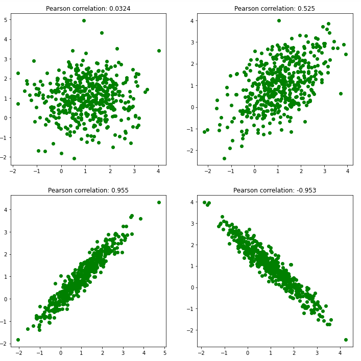

# 什么是机器学习中的重要特征？

[机器学习](https://www.baeldung.com/cs/category/ai/ml)

[决策树](https://www.baeldung.com/cs/tag/decision-trees) [概率与统计](https://www.baeldung.com/cs/tag/probability-and-statistics) [回归](https://www.baeldung.com/cs/tag/regression)

1. 简介

    机器学习（ML）是计算机科学和人工智能的一个分支，它允许计算机程序在没有明确编程的情况下进行学习。简而言之，机器学习包括一系列基于统计技术的算法，这些算法可以从数据中学习，从而做出一些决策或预测。

    输入数据通常由一组输入特征或变量组成。当 ML 模型输出预测结果时，它更依赖于某些特征而不是其他特征。因此，有些特征对模型更重要，有些则不那么重要。

    在本教程中，我们将举例说明什么是特征（变量）重要性，以及如何衡量它。

2. 什么是机器学习中的特征？

    用一句话来解释，特征或变量是从数据集中生成并用作机器学习模型输入的单个属性。总的来说，我们将特征表示为数据集中的数字列，但它们也可以是字符串。

    特征是 ML 建模中最重要的组成部分之一。基本上，模型预测直接取决于特征的质量。因此，ML 特别强调特征工程和特征选择。要想知道哪些特征对模型的贡献更大，并在此基础上选择或创建新特征，我们需要以某种方式衡量它们的重要性。

3. 什么是机器学习中的特征重要性？

    特征（变量）重要性表示每个特征对模型预测的贡献程度。基本上，它决定了特定变量对当前模型和预测的有用程度。例如，如果我们想根据身高、年龄和姓名来预测一个人的体重，那么很明显，身高变量的影响最大，而姓名变量甚至与这个人的体重无关。

    总的来说，我们用一个数值来表示特征的重要性，我们称之为分数，分数越高，特征就越重要。特征重要性得分有很多好处。例如，可以确定自变量（特征）和因变量（目标）之间的关系。 通过分析变量重要性得分，我们可以找出不相关的特征并将其排除在外。减少模型中无意义变量的数量可以加快模型的运行速度，甚至提高模型的性能。

    此外，特征重要性通常被用作 ML 模型可解释性的工具。从分数中，我们可以解释为什么 ML 模型会做出特定的预测，以及如何操作特征来改变预测结果。

    计算特征重要性的方法有很多，但一般来说，我们可以将其分为两类：

    - 与模型无关
    - 依赖模型

    在本文中，我们将只解释其中的一部分。

4. 与模型无关的特征重要性

    这组方法并不特别与某种特定的 ML 方法相关，但可以应用于解决某个问题的大多数 ML 模型。例如，如果我们要解决一个分类问题，我们可以将模型无关方法应用于逻辑回归、随机森林、支持向量机等所有 ML 算法。

    1. 相关性标准

        首先，衡量特征重要性的最简单方法是将特征与目标变量相关联。当目标变量具有连续值时，这种方法是可行的。基本上，[相关性](https://www.baeldung.com/cs/correlation-coefficient)是量化两个变量之间关系的一种统计测量方法。最常用的相关方法是皮尔逊相关和斯皮尔曼相关。Pearson 相关性衡量两个变量之间的线性依赖关系，而 Spearman 则衡量单调性，两者的取值范围都在 -1 和 1 之间：

        

        测量特征重要性的想法非常简单。我们只需测量每个特征与目标变量之间的相关性即可。此外，如果目标变量较多，我们还可以计算平均相关性作为重要性指标。之后，相关系数绝对值越高的特征就越重要。

    2. 单变量预测

        与使用相关系数作为特征重要性得分相比，我们可以简单地将单个特征作为模型的输入。然后，根据其预测结果，可以将单个特征的预测能力视为特征重要性。根据 ML 问题的不同，我们甚至可以定义多种测量方法，如不同的误差和基于准确度的测量方法，并将它们结合起来。

        但是，我们并不需要将单个变量的预测能力理解为变量重要性的基本事实。有时可能会出现这样的情况，即变量的单独预测能力较低，但与其他变量结合后，可能会显著提高模型的性能。

    3. 叠加特征重要性

        首先，排列特征重要性是一种非常简单且常用的技术。基本上，它的整体思路是观察当我们改变单个变量的值时，ML 模型的预测结果会发生怎样的变化。我们通过对单一算法进行排列组合来实现这一目的。算法如下：

        

5. 依赖模型的特征重要性

    与模型相关的特征重要性是特定 ML 模型所特有的。基本上，在大多数情况下，它们可以作为模型的一部分直接从模型中提取。尽管如此，我们也可以将它们作为单独的特征重要性方法来使用，而不一定要使用该 ML 模型进行预测。

    1. 线性回归特征重要性

        我们可以拟合一个[线性回归](https://www.baeldung.com/cs/regularization-parameter-linear-regression#linear-regression)模型，然后提取显示每个输入变量重要性的系数。假设输入特征具有相同的比例，或者在拟合模型之前已经进行了比例调整。需要相同的特征比例来比较这些系数的大小，并得出哪些特征更重要的结论。

        除了简单的线性回归，带有 L1 正则化参数的线性回归（称为[Lasso回归](https://www.baeldung.com/cs/regularization-parameter-linear-regression#linear-regression)）也很常用，尤其是在特征选择方面。Lasso 回归具有 $\lambda$ 正则化参数，可控制正则化程度，并使系数缩小。此外，Lasso 可以通过只选择其中一个变量来任意缩小相关变量。

    2. 决策树特征重要性

        [决策树](https://www.baeldung.com/cs/decision-trees-vs-random-forests#decision-trees)算法在减少用于选择分割点的标准的基础上提供特征重要性得分。通常，它们基于[基尼](https://www.baeldung.com/cs/impurity-entropy-gini-index#gini-impurity)或[熵](https://www.baeldung.com/cs/impurity-entropy-gini-index#entropy)不纯度测量。此外，同样的方法也可用于所有基于决策树的算法，如随机森林和梯度提升。

6. 结论

    在本文中，我们解释了 ML 中的术语特征。此外，我们还介绍了特征重要性以及一些类型的特征重要性方法。总之，特征重要性是一种常用的技术，因为它可以让我们了解有关 ML 模型的大量新信息，并据此决定建模的下一步。

[What Is Feature Importance in Machine Learning?](https://www.baeldung.com/cs/ml-feature-importance)
