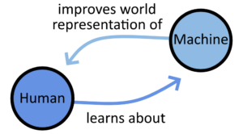
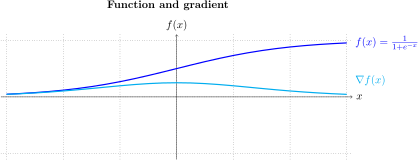

# 机器学习的基本概念

[Basic Concepts of Machine Learning](https://www.baeldung.com/cs/ml-fundamentals)

1. 简介

    在本教程中，我们将学习机器学习的基本概念，为研究这一迷人的知识分支做好准备。

    我们可以将本文视为一篇小型入门文章，它解释了当前机器学习的术语如何源自该学科先驱的早期研究。

    首先，我们将学习拉夫罗斯和图灵关于计算器的早期著作。然后，我们将重点讨论我们今天在该学科文献中常用的一些关键术语，一如他们当年所做的那样。

2. 背景： 机器会思考吗？

    1. 学习机器

        本节的标题是图灵的关键性论文《[计算机械与智能](https://academic.oup.com/mind/article-pdf/LIX/236/433/9866119/433.pdf)》中提出的问题。这个问题以及试图回答这个问题的尝试，是我们建立整个机器学习学科的基础。

        今天，我们在机器学习中使用的概念系统和术语都源自图灵对如何回答这个特别深奥的问题的初步研究。

        与我们的目的特别相关的是这篇论文的第 7 节，它也是这篇论文的结尾：这一节被恰当地命名为 "学习机器"。这一节涵盖了计算机获取知识的主题。其中，图灵对阿达-拉芙蕾丝（Ada Lovelace）的观点做出了回应，她认为计算机只能执行程序规定的操作。

        几年前，拉芙蕾丝女士在研究巴贝奇的分析引擎时提出了反对意见，认为机器的计算能力仅限于程序员最初给它的指令。她认为，从某种意义上说，机器所能拥有的所有想法都是由人类注入其中的。因此，在她看来，这些想法并不构成适当意义上的思维。

        拉芙蕾丝是那个时代的著名数学家，被认为开发了第一套计算机算法。不过，她对计算的理论理解并不允许机器自主学习。所有可以嵌入计算机的知识和学习，最终都受限于计算机程序员之前掌握的知识和学习。

        如果她是对的，我们今天就不会有机器学习这门学科了。显然，拉芙蕾丝的思路出现了一些错误。

    2. 学习人类

        图灵则认为，程序员在学习过程中所起的作用，充其量只能与遗传和儿童大脑的初始结构对其成年后的进一步发展所起的作用相提并论。图灵认为，成人的心智并不是由儿童时期的大脑结构决定的，就像计算机的学习能力受到其初始程序的限制一样。

        虽然系统的初始配置肯定会对系统的学习产生影响，但这并不是全部。人类的学习过程还受到另外两个因素的影响。第一是儿童所接受的正规教育；第二是儿童所经历的非正规经验。

        当我们从人类学习领域转向机器学习领域时，比较仍然存在。图灵认为，虽然给定程序的初始配置很重要，但学习的发生是另外两个组成部分的结果。儿童在计算机领域接受的正规教育可能相当于模型的正规训练。而非正式的经验则相当于实验者在选择某个模型时所做出的判断。

        2.3. 关于学习的学习

        本表总结了图灵论文中人类和机器学习中常见的概念类别：

        | 人类学习  | 机器学习   |
        |-------|--------|
        | 遗传学   | 系统初始配置 |
        | 正规教育  | 模型训练   |
        | 非正式经历 | 实验员评估  |

        这是机器学习学科理论基础的核心，也是机器学习所处理的最深层次问题的本质：

        

        机器学习领域的每一次发展，都会推动人类知识的进步，从而促进人类的学习。但顾名思义，机器学习领域的任何发展都必须使机器学得更好或更快：这反过来又使机器学习研究构成了一个非线性过程。

        在同一过程中，人类学习机器，机器学习人类感知和理解的世界。

3. 机器学习的基本概念

    在上一节中，我们了解了为什么将机器学习视为人类知识的一个分支是有意义的。事实上，机器学习是涵盖机器学习方式的一个知识分支；因此，在我们学习机器学习的过程中，也是人类学习机器学习过程的过程。由于机器学习过程通常是由人类发起的，因此我们也可以说，随着人类对机器学习了解得越来越多，机器本身也会学习得越来越多。

    机器学习的基本概念学习机器学习需要了解与该学科相关的基本词汇。由于该学科属于计算机科学、统计学和认知科学的交叉学科，因此我们从所有这些科学分支中汲取了机器学习的特定学科词汇。

    以下是我们需要熟悉的一些最重要的概念。

    1. 机器

        这是构成该学科名称的第一个词，因此也是最重要的一个词。从广义上讲，机器是一种将某种输入转化为某种结果或行为的机制，是机械学的研究对象。不过，在计算机科学中，机器一词几乎总是指计算机或通用图灵机。

        通用图灵机是一种能够进行计算的抽象机器。如果我们接受可用内存远远大于程序[空间复杂度](https://www.baeldung.com/cs/space-complexity)的观点，那么现代个人电脑当然就是通用图灵机的实例。

    2. 学习

        本学科名称中的第二个词源于人类学习过程与逐步建立越来越精确的统计模型的程序之间的最初类比。套用[米切尔的定义](https://books.google.com/books?id=EoYBngEACAAJ)，学习是指程序在执行一项任务时，通过一组特定的训练经验，取得越来越好的性能的过程。

        在学习过程中，模型的预测值与某些真实标签或值之间的误差会随着时间的推移逐渐减小。这也导致了这样一种观点，即学习或预测误差与时间之间存在一种关系，即[学习是时间的函数](https://www.baeldung.com/cs/learning-curve-ml)。

        由于机器学习模型的学习经常被分为相同的一系列连续步骤，因此 "学习" 也经常被用作模型的[训练、测试和验证](https://www.baeldung.com/cs/ml-train-validate-test)的同义词。

    3. 模型

        在机器学习和统计学中，模型是一种使用数学符号和假设来描述系统的方法。

        机器学习中常用的模型类别包括：

        - 回归模型，如[线性回归和逻辑回归](/core-concepts/math-logic/linear-vs-logistic-regression-zh.md)
        - [支持向量机](https://www.baeldung.com/cs/ml-support-vector-machines)
        - [神经网络](https://www.baeldung.com/cs/neural-net-advantages-disadvantages)

        具体模型的选择取决于正在执行的具体任务。因此，不仅要学习机器学习中使用的理论和[算法](https://www.baeldung.com/cs/heuristic-vs-algorithm#what-is-an-algorithm)，还要学习与解决任何特定任务相关的[启发式](https://www.baeldung.com/cs/heuristics)方法。

    4. 数据集

        数据集是与社会或物理世界的某些特征相关的观察结果列表，一般由[特征和标签](https://www.baeldung.com/cs/feature-vs-label)组成。用于[监督](https://www.baeldung.com/cs/sentiment-analysis-training-data#datasets-for-supervised-learning)和[非监督学习](https://www.baeldung.com/cs/machine-learning-intro#unsupervised)的数据集种类繁多，为特定任务选择数据集取决于我们正在研究的问题。一个有用的参考资料是加州大学欧文分校（University of California Irvine）策划的[数据集列表](https://archive.ics.uci.edu/datasets)，其中包含学生最常用的数据集。

        在使用数据集训练机器学习模型之前，通常会对数据集进行各种预处理步骤，如[归一化](https://www.baeldung.com/cs/data-normalization-before-after-splitting-set)和[拆分](https://www.baeldung.com/cs/train-test-datasets-ratio)。如果给定的数据集过大，无法进行整体处理（现实世界中的大多数数据集都是如此），我们可以将它们[分批送入](https://www.baeldung.com/cs/mini-batch-vs-single-batch-training-data)正在训练的模型。

    5. 预测和误差或成本函数

        机器学习模型与统计模型之间存在着一种特殊的区别。这种区别涉及前者进行预测的必要性，而后者则不一定需要。

        机器学习模型只要能做出准确的预测，就是有用的。因此，我们通常要求机器学习模型在我们采用的[准确度指标](https://www.baeldung.com/cs/top-n-accuracy-metrics)上得分很高。

        在监督学习中，预测可以在训练过程中计算出来。在这种情况下，我们通常希望计算预测值与某种真实值或标签之间的误差。这样，我们就可以利用预测值与真实值之间的差值来确定[成本](https://www.baeldung.com/cs/cost-function-logistic-regression-logarithmic-expr)，然后通过[梯度下降](https://www.baeldung.com/cs/gradient-descent-vs-newtons-gradient-descent)等技术来训练模型参数。

    6. 梯度

        简单直观地说，函数的梯度表示在一个有多个变量的函数中，根据每个变量计算出的斜率的方向和陡度。对于单变量函数，梯度相当于总导数：

        

        更广义地说，梯度是与标量多元函数相关联的向量场，该函数至少在其部分域中是可微分的。我们可以用 f 表示 $\mathbb{R}^n \to \mathbb{R}$ 这个在变量 $\{x_1, x_2, ..., x_n\}$ 上的函数。然后，我们可以把梯度 $\nabla f$ 表示为一个列向量，其中包含偏导数列表 $\frac{\partial f}{\partial x_k}$，对于 k 在 $\{1...n\}$ 中：

        \[\nabla f = \begin{bmatrix} \frac{\partial f}{\partial x_1} \\ \frac{\partial f}{\partial x_2} \\ \vdots \\ \frac{\partial f}{\partial x_n} \end{bmatrix}\]

        让我们举一个简单的例子来更好地理解梯度作为矢量场的概念以及如何计算它。一个简单的二元三角函数 f(x,y) 是两个自变量的两个正弦波之和：

        \[f(x, y) = \sin(x) + \sin(y)\]

        这个函数有一个梯度，我们可以把它计算为包含两个偏导数的列向量：$\frac{\partial f}{\partial x}, \frac{\partial f}{\partial y}$：

        \[\nabla f = \begin{bmatrix} \cos(x) \\ \cos(y) \end{bmatrix}\]

        在这种情况下，点 $p = (\pi, \pi)$ 处的梯度值为：

        \[\nabla f(\pi, \pi) = \begin{bmatrix} -1 \\ -1 \end{bmatrix}\]

        梯度在某种意义上概括了导数的概念。因此，我们可以用它来确定相关函数中最接近静止点的方向。这对于某些函数的最小化或最大化非常有用，例如将机器学习模型的参数和预测值联系起来的成本函数。

        我们关于[梯度下降和梯度上升](https://www.baeldung.com/cs/gradient-descent-vs-ascent)的文章是了解这一过程的很好参考。

4. 结论

    在本文中，我们学习了机器学习的基本概念。我们还学习了与其基本词汇相关的术语。
