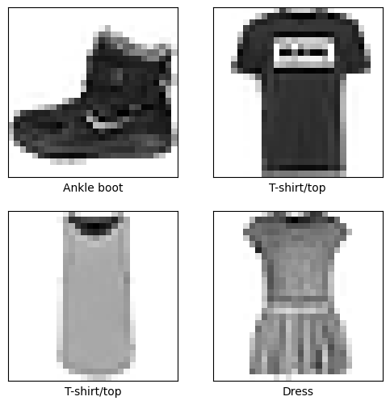
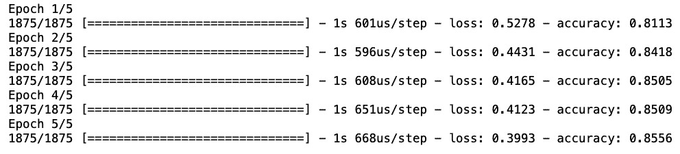
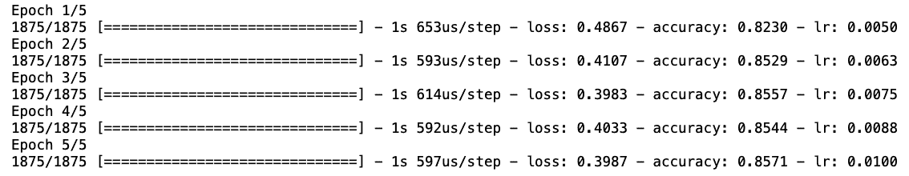
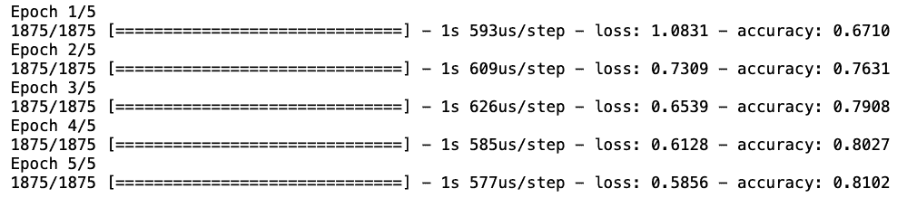
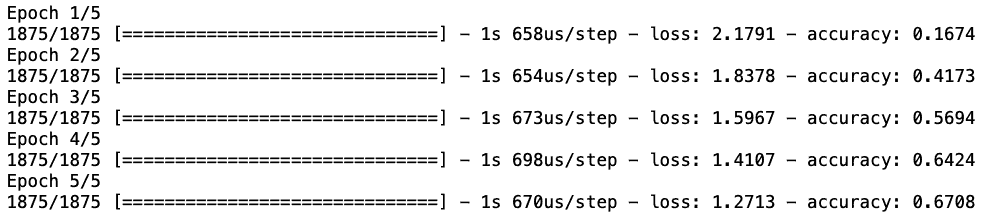

# 热身学习率意味着什么？

[机器学习](https://www.baeldung.com/cs/category/ai/ml)

[Python](https://www.baeldung.com/cs/tag/python) [培训](https://www.baeldung.com/cs/tag/training)

1. 简介

    在训练神经网络时，选择学习率（[LR](https://www.baeldung.com/cs/ml-learning-rate)）是至关重要的一步。这个值定义了梯度的每次传递如何改变每一层的权重。在本教程中，我们将展示定义 LR 的不同策略如何影响模型的准确性。我们将考虑热身场景，其中只包括几次初始迭代。

    有关更多理论方面的内容，请参阅我们的另一篇[文章](https://www.baeldung.com/cs/learning-rate-warm-up)。在此，我们将重点关注不同方法的实施方面和性能比较。

2. 设置模型和数据

    为了简单起见，我们使用众所周知的[时尚MNIST数据集](https://www.tensorflow.org/datasets/catalog/fashion_mnist)。让我们先加载所需的库和这个带有标签的[计算机视觉数据集](https://www.baeldung.com/cs/computer-vision-popular-datasets)：

    ```python
    import tensorflow as tf
    import numpy as np
    import matplotlib.pyplot as plt
    import keras
    fashion_mnist = tf.keras.datasets.fashion_mnist
    (train_images, train_labels), (test_images, test_labels) = fashion_mnist.load_data()
    ```

    让我们来看看我们的数据是什么样子的，以检查我们是否正确加载了所有内容。

    ```python
    class_names = ['T-shirt/top', 'Trouser', 'Pullover', 'Dress', 'Coat', 'Sandal', 'Shirt', 'Sneaker', 'Bag', 'Ankle boot']

    # Normalize the data

    train_images = train_images / 255.0
    test_images = test_images / 255.0

    # Plot 4 samples of the dataset

    plt.figure(figsize=(6,6))

    for i in range(4):
        plt.subplot(2,2,i+1)
        plt.xticks([])
        plt.yticks([])
        plt.grid(False)
        plt.imshow(train_images[i], cmap=plt.cm.binary)
        plt.xlabel(class_names[train_labels[i]])
        
    plt.show()
    ```

    我们可以看到一些样本

    

    我们将使用同样[简单的神经网络架构](https://www.baeldung.com/cs/neural-networks-dense-sparse)，以保持比较的公平性。

    ```python
    model = tf.keras.Sequential([
        tf.keras.layers.Flatten(input_shape=(28, 28)),
        tf.keras.layers.Dense(128, activation='relu'),
        tf.keras.layers.Dense(10)
    ])
    ```

    一切准备就绪后，我们来测试不同的 LR 策略。

3. LR 策略

    如前所述，我们将评估三种[策略来定义LR](https://www.baeldung.com/cs/learning-rate-batch-size)。第一种情况是在预热期间使用恒定值。然后，我们提出一种随时间线性增长的 LR。最后，我们将提出一种名为 Adagrad 的更稳健的策略。

    1. 恒定 LR

        鉴于问题的性质，我们为模型选择了一个分类损失函数。然后，为了使用等于 0.01 的常量 LR，我们在选择优化器时直接定义了该值：

        ```python
        optimizer = keras.optimizers.Adam(learning_rate=0.01)
        model.compile(optimizer=optimizer,
                    loss=tf.keras.losses.SparseCategoricalCrossentropy(from_logits=True), metrics=['accuracy'])
        ```

        最后，我们可以拟合模型并检查结果：

        `history = model.fit(train_images, train_labels, epochs=5, verbose=1)`

        

        仅经过 5 次迭代，我们就获得了 0.8556 的准确率和一个递减的损失函数。我们应该记住，我们的主要目标是研究如何实施不同的 LR 策略。我们将在不否定任何一种方法的前提下讨论不同方法的性能。

    2. 线性增加

        我们使用导言中提到的线性热身理论文章中定义的公式。我们从等于 0.005 的 LR 开始，分 5 步逐渐增加到 0.01。为了将此策略传递给我们的模型，我们使用了 Keras 的回调 API：

        ```python
        def scheduler(epoch, lr):
            
            initial_lr = 0.005
            final_lr = 0.01
            nsteps = 5
            delta = (final_lr - initial_lr)/(nsteps - 1)
            
            lr = initial_lr + (epoch * delta)
            return (lr)

        callback = keras.callbacks.LearningRateScheduler(scheduler)
        ```

        然后，我们拟合模型并传递回调对象：

        `history = model.fit(train_images, train_labels, epochs=5,  callbacks=[callback], verbose=1)`

        

        因此，我们可以看到 LR 在线性增加策略中的变化情况。最终，我们的准确率（0.8571）和 LR（0.01）都令人满意。现在，我们可以以相同的 LR 值开始训练，以避免突然的变化。

    3. 其他策略

        除了恒定法和线性递增法，我们还可以使用更复杂的策略，如 Adagrad 或 Adadelta。它们都有自己定义学习率的方法，我们只需调整参数即可。

        让我们从 Adagrad 开始，它是一种优化算法，可根据训练过程中的更新频率为各个参数定制学习率。该算法内置在 TensorFlow 中，我们只需向优化器传递一个参数即可。由于 TensorFlow 的限制，我们不会明确显示每次迭代后的学习率：

        ```python
        optimizer = tf.keras.optimizers.Adagrad(
            learning_rate=0.001,
            initial_accumulator_value=0.1,
            epsilon=1e-07,
            name='Adagrad' 
        )

        model.compile(optimizer=optimizer,
                    loss=tf.keras.losses.SparseCategoricalCrossentropy(from_logits=True), 
                    metrics=['accuracy'])

        history = model.fit(train_images, train_labels, epochs=5,   verbose=1)
        ```

        

        简而言之，我们可以看到初始准确率较低，但很快就得到了修正。这是因为 Adagrad 依靠迭代来学习哪些参数更新得更频繁。

        我们还可以在训练过程中调整每个维度的学习率。这就是 Adadelta 背后的理念。通过这种方式，我们可以避免累积之前迭代的每个梯度的问题。要实现这一点，我们只需更改优化器：

        ```python
        optimizer = keras.optimizers.Adadelta(
            learning_rate=0.001、
            rho=0.95、
            epsilon=1e-07
        )
        ```

        

        我们又一次从很低的准确率开始训练，在第二个 epoch 之后，准确率明显提高。

4. 结论

    在本文中，我们讨论了实施不同的 LR 策略为训练阶段预热的问题。这是训练模型时的一个重要步骤，尤其是当我们的目标是找到局部最优时。我们的代码和示例使优化人员只需稍作调整就能做出选择，可作为未来测试的烹饪手册。
