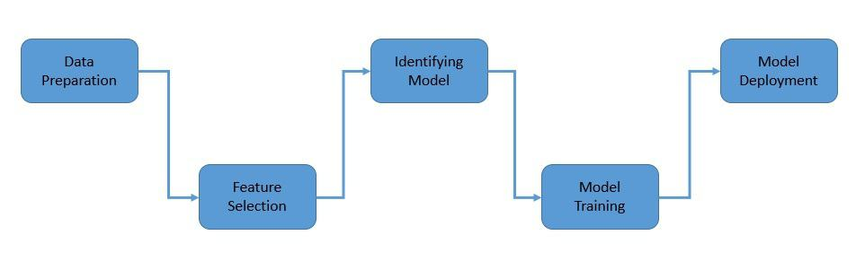

# 统计在机器学习中的重要性

[机器学习](README-zh.md)

[概率与统计](https://www.baeldung.com/cs/tag/probability-and-statistics)

1. 简介

    在本教程中，我们将了解统计学这门学科，以及它如何成为数据科学的重要工具。我们将首先探讨统计学的一般概念和分类，然后介绍一些机器学习中常用的统计工具。

    统计学是开发和研究收集、分析、解释和展示数据的方法。更具体地说，统计学关注的是在不确定的情况下使用数据进行决策。

2. 统计学的基本概念

    在了解统计学如何在机器学习中发挥重要作用之前，我们必须先了解一些统计学的基本概念。这些概念是任何统计分析的基础，我们经常会听到这些概念。

    1. 种群和样本

        统计学的应用始于[统计人口](https://en.wikipedia.org/wiki/Statistical_population)，它代表了对某些问题或实验感兴趣的一组类似项目或事件。例如，"生活在一个国家的所有人" 或 "构成晶体的每个原子"：

        

        如果人口众多，统计学家通常会选择人口中的一个子集，称为[统计样本](https://www.omniconvert.com/what-is/sample-size/)。例如，"一个国家的一千名居民"。当然，我们必须注意选择无偏见的样本，以准确模拟总体。

    2. 概率分布

        概率[分布](https://en.wikipedia.org/wiki/Probability_distribution)是统计学中的一个重要概念，因为它可以帮助我们描述现实生活中变量的种群，比如一个城市中每个人的年龄。它是一个数学函数，给出了实验中不同可能结果发生的概率：

        

        所考虑的变量可以是离散的，也可以是连续的。因此，概率分布可以用概率质量函数或概率密度函数来描述。一些常用的概率分布包括标准分布和二项分布。

    3. 中心极限定理

        中心极限定理（Central Limit Theorem，[CLT](https://corporatefinanceinstitute.com/resources/data-science/central-limit-theorem)）指出，对于独立且同分布的随机变量，即使原始变量本身不是正态分布，标准化均值的抽样分布也会趋向于标准正态分布：

        

        随着时间的推移，CLT 已有多种变体。不过，它仍然是数据统计分析中的一个基本概念。这是因为它有助于根据样本估计总体的特征。

3. 统计分析方法

    我们可以使用两种主要方法对从总体中抽取的样本数据进行统计分析--描述性统计和推断性统计。描述性统计旨在总结样本，而推论性统计则利用样本来了解总体。

    1. 描述性统计

        [描述性统计](https://en.wikipedia.org/wiki/Descriptive_statistics)是使用和分析总结性统计的过程，它定量描述或总结了样本的特征。描述性分析以定量测量或可视化图表的形式对样本进行简单总结。

        我们常用来描述数据集的一些指标包括中心倾向指标、变异性或离散性指标以及概率分布形状指标。然后，几种统计图形技术会进一步帮助直观地描述数据集。

        描述性统计技术在进行经验性和分析性数据分析时非常有用。事实上，探索性数据分析（EDA）是一种分析数据集的方法，它集合了各种不同的总结技术。

    2. 推断统计

        [推断统计](https://en.wikipedia.org/wiki/Statistical_inference)是使用数据分析来推断群体属性的过程。在此，我们假设观察到的数据集是从一个更大的群体中抽样得到的。推断统计以概率论为基础，涉及对随机现象的分析。

        统计推断需要一些假设。因此，统计模型是一组关于生成观测数据的信念。 在统计学上，统计学家使用许多层次的模型假设，例如，完全参数、非参数和半参数。

        统计推论的结论就是统计命题。统计命题有多种形式，如点估计值、区间估计值或置信水平、可信区间、拒绝假设、数据点的聚类或分组。

4. 描述性统计工具

    正如我们前面所看到的，描述性统计有助于我们理解数据，因此在机器学习过程中发挥着重要作用。我们将介绍一些常用的描述性统计工具，它们可以帮助我们确保数据符合机器学习的要求。

    1. 中心倾向的测量

        在统计学中，中心倾向是指概率分布的中心值。它也可以表示定量数据聚集在某个中心值周围的趋势。最广泛使用的三种中心倾向测量方法是平均值、中位数和模式：

        

        数据集中所有测量值的总和除以观测值的个数，即为平均值。将数据集的上半部分和下半部分分开的中间值称为中位数。此外，数据集中出现频率最高的值称为模式。

    2. 统计离散度

        在统计学中，离散度是指概率分布被拉伸或挤压的程度。数据集的离散度通常表明数据的中心倾向是强还是弱。常用的离散度量是[方差](https://en.wikipedia.org/wiki/Variance)、[标准差](https://en.wikipedia.org/wiki/Standard_deviation)和[四分位距](https://makemeanalyst.com/explore-your-data-range-interquartile-range-and-box-plot)：

        

        方差是随机变量偏离均值的平方差。此外，方差通常被定义为标准差的平方。四分位数间距是数据的第 75 个百分位数和第 25 个百分位数之间的差值。

    3. 概率分布的形状

        概率分布的形状对于确定合适的分布来模拟群体的统计特性至关重要。这通常是描述性的。例如，正态分布被称为 "钟形曲线"：

        

        然后还有偏度和峰度等定量指标来描述其形状。偏度是随机变量的概率分布对其均值的不对称程度的度量。峰度是随机变量概率分布 "尾度" 的度量。

5. 推断统计工具

    推断统计是根据从总体中抽取的样本对总体进行推断。推理统计中的工具对开发机器学习模型有很大帮助。其中包括特征选择和模型比较等重要步骤。

    1. 假设检验

        统计假设检验决定数据是否充分支持特定假设。它允许我们对群体参数做出概率声明。统计假设可以是这样的陈述："办公室咖啡机分配的咖啡量超过100毫升"：

        

        首先，我们将假设重新表述为零假设 ($H_{0}$) 和备择假设 ($H_{1}$)。然后，我们收集样本数据并进行统计检验，如 z 检验。统计检验为我们提供了 p 值，它有助于确定是否应该拒绝零假设。

    2. 回归分析

        回归分析是一套用于估计因变量与一个或多个自变量之间关系的统计过程。例如，线性回归试图根据特定标准（如普通最小二乘法）找到最符合数据的直线：

        

        然后是非线性回归，即用模型参数和一个或多个自变量的非线性组合函数来模拟观测数据。回归分析广泛用于预测和预报，以及推断变量之间的因果关系。

    3. 方差分析（ANOVA）

        方差分析（[ANOVA](https://researchmethod.net/anova)）是一组用于分析均值间差异的统计模型。它以总方差定律为基础，将特定变量的观测方差划分为可归因于不同变异源的成分：

        

        方差分析对两个或多个群体均值是否相等进行统计检验。它有利于描述变量之间的复杂关系。这种方法常用于分析实验数据，与相关性相比具有一些优势。

6. 推断统计的范式

    随着时间的推移，人们建立了不同的统计推断范式。一些统计方法属于某一范式，而另一些方法则在不同范式下有不同的解释。最流行的范式包括频繁主义范式和贝叶斯范式。

    1. 频数推理

        [频繁主义](https://en.wikipedia.org/wiki/Frequentist_inference)推理基于频繁主义概率论，它将概率等同于频率。它是对概率的研究，假设结果在一段时间内或重复抽样中以一定频率出现。

        频繁主义通过强调数据中的发现频率来总结样本数据。频繁主义统计学提供了完善的统计推断方法，如统计假设检验和置信区间。

        频繁主义推断有两个互补的概念，即费雪还原和奈曼-皮尔森操作标准。罗纳德-费雪（[Ronald Fisher](https://en.wikipedia.org/wiki/Ronald_Fisher)）、耶日-奈曼（[Jerzy Neyman](https://en.wikipedia.org/wiki/Jerzy_Neyman)）和埃贡-皮尔逊（[Egon Pearson](https://en.wikipedia.org/wiki/Egon_Pearson)）是频繁主义的主要贡献者。

    2. 贝叶斯推理

        [贝叶斯推理](https://en.wikipedia.org/wiki/Bayesian_inference)以贝叶斯定理为基础，随着证据的增多，贝叶斯定理被用来更新假设的概率。[贝叶斯定理](https://en.wikipedia.org/wiki/Bayes%27_theorem)描述了基于可能与事件相关的条件的先验知识的事件概率：

        \[P(H|E) = \frac{P(E|H).P(H)}{P(E)}\]

        - $P(H|E)$ 是在 E 为真的条件下，事件 H 发生的条件概率
        - $P(E|H)$ 是在 H 为真的条件下，事件 E 发生的条件概率
        - P(H)和P(E)分别是在没有任何给定条件下观察到H和E的概率

        这里，H 代表任何假设，P(H) 是假设的先验概率，E 是新证据，P(E|H) 是可能性，P(E) 是边际可能性，P(H|E) 是后验概率。我们感兴趣的是计算后验概率。

        因此，贝叶斯推理使用可用的后验信念来提出统计命题。贝叶斯推断的常用例子包括用于[区间估计的可信区间](https://en.wikipedia.org/wiki/Credible_interval)和用于[模型比较的贝叶斯系数](https://en.wikipedia.org/wiki/Bayes_factor)。

7. 机器学习中的统计学

    机器学习是人工智能的一个分支，主要是利用数据和算法来模仿人类的学习方式，逐步提高学习效率。它包括多个阶段，而统计工具在机器学习的各个阶段都发挥着关键作用：

    

    1. 数据准备

        与计算机科学的许多其他方面一样，机器学习深受 "垃圾进，垃圾出"（[GIGO](https://en.wikipedia.org/wiki/Garbage_in,_garbage_out)）概念的影响。它规定，无论处理数据的算法质量如何，有缺陷的输入数据都会产生无意义的输出。

        例如，在不完整或有偏见的数据上训练出来的机器学习模型很可能会产生错误或有偏见的预测。我们收集用于训练模型的数据必须具有相关性、代表性、无偏见且无异常。

        这一过程首先要了解可用数据。描述性统计工具在数据探索中起着至关重要的作用。此外，[估算](https://en.wikipedia.org/wiki/Imputation_(statistics))和[离群点检测](https://en.wikipedia.org/wiki/Anomaly_detection)等统计工具有助于识别和消除数据丢失、错误和损坏。

    2. 特征选择

        机器学习中的特征是一种现象的单独可测量属性或特征。例如，某个地点的相对湿度。选择信息丰富、具有区分性和独立性的特征是成功应用机器学习算法的另一个关键步骤。

        特征工程是将原始数据转化为适合机器学习模型的特征的过程。它包括两个过程：特征选择和特征提取。它采用多种统计工具来选择、提取和转换最相关的特征。

        工具的选择取决于输入和输出数据的性质，可以是数值数据，也可以是分类数据。可用的统计工具包括[皮尔逊相关系数](https://en.wikipedia.org/wiki/Pearson_correlation_coefficient)、[斯皮尔曼秩系数](https://en.wikipedia.org/wiki/Spearman's_rank_correlation_coefficient)、方差分析相关系数、[肯德尔秩系数](https://en.wikipedia.org/wiki/Kendall_rank_correlation_coefficient)和卡方检验。

    3. 确定机器学习模型

        统计模型用于发现和解释变量之间的关系，而机器学习模型的建立则是为了在没有明确编程的情况下提供准确的预测。尽管统计模型被广泛用于建立合适的机器学习模型。

        机器学习模型从统计学中衍生出很多方法。例如，线性回归模型利用了[最小二乘法](https://en.wikipedia.org/wiki/Least_squares)的统计方法。即使是复杂的机器学习模型，如神经网络，也使用了基于统计理论的[梯度下降](https://en.wikipedia.org/wiki/Gradient_descent)等优化技术。

        目前有多种机器学习模型可供选择，针对我们要解决的问题选择合适的模型至关重要。同样，通过假设检验和估计统计等工具，[统计学](https://en.wikipedia.org/wiki/Estimation_statistics)在模型选择中发挥着重要作用。

    4. 模型训练

        机器学习模型需要足够的训练数据来学习。这是一个称为模型拟合的迭代过程。在此，模型通过将处理后的输出与样本输出进行关联，从而提高预测效率。

        目标是确定一组最佳的模型参数和超参数。模型参数是在训练过程中学习的，而超参数则是通过调整获得最佳性能的模型。

        许多统计技术对于验证和完善机器学习模型至关重要。例如，假设检验、[交叉验证](https://en.wikipedia.org/wiki/Cross-validation_(statistics))和[引导](https://en.wikipedia.org/wiki/Bootstrapping_(statistics))等技术有助于量化模型的性能，避免[过度拟合](https://en.wikipedia.org/wiki/Overfitting)等问题。

    5. 模型部署

        机器学习模型需要根据其预测质量进行评估。有几种统计技术可以帮助我们对其进行量化。例如，[准确率](https://en.wikipedia.org/wiki/Accuracy_and_precision)、[精确度和召回率](https://en.wikipedia.org/wiki/Precision_and_recall)、[F1 分数](https://en.wikipedia.org/wiki/F-score)、[混淆矩阵](https://en.wikipedia.org/wiki/Confusion_matrix)和 AUC-ROC 曲线等等。

        一旦我们获得了可接受的高质量模型，我们就需要用它来预测未见数据。然而，与其他任何预测一样，它不可能完全准确。因此，我们必须使用预测和[置信区间](https://en.wikipedia.org/wiki/Confidence_interval)来量化准确性。

        最后，当机器学习模型在输入数据上经过训练并部署到新数据上进行预测时，它需要不断发展。与之前一样，统计在反馈预测准确性以相应更新模型参数方面发挥着至关重要的作用。

8. 总结

    在本教程中，我们介绍了统计学的基本概念。其中包括预测和推断统计的大类，以及这些大类中可供我们在机器学习中使用的一些流行统计工具。

    最后，我们介绍了机器学习的不同步骤，并了解了统计在每个步骤中的重要作用。值得注意的是，统计构成了机器学习过程的基础。
