# 支持向量机（SVM）

[机器学习](https://www.baeldung.com/cs/category/ai/ml)

参考 [SVM](https://www.baeldung.com/cs/tag/svm)

1. 概述

    在本教程中，我们将学习支持向量机的理论和数学基础。

    首先，我们将讨论线性分类的最优决策边界问题。然后，我们将研究支持向量机如何保证找到这些边界。

    讨论完线性支持向量机后，我们还将讨论非线性决策边界的识别问题。在此过程中，我们将列举非线性支持向量机最常用的内核。

    本教程结束时，我们将熟悉支持向量机的理论基础。我们将知道如何在数据集上计算支持向量机，以及在必要时应用哪些内核。

2. 判定边界的识别问题

    1. 作为分离的复杂性

        正如导言中所预料的那样，我们将通过研究机器学习中的决策边界识别问题来开始关于支持向量机（以下简称 SVM）的讨论。这样，我们将在机器学习模型的介绍性文章中概述任何给定模型所包含的[先验知识类型](https://www.baeldung.com/cs/ml-labeled-vs-unlabeled-data#on-data-information-and-knowledge)。

        机器学习的典型任务之一是[监督学习模型](https://www.baeldung.com/cs/machine-learning-intro#supervised)的[分类](https://www.baeldung.com/cs/naive-bayes-classification)任务。执行这些任务的算法有很多，每种算法都有自己的细微差别。在我们网站上的其他教程中，我们已经学习了[分类的逻辑回归](https://www.baeldung.com/java-logistic-regression)、[神经网络中的软最大值](https://www.baeldung.com/cs/ml-nonlinear-activation-functions#3-softmax)和[天真贝叶斯分类器](https://www.baeldung.com/cs/naive-bayes-classification)，如果需要，我们可以参考这些教程进行复习。

        机器学习分类背后的理念是，可以将世界或向量空间划分为具有不同可识别特征的区域。在此过程中，我们假定世界具有复杂性，与该世界的不同子集相对应，且互不重叠。因此，世界可以划分为不同的区域，由不同类别的事物组成，每个区域都有自己的元素：

        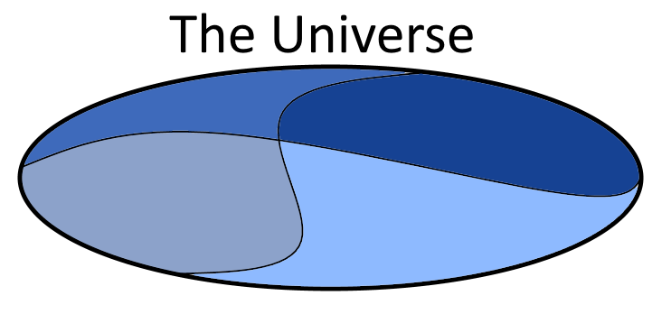

        这一点对于 SVM 尤为重要，原因我们稍后会讲到。

    2. 以地域为地图

        然后，我们可以问自己，如何才能从类别的角度来描述这个世界，并找到一个全面的、不遗漏任何区域的形式化描述。换句话说，我们可以问自己，如何绘制一张地图，让我们能够识别该世界中任何点或观测点的类别隶属关系。当然，我们感兴趣的是能适用于所有点或尽可能多点的最简单的摘要。

        一种方法是创建一个无限集、列表或字典，其中包含该世界中的所有现有点及其相关分类。具体做法是逐点对整个世界进行采样，然后将我们在每个位置观察到的类别或分类组成一个描述：

        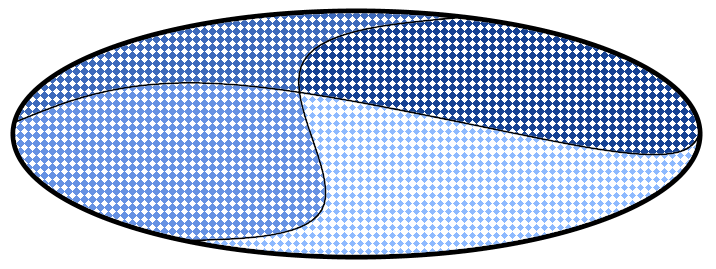

        如果我们这样做了，我们就能绘制出一张由我们在每个点上观察到的类别列表组成的地图。例如，如果我们用从 1 到 4 的数字来表示类别，我们就可以定义一个无限集，看起来就像这样：

        \[\text{MAP}: \{(x_1 \mapsto 1); (x_2 \mapsto 3); (x_3 \mapsto 4) ; (x_4 \mapsto 2); ... \}\]

        如果我们想象以任意分辨率对世界进行采样，我们就会创建一张地图，其中包含世界上的所有点，或者我们想要的任意多的点，以及与它们相关的类。

        这种方法完全合理，但在实践中不太可能实现。第一个原因是，这种方法需要对任意高分辨率的[特征空间进行采样](https://en.wikipedia.org/wiki/Multidimensional_sampling)。第二个原因是，地图所需要的信息与它所描述的整个世界一样多，因此使用地图而不是它所指向的世界是多余的。

    3. 通过识别分离理解复杂性

        然而，我们可以根据我们的世界所划分的区域并不重叠这一先验知识，采用另一种方法：

        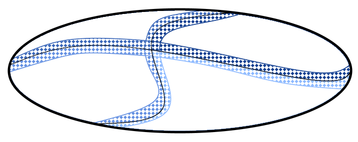

        这种方法建议使用每个区域的子集来定义同一区域。事实上，我们可以明确地只确定每个区域 R 的一个子区域 S，这样该子区域加上它的补集就对应于该区域： $S + (R \ S) = R$。

        然后，我们可以像之前那样，只明确列出子区域 S 中包含的点，并将任何补集子集 R （或 S）中的所有其他点视为与最接近的子区域 S 中的任何元素属于同一类别。这意味着我们只对每个区域的一小部分进行采样，特别是那些与其他区域的类似子集相邻的子集。

        这种总结方法没有前一种方法复杂。这是因为我们只明确枚举了部分点及其各自的类别，而不是整个区域。其余的类别隶属关系我们根据程序推断，因此所需的明确信息较少。

    4. 最接近但不同的观察结果

        然而，我们可以更好地总结这个世界的复杂性。我们只需考虑到，我们其实并不需要整个子区域来划分类别之间的边界，而只需要几个点。具体来说，就是最接近区域之间边界的点，或者说，我们任意决定的最接近的点：

        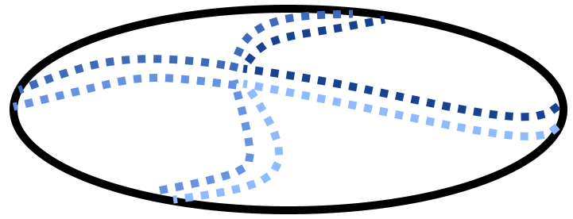

        现在，这些点之间的距离取决于我们采样的分辨率。分辨率越高，点与点之间的距离就越近，区域内的边界也越近，反之亦然。但无论分辨率如何，只要我们在每个区域内至少有一个点，我们就可以想象边界位于属于不同类别的最近点之间的某处：

        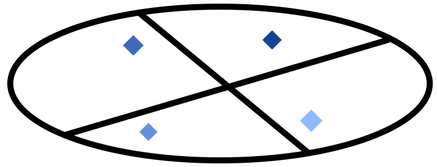

        根据采样的分辨率，我们所确定的边界相对于世界真实复杂性的准确性可能会有很大的变化。但无论如何，我们都可以确定一个边界，它至少对空间的某些部分是正确的。

    5. 学习更精确的表征

        识别边界的过程也可以从动态或在线的角度来解释。我们可以设想，一旦我们识别出潜在的边界（如上面的例子），我们就会收到新的观察结果，从而推翻我们的预测。在这种情况下，我们只需移动已确定的边界，以适应新的观测结果：

        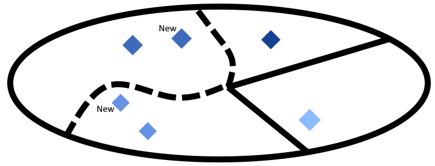

        支持向量机就是以这种方式工作的。支持向量机首先识别出不属于同一类别的最接近的观测数据，然后提出一个决策边界，将所有属于同一类别的观测数据集中在一个区域内。只不过，它们也会选择一个可能的决策边界，使其与最近的已知观测值的距离最大化，这一点我们很快就会看到。

3. SVM 的数学公式

    1. 线性可分问题的线性 SVM

        现在，我们可以对上述过程进行数学形式化。如果我们有一个由观测值组成的数据集，这些观测值横跨一个特征空间 $V = \mathbb{R}^{|x|}$。这里，$|x|$ 是包含给定观测值 x 的特征向量的维度。

        在这个特征空间 V 中，SVM 可以识别出一个超平面，该超平面可以最大化自身与属于不同类别的最接近的两个点或两组点之间的距离。如果存在这样一个超平面，我们就可以说观测数据在特征空间 V 中是[线性可分](https://www.baeldung.com/cs/neural-net-advantages-disadvantages#no-free-lunch-theorem)的：

        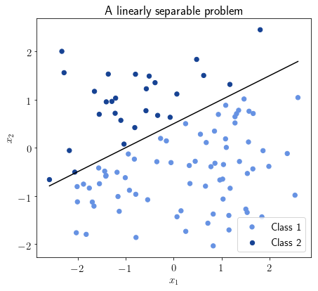

        然而，并非所有问题都是线性可分的。请记住，本节我们只讨论可线性分离的问题；有关非线性 SVM 的讨论，请参阅下文。

    2. 分离超平面和支持向量

        在这种情况下，我们可以说为线性可分离问题识别超平面的 SVM 是线性 SVM。我们马上就会看到计算这个超平面的公式。在此之前，我们先来推理一下这个函数需要什么样的输入。

        我们可以天真地尝试通过观察整个点或观察集合来识别分离超平面。这就意味着，我们使用的任何学习函数的输入都会包含大量信息量不大的特征。正如我们在上文关于识别决策边界的章节中所讨论的，我们所需要的唯一有参考价值的观察结果就是那些最接近决策边界的观察结果：

        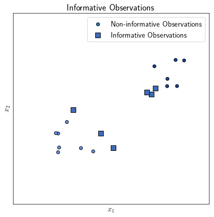

        当然，在学习决策边界之前，我们还不知道它的具体位置。不过，在线性可分性的假设下，我们可以假设如下。如果任何一对观察结果属于两个不同的类别，那么超平面就位于它们之间的某处：

        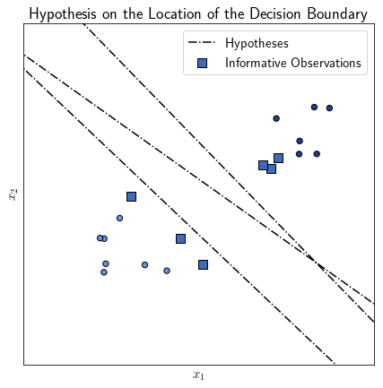

        这些信息丰富的观察结果，或者说它们的特征向量，有助于 SVM 识别决策边界。因此，我们将与其他类别观测值相邻的特征向量称为 "支持向量"。"支持向量机"的名称也由此而来。

    3. 识别决策边界

        现在，让我们深入探讨一下如何识别这个超平面来进行类别分离。描述向量空间 V 中超平面 $h_V$ 的一般公式是

        $\overrightarrow{v} \cdot \overrightarrow{x} - b = 0$

        其中 v 是这个超平面的法向量。如果 b 项等于 0，超平面也是原始向量空间的子空间，但这并不是必需的。

        我们可以将确定决策边界的问题重构为确定法向量 $\overrightarrow{v}$ 和参数 b 的问题。换句话说，超平面必须是距离属于不同类别的两个最近观测值最远的地方。

        我们可以将正在学习的决策函数称为 y = f(x)。如果两个类别分别由值 1 和 -1 编码，这样 $y_i = f(x_i) \to y_i = 1 \vee y_i = -1$，我们就可以把问题写成：

        \[\text{min}(||\overrightarrow{v}||): y_i (\overrightarrow{v} x_i + b) \geq 1\]

        一方面，属于 y = 1 类的观测值可以用不等式 $(\overrightarrow{v} x_i + b) \geq 1$ 表示。而属于 y = -1 类的观测结果则可以用不等式 $(\overrightarrow{v} x_i + b) \leq -1$ 来表示。因此，两者可以简化为

        \[[ (\overrightarrow{v} x_i + b) \geq y_i | y_i = 1 ] \vee [ (\overrightarrow{v} x_i + b) \leq y_i | y_i = -1 ] \leftrightarrow y_i (\overrightarrow{v} x_i + b) \geq 1\]

        这个公式最终对应于我们在前面的表达式中最小化其项 $\overrightarrow{v}$ 的公式。因此，我们确定为决策边界的超平面是位于两个半空间极限之间的超平面，与上面定义的不等式相对应：

        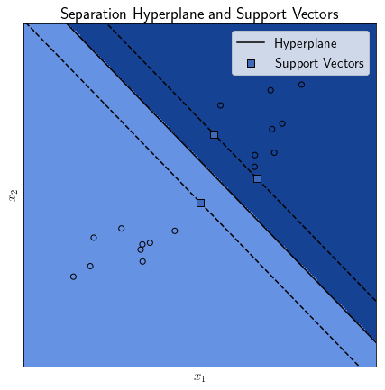

4. 非线性 SVM

    1. 非线性决策边界

        有些类别的问题并不是线性可分的。在这种情况下，我们说特征空间中没有超平面可以作为决策边界。然而，决策边界仍然存在，只不过它不是 V 的超平面：

        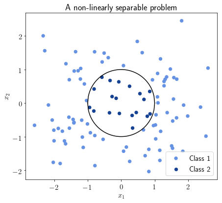

        即使它不是特征空间的超平面，也可能是某个变换向量空间的超平面。我们称这个变换空间为 $W = \mathbb{R}^m$。W 的维度预计等于或高于 V 的维度，因此 $|W| \geq |V|$。

        因此，非线性可分离问题的决策边界识别任务可以按以下方式重构。首先，我们可以找到一个映射，将特征空间 V 投射到具有变换拓扑结构的向量空间 W：

        \[f: V = \mathbb{R}^{|x|} \mapsto W = \mathbb{R}^m \leftrightarrow |x| \leq m\]

        这样，我们就可以用相应的变换空间的点积代替我们在未变换的向量空间 V 中计算的两个特征向量之间的点积：

        \[x_i, x_j \in V: k(x_i \cdot x_j) = \chi_i \cdot \chi_j | \chi_i, \chi_j \in W \leftrightarrow \chi_i = f(x_i) \wedge \chi_j = f(x_j)\]

        有一个函数可以用变换后的点积代替原始空间中两个向量的点积，以非变换向量为单位。这个函数叫做 SVM 的核 k；核 $k(x_i,x_j) = f(x_i) \cdot f(x_j)$。

        在变换后的向量空间中计算出的超平面 h_W 有一个法向量 $\overrightarrow{\omega} = \sum \alpha y f(x)$。这反过来又允许我们在变换后的空间 W 中计算 $h_W = \omega \cdot \chi + \beta$ ，并且变换后的观测值 $\chi = f(x)$。

        然后我们可以将超平面投影回原始向量空间 V。投影是通过反映射 $f^{-1}$ 实现的，即 $h_V = f^{-1}(h_W)$。

    2. SVM 的非线性核

        现在我们可以列举非线性 SVM 最常用的核函数类型。最常见的核函数有

        - 度数为 p 的[多项式](https://en.wikipedia.org/wiki/Polynomial#Polynomial_functions)核，$(x_i, x_j)^p$
        - [径向基函数](https://en.wikipedia.org/wiki/Radial_basis_function_kernel)核，$e^{-a||x_i - x_j||^{2}}，a>0$
        - [sigmoid](https://www.baeldung.com/cs/ml-nonlinear-activation-functions#sigmoid-activation-functions) $tanh(a \cdot x_i \cdot x_j + c)$

        选择使用哪个具体的核取决于我们要解决的问题。在任何情况下，这个决定都是基于启发式的，没有什么理论价值。在实践中，我们会依次测试所有的核，直到找到一个精度令人满意的核为止。

5. 结论

    在本教程中，我们研究了支持向量机的理论基础，并对其进行了数学描述。

    首先，我们从总体上讨论了识别分类决策边界的问题。在这种情况下，我们注意到在决策边界附近的观察结果如何携带最多的信息。

    然后，我们讨论了为类的线性分离确定超平面的问题。我们还将一个类别中信息量最大的特征，即位于决策超平面附近的特征命名为 "支持向量"。

    最后，我们讨论了为不可线性分离的问题确定决策边界的问题。与此相关，我们研究了如何将原始向量空间转化为一个存在解决方案的空间。我们还讨论了核函数的用法，并定义了非线性 SVM 中最常用的核函数。
