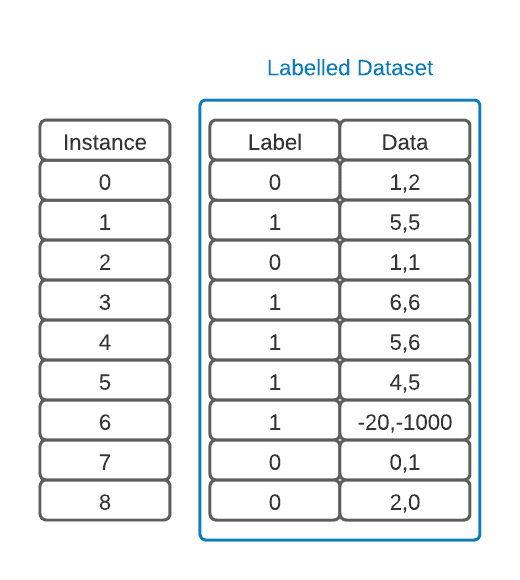

# [ML：训练、验证和测试](https://www.baeldung.com/cs/ml-train-validate-test)

1. 简介

    在本教程中，我们将讨论神经网络的训练、验证和测试方面。这些概念在机器学习中至关重要，充分体现了模型成熟的不同阶段。同样重要的是，这些概念与交叉验证、批量优化和正则化等许多其他概念相邻。

2. 概念

    由于神经网络的出现，机器学习领域得到了极大的扩展。这些神经网络之所以被广泛应用，是因为它们是非常灵活的模型，几乎可以适应任何类型的数据，前提是我们有足够的计算资源来及时训练它们。为了有效利用这些学习结构，我们需要确保模型能够泛化正在处理的信息。

    这里的问题是，如果我们提供所有数据供模型训练，我们就无法测试模型是否从信息中正确提取了函数。这个指标被称为[准确度](https://www.baeldung.com/cs/ml-accuracy-vs-auc)，对于评估模型的性能至关重要。

    1. 训练与测试

        好了，我们可以先创建一个训练集和一个测试集。现在，我们可以使用测试集来训练模型并验证其准确性。在训练过程中，模型从未见过测试数据。因此，我们得到的准确率结果将是有效的。我们可以使用不同的技术来训练神经网络模型，但最容易理解和实现的是反向传播技术。现在，假设我们通过训练-测试方法得到的结果并不理想。我们也许可以改变模型中的一些超参数，然后再试一次。

        但是，如果这样做，我们就会利用测试集的结果来调整模型的训练。从理论上讲，这种方法是有问题的，因为我们从测试集中添加了一个反馈回路。这将使我们得出的精确度结果失真，因为我们是在根据取得的结果改变参数。换句话说，我们是在利用测试集的数据来优化我们的模型。

    2. 验证集的目的

        为了避免这种情况，我们只在最后进行某种 "盲测(blind test)"。相反，为了在整个模型开发过程中进行迭代和更改，我们使用了验证集。现在，我们可以利用这个验证集来微调各种超参数，以帮助模型拟合数据。此外，这组数据还可以作为模型实际测试准确性的某种指标。这就是拥有验证数据集非常重要的原因。

        现在，我们可以训练一个模型，对其进行验证，改变不同的超参数以优化性能，然后测试一次模型，报告其结果。

        让我们看看能否将其应用到一个例子中。

3. 实施

    要以经典的监督学习方式实现这些概念，我们必须首先获得一个有标签的数据集。下面将以两个以坐标为单一特征的类别为例进行说明：

    

    首先要注意的是，我们的数据中有一个离群值。好的做法是使用常用统计方法找到这些异常值，对其进行检查，然后删除那些不能为模型增加信息的异常值。这是数据预处理这一重要步骤的一部分：

    

    1. 分割数据集

        现在我们已经准备好数据，可以将其拆分成训练集、验证集和测试集。在下图中，我们为数据集添加了一列，但我们也可以制作三个独立的数据集：

        

        我们必须确保这些组是平衡的，这样我们的模型才能减少[偏差](https://www.baeldung.com/cs/machine-learning-biases)。这就意味着，这些组中每个标签的示例数量必须大致相同。如果平衡失误，可能会导致模型没有足够的类实例来准确学习。这也会危及测试结果。

        在这个二元分类示例中，我们的训练集有两个 "1" 标签，只有一个 "0" 标签。但是，我们的验证集中每个类别都有一个标签，而测试集中有两个 "0" 标签，只有一个 "1" 标签。由于我们的数据极少，这样的结果令人满意。

        不过，我们可以改变我们定义的分组，然后挑选出最佳配置，看看模型在测试中的表现如何。这就是所谓的交叉验证。K 折交叉验证广泛应用于 ML。不过，本教程并不涉及。

    2. 训练和测试我们的模型

        接下来，我们就可以训练模型了。对于前馈神经网络，我们可以使用反向传播算法来训练。该算法将计算每个训练实例的误差，并利用误差微调神经网络中连接的权重。我们尽可能多地迭代运行该算法，直到它即将过拟合我们的数据时，我们就得到了下面的模型：

        

        为了验证模型训练的正确性，我们将训练好的模型输入验证数据集，并要求它对不同的示例进行分类。这将为我们提供验证精度。

        如果在验证阶段出现错误，我们可以改变任何超参数，使模型表现更好，然后再试一次。也许我们可以增加一个隐藏层，改变[批次大小](https://www.baeldung.com/cs/learning-rate-batch-size)，甚至根据优化方法调整学习率。

        我们还可以使用验证数据集来提前停止，以防止模型过度拟合数据。这也是正则化的一种形式。现在，我们已经有了自己喜欢的模型，我们只需使用测试数据集来报告结果，因为验证数据集已经用于调整我们网络的超参数。

4. 在 Python 中实践

    让我们来探索如何在 Python 中实现训练、测试和验证。为此，我们将使用 [scikit learn](https://scikit-learn.org/) 机器学习框架。这是一个免费开源、简单高效的工具，我们甚至可以将其用于商业应用。 在本次实践中，我们还将使用它的[鸢尾花数据集](https://en.wikipedia.org/wiki/Iris_flower_data_set)。这个数据集非常有名，它是一个多变量数据集，使用多种形态学测量方法对三种相关的鸢尾花进行分类。

    1. 设置环境

        我们可以使用一些在线开发环境来开发 Python 代码，例如 [Google Colab](https://colab.research.google.com/)。如果是这种情况，我们可以进行下一步。但是，如果我们想在本地工作，就必须设置我们的开发环境。

        我们的操作系统很有可能已经默认安装了 Python3，但如果没有，我们就必须安装 [Python](https://www.python.org/downloads/) 语言。现在，我们建议为每个项目创建一个特定的 Python 环境。这样，项目依赖关系就不会相互干扰：

        ```bash
        mkdir my_first_ml_project
        cd my_first_ml_project
        python3 -mvenv env
        ```

        上述命令将创建一个新目录，并在其下创建一个 env 文件夹，其中包含我们需要的任何依赖项。要在 Linux 或 Mac OS X 下激活新环境，我们必须使用

        `$ . ./env/bin/activate`

        在 Microsoft Windows 上，命令是

        `C:\Users\user\my_first_ml_project> .\env\scripts\activate`

        现在，我们可以安装依赖项了。

        首先，让我们从 [Jupyter](https://jupyter.org/) Notebook 开始，这是一个优秀的基于 Python 网络的集成开发环境，是数据科学家的主要工具之一：

        `pip install notebook`

        此外，这也是安装我们需要的其他依赖项的好时机：

        `pip install pandas pyarrow seaborn matplotlib scikit-learn`

        要运行它，我们必须调用它的可执行文件：jupyter-notebook。 最后，它会显示其网络访问 URL。

        ```bash
        (env) baeldung@host:~/ML$ jupyter-notebook
        ... 
            To access the server, open this file in a browser:
                file://Users/guilherme/AppData/Roaming/jupyter/runtime/jpserver-2888-open.html
            Or copy and paste one of these URLs:
                http://localhost:8888/tree?token=d0bce16a9d501e82043e18acd6400a045c461a0f984d9eca
                http://127.0.0.1:8888/tree?token=d0bce16a9d501e82043e18acd6400a045c461a0f984d9eca
        [I 2024-02-16 20:41:57.128 ServerApp] Skipped non-installed server(s): bash-language-server, dockerfile-language-server-nodejs, javascript-typescript-langserver, jedi-language-server, julia-language-server, pyright, python-language-server, python-lsp-server, r-languageserver, sql-language-server, texlab, typescript-language-server, unified-language-server, vscode-css-languageserver-bin, vscode-html-languageserver-bin, vscode-json-languageserver-bin, yaml-language-server
        ```

        默认浏览器应该会自动打开，如果没有，我们可以点击任何 HTTP URL 在浏览器上打开 Jupyter Notebook。

    2. 虹膜数据集

        我们先来看看 Iris 数据集。我们将从 Scikit Learn 提供的数据集中加载该数据集。首先，我们必须安装所需配置，如上图所示激活虚拟环境，然后在命令行中运行：

        `pip install pandas pyarrow seaborn matplotlib scikit-learn`

        或者，也可以在 Jupyter Notebook 上完成安装，在新的 Notebook 文件中使用以下命令：

        `%pip install pandas pyarrow seaborn matplotlib scikit-learn`

        现在，让我们开始我们的 python 示例：

        ```python
        # Load libraries
        import pandas as pd
        import seaborn as sns
        from matplotlib import pyplot as plt
        ```

        现在，让我们导入数据集并准备使用：

        ```python
        from sklearn.datasets import load_iris
        iris_data = load_iris()
        iris = pd.DataFrame(iris_data.data, columns=iris_data.feature_names)
        # Add labels
        iris['Species'] = list(map( lambda i: iris_data.target_names[i], iris_data.target))
        ```

        让我们来看看数据集：

        `sns.pairplot(iris, hue='Species')`

        将显示以下图片：

        

        这张图显示了如何根据数据集的每个维度对各种花的种类进行聚类。现在，我们可以训练一个神经网络，在给定任意一组萼片和花瓣维度的情况下，猜测其所属的正确物种。

    3. 拆分训练、验证和测试数据集

        为了分割数据集，我们将两次使用 Sklearn 的 [train_test_split](https://scikit-learn.org/stable/modules/generated/sklearn.model_selection.train_test_split.html) 函数。该函数将按照给定的比例随机将数据集一分为二。在本教程中，我们将使用 40% 的数据进行验证和测试。
        导入 train_test_split 方法

        `from sklearn.model_selection import train_test_split`

        首先，让我们使用整个数据集的 60% 来分割训练数据集：

        ```python
        validation_test_sizes = 0.4
        train, validation_test = train_test_split(iris, test_size = 0.4)
        print ("Train:\t\t", train.shape[0], "objects")
        ```

        现在，让我们把剩余的数据样本分成验证数据集和测试数据集：

        ```python
        validation, test = train_test_split(validation_test, test_size = .5)
        print ("Validation:\t", validation.shape[0], "objects")
        print ("Testing:\t", test.shape[0], "objects")
        ```

        最后，让我们准备好与 Sklearn 函数一起使用的三个数据集：

        ```python
        train_X = train[['sepal length (cm)', 'sepal width (cm)', 'petal length (cm)', 'petal width (cm)']]
        train_y = train.Species

        validation_X = validation[['sepal length (cm)', 'sepal width (cm)', 'petal length (cm)', 'petal width (cm)']]
        validation_y = validation.Species

        test_X = test[['sepal length (cm)', 'sepal width (cm)', 'petal length (cm)', 'petal width (cm)']]
        test_y = test.Species
        ```

    4. 训练、验证和测试

        现在，我们可以使用不同的超参数来训练和验证神经网络模型。在下面的示例中，我们将尝试不同的隐藏层大小：
        我们将使用多层感知器分类器神经网络。因此，让我们导入它：

        `from sklearn.neural_network import MLPClassifier`

        为了获取模型的质量，我们将使用准确度指标，让我们导入它：

        `from sklearn.metrics import accuracy_score`

        使用不同的超参数进行训练和验证，我们将尝试不同的神经网络，隐层上的神经元从 1 个到 10 个不等：

        ```python
        # The hyperparameter we'll change is the number of neurons in the hidden layer, ranging from 1 to 10
        best_accuracy = 0
        best_model = None
        for i, layer_size in enumerate(range(1,11,1)):
            print ('{}: Testing neural network MLP classifier with {} neurons on the hidden layer'.format(i + 1, layer_size))
            model = MLPClassifier(hidden_layer_sizes=layer_size, max_iter=20000)

            # Train
            model.fit(X=train_X, y=train_y)

            # Validate
            p = model.predict(X=validation_X)

            current_accuracy = accuracy_score(p, validation_y)
            print ('\taccuracy using the validation dataset:\t{:.3f}'.format(current_accuracy))

            if best_accuracy < current_accuracy:
                best_model=model
                best_accuracy = current_accuracy

            del (model)
        print ('Best model had {} neurons in the hidden layer'.format(best_model.get_params()['hidden_layer_sizes']))
        ```

        这将打印出如下内容

        ```log
        1: Testing neural network MLP classifier with 1 neurons on the hidden layer
        accuracy using the validation dataset: 0.900
        2: Testing neural network MLP classifier with 2 neurons on the hidden layer
        accuracy using the validation dataset: 0.667
        3: Testing neural network MLP classifier with 3 neurons on the hidden layer
        accuracy using the validation dataset: 0.967
        4: Testing neural network MLP classifier with 4 neurons on the hidden layer
        accuracy using the validation dataset: 0.800
        5: Testing neural network MLP classifier with 5 neurons on the hidden layer
        accuracy using the validation dataset: 1.000
        6: Testing neural network MLP classifier with 6 neurons on the hidden layer
        accuracy using the validation dataset: 1.000
        7: Testing neural network MLP classifier with 7 neurons on the hidden layer
        accuracy using the validation dataset: 0.967
        8: Testing neural network MLP classifier with 8 neurons on the hidden layer
        accuracy using the validation dataset: 1.000
        9: Testing neural network MLP classifier with 9 neurons on the hidden layer
        accuracy using the validation dataset: 1.000
        10: Testing neural network MLP classifier with 10 neurons on the hidden layer
        accuracy using the validation dataset: 1.000
        Best model had 5 neurons in the hidden layer
        ```

        在这种情况下，最佳方案是隐藏层中有 5 个神经元。我们应该注意的是，由于数据集分割和训练起始权重值默认是随机选择的，因此其他执行结果可能会有所不同。然而，这种行为是可取的。去掉随机性会增加训练出现偏差的风险。

        此外，需要注意的是，准确率非常高，达到了 100%。我们很可能不希望出现这种情况，因为这可能导致模型在对已知样本进行分类时非常出色，但在处理新数据时却表现不佳。

    5. 测试

        选出准确率最高的模型后，我们就可以对其进行测试了：

        ```python
        p = best_model.predict(X=test_X)
        best_model_testing_accuracy = accuracy_score(p, test_y)
        print ('\taccuracy using the testing dataset:\t{:.3f}'.format(best_model_testing_accuracy))
        ```

        结果如下

        `accuracy using the testing dataset:0.967`

        现在，我们甚至可以显示分类报告了：

        ```python
        from sklearn.metrics import accuracy_score, classification_report
        print (classification_report(test_y,p))
        ```

        结果如下

        ```log
                    precision    recall  f1-score   support

            setosa       1.00      1.00      1.00        10
        versicolor       1.00      0.92      0.96        12
        virginica       0.89      1.00      0.94         8

            accuracy                           0.97        30
        macro avg       0.96      0.97      0.97        30
        weighted avg       0.97      0.97      0.97        30
        ```

        或混淆矩阵

        ```python
        from sklearn.metrics import confusion_matrix, ConfusionMatrixDisplay

        cm = confusion_matrix(test_y, p, labels=iris_data.target_names)
        cmd= ConfusionMatrixDisplay(cm, display_labels=iris_data.target_names)
        cmd.plot()
        cmd.ax_.set_title('{}. Accuracy: {:.4f}'.format(best_model, best_model_accuracy))
        ```

        显示

        

        在本例中，验证的准确率为 96.67%，只有一次错误分类，一朵 versicolor 花被错误地分类为 virginica 花。

5. 结论

    在本文中，我们讨论了机器学习中训练、测试和验证的不同概念。

    我们还展示了如何使用 Scikit Learn 工具包在 Python 中实现这些功能。
