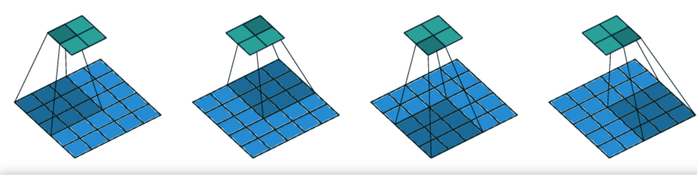

# 神经网络:分步卷积

[机器学习](README-zh.md)

[卷积神经网络](https://www.baeldung.com/cs/tag/cnn) [神经网络](https://www.baeldung.com/cs/tag/neural-networks)

1. 概述

    在本教程中，我们将介绍神经网络中的步进卷积。首先，我们将介绍一般的卷积算子，然后我们将讨论一种特定的卷积技术，即分层卷积。最后，我们将介绍分层卷积的优势和在现实世界中的一些用例。

2. 卷积

    深度神经网络已经证明是机器学习和人工智能领域一种强大的学习技术，它为从视觉识别和语言生成到自动驾驶和医疗保健等各种应用带来了革命性的变化。其成功的一个核心原因是卷积神经网络（[CNNs](https://www.baeldung.com/cs/ai-convolutional-neural-networks)）具有强大的学习能力，在处理涉及图像、图形和序列的任务时异常有效。

    在每个卷积神经网络架构中，我们都能找到一个[卷积算子](https://www.baeldung.com/cs/convolutional-layer-size)，其目的是利用某种相关性（时间或空间）来学习高级特征。在高层次上，我们可以将卷积想象成一个小型滤波器（也称为内核），它在输入图像或序列上滑动，捕捉每个位置的局部特征。然后将这些局部特征组合起来，生成一个特征图，作为下一层网络的输入。

3. 分步卷积

    在本文中，我们将重点讨论步进卷积，它改进了 CNN 中应用的传统卷积。具体来说，传统卷积使用的步长（或步幅）为 1，这意味着滑动滤波器每次移动 1 个样本（例如图像中的像素）。相反，分步卷积引入了一个步长变量，用于控制文件夹在输入上移动时的步长。因此，举例来说，当步长等于 2 时，滤波器每次滑过输入样本时都会跳过一个像素，这样输出的特征图就会更小。

    在下面的图片中，我们可以看到传统卷积（上图）和步长为 2 的跨距卷积（下图）是如何应用于二维输入的：

    

4. 优势

    现在，我们来谈谈跨距卷积相对于传统卷积算子的一些优势。

    1. 降采样

        在分步卷积过程中，滤波器在移动给定输入时会跳过一些像素，从而对输入数据进行降采样。这种固有的下采样在学习过程中具有多种优势。重要的是，降采样会促使网络专注于最具辨别力的特征，而忽略冗余信息。在物体识别等任务中，细粒度细节可能并不那么重要，因此对输入图像进行降采样是非常有益的。

    2. 计算效率

        分层卷积的主要优势之一是降低了计算复杂度。通过跳过像素，网络可以更高效地处理较大的图像。这在实时应用和资源有限的环境中尤为重要。

5. 使用案例

    既然我们已经谈到了分层卷积的优势，接下来让我们来看看一些实际应用，在这些应用中，分层卷积似乎可以提高神经网络的性能。

    1. 图像分类

        分层卷积的概念对图像分类非常有益，而图像分类是 CNN 最常见的应用之一。具体来说，用于图像分类的 CNN 运用分层卷积对输入图像进行缩样，只保留关键信息。因此，网络训练和推理都更快、更轻便，这在资源有限的情况下尤其有用。此外，在输入图像非常大的情况下，有必要使用分层卷积，以便在系统内存中容纳模型，同时实现较高的分类性能。

    2. 自动语音识别

        虽然 CNN 中的分层卷积概念始于计算机视觉领域，但其成功已扩展到语音分析等许多其他领域。具体来说，在自动语音识别 (ASR) 中，分层卷积有助于从音频频谱图中捕捉相关的声学特征，而忽略低层次的噪声特征。通过在 ASR 模型中使用一维 CNN 与跨卷积，研究人员显著提高了语音模型的准确性，从而可以使用更好的语音助手和转录服务。

6. 结论

    在本文中，我们介绍了神经网络中的跨步卷积概念。我们首先介绍了卷积算子，然后讨论了分层卷积的定义和优点。最后，我们提到了一些使用分层卷积的实际应用。
