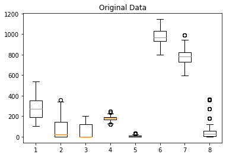
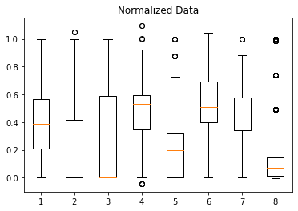
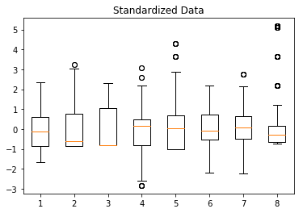
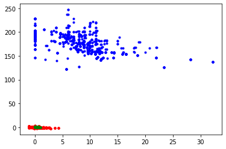
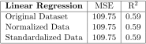

# 线性回归中的归一化与标准化

[机器学习](https://www.baeldung.com/cs/category/ai/ml)

[回归](https://www.baeldung.com/cs/tag/regression) [训练](https://www.baeldung.com/cs/tag/training)

1. 简介

    在本教程中，我们将研究不同的特征缩放方法如何影响线性回归的预测能力。

    首先，我们将了解两种广泛采用的特征缩放方法。然后，我们将在一个玩具数据集上应用这些特征缩放技术。最后，我们将对结果进行对比。

2. 特征缩放

    在机器学习中，[特征缩放](https://www.baeldung.com/cs/feature-scaling)指的是将特征值放到相同的范围内。缩放对于考虑观察值之间距离的算法（如 k-近邻）来说极为重要。另一方面，决策树等基于规则的算法不受特征缩放的影响。

    缩放数据的一种技术是将数据挤入一个预定义的区间。在[归一化](https://www.baeldung.com/cs/batch-normalization-cnn#normalization)中，我们将特征值的最小值映射为 0，最大值映射为 1、 我们将特征值的最小值映射为 0，最大值映射为 1：

    \[z = \frac{x - min(x)}{max(x) - min(x)}\]

    在[标准化](https://www.baeldung.com/cs/normalizing-inputs-artificial-neural-network#2-standardization)过程中，我们不会将数据强制纳入一个确定的范围。相反，我们转换为平均值为 0，标准差为 1：

    \[z = \frac{x - \mu}{\sigma}\]

    这不仅有助于缩放，还能集中数据。

    一般来说，在大多数情况下，标准化比归一化更合适。

3. Python 中的特征缩放

    为了更好地说明特征缩放的用法，让我们应用迄今为止学到的知识。在 Python 中，我们可以使用 scikit-learn 库完成所有机器学习任务，包括预处理。

    在本节中，我们将使用混凝土[抗压强度数据集](https://archive.ics.uci.edu/ml/datasets/concrete+compressive+strength)。回归问题是根据七种成分的数量和混凝土的龄期预测混凝土的抗压强度。该数据集中有 8 个数字输入变量和 1030 个实例。

    盒状图显示了数值数据的中位数、四分位数和范围。让我们用方框图来分析混凝土抗压强度数据集中的输入特征：

    

    在图中，我们可以看到输入特征的不同范围。我们还可以看到大部分数据和异常值的位置。

    1. 归一化

        为了进行归一化处理，我们使用了 scikit-learn 中的 min-max 标度器：

        ```py
        from sklearn.preprocessing import MinMaxScaler

        min_max_scaler = MinMaxScaler().fit(X_test)
        X_norm = min_max_scaler.transform(X)
        ```

        根据经验，我们先在测试数据上拟合一个缩放器，然后用它对整个数据集进行变换。通过这种方法，我们可以在建立模型时完全忽略测试数据集。

        对具体数据集进行归一化处理后，我们得到

        

        正如所承诺的那样，来自不同领域的所有值都被转换到了 [0, 1] 的范围内。对最后一个特征的仔细观察表明，极端离群值会迫使大部分观测值进入更小的范围。此外，新观测值中的极端离群值也会丢失。

    2. 标准化

        要对特征进行标准化处理，我们使用标准标度器：

        ```py
        from sklearn.preprocessing import StandardScaler

        scaler = StandardScaler().fit(X_train)
        X_std = scaler.transform(X)
        ```

        同样，我们仅使用测试数据集的观测值来拟合标量器。对具体数据集进行标准化处理后得到的方框图显示了特征受到的影响：

        

        让我们再次观察第 8 个特征。离群值不会影响大部分数值的转换。此外，新观测值中的极端值仍会得到体现。

        在进一步讨论之前，让我们直观地比较一下归一化和标准化是如何改变数据的。为此，让我们绘制第 4 个特征与第 5 个特征的对比图：

        

        蓝点代表输入特征的实际值。红点代表标准化值，绿点代表归一化值。不出所料，归一化会使数据点靠拢。与标准化数据集相比，结果范围非常小。

4. Python 中的线性回归

    既然我们已经学会了如何应用特征缩放，就可以继续训练机器学习模型了。让我们建立一个线性回归模型：

    ```py
    from sklearn import linear_model

    # Create linear regression object
    regr = linear_model.LinearRegression()

    # Train the model using the training sets
    regr.fit(X_train, y_train)

    # Make predictions using the testing set
    y_pred = regr.predict(X_test)
    ```

    训练模型后，我们可以报告截距和系数：

    ```py
    # The intercept
    print('Interccept: \n', regr.intercept_)
    # The coefficients
    print('Coefficients: \n', regr.coef_)
    ```

    在我们的例子中，输出结果将是

    ```log
    Intercept: 
    -59.61868838556004
    Coefficients: 
    [ 0.12546445  0.11679076  0.09001377 -0.09057971  0.39649115  0.02810985
    0.03637553  0.1139419 ]
    ```

    此外，我们还可以报告均方误差和 R 平方指标：

    ```py
    print('MSE: %.2f' % mean_squared_error(y_test, y_pred))
    print('R^2: %.2f' % r2_score(y_test, y_pred))
    ```

    得出分数

    ```log
    MSE: 109.75
    R^2: 0.59
    ```

    要在特征缩放数据集上训练线性回归模型，我们只需改变拟合函数的输入。

    以类似的方式，我们可以轻松地在归一化和标准化数据集上训练线性回归模型。然后，我们使用该模型预测测试集的结果，并衡量其性能。

    具体数据集的结果如下：

    

    令人惊讶的是，在我们的案例中，特征缩放并没有提高回归性能。事实上，在著名的玩具数据集上采用相同的步骤也不会提高模型的成功率。

    不过，这并不意味着线性回归不需要特征缩放。即使是 sci-kit 实现也有一个布尔归一化参数，当设置为"True"时就会自动归一化输入。

    相反，这一结果提醒我们，在机器学习中，并没有适合所有预处理方法的方法。我们需要仔细研究数据集，并应用定制的方法。

5. 结论

    在本文中，我们研究了两种著名的特征缩放方法：归一化和标准化。我们在 python 中应用了这些方法，以了解它们是如何转换混凝土抗压强度数据集的特征的。

    然后，我们使用该数据集及其归一化和标准化副本训练了线性回归模型。在我们的例子中，这并没有改变模型的成功率。

[Normalization vs Standardization in Linear Regression](https://www.baeldung.com/cs/normalization-vs-standardization)
