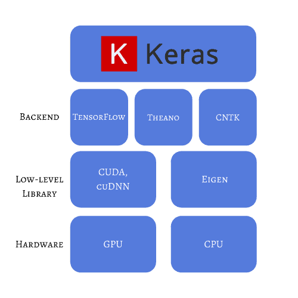
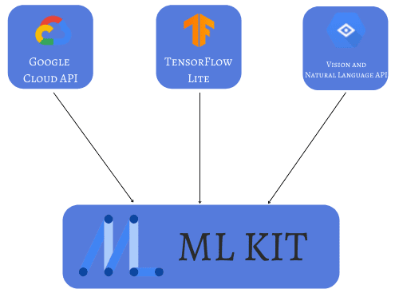

# [开源人工智能引擎](https://www.baeldung.com/cs/open-source-ai-engines)

1. 简介

    我们几乎每周都能在新闻中发现与人工智能相关的话题。不仅是受欢迎程度，可使用的技术数量也在不断增加。目前，我们可以选择各种框架、库和平台进行部署和测试。面对这么多的选择，有时我们很难做出正确的选择。

    如果我们不得不硬编码每个神经网络、其梯度计算以及每一层的结构，那将是低效且耗时的。我们可以使用成熟的工具来确保我们的模型具有更高的准确性和所需的输出，而不是编码数学公式和修复小错误。在本教程中，我们将介绍一些人工智能引擎，并说明它们之间的区别。我们还将讨论每种引擎所需的专业知识水平，以便为下一个项目选择正确的工具。

2. Keras

    该库以 "为人类而非机器而设计" 自居，提供了高度的抽象性。它是在 TensorFlow 2 的基础上设计的。它的主要目标是提供最快的实现，因为至少在最常见的场景和情况下，它能减轻用户的负担。它还可用作其他后端框架（如 Theano 和 CNTK）的封装器。

    该库的灵活性为其在现实世界中提供了强大的应用范围。例如，我们可以用相对较小的代码实现 CT 扫描的 3D [图像分类](https://keras.io/examples/vision/3D_image_classification/)。鉴于在 GPU 或 TPU 中使用底层操作可实现的可扩展性和效率，Youtube 和 NASA 等大公司在其工作流程的某些阶段都会使用 [Keras](https://keras.io/about/)。

    Keras 还具有针对图像、时间序列和文本数据的预处理功能。此外，它还内置了已矢量化的小型数据集，可用于测试简单的代码示例。

    对于有 Python 经验但对 ML 领域知之甚少的开发人员来说，Keras 是一个不错的选择。我们可以通过真实数据集和实际问题，轻松了解如何构建、训练和完善神经网络架构：

    

3. 开放神经网络

    Open Neural Network 是一个用 C++ 编写的机器学习开源库。当我们正在进行的项目有严格的高性能要求时，我们应该考虑使用它。

    我们可以在以下几种情况下使用该库：

    - 回归：根据员工的年龄估算其薪水
    - 分类：定义一封电子邮件是否为垃圾邮件
    - 预测：预测公司股价
    - 关联：确定客户会因为购买了某种特定产品而购买哪种其他产品

    该库是一个用于高级分析的软件解决方案。它有五大类供我们构建和测试模型：数据集、神经网络、训练策略、模型选择和测试分析。我们可以很容易地找到这些类的入门[教程](https://www.opennn.net/documentation/)。

    建议熟悉 C++ 代码和 ML 基础知识的开发人员使用该库。

4. DL4J

    考虑到 Java 仍然是世界上最常用的编程语言之一，因此使用 Java 编写一个库是合情合理的。

    Deep Learning for Java 是一个适用于 JVM 的开源分布式深度学习库。在其内部，计算是用 C、C++ 和 Cuda 进行的。这样，再加上可以使用 Apache [Spark](https://www.baeldung.com/apache-spark) 和 [Hadoop](https://hadoop.apache.org/) 等分布式计算框架，我们就可以在 CPU 和 GPU 上进行加速训练。

    API 使我们能够根据需要灵活构建深度神经网络。我们可以使用卷积网络、递归网络和变异自动编码器等来构建每一层。该库还为我们提供了测试和优化迁移学习、加载先前训练好的模型、冻结某些层以及微调模型中所有参数的工具。

    DL4J 的最大优势之一是可视化 UI 界面，我们可以将其与 Spark 结合使用，在网络浏览器中实时验证训练进度。

    我们可以在[文档](https://deeplearning4j.konduit.ai/deeplearning4j/tutorials/quick-start)页面上找到每个 API 函数的详细解释、初学者教程和可视化示例。

5. 亚马逊机器学习

    Amazon ML 号称是最广泛的机器学习服务。我们可以使用 Amazon ML 构建、训练和部署机器学习模型。我们还可以在完全不了解神经网络行为方式的情况下添加人工智能功能。

    虽然该工具不是开源的，但我们确实可以有限地使用其功能。它提供了广泛的[可能性](https://aws.amazon.com/machine-learning/)，包括预防欺诈、业务预测和图像分析。

    使用这样一个高度抽象的平台，我们不需要负责开发实际代码，但这也带来了一个缺点。我们需要使用应用程序接口（API）来使用这些功能，但却无法定义一些特定的参数或学习策略，例如新的机器学习算法或损失函数。

6. Azure 机器学习工作室

    如果我们想使用端到端平台的拖放界面，可以使用 [Azure ML](https://azure.microsoft.com/en-us/services/machine-learning/#features)。在这一点上，很明显，构建模型时最大的挑战之一就是定义哪些特征是相关的，以及应该如何表示数据。

    该平台配备了自动机器学习策略，其中已经实施了特征工程以及算法选择和超参数调整。所有这些资源与内置的 DevOps 相结合，使快速原型开发和部署成为可能。

    通过与 ONNX、TensorFlow 和 Pytorch 等开源框架集成，以及使用集成开发环境的 Jupyter Notebooks，我们还可以在较低的抽象层次上工作，为我们的项目提供更多灵活性。此外，我们还可以将 Python 或 R 工具与 Azure ML Studio 配合使用。

    与亚马逊 ML 类似，这项服务的免费版也限制了我们可以使用的资源数量。

7. 谷歌 ML 工具包

    谷歌开发了 ML Kit，为我们提供了将神经网络轻松集成到 Android 和 IOS 应用程序中的工具。该工具包就像一个移动 SDK，适用于具有不同机器学习经验水平的开发人员。例如，我们只需几行代码就能实现[人脸检测](https://developers.google.com/ml-kit/vision/image-labeling)应用。如果需要，我们还可以使用底层 API 来定制神经网络的架构。

    重要的是，如果我们使用基于云的 API，还可以使用谷歌云强大可靠的机器学习技术。此外，我们还可以开发离线、设备上的应用程序，在没有互联网连接的情况下工作，因为整个软件将使用设备的内存和处理器。

    有两个主要的应用程序接口。视觉应用程序接口（Vision API）用于图像标注、文本识别、物体检测和其他与视觉相关的应用。自然语言 API 用于翻译和回复建议。

    由于我们要开发的是移动应用程序，因此不一定非要成为神经网络专家，但需要具备这方面的一些知识。

    

8. 总结

    在本文中，我们了解到以往的经验和偏好的编程语言在很大程度上影响着我们对 ML 技术的选择。这一点，再加上我们在开发模型过程中所需的灵活性，可以让我们做出正确的选择。

    如果我们的背景不包括上述任何一种语言，我们也可以使用高级工具，这些工具可以集成到我们的软件中，而无需处理代码的特殊性。

    最后，了解人工智能的基础知识将扩大我们使用框架和工具的范围，因为我们将知道如何调整超参数以获得更快但仍然准确的训练。
