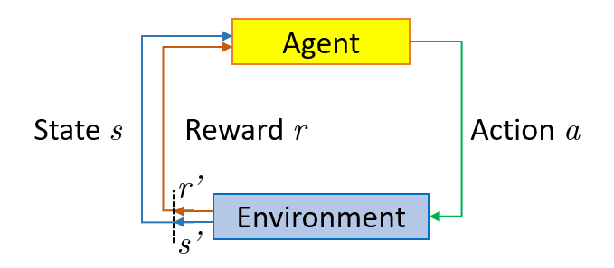
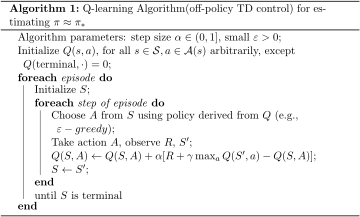
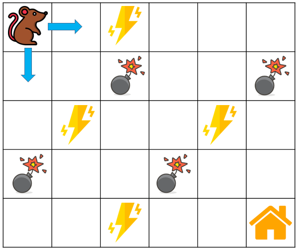
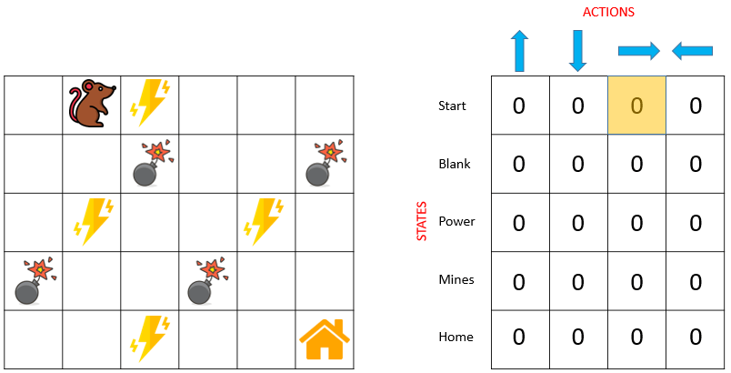
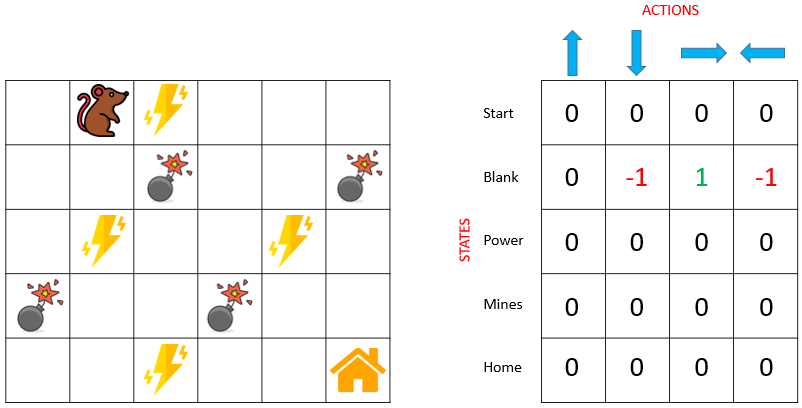
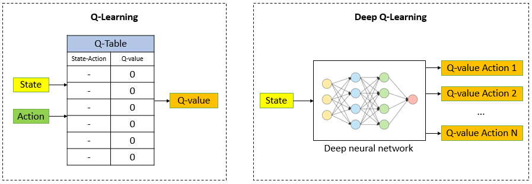

# Q-Learning vs. Deep Q-Learning vs. Deep Q-Network

[深度学习](https://www.baeldung.com/cs/category/ai/deep-learning) [机器学习](https://www.baeldung.com/cs/category/ai/ml)

[强化学习](https://www.baeldung.com/cs/tag/reinforcement-learning)

1. 前言

    由于强化学习（[RL](https://www.baeldung.com/cs/reinforcement-learning-neural-network)）在博弈论、运筹学、[组合优化](https://www.baeldung.com/cs/combinatorial-optimization-problems-methods)、[信息论](https://www.baeldung.com/cs/information-theory)、基于仿真的优化、控制论和[统计学]等多个领域的成功应用，它最近受到了广泛关注。

    在本教程中，我们将探讨强化学习、[Q-learning](https://www.baeldung.com/cs/q-learning-vs-sarsa)、[深度Q-learning](https://www.baeldung.com/cs/reinforcement-learning-neural-network)与深度Q-network的概念，以及它们之间的关系。

2. 强化学习

    强化学习（RL）是[机器学习]的一个子集，其中一个代理通过与环境交互来学习实现其目标的最佳策略。与依赖于摄取和处理数据的监督机器学习算法不同，RL不需要数据来学习。相反，代理从其与环境的交互以及所获得的奖励中学习，从而做出更好的决策。在RL中，目标是随着时间的推移使累积奖励最大化，代理通过尝试和错误来选择可获得最高奖励的行动。

    下图说明了在强化学习中代理如何与环境交互：

    

    以马里奥视频游戏为例进行说明。如果游戏角色采取随机行动，例如向左移动，它可能会获得基于该行动的奖励。采取行动后，游戏角色（马里奥）将处于新的状态，该过程将重复进行，直到马里奥到达阶段终点或输掉游戏。这一过程将重复多次，直到马里奥学会通过最大化奖励来驾驭环境。通过这种尝试和犯错的过程，马里奥将学会哪些行为会带来更高的奖励，并相应地调整其策略，以实现完成关卡的目标。

    简而言之，RL是一门利用经验做出最佳决策的科学。这一过程包括以下简单步骤：

    - 观察环境
    - 使用某种策略决定如何行动
    - 执行行动
    - 根据行动获得奖励或惩罚
    - 从经验中学习并改进策略
    - 重复这一迭代过程，直至找到最优策略

    RL算法可大致分为两类：[基于模型和无模型](https://www.baeldung.com/cs/ai-model-free-vs-model-based)。

    基于模型的算法使用过渡函数和奖励函数来估计最优策略。换句话说，它学习环境的动态模型，并用它来预测未来的状态和奖励。

    另一方面，无模型算法不使用或估计环境动态。相反，它通过试错直接估算出最优策略，并利用从环境中获得的奖励来指导其决策。这使得无模型算法更适用于具有复杂动态的环境，在这种环境中很难对环境进行精确建模。

3. Q-学习

    1. 什么是Q-学习

        Q-learning是一种无模型、基于值、[非策略的算法](https://www.baeldung.com/cs/off-policy-vs-on-policy)，用于在给定环境中为代理找到[最优策略](https://www.baeldung.com/cs/ml-value-iteration-vs-policy-iteration)。该算法根据代理的当前状态确定要采取的一系列最佳行动。Q-learning中的 "Q" 代表质量，表示有价值的行动如何使未来回报最大化。

        作为一种基于模型的算法，Q-learning不需要过渡函数和奖励函数的知识。它通过试错直接估算出最优策略，并使用从环境中获得的奖励来指导其决策。该算法根据特定（状态、动作）对收到的奖励和下一状态的估计值更新Q值。通过根据观察到的奖励反复更新Q值，Q-learning可以收敛到一个最优策略，使累积奖励随着时间的推移达到最大化。

        作为一种基于价值的算法，Q-learning训练价值函数，以了解在每个状态下哪些行动更有价值，并据此选择最优行动。价值函数根据从环境中获得的回报进行迭代更新，通过这个过程，算法可以收敛到一个最优策略，使累积回报随着时间的推移最大化。

        作为一种非策略算法，Q-learning评估并更新与行动策略不同的策略。具体来说，Q-learning使用epsilon-greedy策略，即代理以1-epsilon的概率选择Q值最高的行动，并以epsilon的概率选择随机行动。这种探索策略确保代理探索环境并发现新的（状态、行动）对，从而获得更高的回报。

        Q值根据所采取的行动获得的奖励进行更新，即使该行动并非当前策略下的最优行动。通过基于每个状态下最高Q值的行动更新Q值，Q-learning可以收敛到最优策略，即使它与训练期间用于行动的策略不同。

    2. Q-学习如何工作

        当代理暴露在环境中并通过执行不同的行动获得不同的奖励时，其值会根据以下公式进行更新：

        \[Q_{\text{new}}\left(s,a\right)=Q\left(s,a\right)+\alpha\left(R\left(s,a\right)+\gamma\max_{a}Q'\left(s',a'\right)-Q\left(s,a\right)\right),\]

        其中$Q\left(s,a\right)$是当前的Q值，$Q_{\text{new}}\left(s,a\right)$是更新的Q值，$\alpha$是学习率，$R\left(s,a\right)$是奖励，$\gamma$是介于[0,1]之间的数字，用于随着时间的推移对奖励进行折现，假设开始时的行动比结束时的行动更重要（这一假设已被许多实际应用案例所证实）。

        最简单的Q值是一个表格（或矩阵），状态为行，行动为列。Q表随机初始化，代理开始与环境交互并测量每个行动的奖励。然后计算观察到的Q值并更新Q表。以下伪代码总结了Q-learning的工作原理：

        

    3. 示例

        让我们看下面一个简单的例子来了解Q-learning是如何工作的。我们的代理是一只老鼠，它必须穿过迷宫到达终点（它的房子）。迷宫中有地雷，老鼠每次只能移动一个方格（从一个方格移动到另一个方格）。如果老鼠踩到地雷，就会死亡。老鼠希望在最短的时间内到达它的家：

        

        奖励系统如下：

        - 老鼠每走一步损失1分。这样做是为了让老鼠走最短的路，尽快到达家。
        - 如果老鼠踩到地雷，则损失100分，游戏结束。
        - 如果老鼠获得能量（黄色闪电图标），它将获得1分。
        - 如果老鼠到达自己的家，它将获得100分。

        老鼠在每个非边缘牌上有四种可能的行动：$(\uparrow, \downarrow, \rightarrow, or \leftarrow)$（向上、向下、向右或向左移动）。状态是大鼠在迷宫中的位置。

        有了这些信息，我们就可以将Q表初始化为一个大小为$5\times4$的矩阵，其中行代表大鼠可能的状态（位置），列代表可能的动作（向4个方向移动）。最初，我们的老鼠对环境（迷宫）一无所知，因此它将选择一个随机的动作，比如我们的机器人对环境一无所知。所以机器人选择一个随机的动作，比如向右：

        

        利用贝尔曼方程，我们现在可以更新在起点和向右移动的Q值。我们将不断重复这一过程，直到学习停止。这样，Q表就会更新。例如，大鼠当前位置对应的下一个Q表如下所示：

        

4. 深度Q学习和深度Q网络

    Q-learning的主要缺点之一是在处理大的状态空间时变得不可行，因为Q表的大小会随着状态和动作的数量呈指数增长。在这种情况下，算法的计算成本会变得很高，并且需要大量内存来存储Q值。试想一下，一个游戏有1000个状态，每个状态有1000个动作。我们将需要一个包含一百万个单元格的表格。与国际象棋或围棋相比，这是一个非常小的状态空间。此外，Q-learning不能用于未知状态，因为它不能从以前的状态推断出新状态的Q值。这带来了两个问题：

    首先，保存和更新该表所需的内存量会随着状态数量的增加而增加。

    其次，探索每个状态以创建所需的Q表所需的时间是不现实的。

    为了应对这一挑战，一种替代方法是将Q-learning与深度神经网络相结合。这种方法被称为深度Q值学习（[DQL](https://www.baeldung.com/cs/q-learning-vs-dynamic-programming)）。DQL中的神经网络充当每对（状态、动作）的Q值近似值。

    神经网络接收状态作为输入，并输出所有可能动作的Q值。下图说明了Q-learning和深度Q-learning在评估Q值方面的区别：

    

    从本质上讲，深度Q-Learning用神经网络取代了常规Q表。神经网络不是将（状态、动作）对映射为Q值，而是将输入状态映射为（动作、Q值）对。

    2013年，DeepMind推出了Deep Q-Network（[DQN](https://arxiv.org/abs/1312.5602)）算法。DQN旨在从原始像素学习玩Atari游戏。这是强化学习领域的一项突破，为该领域的未来发展铺平了道路。Deep Q-network一词指的是其DQL架构中的神经网络。

    1. 深度Q学习的工作原理

        以下是DQN的工作步骤：

        - 环境： DQN与具有状态、动作空间和奖励函数的环境交互。DQN的目标是学习最优策略，使累积奖励随着时间的推移达到最大化。
        - 重放记忆： DQN使用重放记忆缓冲区来存储过去的经验。每个经验都是一个元组（状态、动作、奖励、下一状态），代表从一个状态到另一个状态的单次转换。重放存储器存储这些经验，以便日后随机采样。
        - 深度神经网络： DQN使用深度神经网络来估计每对（状态、动作）的Q值。神经网络将状态作为输入，并输出每个动作的Q值。该网络的训练目标是最小化预测Q值与目标Q值之间的差值。
        - ε-贪心探索： DQN使用[ε-贪婪探索策略](https://www.baeldung.com/cs/epsilon-greedy-q-learning)来平衡探索和利用。在训练过程中，代理以epsilon概率随机选择一个动作，并以(1-epsilon)概率选择Q值最高的动作。
        - 目标网络： DQN使用一个单独的目标网络来估计目标Q值。目标网络是具有固定参数的主神经网络的副本。目标网络定期更新，以防止高估Q值。
        - 训练： DQN使用贝尔曼方程训练神经网络，以估计最佳Q值。损失函数是预测值和目标值之间的均方误差。目标Q值通过目标网络和Bellman方程计算得出。使用反向传播和随机梯度下降更新神经网络权重。
        - 测试： DQN在训练后使用学习到的策略进行环境决策。在给定状态下，代理选择Q值最高的行动。

        总之，DQN通过使用深度神经网络估计Q值、重放记忆缓冲区存储过去的经验以及目标网络防止高估Q值来学习最优策略。该代理在训练过程中使用ε-贪婪探索策略，并在测试过程中选择Q值最高的行动。

5. 5.Q-Learning、深度Q-Learning和深度Q-Network之间的差异总结

    下表概述了Q-learning、Deep Q-learning和Deep Q-network之间的区别：

    |  | Q-learning | Deep Q-learning| Deep Q-network |
    |------------|-----------------|--------------------------|---------------------------------|
    | 方法         | 使用 Q 表进行表格式学习   | 利用神经网络进行函数逼近             | 利用神经网络进行函数逼近                    |
    | 输入         | （状态、动作）对        | 原始状态输入                   | 原始状态输入                          |
    | 输出         | 每对（状态、动作）的 Q 值  | 每对（状态、动作）的 Q 值           | 每对（状态、动作）的 Q 值                  |
    | 训练数据       | Q 表条目           | 经验 回放缓冲区                 | 经验 回放缓冲区                        |
    | 训练时间       | 快速              | 速度慢                      | 速度慢                             |
    | 复杂性        | 受限于状态和行动的数量     | 由于使用了神经网络，因此更为复杂         | 由于使用了神经网络，因此更为复杂                |
    | 泛化         | 仅限于 Q 表中的状态     | 可泛化至未知状态                 | 可泛化至未知状态                        |
    | 可扩展性       | 难以处理较大的状态和动作空间  | 能很好地处理大空间                | 能很好地处理大空间                       |
    | 稳定性        | 容易过度拟合          | 比 Q-learning 更稳定，但仍可能不稳定 | 比 Q-learning 和深度 Q-learning 更稳定 |

    |             | Q-learning                                   | Deep Q-learning                                        | Deep Q-network                                  |
    |----------------|----------------------------------------------|--------------------------------------------------------|-------------------------------------------------|
    | Approach       | Tabular learning using Q-table               | Function approximation with neural networks            | Function approximation with neural networks     |
    | Input          | (state, action) pairs                        | Raw State input                                        | Raw State input                                 |
    | Output         | Q-values for each (state, action) pair       | Q-values for each (state, action) pair                 | Q-values for each (state, action) pair          |
    | Training data  | Q-table entries                              | Experience Replay buffer                               | Experience Replay buffer                        |
    | Training time  | Fast                                         | Slow                                                   | Slow                                            |
    | Complexity     | Limited by the number of states and actions  | More complex due to the use of neural networks         | More complex due to the use of neural networks  |
    | Generalization | Limited to states in Q-table                 | Can generalize to unseen states                        | Can generalize to unseen states                 |
    | Scalability    | Struggles with large state and action spaces | Handles large spaces well                              | Handles large spaces well                       |
    | Stability      | Prone to overfitting                         | More stable than Q-learning, but can still be unstable | More stable than Q-learning and deep Q-learning |

6. 结论

    在这篇简短的文章中，我们探讨了强化学习的概述，包括其定义和目的。此外，我们还深入研究了一些重要的强化学习算法，即Q-learning、Deep Q-learning和Deep Q-network，概述了它们的基本概念和在决策过程中的作用。

